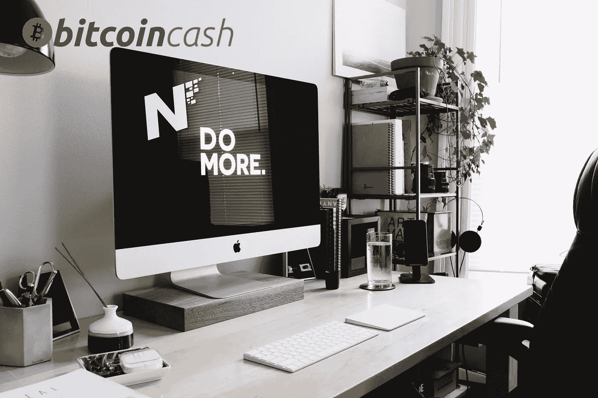
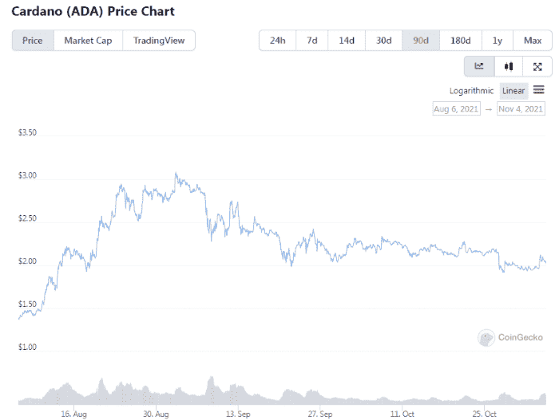
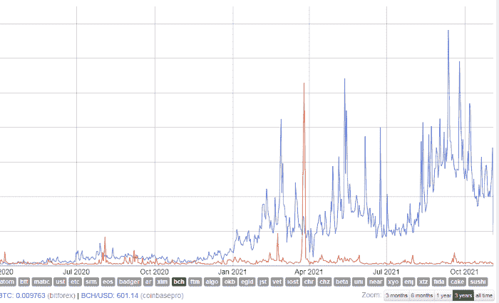
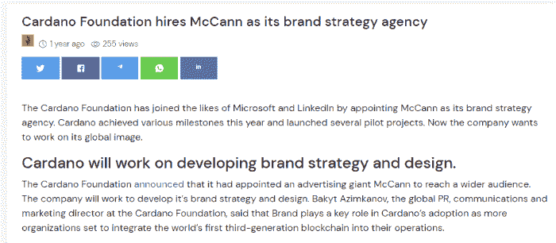
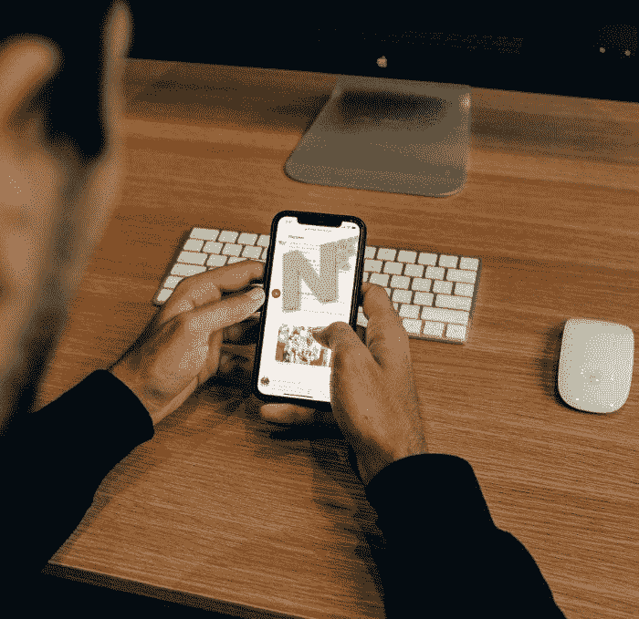
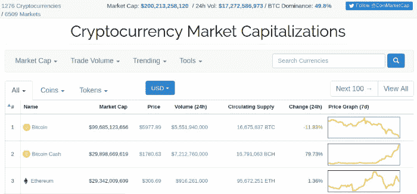

# 营销和品牌意识:Cardano 和比特币现金的比较

> 原文：<https://medium.com/coinmonks/marketing-and-branding-awareness-comparison-between-cardano-and-bitcoin-cash-6cb9abe27886?source=collection_archive---------9----------------------->

如今一切都与加密货币相连。

数字经济有足够的潜力在未来几年呈指数级增长，那些处于良好起点的投资者是那些认真相信这一点的人。开发人员仍然有很高的需求，并在密码行业内找到了一个具有无限可能性的领域。

不过，加密与 dot.com 泡沫有相似之处。我们看到过度的投机和金钱涌入任何成为头条新闻的项目。

虽然，在 dot.com 崩溃的尘埃中，我们今天已经出现了一些最好的科技公司。虽然一些加密“资产”的表现超出预期，比一年前高出 100 多倍，但它们仍然不值得这么高的价格，其中大多数价格可能会下降。

我们今天看到一些加密资产的极端估价。柴犬目前在 crypto index services 的前 10 名中，一个叫做 Squid Game Token 的骗局，在开发者退出之前的一瞬间达到了 2 万亿的估值——被骗并崩溃为零，而 testnet 区块链的估值达到了 1000 亿美元。

**营销**和**品牌**可以制造炒作，向投资者提供估值不合理的加密货币。

无论是**机构**、**富有的个人**，还是**赌上毕生积蓄的散户**，都无关紧要。他们都不知道他们在做什么，指望 Twitter、Reddit 和 google-ads 来选择他们的加密投资。

# 卡尔达诺 1000 亿美元的市值是积极营销活动的结果

与此同时，比特币现金等加密货币不断发展，并在技术功能方面表现出色，区块链网络受到了媒体的所有赞誉。

Solana、Polkadot 和 Cardano 正处于 testnet 阶段，没有足够的社区支持他们。在大多数排名前 20 的资产中，当前的群体只是等待尽快平仓的投机者，正如我们已经在 Cardano 身上看到的那样。

Coingecko

卡尔达诺的价格涨到了 3 美元，现在鲸鱼们开始获利了。

## **卡尔达诺——比特币现金推文日线图:**

[Source](https://bitinfocharts.com/comparison/bitcoin-tweets.html#3y)

*(蓝线:卡达诺，读取线:比特币现金)*

在过去两年中，Cardano 的表现优于比特币现金和大多数其他加密货币，原因很简单，因为它无处不在。

卡尔达诺的垃圾邮件鼓吹者，这些骗子，接管了互联网，出现在每一个该死的加密货币讨论中，发出垃圾邮件和充满爱意的评论，这些评论远非现实。

[*Source*](https://cardanofeed.com/cardano-foundation-hires-mccann-as-its-brand-strategy-agency-909.html)

## 品牌宣传

品牌塑造了公司的名字，提升了它在企业界的地位。卡尔达诺是一家由商人经营的企业，并通过积极的营销和品牌推广取得了前所未有的成绩。

[McCann](https://www.mccann.com/) 是负责宣传和推广 Cardano 品牌名称的品牌代理机构，使其曝光率远远超过已经充斥着数十篇日常 ADA 支持文章的加密新闻媒体。

麦肯公司的客户包括威瑞森、微软、宜家、万事达卡、雀巢、欧莱雅，这只是其中的几个。这不仅仅是一项专业服务，它还能提升任何公司的品牌形象，从而吸引投资者。

因此，[在开发中面临各种问题](https://cryptobriefing.com/cardanos-smart-contracts-face-major-scalability-issue/)，并推动每一行代码作为突破性发展的测试网，已经达到了 1000 亿美元的估值。而这一切都与[零网络采用](https://www.nasdaq.com/articles/the-two-big-problems-facing-cardano-2021-03-17)有关。

作为一个测试网络，Cardano 的市值达到了超过德国电信的水平。炒作如何给加密资产创造人为价格表现的一个例子。

# 噪音。现金及其比特币现金营销的潜在用例

如果我们讨论网络效应，那么比特币现金和智能合约第二层网络“SmartBCH”的表现优于大多数其他产品。

**比特币现金瞬间无感。它提供 0-确认交易，只需一秒钟即可完成交易。**

这是微交易和 noise.cash 等平台吸引人的地方，noise . cash 目前拥有超过 20 万活跃用户。

## Noise.cash:社交媒体 BCH 营销工具

[*Source*](https://unsplash.com/photos/FdDkfYFHqe4)

(也可阅读:[**noise . cash——完美的 BCH 营销工具**](https://read.cash/@Pantera/noisecash-a-perfect-bch-marketing-tool-63ddb93a) )

营销会埋没优质产品，那些对改善个人健康和生活条件最有用的产品，取而代之的是推销任何破损和无效的产品，甚至是会损害公众利益的产品。

营销将价格推高 10 到 20 倍。

你认为一双 150 美元的耐克的生产成本是多少？这只是 25 美元。剩下的 125 美元是营销所代表的附加值，以增加广告、品牌知名度等形式。

品牌价值耐克比彪马更好，而这些只是相同的鞋有微小的设计差异。

正因如此，许多类似的美国公司为了降低生产成本，已经将几乎所有的业务完全外包到海外，而只是将营销和 R&D 部门留在美国。

然而，营销不仅仅是广告。它是 [**创新**](https://www.lead-innovation.com/english-blog/innovation-marketing) 、 [**放置**](https://www.investopedia.com/terms/p/product-placement.asp) 的产品，增加了 [**用例**](https://productmarketingalliance.com/the-role-of-use-cases-in-product-marketing/) 等。营销的主要焦点是理解和关注消费者(顾客，用户)的需求。

最好的广告是**口碑营销**。当消费者(或区块链网络平台的用户)简单地讨论它，并与另外 3-4 个可能感兴趣的人谈论它时。这些人各自与另外 3-4 个人讨论，因此对某个产品的认知传播达到指数级增长。

为比特币现金管理的 noise.cash 和 read.cash 已经在产生效果了。大多数 SmartBCH 用户都是这两个网站的用户。

## **如今在比特币现金基础上创造的任何东西都有 20 万用户的潜力。**

在我看来，这是每个人都应该考虑的。**西蒙** (read.cash & noise.cash 创始人)和**马克·德·梅塞尔**(已向这些平台投资 100 万美元)，他们的工作和愿景值得称赞。

这两个人工作的倍增因素是 SmartBCH 今天成功的原因之一。

比特币现金营销目前被隔绝在 noise.cash 和 read.cash 的界限之内，但 noise.cash 的规模和质量都在不断增长。它可能很快就会达到一个受人尊敬的社交媒体网站的水平。

如果有一天一些顶级 noise.cash 账户(拥有最活跃的粉丝的账户)成为类似 Instagram 的影响者，并在 noise.cash 中推广产品，我不会感到惊讶

Noise.cash 不仅仅是加密货币。虽然这是一个核心话题，但它似乎正在迅速脱离加密利基，成为一个现代社交媒体。

仅仅是使用比特币现金支付小费，就为 BCH 的生态系统做出了重要贡献。

大多数 BCH 社区仍然喜欢使用 Reddit 和 Twitter 进行交流。我理解他们可能会发现 noise.cash 的困难，但他们应该知道，noise.cash 人群迟早会找到他们，并将他们添加到他们的通知中。我经常从 noise.cash 上发现比特币现金发展的重要新闻。

# 最后

我不想对比特币现金设定未满足的期望。

我进行长期投资，并将继续等待 BCH 在这个市场找到它应得的位置。这不亚于市值排名前五的加密货币。

[*Source*](https://twitter.com/VitalikButerin/status/929558722170429440/photo/1)

我之前写道，年底前 BCH 的 5000 美元并不是一个不现实的期望。我可以坐下来，不再谈论它，也许会说这是一个错误，但这就是我如何看待 BCH 在某些市场标准下的表现。也许时机不对，也许不对。

这就是加密市场如何与发现资产表现优于其他资产的情绪一起工作，并不断将其推向更高的位置。然而，我希望这是自然发生的。不像 5 月份那样在短短两周内。它需要有一定的价格行动与真正的投资者对比特币现金的兴趣。

机构购买灰度广告更多的东西。零售购买 Twitter 广告的东西。

Noise.cash 是一项实验，它达到了加密领域前所未有的规模。值得注意的是，加密媒体一直低估噪音。现金，而不是提及或成为它的一部分。

甚至像 Coindesk、Cointelegraph 等 BTC 最大化主义者和不可靠的媒体也能增加流量，但它们都只是受赞助的代币，为出版物付费，并遵循短视的 BTC 最大化主义议程。

可审查的加密媒体将继续审查和误报比特币现金。

Follow me on: ● [ReadCash](https://read.cash/@Pantera) ● [NoiseCash](https://noise.cash/u/Pantera99) ● [Medium](/@panterabch) ● [Hive](https://hive.blog/@pantera1) ● [Steemit](https://steemit.com/@pantera1) ●[Vocal](https://vocal.media/authors/pantera) ● [Minds](https://www.minds.com/pantera99/) ● [Twitter](https://twitter.com/Panterabch) ● [LinkedIn](https://www.linkedin.com/in/panterabch/) ● [email](https://read.cash/@Pantera/localcryptos-p2p-exchange-is-now-offering-bitcoin-cash-trading-06637230#bad-link)

**备注:**

> *免责声明:本内容中发布的所有材料均用于娱乐和教育目的，并符合合理使用准则。无意侵犯版权。如果您是或代表本文所用材料的版权所有者，并且对所述材料的使用有疑问，请发送* [*电子邮件*](https://read.cash/@Pantera/cryptouknowns-battlegrounds-the-crypto-battle-royal-part-i-0ca762da#bad-link) *。*

***支持内容创作者。***

如果你喜欢这个故事，就订阅吧！

*原载于*[*https://read . cash*](https://read.cash/@Pantera/noisecash-bitcoin-cash-marketing-and-branding-awareness-18f7b05c)*。*

> 加入 Coinmonks [电报频道](https://t.me/coincodecap)和 [Youtube 频道](https://www.youtube.com/c/coinmonks/videos)了解加密交易和投资

## 另外，阅读

*   [如何购买 Monero](https://blog.coincodecap.com/buy-monero) | [IDEX 评论](https://blog.coincodecap.com/idex-review) | [BitKan 交易机器人](https://blog.coincodecap.com/bitkan-trading-bot)
*   [如何在 Bitbns 上购买柴犬(SHIB)币？](https://blog.coincodecap.com/buy-shiba-bitbns) | [印度币安](https://blog.coincodecap.com/binance-in-india)
*   [币安 vs Bitstamp](https://blog.coincodecap.com/binance-vs-bitstamp) | [比特熊猫 vs 比特币基地 vs Coinsbit](https://blog.coincodecap.com/bitpanda-coinbase-coinsbit)
*   [如何购买 Ripple (XRP)](https://blog.coincodecap.com/buy-ripple-india) | [非洲最好的加密交易所](https://blog.coincodecap.com/crypto-exchange-africa)
*   [非洲最佳加密交易所](https://blog.coincodecap.com/crypto-exchange-africa) | [胡交易所评论](https://blog.coincodecap.com/hoo-exchange-review)
*   [eToro vs robin hood](https://blog.coincodecap.com/etoro-robinhood)|[MoonXBT vs by bit vs Bityard](https://blog.coincodecap.com/bybit-bityard-moonxbt)
*   [Stormgain 回顾](https://blog.coincodecap.com/stormgain-review) | [Bexplus 回顾](https://blog.coincodecap.com/bexplus-review) | [币安 vs Bittrex](https://blog.coincodecap.com/binance-vs-bittrex)
*   [Bookmap 评论](https://blog.coincodecap.com/bookmap-review-2021-best-trading-software) | [美国 5 大最佳加密交易所](https://blog.coincodecap.com/crypto-exchange-usa)
*   [如何在 FTX 交易所交易期货](https://blog.coincodecap.com/ftx-futures-trading) | [OKEx vs 币安](https://blog.coincodecap.com/okex-vs-binance)
*   [如何在无法阻挡的域名上购买域名？](https://blog.coincodecap.com/buy-domain-on-unstoppable-domains)
*   [印度的加密税](https://blog.coincodecap.com/crypto-tax-india) | [altFINS 审核](https://blog.coincodecap.com/altfins-review) | [Prokey 审核](/coinmonks/prokey-review-26611173c13c)
*   [Blockfi vs 比特币基地](https://blog.coincodecap.com/blockfi-vs-coinbase) | [比特坎评论](https://blog.coincodecap.com/bitkan-review) | [币安评论](/coinmonks/binance-review-ee10d3bf3b6e)
*   [Coldcard 评论](https://blog.coincodecap.com/coldcard-review) | [BOXtradEX 评论](https://blog.coincodecap.com/boxtradex-review)|[uni swap 指南](https://blog.coincodecap.com/uniswap)
*   [阿联酋五大最佳加密交易所](https://blog.coincodecap.com/best-crypto-exchanges-in-uae) | [SimpleSwap 评论](https://blog.coincodecap.com/simpleswap-review)
*   购买 Dogecoin 的 7 种最佳方式
*   [iTop VPN 审查](https://blog.coincodecap.com/itop-vpn-review) | [曼陀罗交易所审查](https://blog.coincodecap.com/mandala-exchange-review)
*   [美国最佳加密交易机器人](https://blog.coincodecap.com/crypto-trading-bots-in-the-us) | [经常性评论](https://blog.coincodecap.com/changelly-review)
*   [A-Ads 审查](https://blog.coincodecap.com/a-ads-review) | [Bingbon 审查](https://blog.coincodecap.com/bingbon-review) | [Mudrex 投资](https://blog.coincodecap.com/mudrex-invest-review-the-best-way-to-invest-in-crypto)