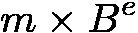

# 坚实的数学(第一部分:数字)

> 原文：<https://medium.com/coinmonks/math-in-solidity-part-1-numbers-384c8377f26d?source=collection_archive---------0----------------------->

## 本文开启了关于扎实做数学的系列文章。首先要讨论的话题是:**数字**。

# 介绍

[以太坊](https://ethereum.org/)是一个可编程的区块链，其功能可以通过向区块链本身发布可执行代码片段来扩展，这些代码被称为智能合同。这是以太坊与第一代区块链的区别，在第一代中，新功能需要修改客户端软件，升级节点，并分叉整个区块链。

智能合约是一段在链上发布的可执行代码，它有一个唯一的区块链地址分配给它。智能合约控制属于其地址的所有资产，并且在与其他智能合约交互时可以代表该地址行事。每个智能协定都有持久存储，用于保存调用之间的智能协定状态。

[Solidity](https://solidity.readthedocs.io/) 是以太坊上智能合约开发的主要编程语言，也是其他几个使用以太坊虚拟机(EVM)的区块链平台上的主要编程语言。

编程总是与数学有关，区块链总是与金融有关，而金融自古以来就是与数学有关的(或者也许数学是关于金融的)。作为以太坊区块链的主要编程语言，Solidity 必须做好数学。

在这个系列中，我们讨论了 Solidity 如何计算的各个方面，以及开发人员如何在 Solidity 中计算。首先要讨论的话题是:**数字**。

> 交易新手？尝试[加密交易机器人](/coinmonks/crypto-trading-bot-c2ffce8acb2a)或[复制交易](/coinmonks/top-10-crypto-copy-trading-platforms-for-beginners-d0c37c7d698c)

# Solidity 中的数字类型

与主流编程语言相比，Solidity 有相当多的数字类型:即 5248。是的，根据[文档](https://solidity.readthedocs.io/en/v0.6.2/types.html#value-types)，有 32 个有符号整数，32 个无符号整数，2592 个有符号定点，2592 个无符号定点类型。JavaScript 只有两种数值类型。Python 2 曾经有四个，但是在 Python 3 中“long”类型被去掉了，所以现在只有三个。Java 有 7 个，C++大约有 14 个。

有这么多的数字类型，Solidity 应该有适合每个人的类型，对吗？没那么快。让我们更仔细地看看这些数字类型。

我们将从以下问题开始:

## 为什么我们需要多种数值类型？

> 剧透:我们没有。

纯数学中没有数值类型。一个数可以是整数或非整数、有理数或无理数、正数或负数、实数或虚数等，但这些只是性质，这个数可以有也可以没有，一个数可以同时有几个这样的性质。

许多高级编程语言都有单一的数字类型。在 2019 年推出“BigInt”之前，JavaScript 只有“number”。

除非做硬核的低级东西，否则开发人员并不真的需要多个数值类型，他们只需要具有任意范围和精度的纯数字。然而，硬件本身并不支持这样的数字，用软件来模拟有些昂贵。

这就是为什么低级编程语言和以高性能为目标的语言通常有多种数值类型，如有符号/无符号、8/16/32/64/128 位宽、整数/浮点等。这些类型由硬件本身支持，并广泛用于文件格式、网络协议等，因此低级代码从中受益。

然而，出于性能原因，这些类型通常继承了底层 CPU 指令的所有奇怪语义，例如无声的上溢和下溢、不对称范围、二进制分数、字节排序问题等。这让他们在高层业务逻辑代码中痛苦不堪。直截了当的用法往往显得不安全，而安全的用法往往变得繁琐而不可读。

所以，下一个问题是:

## 为什么 Solidity 有这么多数值类型？

> 剧透:没有。

EVM 本身支持两种数据类型:256 位字和 8 位字节。堆栈元素、存储键和值、指令和内存指针、时间戳、余额、事务和块散列、地址等都是 256 位字。内存、字节码、调用数据和返回数据由字节组成。大多数 EVM 操作码处理文字，包括所有的数学运算。一些数学运算将单词视为有符号整数，一些视为无符号整数，而其他运算则以相同的方式工作，不管参数是否有符号。

因此，EVM 本身支持两种数值类型:有符号 256 位整数和无符号 256 位整数。这些类型分别被称为`int`和`uint`。

除了这两种类型(以及它们的别名`int256`和`uint256`)以外，Solidity 还有 62 种整数类型`int<N>`和`uint<N>`，其中`<N>`可以是 8 到 248 的任意倍数，即 8，16，…，248。在 EVM 级别上，所有这些类型都由相同的 256 位字支持，但是每个操作的结果都被截断为 N 位。当需要特定位宽时，它们可能对特定情况有用，但对于一般计算来说，这些类型只是`int`和`uint`版本的功能较弱且效率较低(每次操作后截断并非免费)。

最后，Solidity 有 5184 个定点类型`fixedNxM`和`ufixedNxM`，其中 N 是从 8 到 256 的 8 的倍数，N 是从 0 到 80 的整数，包括 0 和 80。这些类型应该实现各种范围和精度的十进制定点运算，但是到目前为止(Solidity 0.6.2 ),文档说:

> Solidity 还不完全支持定点数。它们可以被声明，但不能被赋值给或从。

所以定点数和分数一般都不被支持。

那么，下一个问题是:

## 如果我们需要大于 256 位的分数或整数呢？

> 剧透:你得模仿他们。

有人会说，256 位应该对任何人都足够了。然而，一旦以太坊中的大多数数字都是 256 位宽，即使两个数字的简单和也可能是 257 位宽，两个数字的乘积可能是 512 位宽。

模拟比编程语言本身支持的类型更宽的固定或可变宽度整数的常见方法是将它们表示为较短的、本身支持的整数的固定或可变长度序列。因此，宽整数的位映像是较短整数的位映像的串联。

在 Solidity 中，宽整数可以表示为固定或动态数组，其元素可以是字节或`uint`值。

对于分数来说，情况有点复杂，因为它们有不同的味道，每一种都有自己的优点和缺点。

最基本的是简单的分数:只是一个整数，称为“分子”，除以另一个整数，称为“分母”。在 Solidity 中，简单分数可以表示为一对两个整数，或者表示为单个整数，其位图像是分子和分母的位图像的串联。在后一种情况下，分子和分母的宽度必须相同。

分数的另一种流行格式是定点数。定点数基本上是一个简单的分数，它的分母是一个预定义的常数，通常是 2 或 10 的幂。前一种情况称为“二进制”定点，而后一种情况称为“十进制”定点。只要分母是预定义的，就不需要显式指定 is，所以只需要指定分子。在 Solidity 中，定点数通常表示为单个整数分子，而常用的分母是 10 ⁸、10 ⁷、2⁶⁴和 2 ⁸.

另一种众所周知的分数格式是浮点数。基本上，浮点数可以描述如下:

其中 ***m*** (尾数)和 ***e*** (指数)为整数， ***B*** (底数)为预定义的整数常量，通常为 2 或 10。 ***B*** =2 的情况称为“二进制”浮点，而 ***B*** =10 的情况称为“十进制”浮点。

[IEEE-754](https://en.wikipedia.org/wiki/IEEE_754) 标准化了几种常见的浮点格式，包括五种二进制格式，称为“半”、“单”、“双”、“四”和“八倍”精度。每种格式都将尾数和指数分别打包成 16、32、64、128 或 256 位的单个序列。实际上，这些标准格式可以用二进制类型`bytes2`、`bytes4`、`bytes8`、`bytes16`和`bytes32`来表示。或者，尾数和指数可以分别表示为一对整数。

这部分的问题是:

## 这一切都要我们自己去实现吗？

> 剧透:没必要。

好消息是各种数字格式都有 Solidity 库，比如:[fixity](https://github.com/extraterrestrial-tech/fixidity)(任意小数位数的十进制定点)[ds math](https://github.com/dapphub/ds-math)(18 或 27 位小数的十进制定点) [BANKEX 库](https://github.com/BankEx/solidity-float-point-calculation) (IEEE-754 八倍精度浮点) [ABDK 库](https://github.com/abdk-consulting/abdk-libraries-solidity)(二进制定点和四倍精度浮点)等。

坏消息是不同的库使用不同的格式，所以很难将它们结合起来。这个问题的根源将在下一节讨论。

# 实体中的数字文字

在上一节中，我们讨论了数字在运行时是如何表示的。在这里，我们将看看它们在开发时是如何表示的，即在代码本身中。

与主流语言相比，Solidity 有非常丰富的数值语法。首先支持好的老十进制整数，比如`42`。和其他类似 C 的语言一样，也有十六进制的整数文字，比如`0xDeedBeef`。到目前为止一切顺利。

在 Solidity 中，文字可以有单位后缀，比如`6 ether`，或者`3 days`。一个单位，基本上就是一个因子，字面量乘以。这里`ether`是 10⁸`days`是 86400(24 小时× 60 分钟× 60 秒)。

除此之外，Solidity 支持整数的科学符号，比如`2.99792458e8`。这很不寻常，因为主流语言只支持分数文字的科学记数法。

但可能是整个 Solidity 语言最独特的特征，是它对理性字面表达式的支持。几乎每个成熟的编译器都能够在编译时计算常量表达式，所以`x = 2 + 2`不生成`add`操作码，而是相当于`x = 4`。坚固也能做到这一点，但实际上，它远不止于此。

在主流语言中，常量表达式的编译时求值只是一种优化，因此常量表达式在编译时求值的方式与在运行时求值的方式完全相同。这使得用具有相同值的命名常量或变量替换这种表达式的任何部分成为可能，并得到完全相同的结果。然而，对于坚固性来说，情况并非如此。

在运行时，Solidity 中的除法将结果舍入为零，其他算术运算在溢出时换行，而在编译时，表达式使用具有任意大分子和分母的简单分数进行计算。因此，在运行时，表达式`((7 / 11 + 3 / 13) * 22 + 1) * 39`将被计算为 39，而在编译时，完全相同的表达式被计算为 705。不同之处在于，在运行时，`7 / 11`和`3 / 13`被舍入为零，但是在编译时，整个表达式被计算为简单的分数，根本没有任何舍入。

更有趣的是，下面这个表达式在坚固性上是有效的:`7523 /48124631 * 6397`，而这个是无效的:`7523 / 48125631 * 6397`。不同的是，前者计算的是整数，而后者计算的是非整数。记住，Solidity 在运行时不支持分数，所以所有文字必须是整数。

虽然分数和大整数在运行时可以用实体来表示，如前几节所述，但是没有方便的方法在代码中表示它们。这使得任何使用这些数字执行操作的代码都变得相当神秘。

只要 Solidity 没有标准的定点也没有浮点格式，每个库都用自己的，这就使得库之间互不兼容。

# 结论

自从以太坊区块链诞生以来，智能合约就一直在计算。从简单的百分比到复杂的衍生产品估价。然而，智能合约开发的主要语言 Solidity 在数学方面没有走得更远，只是揭示了 EVM 操作码能够做什么。

图书馆试图涵盖 basic 语言遗漏的内容，但苦于缺乏标准化的数字格式。

核心语言有一些无与伦比的特性，但同时缺乏对基本的、必备的东西的支持。

在后续的文章中，我们将讨论如何应对这一切，接下来要讨论的话题将是: [**溢出**](/coinmonks/math-in-solidity-part-2-overflow-3cd7283714b4) 。

本系列的其他文章:

*   [第二部分:溢出](/coinmonks/math-in-solidity-part-2-overflow-3cd7283714b4)
*   [第 3 部分:百分比和比例](/coinmonks/math-in-solidity-part-3-percents-and-proportions-4db014e080b1)
*   [第四部分:复利](/coinmonks/math-in-solidity-part-4-compound-interest-512d9e13041b)
*   [第 5 部分:指数和对数](/coinmonks/math-in-solidity-part-5-exponent-and-logarithm-9aef8515136e)

> 加入 Coinmonks [电报频道](https://t.me/coincodecap)和 [Youtube 频道](https://www.youtube.com/c/coinmonks/videos)获取每日[加密新闻](http://coincodecap.com/)

## 另外，阅读

*   [复制交易](/coinmonks/top-10-crypto-copy-trading-platforms-for-beginners-d0c37c7d698c) | [加密税务软件](/coinmonks/crypto-tax-software-ed4b4810e338)
*   [电网交易](https://coincodecap.com/grid-trading) | [加密硬件钱包](/coinmonks/the-best-cryptocurrency-hardware-wallets-of-2020-e28b1c124069)
*   [密码电报信号](http://Top 4 Telegram Channels for Crypto Traders) | [密码交易机器人](/coinmonks/crypto-trading-bot-c2ffce8acb2a)
*   [Bitsgap 审查](/coinmonks/bitsgap-review-a-crypto-trading-bot-that-makes-easy-money-a5d88a336df2) | [Quadency 审查](/coinmonks/quadency-review-a-crypto-trading-automation-platform-3068eaa374e1) | [Bitbns 审查](/coinmonks/bitbns-review-38256a07e161)
*   [密码本交易平台](/coinmonks/top-10-crypto-copy-trading-platforms-for-beginners-d0c37c7d698c) | [Coinmama 审核](/coinmonks/coinmama-review-ace5641bde6e)
*   [印度的加密交易所](/coinmonks/bitcoin-exchange-in-india-7f1fe79715c9) | [比特币储蓄账户](/coinmonks/bitcoin-savings-account-e65b13f92451)
*   [最佳加密交易所](/coinmonks/crypto-exchange-dd2f9d6f3769) | [印度最佳加密交易所](/coinmonks/bitcoin-exchange-in-india-7f1fe79715c9)
*   开发人员的最佳加密 API
*   最佳[密码借贷平台](/coinmonks/top-5-crypto-lending-platforms-in-2020-that-you-need-to-know-a1b675cec3fa)
*   [杠杆代币](/coinmonks/leveraged-token-3f5257808b22)终极指南