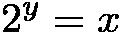

# 坚实的数学(第五部分:指数和对数)

> 原文：<https://medium.com/coinmonks/math-in-solidity-part-5-exponent-and-logarithm-9aef8515136e?source=collection_archive---------0----------------------->

## 本文是关于扎实做数学系列文章的第五篇。这次的题目是:指数和对数。


# 介绍

几个世纪以来，对数被用来简化计算。在电子计算器普及之前，计算尺，基于对数的机械计算器，是工程师职业的象征。

对数函数与指数函数(对数函数的反函数)一起允许将乘法转换为加法，更重要的是，将指数转换为乘法。由于以下两条规则，这是可能的:


对这些方程的左右部分求幂后，我们得到:


注意，这些公式适用于任意正基数 ***b*** 除此之外，我们可以选择便于实现的基数。

在本文中，我们将展示如何在 Solidity 中高效实现以 2 为底的对数和指数函数，如何将这些以 2 为底的函数转化为相应的自然函数(base ***e*** )，以及这些函数在 DeFi 应用中的真实用例。

所以本文的重点是**指数和对数**。

# 对数

让我们从二进制(以 2 为底)对数开始。 ***x*** 的二进制对数，就是值 ***y*** 这样:



显然， ***x*** 的值必须为正，y 才能存在。

注意，如果


然后


所以 ***n*** 是 ***x*** 的二进制对数的整数部分。因此，我们的第一个问题是:

## Solidity 中二进制对数的整数部分怎么算？

> 剧透:右移计数。

以下是适用于正整数 ***x*** 的简单方法:

```
for (n = 0; x > 1; x >>= 1) n += 1;
```

虽然这种方法简单明了，但由于其气体消耗为 O(n ),因此相当昂贵。以下是适用于 256 位正整数 ***x*** 的改进版本:

```
if (x >= 2**128) { x >>= 128; n += 128; }
if (x >= 2**64) { x >>= 64; n += 64; }
if (x >= 2**32) { x >>= 32; n += 32; }
if (x >= 2**16) { x >>= 16; n += 16; }
if (x >= 2**8) { x >>= 8; n += 8; }
if (x >= 2**4) { x >>= 4; n += 4; }
if (x >= 2**2) { x >>= 2; n += 2; }
if (x >= 2**1) { /* x >>= 1; */ n += 1; }
```

这种改进的实现在最坏的情况下消耗大约 600 汽油:比原始的、未优化的实现少 25 倍。

到目前为止还不错，但是

## 如果 X 是分数呢？

> 剧透:加指数就行。

在 Solidity 语言的核心中没有分数，但是有几种方法可以模拟这样的数字。让我们考虑其中的两种方式:二进制定点和二进制浮点。两种方式都是这样表示小数 ***x*** :


其中 ***m*** 和 ***e*** 为整数。数值 ***m*** 称为尾数 ***e*** 称为指数。二进制定点数和浮点数之间的区别在于，对于定点数，指数是预定义的常数，通常为负，因此只需存储尾数；而对于浮点数，指数是可变的，因此它必须与尾数一起存储。

现在让我们注意到


因此，二进制定点数或浮点数的二进制对数可以计算为尾数的二进制对数加上指数。只要指数是整数，同样的公式也适用于对数的整数部分。

现在，当我们知道如何为整数部分融资时，

## 二进制对数的小数部分呢？

> 剧透:方形和半方形。

设 ***n*** 为 ***x*** 的二进制对数的整数部分，那么对数的小数部分可以这样计算:


注意，只要


然后


因此，计算二进制对数的小数部分可以推导为计算 1(包括 1)和 2(不包括 2)之间的数的二进制对数。为了进行这种计算，我们将使用以下两条规则:


下面是编写的代码，好像 Solidity 本身支持小数:

```
for (delta = 1; delta >= precision; delta /= 2) {
  if (x >= 2) { result += delta; x /= 2; }
  x *= x;
}
```

在每次迭代中，我们应用前面的规则:将`x`的值平方，将`delta`的值减半。如果在某一点上`x`的值变得大于或等于 2，那么我们应用后一个规则:将`delta`加到`result`，并将`x`的值减半。我们重复循环，直到`delta`下降到期望的`precision`以下，因为继续计算不会给`result`增加任何显著的值。

不幸的是，Solidity 本身并不支持分数，所以真正的代码应该是这样的:

```
for (delta = ONE;
     gte (delta, precision);
     delta = div (delta, TWO)) {
  if (gte (x, TWO)) {
    result = add (resukt, delta);
    x = div (x, TWO);
  }
  x = mul (x, x);
}
```

其中`ONE`、`TWO`、`add`、`mul`、`div`和`gte`是常数和函数，模拟某种分数和对其进行的算术运算，以确保可靠性。

幸运的是， [ABDK 库](https://github.com/abdk-consulting/abdk-libraries-solidity)已经准备好使用二进制对数实现 64.64 位二进制定点四倍精度二进制浮点数。

现在，当我们知道如何计算二进制对数时，

## 自然对数和普通对数呢？

> 剧透:魔幻因素。

为了计算自然对数(基数 ***e*** )和普通对数(基数为 10)，我们可以使用以下规则:


因此，


这里


是可以硬编码到实现中的神奇因素，不需要在运行时计算。

现在，当我们完成对数，让我们切换到

# 指数

同样，让我们从以 2 为底的幂运算开始，即计算


坚固性有`**`运算符，所以显而易见的解决方案是:

```
y = 2**x
```

但是，这只适用于那些同时为整数和非负的 ***x*** 的值。此外，这不是最有效的方法，因为使用移位操作会稍微便宜一些:

```
y = 1 << x
```

这种移动也有助于负值的 ***x*** :

```
y = x >= 0 ? 1 << x : 1 >> -x
```

由于 Solidity 本身不支持分数，任何负 x 都会导致零结果，没有太大意义。然而，如果我们用 1 的定点表示代替这里的整数 1，这段代码会变得更合理。

对于二进制浮点数就更简单了，如上式 ***y*** 是尾数等于 1，指数等于 ***x*** 的二进制浮点数。

到目前为止还不错，但是

## 如果 x 是分数呢？

> 剧透:乘以魔法因素。

让我们把一个 ***x*** 的小数值拆分成整数部分 ***n*** 和小数部分 ***f*** :


然后


设 ***f*** 为二进制分数:


然后


请注意:


神奇的因素，


可以预先计算，不需要在运行时计算:


这很好，但是

## 我们应该预先计算多少个魔法因子？

> 剧透:尽可能多的精度。

对于二进制定点数来说，答案是显而易见的，因为点之后的二进制位数是固定的。所以。如果定点在小数部分有 64 位，那么我们需要 64 个魔因子。

对于二进制浮点数，事情要复杂一些，因为尾数 ***m*** 可以通过大的负指数 ***e*** 向右移位。因此，这种浮点数的二进制表示如下:


幸运的是，对于 0 和 1 之间的任何 ***f*** ，事实确实如此


所以如果 ***f*** 是上面显示的二进制表示的数，那么


因此，如果期望的结果精度是 ***M*** 位，那么我们可以忽略***【f】***的二进制表示的那些位，这些位位于点之后比 ***M*** 二进制位更远的位置。这样，我们最多需要预先计算好的 ***M*** 个幻数来计算指数。

可以在 [ABDK 库](https://github.com/abdk-consulting/abdk-libraries-solidity)源代码中找到二进制定点数和浮点数的以 2 为底的指数函数的现成实现。

以 2 为底的指数很好，但是

## 任意底的指数呢？

> 剧透:用对数。

我们知道，对于任意正的 ***x*** 和任意负的 ***b*** 除了一个以外，以下是正确的:


所以，对于任意的 ***y*** :


对于 ***b*** =2 这就给了我们:


由于我们已经知道如何计算以 2 为底的对数和指数函数，我们可以计算任意底的指数函数。

此公式可用于有效计算连续复利:


这里 ***r*** 是单个时间单位的利率， ***t*** 是计算复利的时间间隔的长度。请注意，在固定利率的情况下，值


可以只计算一次，可能是离线的，然后重用，这将使这个公式更加有效。

# 结论

在本文中，我们展示了如何有效地计算二进制定点数和浮点数的以 2 为底的对数和指数函数。

我们还描述了如何通过底数为 2 的函数实现任意底数的对数和指数函数。

我们展示了使用对数和指数函数有效实现的连续复利计算的真实用例。

我们的下一篇文章将展示对数和指数在 DeFi 应用中的更多用例，下一个主题将是: **Bancor 公式**。

本系列的其他文章:

*   [第 1 部分:数字](/coinmonks/math-in-solidity-part-1-numbers-384c8377f26d)
*   [第二部分:溢出](/coinmonks/math-in-solidity-part-2-overflow-3cd7283714b4)
*   [第 3 部分:百分比和比例](/coinmonks/math-in-solidity-part-3-percents-and-proportions-4db014e080b1)
*   [第四部分:复利](/coinmonks/math-in-solidity-part-4-compound-interest-512d9e13041b)

> 加入 Coinmonks [电报频道](https://t.me/coincodecap)和 [Youtube 频道](https://www.youtube.com/c/coinmonks/videos)获取每日[加密新闻](http://coincodecap.com/)

## 另外，阅读

*   [复制交易](/coinmonks/top-10-crypto-copy-trading-platforms-for-beginners-d0c37c7d698c) | [加密税务软件](/coinmonks/crypto-tax-software-ed4b4810e338)
*   [网格交易](https://coincodecap.com/grid-trading) | [加密硬件钱包](/coinmonks/the-best-cryptocurrency-hardware-wallets-of-2020-e28b1c124069)
*   [密码电报信号](/coinmonks/top-3-telegram-channels-for-crypto-traders-in-2021-8385f4411ff4) | [密码交易机器人](/coinmonks/crypto-trading-bot-c2ffce8acb2a)
*   [币安交易机器人](/coinmonks/binance-trading-bots-d0d57bb62c4c) | [OKEx 评论](/coinmonks/okex-review-6b369304110f) | [阿塔尼评论](https://coincodecap.com/atani-review)
*   [最佳加密交易信号电报](/coinmonks/best-crypto-signals-telegram-5785cdbc4b2b) | [MoonXBT 评论](/coinmonks/moonxbt-review-6e4ab26d037)
*   如何在 Bitbns 上购买柴犬(SHIB)币？ | [买弗洛基](https://coincodecap.com/buy-floki-inu-token)
*   [CoinFLEX 评论](https://coincodecap.com/coinflex-review) | [AEX 交易所评论](https://coincodecap.com/aex-exchange-review) | [UPbit 评论](https://coincodecap.com/upbit-review)
*   [十大最佳加密货币博客](https://coincodecap.com/best-cryptocurrency-blogs) | [YouHodler 评论](https://coincodecap.com/youhodler-review)
*   [AscendEx 保证金交易](https://coincodecap.com/ascendex-margin-trading) | [Bitfinex 赌注](https://coincodecap.com/bitfinex-staking)
*   [最好的卡达诺钱包](https://coincodecap.com/best-cardano-wallets) | [Bingbon 副本交易](https://coincodecap.com/bingbon-copy-trading)
*   [最佳加密交易所](/coinmonks/crypto-exchange-dd2f9d6f3769) | [印度最佳加密交易所](/coinmonks/bitcoin-exchange-in-india-7f1fe79715c9)
*   [面向开发人员的最佳加密 API](/coinmonks/best-crypto-apis-for-developers-5efe3a597a9f)
*   最佳[密码借贷平台](/coinmonks/top-5-crypto-lending-platforms-in-2020-that-you-need-to-know-a1b675cec3fa)
*   [免费加密信号](/coinmonks/free-crypto-signals-48b25e61a8da) | [加密交易机器人](/coinmonks/crypto-trading-bot-c2ffce8acb2a)
*   杠杆代币的终极指南