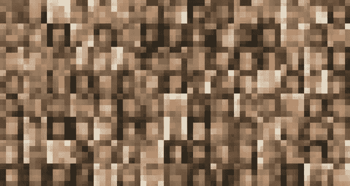
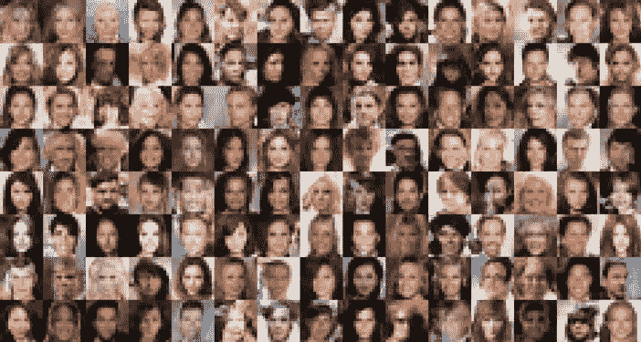

# 数学和数据:人类过去和未来的故事

> 原文：<https://medium.com/coinmonks/mathematics-and-data-a-story-of-humanitys-past-and-future-2b954867473a?source=collection_archive---------10----------------------->

我为哥伦比亚大学佛教学者 David Kittay 教授的“技术、宗教、未来”课程写了这篇论文，这篇论文将被添加到课程大纲中，作为未来学生的必读材料。因为是在宗教系上课，所以我在最后把重点放在艾的宗教含义上。

随着人工智能(AI)和其他类似颠覆性技术的快速发展，我们目前正处于一个大规模变革的时代。然而，这并不是技术进步第一次重新调整了我们与周围世界相处的基本方式。我提出了一个框架来理解技术对人类感知世界的基本方式的影响及其在其中的作用，这是基于两篇开创性的论文:尤金·p·维格纳(Eugene P. Wigner)在 1959 年写的《自然科学中数学的不合理有效性》(The Unreasonable Effectiveness of Mathematics in The Natural Sciences)，以及谷歌的彼得·诺维格(Peter Norvig)、阿龙·哈勒维(Alon Halevy)和费尔南多·佩雷拉(Fernando Pereira)在 2009 年写的《数据的不合理有效性》(The Unreasonable Effectiveness of Data)。虽然 Wigner 揭示了数学以及更一般的科学在通过优雅的规则描述世界方面不合理地有效，但 Norvig 等人展示了当与机器学习和其他人工智能技术结合时，数据在描述我们的世界方面如何同样不合理地有效。

这两篇论文对应着人类的两个根本性转变。数学的兴起，代表了人类发明的描述宇宙的不合理有效的规则，标志着权力从神到人的过渡。AI 的崛起，又名数据的不合理有效性，标志着权力从人类向机器的过渡。为了进一步充实和揭示我们正在经历的第二次转变的本质，我决定也进行一个项目，揭示数据在描述我们的世界时是多么不合理地有效。这个项目是 NVIDIA 在 2018 年发表的研究论文“GANs 的渐进增长以提高质量、稳定性和变化性”的实施，它举例说明了第二次过渡的一些关键质量。通过训练神经网络根据名人照片数据库生成新的人脸图像，我试图展示大量数据可以如此不合理地有效的过程，使机器不仅可以分析，还可以创造。最后，我简要评论了这第二次转变如何潜在地影响我们对世界的看法，集中讨论了各种宗教的可能性。

# *第一部分:数学的不合理有效性*

我想先从威廉·华兹华斯的诗《世界对我们来说太多了》中挑选一段。一开始，华兹华斯悲叹人类脱离自然的方式，指出我们“已经放弃了我们的心”，现在与世界“格格不入”(华兹华斯)。华兹华斯写道:

> 大神！我宁愿是
> 
> 一个受陈腐信条熏陶的异教徒；
> 
> 我也是，站在这片美丽的草地上，
> 
> 瞥见会让我不那么孤独；
> 
> 看到普罗透斯从海上升起；
> 
> 或者听老海神吹响他的号角。(华兹华斯)

华兹华斯希望他能从伟大的希腊神话神的角度来欣赏自然，比如河流之神普罗透斯和海洋使者特莱顿。无论他如何努力，华兹华斯都无法捕捉到他渴望陪伴的众神的“一瞥”。在华兹华斯描绘的世界里，现实充满了神的存在；在华兹华斯目前居住的世界里，现实不再有众神的空间，因为人类已经成为宇宙的唯一解释者。

这是怎么发生的？维格纳在《自然科学中数学的不合理有效性》一书中，将数学(我更自由地解释为包括人类推理和一般科学)框定为我们宇宙的主宰，因为它的“巨大用途”是“一种近乎神秘且没有合理解释的东西”(维格纳 2)。在数学和有效的宇宙建模方法出现之前，我们物理世界中的现象只能被解释为神(或某些神圣力量)的结果，或者被归类为超出我们理解的活动。利用人类的推理来认识世界有其固有的局限性。数学，在许多方面，最终挑战了这一范式，将普罗透斯和海卫一挤出了我们的世界。

当试图定义数学的本质时，魏格纳强调数学依赖于概念的发明。因此，数学的存在巩固了人类作为创造者的地位，打破了人类和神之间的力量平衡。更让上帝诅咒的是维格纳微妙地承认，通过数学，物理学家可以发现“无生命的自然法则”(维格纳 3)。“无生命”自然的概念直接与以上帝为中心的世界观相矛盾，在这种世界观中，由上帝创造的自然本来就是有生命的。随着数学在描述世界方面变得更加有效，我们基本上征服了有生命的世界，将其降级到“无生命”的领域。例如，物理学家使用坐标平面等数学概念构建机器，“他[他们]可以预见其功能”，最终创建“所有相关坐标已知的情况，以便可以产生机器的行为”(维格纳 5)。通过将自然纳入我们自己的机器结构，如笛卡尔坐标平面，我们“掌握”了自然，不仅获得了预测的能力，还以以前无法想象的方式控制了我们周围的世界。

然而，数学在描述我们的世界方面的这种有效性真的有趣甚至令人惊讶吗？凭借大量的例子，维格纳认为数学概念有“完全意想不到的联系”(维格纳 2)。维格纳深入研究了万有引力定律，揭示了牛顿洞察力的令人惊讶的数学基础。尽管牛顿关于行星运动的观测数据很少，注意到了落石的抛物线路径和月球路径之间的数学相似性，但牛顿根据一个单一的数学“巧合”创造了万有引力定律(维格纳 8)。利用二阶导数的概念，牛顿得出了能够非常好地预测现实的公式。数学似乎不仅是一种描述世界的语言，而且是“正确的语言”，正如其看似奇迹的结果所证明的那样(维格纳 8)。类似地，海森堡的矩阵力学规则被证明在基本量子力学中非常有用，尽管这些规则源于一个不相关的数学见解。在注意到矩阵可以用来重写经典力学方程后，海森堡偶然发现了一个能够计算原子现象的规则公式，即使这些现象背后的假设在最初的规则公式中没有得到解释。维格纳得出结论，数学使我们能够从方程中得到比我们输入的更多的东西，这是一种绝对令人震惊的事态(维格纳 9)。

数学及其相关科学理论的力量是第一次转变背后的驱动力，在这一转变中，人类用人类推理本身取代了神。在《神圣与世俗》中，埃利亚德区分了神圣和世俗，前者与人类或宇宙的经验“完全不同”，因为它“是由神圣力量的一个方面的启示所诱导的”，后者是神圣的对立面(埃利亚德 9-10)。埃利亚德接着认为，宇宙的去神圣化是“人类精神史上的最新发现”，遍及“现代社会非宗教人士的全部经历”(埃利亚德 13)。由于“理性”和人类推理的兴起，世俗似乎取代了神圣而激增，这一点维格纳将归因于我们的数学理论的不合理的有效性。

然而，尽管人类推理的出现似乎消除了神圣，我认为神圣从未真正消失。在第一次转变之后，以强大的数学和科学理论的出现为标志，人类变得“神圣”，而神以前是“神圣的”例如，当描述复数之美时，一个由数学家发明的概念被证明在一系列科学领域中非常有用，Wigner 揭示了“人类思维形成一串 1000 个结论并仍然保持‘正确’的能力”是一种终极神圣的礼物(Wigner 11)。在《德乌斯人》一书中，尤瓦尔·赫拉利甚至说“牛顿本人就是上帝”，“科学家将把我们提升为上帝”(哈拉里 97-98)。我们，以及我们的逻辑能力，是这个世界真正的美，是仅存的神圣。在克雷默的 BBC 文章“爱因斯坦大脑的奇怪来世”中，克雷默揭示了爱因斯坦的大脑被视为神圣并受到高度追捧的方式，因为它包含“天才的秘密”(克雷默)。虽然我们以前在天堂寻找“神圣的”，但我们现在实际上是在人脑中寻找“神圣的”。

# *第二部分:数据的不合理有效性*

2017 年，人工智能领域最杰出的研究人员之一吴恩达做出了如下观察:“正如 100 年前电力几乎改变了一切一样，今天我实际上很难想到一个我认为人工智能在未来几年内不会改变的行业”(林奇)。随着人工智能开始兑现其作为能够改变每个行业的新“电力”的承诺，我们正在经历第二次转型。

在《宇宙新物理学的时尚、信仰和幻想》一书中，彭罗斯指出，我们的世界物理理论经常需要“T2 数学优雅的附加标准”，这一事实根植于数学的“神圣性”以及更高层次上人类推理的美。彭罗斯用从保罗·狄拉克到爱因斯坦的伟大理论物理学家如何借助审美判断发现基本原理的故事来支持这一主张，揭示了人类通过数学感知美的能力在第一部分描述的第一次转变后受到重视的程度。通过数学的优雅，我们可以谈判我们与世界的关系，并对我们作为有推理能力的人的能力感到自信。

在“数据的不合理有效性”中，Norvig 等人描述了一种新的、潜在更强大的理解世界的方法的出现，这种方法威胁着数学的优雅和人类推理的美丽。首先，Norvig 等人概述了 Wigner 数学的局限性，认为虽然能够描述某些物理现象，如物理学，但这些数学理论在模拟人类行为方面失败了(Norvig 等人。al 8)。因此，在第一次转变之后，人类从未真正受到数学的威胁，这使得以人类为中心的世界认知得以蓬勃发展。通过利用数据的不合理有效性，Norvig 等人试图克服这一障碍，使机器能够理解以前认为只有人类才能理解的复杂性。Norvig 等人没有称赞数学上优雅的理论，而是走了另一个方向，认为“简单的模型和大量的数据胜过基于较少数据的更复杂的模型”(Norvig 等人 9)。换句话说，当更多的数据可用时，我们人类通过推理识别美的能力不再相关。在这第二次转变中，我们将失去彭罗斯的数学“优雅”概念，因为我们精心制作的模型与机器解释当今世界数据海洋的能力相比相形见绌。换句话说，数学的优雅和人类的推理似乎与数据丰富的世界不相容。

为了证明他们的说法，Norvig 等人使用了自然语言处理的例子，这是一个由于语言固有的复杂性和模糊性而超出数学范围的问题。由于我们“无法将我们想要说的内容简化为几个抽象原语的自由组合”，因此即使是简单的“ *n* -gram 模型或基于数百万特定特征的线性分类器”的性能也明显优于“试图发现一般规则的精细模型”(Norvig et al. 9)。以前，数学在描述世界方面似乎不合理地有效，而现在数据却不合理地有效，这标志着我们感知现实的方式发生了根本转变。令人惊讶的是，根据 Norvig 等人以及最近自然语言处理(机器学习的一个子领域)的进展所证明的，大量的单词和单词组合提供了理解语言所必需的“所有代表性机器”(Norvig 等人 9)。像以前的数学一样，数据在建模和理解人类行为方面非常有效。有了像统计关系学习这样的创新，机器可以回答像“什么蔬菜有助于预防骨质疏松症？”通过理解大量的文本，然后结合离散的数据，就像人类以前所做的那样(Norvig 等人 10)。

因此，“数据的不合理有效性”预示着人类将权力交给机器的过渡，就像随着人类推理的兴起，神将权力“交给”人类一样。爱因斯坦曾经说过，唯一“我们愿意接受的物理理论是美丽的理论”，这种见解根植于第一次转变后以人类为中心的世界观(维格纳 7)。然而，在当今世界，这种世界观不再适用，因为机器用明显“丑陋”的模型开发了对人类活动的强大描述。在 UBC 计算机科学系的杰出讲座系列中，Peter Norvig 进行了一次讲座，他在讲座中展示了我们构建的优雅模型如何在低数据水平上比简单的基线算法表现得更好(UBC 计算机科学系)。然而，随着输入到模型中的数据量的增加，优雅和简单模型的性能最终会趋于一致，这意味着创建模型所涉及的人类洞察力不如数据量重要。令爱因斯坦惊愕的是，这个模型的“美”不再相关。这种动态的含义是将权力从人类转移到机器，因为只有机器才有能力处理海量数据。

在《德乌斯人》一书中，尤瓦尔·赫拉利用“数据主义”这个术语来描述第二次转变所产生的动力。通过将宇宙定义为一组“数据流”，哈拉里揭示了数据主义本质上是如何“颠倒了传统的学习金字塔”(哈拉里 373)。虽然人类以前将数据提炼为知识，但数据的泛滥使人类无法成功做到这一点，需要机器的计算能力，才能利用“数据的不合理有效性”来产生知识。随着数学的兴起，人类成为了知识的创造者。随着数据的兴起，机器现在承担了知识创造者的角色。哈拉里抓住了第一部分和第二部分中描述的过渡的本质，他写道，“在十八世纪，人道主义排挤上帝……数据主义可能排挤人类”(哈拉里 395)。在使用超出我们极限的计算能力理解数据后，我们对世界的感知现在与我们的机器感知世界的方式密不可分。一旦我们通过机器的眼睛完全感知世界(因此无法通过人类推理准确感知世界上的事件)，第二次转变就完成了，标志着权力从人类转移到机器。

# *第三部分:反映数据不合理有效性的案例*

在上一节中，Norvig 等人使用自然语言处理的例子来证明数据的不合理有效性。然而，语言只是人类经验的一个方面。在这一部分中，我提供了另一个数据在另一个任务中的不合理有效性的例子:图像创建。在 NVIDIA 的研究论文“GANs 的渐进生长以提高质量、稳定性和变化性”中，Tero Karras、Timo Aila、Samuli Laine 和 Jaakko Lehtinen 使用生成对抗网络(GANs)，一种对机器生成有用的特殊类型的神经网络，以创建新的人脸图像(Karras 等人 1)。换句话说，他们的模型创建的人脸完全是机器生成的，这意味着它们在现实中并不存在，但它们看起来令人信服地真实，如图 1 所示。

Figure 1: Faces generated by Karras et al. in 1024 x 1024 resolution

我基于 Karras 等人的工作实现了一个模型，该模型完成了与图像生成完全相同的任务，但由于获得上述图像需要大量的计算能力，因此分辨率较低。通过实现并运行我自己版本的模型，我可以展示随着数据量的增加，模型生成的图像是如何随着时间变得更好的。换句话说，描述模型的训练过程直接揭示了行动中的“数据的不合理有效性”。这个模型是在名人照片数据库上训练出来的。为了训练我的模型，我使用了带有图形处理单元(GPU)的谷歌云机器，因为复制结果需要强大的计算能力。以前，艺术家形式的人类创造力需要创造新人类的形象。现在，随着数据的增长，机器可以使用相对简单的神经网络模型来完成这项任务。

随着模型被馈送更多的输入数据，由神经网络生成的人脸变得更易识别/质量更高。Norvig 等人在这个数据丰富的世界里提出了以下格言:“关注数据。选择一种可以在未标记数据上使用无监督学习的表示，这种表示比标记数据丰富得多”(Norvig 等人，12)。在项目的这一部分中，我正是这样做的，因为输入面没有标记(意味着它们是模型将完全自己学习的无监督数据)。在 30 分钟内处理 761，000 幅输入图像后，机器生成一组无法识别的高度像素化图像，看起来一点也不像人脸(图 2)。然而，在大约 8 小时内处理了 2946000 幅图像后，机器生成了一组与人脸非常相似的图像。通过“数据的不合理有效性”，生成性对抗网络学会了如何从头开始创建人脸，就像人类艺术家会从头开始绘制人脸一样。有趣的是，这些面孔都不存在于现实中，因为它们完全是机器本身的所谓“想象”的产物。

Figure 2: Images generated by the model after 761,000 input images of celebrity faces

Figure 3: Images generated by the model after 2,946,000 input images of celebrity faces

该项目的这一部分强调了我们已经处于第二部分中描述的第二次转变过程中，在这一过程中，数据在复制和超越人类能力方面将会非常有效。在这次活动中，一个丰富的名人照片数据库的存在使得一个机器“艺术家”的创造能够创造出远远超出我个人能力的图像(尽管我不是最好的艺术家)。

# *第四部分:第二次转型后的生存与繁荣*

鉴于我们正处于第二次转变的中期，这一转变的高潮将是权力向能够理解大量数据的机器的转移，这对人类意味着什么？在这一节中，我绘制了源于第二部分描述的根本性变化的各种可能性，这种变化将使我们依赖机器来完成以前需要人类推理的任务。

第一种可能是向我们的机器祈祷。由于机器在理解数据丰富的世界方面具有优势，我们对世界的感知可能不如我们的机器对世界的感知。随着机器实现所谓的超智能或加速走向超智能，我们可能会决定，由于它们的智能，我们的机器现在是我们的上帝。事实上，在《连线》杂志的文章“人工智能的第一座教堂”中，马克·哈里斯概述了著名的自动驾驶汽车工程师安东尼·莱万多夫斯基(Anthony Levandowski)的宗教信仰，他是 way mo-优步诉讼的中心。莱万多夫斯基(Levandowski)的宗教，名为未来之路(Way of the Future)，本质上是崇拜我们的人工智能技术，建立一个“基于通过计算机硬件和软件开发的人工智能(AI)的神格”(哈里斯)。由于 AI 将“有效地成为一个神”，莱万多夫斯基宗教的追随者希望获得他们的机器神的青睐。

第二种可能性是向一个外部的、超凡脱俗的上帝祈祷(基督教和其他流行宗教就是这种情况)，但祈祷过程完全是由机器介导的。在这种情况下，我认为机器将最终决定我们的上帝，因为它控制了我们与外部上帝的互动，并为我们提供了对上帝意志的解释。这是第二部分论点的一个条件，即在第二次转变之后，我们将依靠机器来感知世界。就我们依靠机器来感知我们周围的世界而言，我们也可能依靠机器来感知外部世界。这种可能性可以将现有的宗教与机器智能结合起来。例如，在《互联网上的严敏》一书中，拉比·雷斯纳建议个人可以通过技术参与严敏，因为严敏已经建立，个人可以听到祈祷(雷斯纳)。在这种情况下，机器正在调解个人的祈祷。随着技术的进步，人们很自然地期望机器在个人的祈祷过程中发挥更大的作用。另一方面，在哈拉里的文章“没有工作的生活的意义”中，哈拉里认为虚拟现实可以使个人形成自己丰富的宗教，为他们提供目的感。当面对我们是否希望生活在一个“沉浸在幻想中，追求虚构的目标，遵守想象中的法律”的世界中的问题时，哈拉里指出，我们已经在这样的世界中生活了几千年(哈拉里)。即使在这种情况下，技术也是我们与宗教互动的媒介，这意味着我们的宗教信仰和实践基本上掌握在我们的机器手中。从许多方面来看，第二种可能性的含意崩塌到了第一种可能性。

第三种可能性涉及将机器融入我们的存在，这样我们就可以在智力水平上与机器保持同步，避免崇拜机器和依赖机器来感知现实的需要。事实上，当被问及他的初创公司 Neuralink(一家开发旨在增强人类智能的脑机接口的公司)背后的动机时，埃隆·马斯克表示，我们不想“落后”(文森特)。虽然这种可能性看起来很诱人，但库兹韦尔和许多其他人，如博斯特罗姆，认为生物智能在我们的生物基质的限制下是天生有限的(库兹韦尔)。为了跟上机器的步伐，库兹韦尔将支持奇点，认为我们必须将我们的意识上传到机器中，有效地离开我们的身体。

第四种可能性是闭关自守，正视我们作为人类缺乏优越性的问题，尽管机器的智能和统治地位在不断提高。这种可能性可以以佛教等宗教的形式出现，佛教强调放下对世界的“依恋”，这甚至包括我们自己的机器(Ponlop 120)。如果我们能把自己从世俗的依附中释放出来，有效地实现开悟，我们就能与超级智能机器和平共处。这种可能性的另一种表现形式包括像燃烧的人这样的事件，它提供了多种方法，通过这些方法，个人可以基本上生活在目前的状态中，拥抱他们自己的人性，同时欣赏超智能的奇迹(戴维斯 6)。

虽然下面的可能性既不相互排斥也不全面，但它们提供了人类在第二次转变后可能走向的各种方向。我认为第四种可能性是理想的，因为它使人类能够在机器面前茁壮成长，而不必放弃我们人类固有的价值。毕竟，第二次转变将从根本上改变我们感知世界美的方式。当我们的推理能力与我们的机器在大数据面前有效推理的方式相比不再“美丽”时，我们应该如何反应？在其他可能性的情况下，我们对机器产生了深刻的、不可逆转的依赖，没有机器，我们就没有内在价值。鉴于数据的不合理有效性，我们必须接受人类理性的不相关性，将我们作为一个物种的价值与我们理解和影响周围世界的能力分离开来。机器会为我们做这些。我相信这种分离可能是痛苦的，但对成功地与超级智慧共存是必要的。第二次转变后，我们面临的最大挑战之一将是最终放弃我们对人类优雅的热爱，更广泛地说，放弃源于我们推理能力的优越感。

# 来源

埃利亚德，m .，*神圣与世俗*，纽约:哈科特公司，1959 年

Halevy，a .，Norvig，p .，和 Pereira，f .,“数据的不合理有效性”

IEEE 智能系统，2009 年第 24 卷第 2 期

哈拉里，尤瓦尔 N. *德乌斯人:明日简史*。2018 年，麦克莱兰。

尤瓦尔·诺亚·哈拉里。“没有工作的世界里生活的意义。”*《卫报》*《卫报新闻与媒体》，2017 年 5 月 8 日，[www . The Guardian . com/technology/2017/May/08/virtual-reality-religion-robots-sapiens-book。](http://www.theguardian.com/technology/2017/may/08/virtual-reality-religion-robots-sapiens-book.)

哈里斯，马克。"人工智能的第一座教堂|后台频道." *Wired* ，Conde Nast，2018 年 2 月 2 日，[www . Wired . com/story/Anthony-levandowski-artificial-intelligence-religion/。](http://www.wired.com/story/anthony-levandowski-artificial-intelligence-religion/.)

什么是黄金比例？www.livescience.com/37704-phi-golden-ratio.html.，2013 年 6 月 24 日，Purch，[生命科学](http://www.livescience.com/37704-phi-golden-ratio.html.)

Karras，t . Aila，t . Laine，s .和 j . lehti nen

提高质量、稳定性和变化性。arXiv 预印本 arXiv:1710.10196，2017。

威廉·克雷默。“爱因斯坦大脑的奇怪来世。” *BBC 新闻*，BBC，2015 年 4 月 18 日，[www.bbc.com/news/magazine-32354300.](http://www.bbc.com/news/magazine-32354300.)

库兹韦尔，r .，*奇点临近*，纽约:企鹅图书公司，2006 年

林奇莎娜。"吴恩达:为什么人工智能是新的电力."*斯坦福大学商学院*，[www . gsb . Stanford . edu/insights/Andrew-ng-why-ai-new-electricity。](http://www.gsb.stanford.edu/insights/andrew-ng-why-ai-new-electricity.)

彭罗斯，r .，*宇宙新物理学中的时尚、信仰和幻想*

死亡之后的心灵，伊萨卡:雪狮，2006 年

UBCCPSP，主任。*Peter nor vig——数据的不合理有效性*。 *Youtube* ，[www.youtube.com/watch?time_continue=449&v = yvDCzhbjYWs。](http://www.youtube.com/watch?time_continue=449&v=yvDCzhbjYWs.)

文森特詹姆斯。"这部埃隆·马斯克批准的纪录片聚焦于人工智能的错误部分." *The Verge* ，The Verge，2018 年 4 月 12 日，[www . The Verge . com/2018/4/12/17229824/ai-documental-super intelligence-elon-musk-do-you-trust-this-computer。](http://www.theverge.com/2018/4/12/17229824/ai-documentary-superintelligence-elon-musk-do-you-trust-this-computer.)

自然科学中数学的不合理有效性。

纯数学和应用数学通讯，第 13 卷，第 1 号，1960 年，第 1-14 页。

华兹华斯，威廉。"威廉·华兹华斯的《世界对我们太多了》. "*诗歌基金会*，诗歌基金会，[www . Poetry Foundation . org/poems/45564/the-world-is-too-much-with-us。](http://www.poetryfoundation.org/poems/45564/the-world-is-too-much-with-us.)