# 最大化服务器上的 CPU 资源利用率

> 原文：<https://medium.com/coinmonks/maximizing-cpu-resource-utilization-on-servers-fcbbb7908e1c?source=collection_archive---------2----------------------->

## *通过使用主机托管技术，阿里巴巴将 CPU 资源利用率提高了 30%*

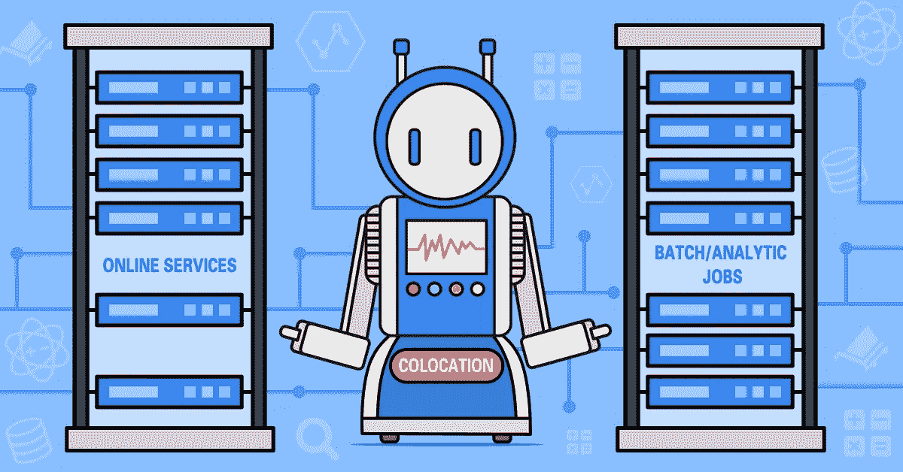

计算资源对于在线服务和离线批处理作业都至关重要。但是，在任何给定的时间里，都有数量惊人的资源处于闲置状态。根据 Geithner 和 McKinsey 的说法，全球服务器只使用了其 CPU 的 6%到 12%。对于阿里巴巴的在线服务，平均每天的利用率只有大约 10%，直到技术团队推出了他们的主机托管解决方案来解决这个问题。

通过主机托管技术，阿里巴巴可以有效地利用那些以前未被充分利用的资源。这是通过利用在线服务和批处理作业的不同属性实现的。通过在其服务器上采用主机托管，阿里巴巴将其 CPU 利用率从 10%提高到了 40%，增幅高达 30%。

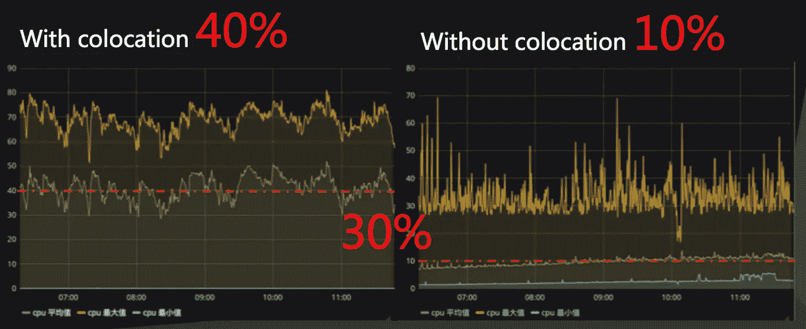

*Colocation boosts cluster resource usage by 30 percent*

阿里巴巴在 2014 年首次开始研究在电子商务中大规模使用的主机托管技术。第一次大规模使用发生在 2017 年，当时双 11 全球购物节期间有 20%的流量是使用该技术处理的。

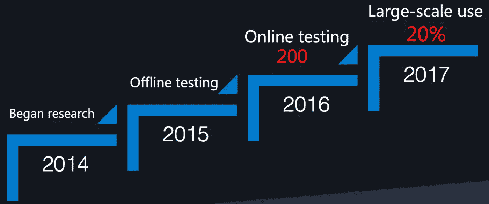

*Alibaba’s colocation technology: from research to implementation*

# 通过主机托管提高 CPU 利用率

主机代管通过将不同的任务类型调度到相同的物理资源来工作。这意味着组合集群并使用调度和资源隔离等控制方法来充分利用资源能力。阿里巴巴的主机托管技术在保护系统景观优化(SLO)的同时做到了这一点。

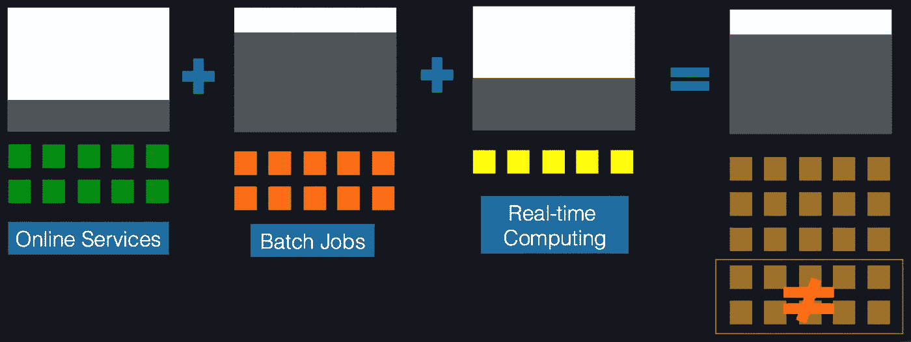

*Colocation technology and CPU resources*

要符合托管资格，任务必须:

**能够按优先级划分** 拥有不同的优先级很重要，这样高优先级任务就可以在必要的时候接管低优先级任务的资源。

**有互补的资源分配** 这意味着不同的任务类型在不同的时间需要不同数量的资源。

# 适用于在线服务和批处理作业的托管

通过利用在线服务和离线批处理作业各自不同的计算需求，可以有效地将主机托管应用于在线服务和离线批处理作业。

**“在线服务”**泛指任何一种基于互联网的服务。对于阿里巴巴集团来说，这包括 Alibaba.com、全球速卖通和天猫等在线平台，以及这些平台的在线活动，如促销活动。

在线服务在高峰时段需要大量资源——例如在阿里巴巴的双 11 全球购物节期间——但在这些时段之外需要的资源要少得多。这意味着在高峰期之外，大量资源可能会闲置。全局服务器只使用了其 CPU 的 6%到 12%。在线服务的使用在白天比在凌晨更高，并且在线服务必须不间断地继续。

**“批处理作业”**是数据分析等需要计算资源，但对延迟敏感度要求相对较低的任务。

批处理作业会占用大量资源，尤其是 CPU 时间。批量作业的高峰时间是凌晨。

因此，在线服务和批处理作业符合托管的资格标准:

在线服务的优先级高于批处理作业，因为它们必须不间断地持续运行。批处理作业优先级较低，因为它们对延迟不太敏感。

批处理作业的高峰时间是凌晨，而在线服务更有可能在一天中达到高峰，这使它们成为互补。

理解主机托管如何更好地利用 CPU 资源进行在线服务和批处理作业的一个有用方法是使用沙子和石头的比喻。

在线服务资源需求可以比作装在容器中的石头。在高峰时间之外，在线服务只需要使用容器内的石头资源，而不需要使用石头之间的间隙。

批处理作业需求可以比作填充容器中石头之间空隙的沙子。由于在线服务通常不需要使用这个空间，批处理作业可以填充这个空间。但是，当对在线服务的需求增加时，批处理作业将离开容器，因此在线服务可以使用额外的资源。这样，更高优先级的任务类型(在本例中为在线服务)可以不间断地继续。

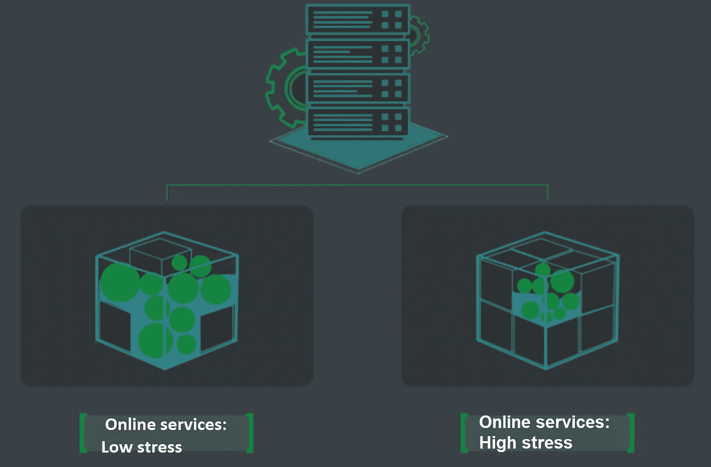

*When demand for online services is high, online services use more resources. The green “stones” represent online services while the blue “sand” represents batch jobs*

# 计算主机托管的优势

主机托管节省的资源量是根据一个简单的公式计算的。

假设一个数据中心有“N”台服务器，利用率(“R”)从 R1 到 R2 递增。在不考虑任何其他限制的情况下，可以节省的服务器数量(“X”)计算如下:

因此，如果您有 10 万台服务器，并且您的资源使用率从 28%增加到 40%，您可以节省 3 万台服务器。换句话说，主机托管可以节省高达 30%的资源。

这一点在谷歌 2015 年发表的一篇题为“谷歌与博格的大规模集群管理”的论文中得到佐证。在本文中，谷歌描述了一个使用与阿里巴巴开发的主机托管解决方案类似的技术的解决方案，并指出他们使用该解决方案能够节省 20%至 30%的计算资源。

# 协同定位调度架构

下图显示了阿里巴巴的主机托管调度解决方案的架构。

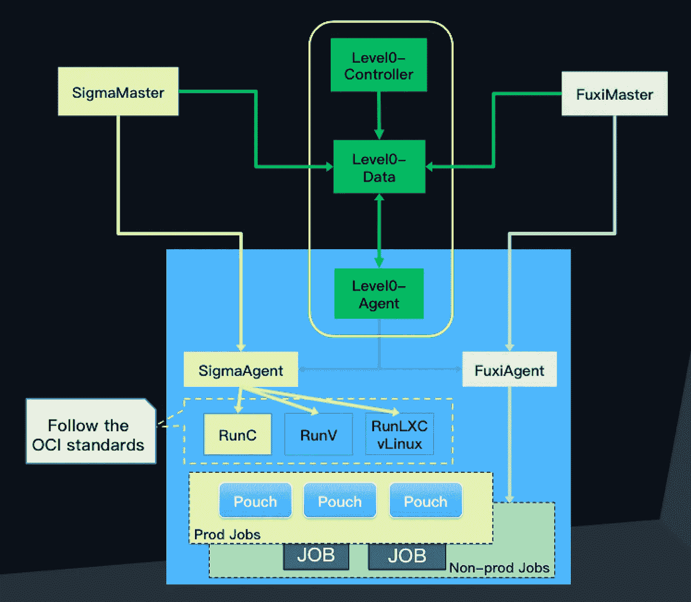

*Colocation scheduling architecture*

该解决方案的三个关键方面是两个自主运行的调度集群，以及在它们之间进行协调的 Level0 机制:

**适马**管理在线服务容器的调度。

**福喜**管理数据处理和批处理作业。

第 0 级机制由第 0 级数据、第 0 级代理和第 0 级控制器组成，使 SigmaMaster 和 FuxiMaster 调度器能够协同工作。

## 希腊字母表中第十八个字母

适马管理在线服务容器的调度。它:

与 Kubernetes API 兼容。

使用阿里袋容器，符合 OCI 标准。

已经被阿里巴巴大规模使用了好几年。阿里巴巴双 11 全球购物节期间也一直在使用。

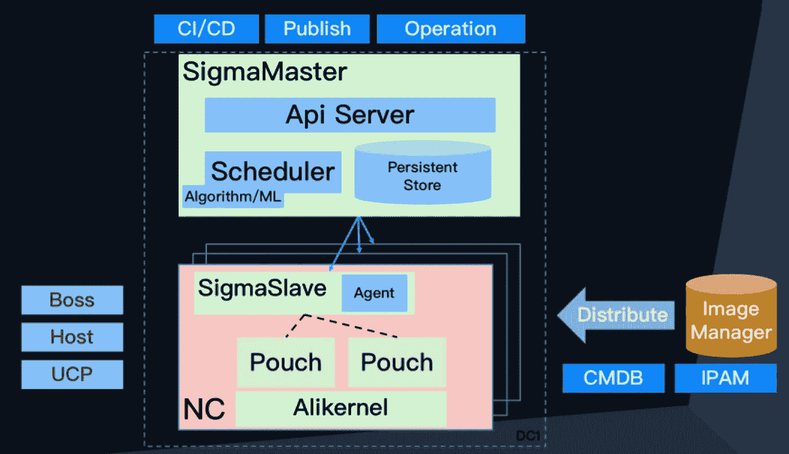

*Sigma architecture*

## 伏羲

福喜管理批量作业。它是:

用于大量数据处理和复杂的大规模计算类型的应用。

提供数据驱动的多级流水线并行计算框架，兼容 MapReduce、Map-Reduce-Merge、Cascading、FlumeJava 等编程模式。

高度可扩展。它支持几十万级并行任务调度，并能根据数据分布优化网络开销。它自动检测故障和系统热点，重新启动失败的任务，并确保稳定可靠地完成操作。

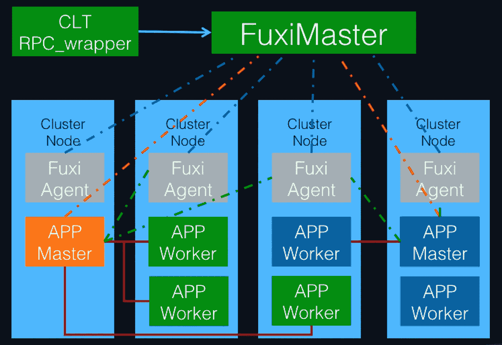

*Fuxi architecture*

## 0 级机制

下图所示的第 0 级机制协调和管理集群，以实现平稳运行。该机制管理:

共存集群

每个调度租户之间的资源匹配

日常使用和大规模促销期间使用的策略

异常检测和处理

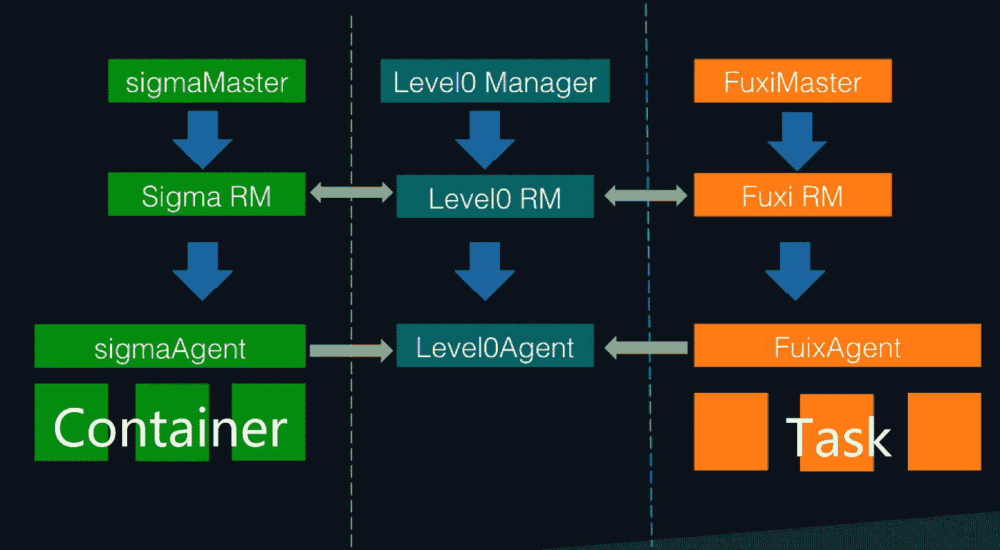

*Level0 mechanism*

# 托管资源隔离

为了使主机托管有效工作，正确执行资源隔离是至关重要的。如果资源隔离不能有效进行，那么对资源的竞争就不能有效解决。

这可能会导致在线服务出现问题。在最好的情况下，这会损害用户体验的质量。在最坏的情况下，这可能意味着无法提供在线服务。

可以采用以下两种方法来避免资源竞争问题:

**1。** **调度**

**2。** **内核隔离**

## 行程安排

调度使用资源表示技术在资源竞争出现之前预测和计划资源需求。调度的目的是降低资源竞争发生的概率。调度可以不断优化。

可以根据以下方法和注意事项来优化调度:

**每日时分复用**

**推广时分复用**

**无损降级**

**批处理作业** **选择**

**动态记忆**

**电脑存储分离**

**每日时分复用**

对于在线服务和批处理作业，资源需求的高峰和低谷出现在一天的不同时间。因此，每天都可以使用时分复用来提高资源利用率。

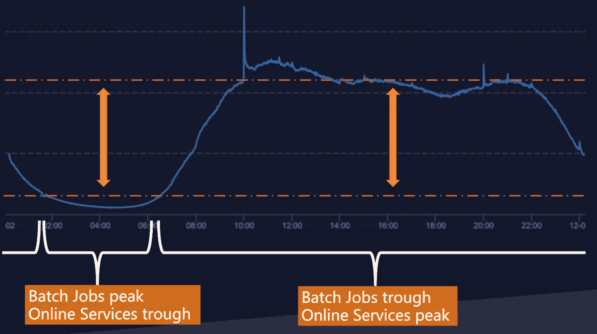

*Peaks and troughs for online services and offline batch jobs*

**推广时分复用**

电子商务业务涉及巨大的在线促销活动，如双 11 全球购物节。在大规模促销或压力测试期间，资源压力将比正常运营期间高出数倍。如果到那时，我们减少用于计算任务的资源，并将所有这些资源用于在线服务，那么我们就可以非常有效地应对短期的资源需求激增。

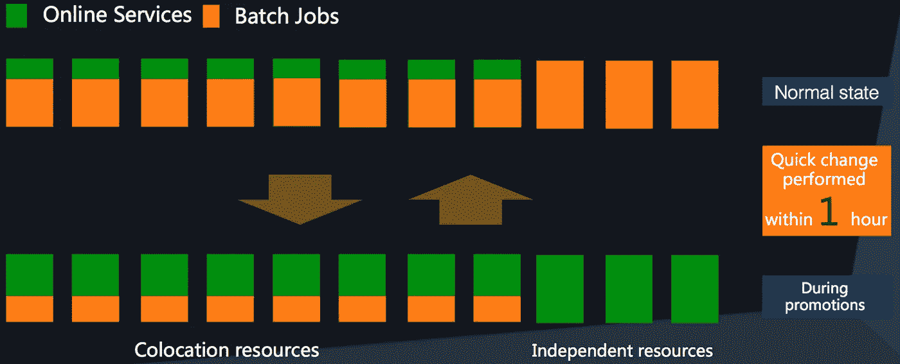

*Allocation of colocation resources according to demand*

**无损降级**

降级批处理作业时，应尽可能降低影响。对于无损降级，要注意降级方案。

因为在线服务通常不使用很多资源，所以添加 70%的计算任务资源只需不到三分钟。这意味着在降级后的前五分钟，批处理作业对在线服务的影响不应太大。

另一个问题是分钟级恢复。如果成功实现逐分钟恢复，那么只有在真正的峰值点才会有影响。由于峰值点周期很短，这种影响将被最小化。

> [在您的收件箱中直接获得最佳软件交易](https://coincodecap.com/?utm_source=coinmonks)

**批量作业选择**

之前我们用沙子这个比喻来描述批处理作业。但是即使是沙粒的大小也不一样。为了确保资源的间隙被利用而不溢出，我们需要过滤和选择沙子。这可能意味着:

制作任务或工作的资源表示，并分析需要消耗的资源数量。

使用 Level0 获得主机的精确剩余计算资源容量。

选择最符合条件且将减少资源竞争的任务或工作。

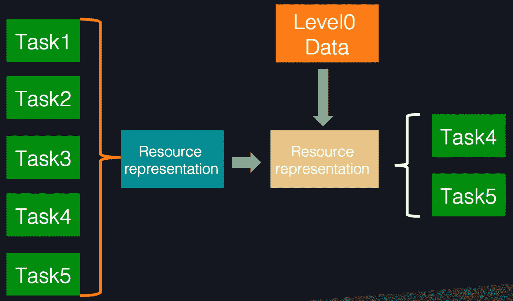

*Computing task selection process*

**动态记忆**

由于以前的内存资源没有考虑托管，内存和 CPU 都是匹配在线服务的原始需求，没有任何多余的内存。

由于不断增长的需求，内存达到了一个瓶颈，静态分配内存不再足够。为了解决这个问题，引入了内部存储器的动态分配。这可能意味着:

计算任务使用的内存量的动态调整。

当在线服务压力增加时，通过迁移或终止任务自动调整批处理作业的内存使用。

如果整个单元内存不足(OOM ),则首先终止优先级较低的计算任务。

**电脑存储分离**

不同的存储解决方案用于在线服务和批处理作业:

在线服务优先考虑每秒输入/输出(IOPS)，但不使用大存储容量，因此使用小型 SSD 驱动器进行存储。

批处理作业优先考虑存储，而不是 IOPS，因此大型硬盘驱动器用于存储。

使用主机代管时，如果本地驱动器仍用于处理数据，但批处理作业混合在一起，那么调度就会变得非常复杂。为了解决这个问题，我们需要从本地驱动器中创建一个虚拟内存池。

这样我们就可以通过远程访问，根据需求访问不同的存储设备。

阿里巴巴也开始大规模建设 25G 网络容量。这将提高整体网络能力。它还将使远程访问变得和本地访问一样快。

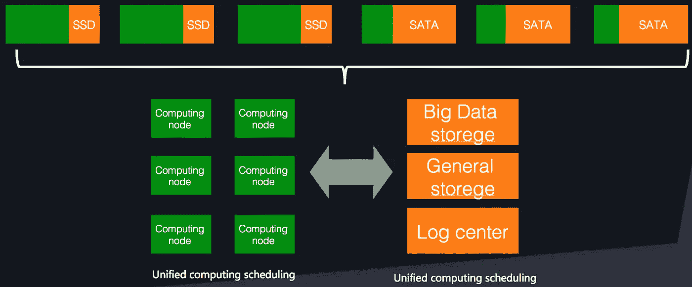

*Computing and storage scheduling*

## 内核隔离

如果发生资源竞争，可以使用任务优先级来决定如何防止对高优先级任务的影响，并最小化对低优先级任务的影响。这是在极端情况下采取的最后手段。

内核隔离可以根据以下方法和注意事项来实现:

**CPU 调度优化**

**记忆保护**

**IO 等级约束**

**网络流量控制**

**CPU 调度优化**

这是最重要的内核隔离项。当 CPU 在线服务的压力增加时，批处理作业必须在毫秒内撤回。

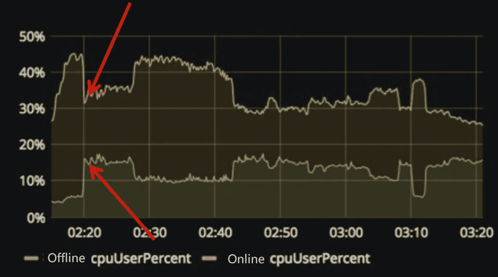

*As the red arrows show, when online services need more resources,* *batch jobs must immediately use less resources*

CPU 调度优化包括:

> ***CPU 资源占用***
> 
> *这意味着根据 CGroup 分配优先级。高优先级任务可以占用低优先级任务的时隙。*
> 
> ***【避免 HT(噪点清除)***
> 
> *这意味着避免离线任务被调度到与在线任务相邻的 HTs，并确保被调度到与在线任务相邻的 HTs 的离线任务在被唤醒后被移动。*
> 
> ***L3 缓存隔离***
> 
> *使用 BDW CPU 特性的 CAT 进行缓存访问流量控制。通过这种方式，可以限制低优先级任务对 CPU 的使用。*
> 
> ***内存带宽隔离***
> 
> *内存带宽包括根据实时监控实施策略化调整，以及通过调整批处理作业的操作时隙长度来控制 CFS 带宽。给任务一个较短的时隙允许高优先级的批处理作业使用更多的 CPU 资源。*

**记忆保护**

试图通过内存恢复隔离来避免联机任务受到内存恢复的影响。

根据不同的组分配优先级，增加组内恢复机制，并根据优先级确定内存恢复的重要性。

如果一个单位是 OOM，从最低优先级开始杀死任务。

**IO 等级约束**

为文件级 io 带宽隔离(上层)添加了 blkio 控制器以及 IOPS 和每秒位数(BPS)限制。一旦超过低带宽阈值，文件级低带宽阈值(较低级别)允许使用剩余的可用带宽。元数据限制限制了特定的元数据操作，例如一次删除大量小文件。

**网络流量控制**

网络流量控制包括带宽隔离，带宽隔离包括本地带宽隔离和邮袋容器之间的带宽隔离。

它还包括带宽共享，分为黄金级、白银级和青铜级。共享带宽可以离线存在，带宽可以按优先级取。

# 结论

经过四年的发展，2017 年，colocation 管理了阿里巴巴双 11 全球购物节 20%的流量。在接下来的一年里，主机托管将继续发展。

协同定位将能够用于更多样化的应用，如实时计算、GPU 或 FPGA。从规模上看，托管也将增加。对于资源表示能力，将使用深度学习来提高预测准确率和利用率。

优先级系统的优化将进一步提高调度能力。然后，将按优先级执行调度，而不是通过在线服务和批处理作业。将来，协同定位可以成为调度系统的通用功能。

(Original article by Lv Qi 吕奇)

# 阿里巴巴科技

关于阿里巴巴最新技术的第一手深入信息→在**脸书**上搜索 [**【阿里巴巴科技】**](http://www.facebook.com/AlibabaTechnology)