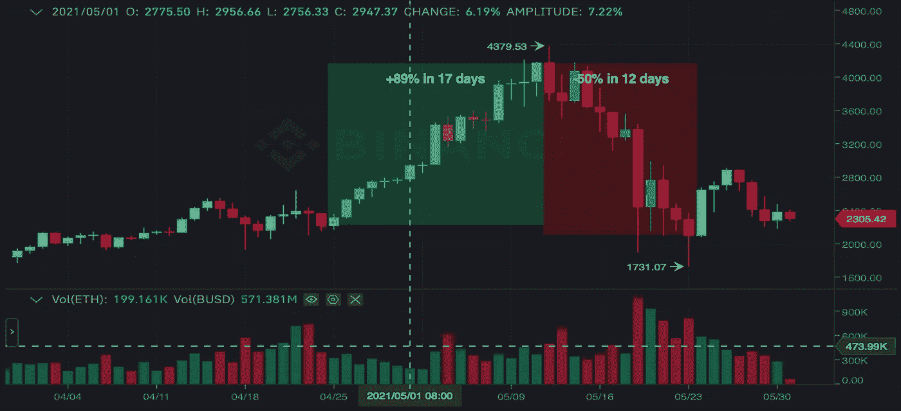
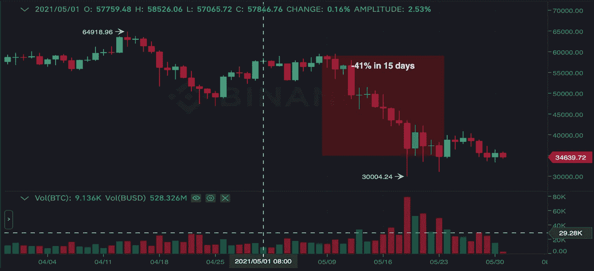
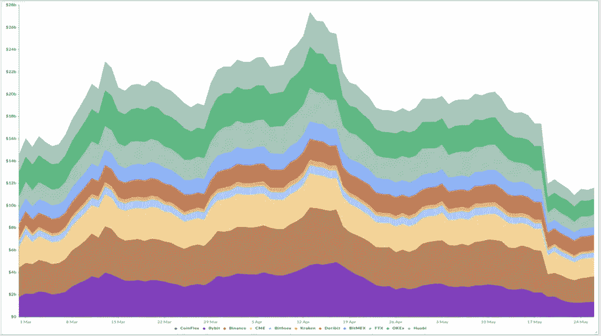

# 2021 年 5 月—每月新闻更新

> 原文：<https://medium.com/coinmonks/may-2021-monthly-news-update-91625e1f5050?source=collection_archive---------6----------------------->

## 您对数字资产世界的每月简报

Photo by Alesia Kozik | pexels.com

在本月的杂志中:

*   市场概述
*   围绕比特币的谣言
*   进一步采用加密技术
*   比特币的传奇
*   共识要点
*   直根活化手表
*   疯狗热的后果

# **五月概述**

## **以太坊**

5 月初，ETH 经历了一轮非常强劲的牛市，在 5 月 1 日至 5 月 12 日期间，价格涨幅超过 50%。有趣的是，这一价格变动与 BTC 没有关联，因为后者显示出横向趋势。

以太坊在 5 月 12 日创下 4379.5 美元(币安)的历史新高，随后开始下跌，5 月 23 日价格跌至 1731.07 美元。这一次以太坊下跌恰逢埃隆马斯克发布推文后比特币暴跌。

总的来说，以太坊似乎正在经历一个相当乐观的阶段。谷歌对“以太坊”的搜索是 2017 年上一轮牛市的两倍。5 月 9 日至 5 月 15 日之间，以太坊矿工的收入超过了比特币矿工的收入([阅读更多](https://www.theblockcrypto.com/linked/105590/googletrends-search-interest-for-cryptocurrency-at-all-time-high))。此外，以太坊公布了其 Q1 2020 的结果，即其总交易量在 Q1 2021 年增长了 20 倍，达到 7130 亿美元，而在 Q1 2020 年为 330 亿美元；与 Q1 2020 相比，每日活跃地址增加了 71%([阅读更多](https://news.bitcoin.com/ethereums-q1-stats-report-highlights-ultra-sound-financial-growth-2021/))。

**瑞士联邦理工学院/BUSD**

*Source: Binance, JKL Capital Research*

## **比特币**

自本月初以来，比特币已经下跌了 40%以上。BTC 的暴跌主要是由市场 FUD(恐惧、不确定性和怀疑)造成的，我们将在下一节讨论。

**BTC/BUSD**

*Source: Binance, JKL Capital Research*

## **山寨币**

在市值最高的硬币中，五月份阿达(卡尔达诺)上涨 **14%** ，BNB(币安)几乎下跌 **50%** ，XRP 下跌 **40%** ，多格下跌超过 **11%** ，圆点(波尔卡多特)下跌 **45%** 。

# **围绕比特币的 FUD**

## **比特币的能耗**

加密货币市场将记住 2021 年 5 月是一个严酷的 FUD(恐惧、不确定性和怀疑)和高波动性的月份。加密领域的一个主要话题是埃隆·马斯克无法对比特币做出决定。今年早些时候，马斯克宣布特斯拉将接受比特币支付，从而提振了市场，到 5 月份，他完全改变了语气。他在 5 月 12 日的推文导致比特币价格从 5 月 11 日的收盘价 5.67 万美元暴跌至 5 月 19 日的最低价 3 万美元。在这条推文中，他指责比特币采矿因使用煤炭而产生高排放。然而，马斯克不会出售特斯拉的任何比特币，并愿意在采矿过渡到可持续能源后立即使用比特币进行交易。

对比特币的攻击受到了加密货币社区的积极批评，声称马斯克完全搞错了。来自 Coindesk research 的一些统计数据:

> 比特币现在使用的能源数量相当可观，约占全球能源消耗的 0.58%。
> 
> 虽然比特币使用了大量的能源，但很大一部分来自可再生能源:2019 年，比特币开采的总能源中有 39%来自可再生能源，76%的矿工将可再生能源作为他们能源组合的一部分([阅读更多](https://www.coindesk.com/research/reports/does-bitcoin-have-an-energy-problem))。

多项研究发表，证明比特币比法定货币具有更高的能效。实际上，传统银行系统甚至金矿开采消耗的能量是比特币开采的两倍([阅读更多](https://www.cnbctv18.com/business/explained-whats-bitcoin-mining-and-how-much-energy-does-it-consume-9359151.htm))。

事实上，加密采矿的数学很简单:降低电力成本转化为更高的利润率。比特币采矿越来越昂贵，因此矿工们被迫不断寻找廉价的电力来源。可再生能源满足了他们的需求，通常被政府奖励所覆盖。因此，如果有什么不同的话，比特币挖矿本质上是被迫利用可再生能源。

最有效的方式来产生最高的采矿散列是通过使用太阳能和水力发电，因为它们是最便宜的解决方案。例如，在中国四川地区的雨季，95%的比特币采矿能源来自水力发电([阅读更多](https://www.nasdaq.com/articles/why-bitcoin-may-actually-speed-up-the-transition-to-renewable-energy-2021-05-18))。

在埃隆·马斯克提出指控后，Microstrategy 的首席执行官迈克尔·塞勒(Michael Saylor)主持了埃隆·马斯克和北美比特币矿工之间的会议，该会议为比特币采矿委员会制定共同能源报告标准奠定了基础([阅读更多信息](https://www.bbc.com/news/technology-57240090))。这种做法在市场上引起了一些共鸣，许多人质疑它是否会威胁到比特币作为分散资产的核心价值([了解更多](https://www.coindesk.com/podcasts/coindesk-podcast-network/bitcoin-mining-council-musk-saylor))。

## **中国严打矿业**

随着更多的监管和日益增长的绿色担忧，中国作为世界上最大的加密开采和投资/交易中心似乎正在后退一步。

尽管中国禁止比特币并不是什么新鲜事，但这个话题在 5 月份的《世界新闻报》上不断出现，给 BTC 价格带来了更大的下行压力。中国的矿商正在认真对待政府的担忧:他们出售了部分比特币股份，以获得更多资金来规划下一步行动；采矿机器在中国的销售也暂停了，秘密采矿者正在寻找新的采矿地点，如哈萨克斯坦、西伯利亚或非洲。

## **比特币基本面不变。通货膨胀也是如此。**

尽管 FUD 围绕加密货币进行了各种猜测，但基本面没有改变。随着全球通胀上升，世界仍然迫切需要一种财富储存资产。

还应该安抚加密投资者神经的是，在 5 月下跌期间发生的大规模清除过度杠杆化头寸的行为。市场预期会出现大幅调整:每当出现大量未平仓的高杠杆头寸的大幅单向波动时，每一次小幅逆转都会导致平仓，从而导致大幅下跌。衍生品头寸中超过 50%的未平仓头寸被平仓。这清理了市场，并为未来更低的波动性提供了依据。

**BTC 期货—累计未平仓合约**

*Source: skew.com*

# **进一步加密采用**

与前几个月一样，5 月份有越来越多的机构探索加密领域。

## **金融机构**

本月初，加密保管人 NYDIG 宣布与银行技术解决方案提供商 FIS 合作，共同目标是为数百家美国银行提供比特币([阅读更多信息](https://www.cnbc.com/2021/05/05/bitcoin-is-coming-to-hundreds-of-us-banks-says-crypto-firm-nydig-.html))。

除了 4 月份宣布的加密投资外，**高盛**现在向其客户提供大宗交易中的比特币期货。

**富国银行**将实施一项积极管理的加密货币战略，向其富裕客户开放加密资产([阅读更多信息](https://www.reuters.com/business/wells-fargo-onboard-active-cryptocurrency-strategy-rich-clients-2021-05-19/))。

**瑞银集团**探索富裕客户的加密机会。

**花旗银行**正在考虑向加密技术开放，因为在客户需求高涨的情况下，它的许多竞争对手已经迈出了进入加密货币市场的第一步。

总部位于新加坡的星展银行推出亚洲首个银行支持的加密货币信托。

离开加密话题，**美国银行**与 Paxos 结算服务合作，这是一个运行区块链技术的平台，实现当天交易结算([阅读更多信息](https://www.coindesk.com/bank-of-america-joins-paxos-network-eyeing-same-day-stock-trade-settlement))。

全球第二大对冲基金复兴科技公司(Renaissance Technologies)将其有史以来最大的赌注押在了加密货币采矿业上。

风险投资巨头安德森·霍洛维茨基金(Andreessen Horowitz)正寻求在一个新的加密货币基金中筹集 10 亿美元([阅读更多信息](https://www.theblockcrypto.com/linked/106605/a16z-2-billion-valuation-crypto-fund))。

## **企业**

MicroStrategy 正在买入 dip。该公司首席执行官迈克尔·塞勒(Michael Saylor)在 5 月份两次宣布购买大宗比特币:首先，他的公司在 5 月 13 日以 1500 万美元购买了 271 BTC([阅读更多](https://www.coindesk.com/microstrategy-keeps-buying-bitcoin-adds-another-15m))，后来在 5 月 18 日又以 1000 万美元购买了 229 BTC([阅读更多](https://www.coindesk.com/microstrategy-buys-the-dip-adds-another-10m-of-bitcoin-to-treasury))。

今年 4 月， **Visa** 在其平台上增加了加密货币结算。现在，该公司宣布与金融科技初创公司 Tala 合作，这将进一步将加密货币扩展到新兴市场。

**Square 的**现金应用数字钱包报告称，比特币净收入达到 35 亿美元，同比增长 11 倍([阅读更多信息](https://www.nasdaq.com/articles/1-big-fintech-with-room-to-grow-2021-05-26))。

Ebay 允许在其平台上销售 NFT，并暗示未来可能接受加密支付。

**苏富比**将接受比特币和以太坊拍卖班克斯画作([阅读更多](https://www.cnbc.com/2021/05/04/sothebys-to-accept-bitcoin-and-ether-for-an-upcoming-auction-of-a-banksy-painting.html))。

**苹果**被发现在“替代支付”领域寻找人才，这暗示着人们对加密货币越来越感兴趣([阅读更多](https://www.ft.com/content/2b30e69d-6662-40e8-9735-eaea8662906e))。

美国分析公司 **Palantir Technologies** 接受比特币支付，并考虑在其资产负债表上加入加密货币([阅读更多信息](https://www.reuters.com/article/crypto-currency-palantir-tech-idUSL4N2MY3MZ))。

S & P 道琼斯指数推出新的比特币(SPBTC)、以太坊(SPETH)加密指数，以及 S & P 加密大型股指数(SPCMC) ( [阅读更多信息](https://www.reuters.com/technology/sp-dow-jones-indices-launches-crypto-indices-2021-05-04/))。

**Bitwise** 推出了一个新的 ETF，由纽约证券交易所(BITQ)的 30 家加密公司组成。

## **政治密码采用**

随着新的基金分配法案于 2021 年 7 月 1 日在德国生效，被称为 Spezialfonds 的国内特殊基金将能够将其投资组合的 20%投资于加密资产([阅读更多信息](https://www.mondaq.com/germany/fin-tech/1069926/germany-introduces-a-new-law-that-allows-funds-to-invest-into-crypto-assets))。相比之下，德国私募基金在 AUM 拥有约 1.8 万亿美元。

美国监管的 ETF 仍然是一个希望，然而获得批准的几率似乎在上升。

拜登的**国税局**执法部门要求官方报告超过 10，000 美元的加密货币转账([阅读更多信息](https://www.bloomberg.com/news/articles/2021-05-20/biden-s-irs-crackdown-plan-targets-rich-hiding-half-of-income?cmpid=socialflow-twitter-business&utm_source=twitter&utm_medium=social&utm_content=business&utm_campaign=socialflow-organic))。

多个国家正在探索加密市场法规，包括韩国、印度、印度尼西亚、新加坡等等。

就交易量而言，币安是世界上最大的加密货币交易所，在收到德国监管机构的公开警告几周后，该交易所正接受美国反洗钱监管机构的调查。

随着金融监管机构要求所有加密货币交易所获得许可证，并将加密投资仅限于专业投资者([阅读更多信息](https://www.reuters.com/technology/hong-kong-restrict-crypto-exchanges-professional-investors-2021-05-21/))，加密监管变得更加严格。

# **关于比特币的传说**

在 5 月份，我们听到了不少传奇投资者对数字资产的看法。比特币的支持者包括:

美国对冲基金传奇人物斯坦利·德鲁肯米勒(Stanley drucken miller)透露，他拥有比特币，因为在一场严重的通胀危机中，他开始将这种加密资产作为价值储存手段。

**保罗·都铎·琼斯**——被广泛认为是最伟大的宏观交易者之一——以比特币形式持有的资产略多于 1%。

全球最大对冲基金 Bridgewater Associates 的创始人雷伊·达里奥发表了一份措辞强硬的声明，称他宁愿持有比特币，也不愿持有债券。同样值得注意的是，Bridgewater 的首席财务官 John Dalby 最近被任命为 NYDIG 的首席财务官，ny dig 是市场上领先的比特币投资解决方案提供商。

卡尔·伊坎——华尔街最成功的投资者之一——相信“加密会一直存在下去”，尽管他个人并不拥有任何数字资产，但他的公司正在考虑“大规模”进入加密领域。

另一方面，**查理·芒格**和**沃伦·巴菲特**在伯克希尔·哈撒韦公司的年会上仍然对比特币持坚定的怀疑态度，称其“令人厌恶”。

# **共识亮点**

CoinDesk 组织的加密领域最大的会议之一于 5 月 24 日至 5 月 27 日举行，汇集了来自各行业的演讲者，讨论新兴的数字金融世界。

今年的亮点包括雷伊·达里奥同意拥有比特币，他认为比特币市场可能会扰乱债券市场，因为投资者对后者失去了兴趣；关于 CBDCs 和政府监管的讨论，一些监管机构承认拥有加密货币；谈论围绕加密货币的 FUDs，特别是比特币的可持续性(迈克尔·塞勒声称，从能源消耗的角度来看，比特币的可持续性比其他类型的支付高 2-3 倍，但还需要做更多的研究)；汤姆·布拉迪是最近加入比特币社区的明星，他相信加密技术会一直存在下去。

# **主根活化观察**

加密社区正在密切关注主根激活( [www.taproot.watch](http://www.taproot.watch/) )，这是比特币多年来最大的升级。它将使 BTC 的交易更便宜、更私密、更灵活、更具扩展性。在分散网络的传统中，只有当 90%的比特币矿工在一个困难时期(目前约为 2 周)内表示支持时，才能激活 Taproot 升级。在撰写本文时，超过 97%的矿工支持主根激活，我们相信升级将在 2021 年 6 月的前 2 周内被接受。一旦这种情况发生，Taproot 将于 2021 年 11 月被激活。

# **狗冷却泵的后果**

4 月开始的 Doge 狂热一直持续到 5 月，在 5 月 8 日创下了 0.73 美元的新 ATH，成为市值排名第四的密码([阅读更多信息](https://coingape.com/dogecoin-sets-another-ath-and-looks-set-to-flip-bnb-for-the-3rd-spot/))。比特币基地也加入了宣传，承诺在未来两个月内将硬币上市。所有这些都是为了期待埃隆·马斯克在美国电视节目《周六夜现场》中推出比特币。

不过，这一次热潮没有持续多久。高峰过后的第二天，crypto meme-coin 进入了低谷，损失了大约。峰值和月末之间其价值的 60%([阅读更多](https://www.cnbc.com/2021/05/08/dogecoin-price-plummets-as-elon-musk-hosts-saturday-night-live-.html))。

Doge 的炒作引发了加密领域的“抽水和倾倒”，大量新硬币进入市场，都声称是一夜暴富的最简单方法。其中包括 FEG(喂养每一只大猩猩)硬币、ASS(澳大利亚安全牧羊犬)硬币、Poo(无需转录)硬币、StopElon 硬币和许多其他硬币。他们都遵循一个类似的场景，一群匿名投资者开始炒作硬币，在所有潜在投资者经常光顾的社交媒体渠道上谈论它，然后为了利润将他们的初始投资全部卸载，将硬币抛至接近零([阅读更多](https://www.vanityfair.com/news/2021/05/inside-the-rise-and-fall-of-shit-coins))。

**免责声明**

*私人和机密*

*仅限收件人*

*本材料严格保密，仅供专业投资者使用(根据开曼群岛金融管理局不时的定义)。未经 JKL Digital Capital Limited(“JKL”)的书面同意，不得出于任何目的复制、重新分发、传递给任何其他人或出版其全部或部分内容，并且必须在 JKL 要求时返还。虽然本材料中包含的信息是从据信可靠的来源汇编的，但 JKL 不代表或保证本材料中包含的信息的准确性、完整性或可靠性。*

*本材料的内容未经任何监管机构审核。建议您对本材料的内容保持谨慎。如果您对本材料的任何内容有任何疑问，您应该获得独立的专业意见。JKL 或其任何关联公司，或其任何或其各自的董事、高级职员、员工和代表都不会对因使用或依赖本材料中包含的任何信息而导致的任何直接、间接或后果性损失承担任何责任或义务。本材料不构成认购或购买任何金融产品的要约或邀请。其目的不是提供任何信贷或其他评估的基础，也不应被视为购买任何金融产品的建议。*

JKL、其关联公司和/或任何或其各自的高级职员、董事、员工和代表可能不时在本材料中描述的产品或与产品相关的任何投资中、为其专有账户和/或为其管理的账户和/或为客户拥有重大利益，这可能对产品的价值产生积极或消极的影响。