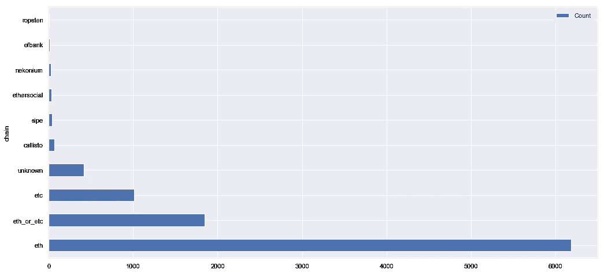
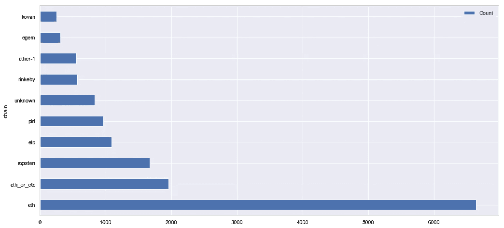
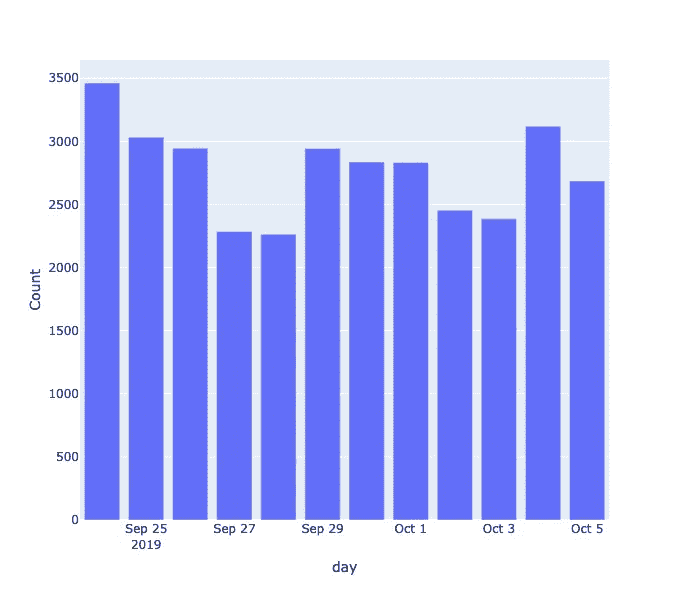
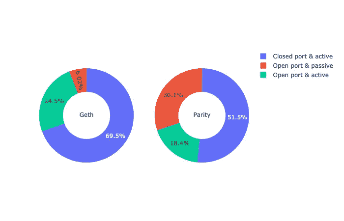
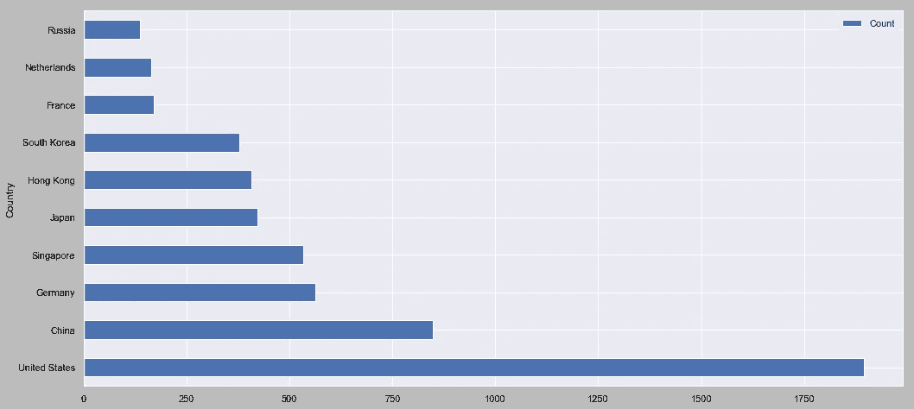
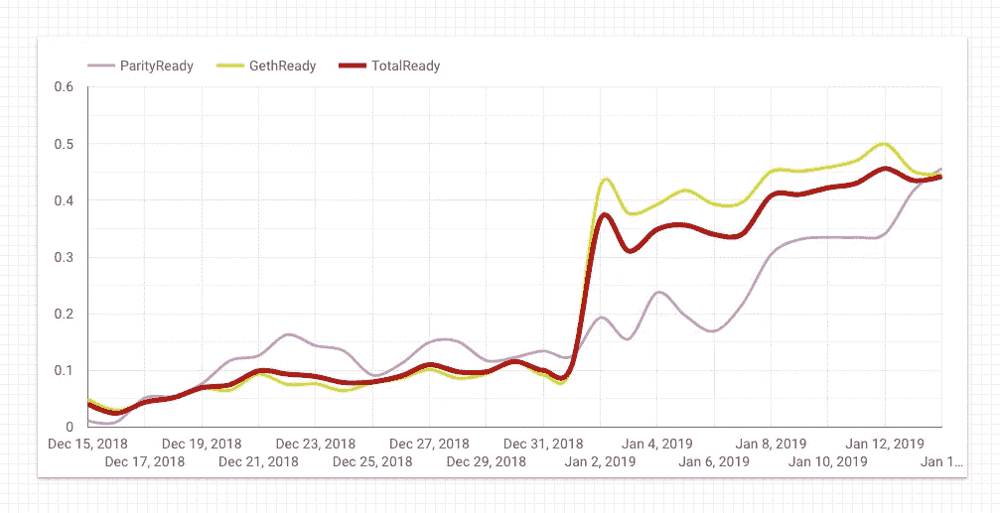
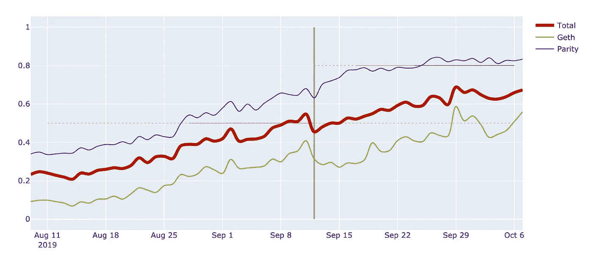

# 测量以太坊节点

> 原文：<https://medium.com/coinmonks/measuring-ethereum-nodes-530bfff08e9c?source=collection_archive---------1----------------------->

最近有一个帖子比较以太坊和比特币的在线节点，我在评论里提到，以太坊相关的数字代表性不够。

我已经跟踪在线以太坊节点有一段时间了，所以我有这些数据供进一步分析。我在[胃袋页面](https://gastracker.io/stats/nodes)上发布了以太坊经典网络的一些结果，尽管我有更详细的数据，对所有基于以太坊的网络有更深入的了解。

*那么抓取以太坊网络*有什么问题呢？第一个也是最明显的障碍是以太坊和以太坊经典的存在，因为两者共享相同的协议、相同的标识符和相同的初始历史，包括创世块。来自两个网络的节点偶尔会相互连接，交换来自共享历史的新事务和数据。通过连接到一个 ETH 节点，您不能确定它的所有对等节点都是 ETH 节点。初始握手不能提供足够的信息，因此一个节点甚至与来自另一个网络的对等节点保持连接，告诉其他以太网节点关于该节点的信息，等等。

## 网络 ID 1 不是以太坊

这是以太节点等服务提供的数据的主要问题。它只显示所有节点，而不考虑实际的链。事实上，它并没有在任何地方显示“ *ETH 节点*，而是“*网络 id 为 1* 的节点”，这些节点由几个不同的区块链共享，而不仅仅是 ETH 和 ETC。

区分它们的唯一方法是连接到它们并下载区块链历史的一部分，因为它对不同的分叉有不同的块。根据我的经验，只有不到 70%的节点是真正的以太坊节点。

这里是每个链的节点分布，其中*网络 id = 1* ，即所有节点都在以太网节点页面上的同一个存储桶中。

Unique nodes for the past 7 days***; unknown —*** nodes here are nodes that respond with network_id 1, but their genesis block doesn’t match any of well-known blockchain*s;* ***eth_or_etc —*** are nodes just shares commons history of ETC and ETH; usually, those nodes are just doing the initial sync

总共有大约 10，000 个节点，其中只有大约 6000 个 ETH 节点、1000 个 ETC 节点和 2000 多个其他网络。

与所有基于以太坊的网络的分布相比(即不仅仅是 network_id = 1):

Unique nodes for the past 7 days

这里有一点可能会引起误解，那就是并不是所有的 6000 个这样的节点总是可用的。上面的数据是基于过去 7 天的，包括至少出现过一次的所有节点。尽管通常一天只有不到一半的人在线:

Unique ETH nodes per day

## Geth 与奇偶校验

另一件事是 Geth 和奇偶行为之间的区别。这两个是领先的节点实现，它们共享大部分市场。然而，很难测量他们股份的准确数字，任何机器人逻辑的错误都会导致结果数字的失真。

*那为什么是*？似乎奇偶和 Geth 有不同的使用场景；第一种在服务器上流行，第二种在桌面上更常见。以太坊官方钱包 Mist 是和 Geth 一起来的，经典 Geth 也是一样，[翡翠钱包](https://emeraldwallet.io/)在 ETC 上的桌面用的。

环境中的这种差异(桌面与服务器)导致了 Geth 更难捕捉的情况。一个问题是 Geth 的在线时间很短。另一个可能造成重大影响的问题是，家庭互联网的端口转发和防火墙配置通常不正确，并且不如数据中心的互联网稳定。因此，您不能连接到这样的 Geth 实例，但应该期待来自它的传入连接。在这种情况下，机器人需要确保所有可能的 Geth 实例以某种方式了解机器人，并连接到它来介绍自己。

为了说明这一点，看一下允许不同软件进行传入连接的节点的分布。

根据我的经验，大约 70%的 Geth 节点不允许传入连接，相比之下，52%的节点不允许传入连接。另一方面，奇偶校验节点在发现其他节点时并不那么活跃，这可能是因为这种节点运行在服务器上，仅在启动后的最初几分钟内为对等节点主动发现。

## 国家

按国家分布也很有趣:

请注意中国的电话号码。我敢肯定，中国的实际节点数量至少要大一倍，但由于防火长城，bot 无法连接到它们。正确衡量一切的唯一方法是在中国大陆运行一个 bot 实例，虽然我不知道如何做，但我肯定希望在将来这样做。

## 看着福克斯

我创建我的刮刀机器人的一个主要原因是为了观察硬分叉，跟踪网络升级的进度，即软件的哪些版本在线。有时它会展示迷人的艺术品，比如我在君士坦丁堡升级之前发布的一个:

请注意，兼容奇偶校验节点的份额是如何随着时间的推移而有机增长的，但是 Geth 在一天之内就出现了巨大的峰值。这可能意味着有一种方法可以控制大多数 Geth 节点的分布，从而控制网络本身。

另一个例子是最近的 ETC 升级，这甚至是在没有大多数节点一致同意的情况下进行的。有风险，但幸运的是，没有损坏网络。分叉后大约一周*达到 50%的节点升级，虽然升级还没有最终完成，节点仍在升级过程中。更糟糕的是*，一些旧节点还在积极挖掘旧的非伪造链*。*

**ETC Atlantis upgrade progress**; vertical line is the date of the fork, horizontal lines are 50% (acceptable for pre-fork) and 80% (acceptable for post-fork); notice the spike of Geth nodes on September 29, most of them were just fresh nodes launched in different regions of Asia, most were shot down in a few days

以太坊网络很难衡量，尽管无疑有很多有趣的数据和见解。我仍在努力改进机器人，试图更精确地收集更多细节，并希望也能抓取其他区块链。

—

如果您使用文章中的数据，请将链接放回本页。谢谢你。如有其他问题，您可以通过 igor@artamonov.ru 联系我

> [在您的收件箱中直接获得最佳软件交易](https://coincodecap.com/?utm_source=coinmonks)

