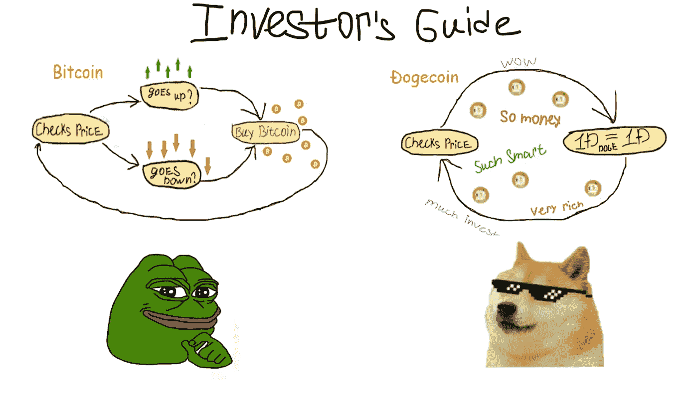
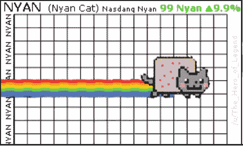
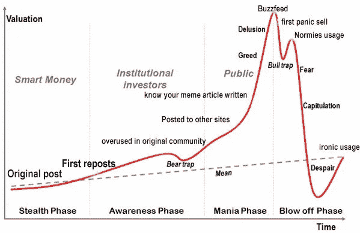
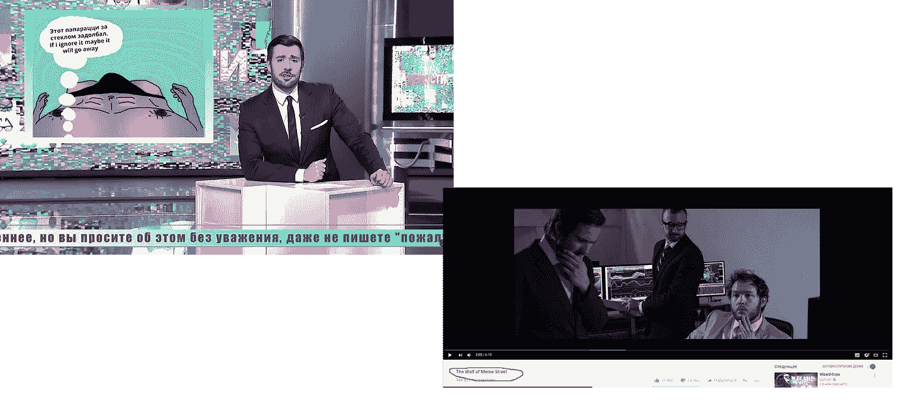
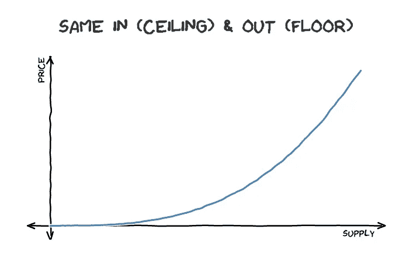
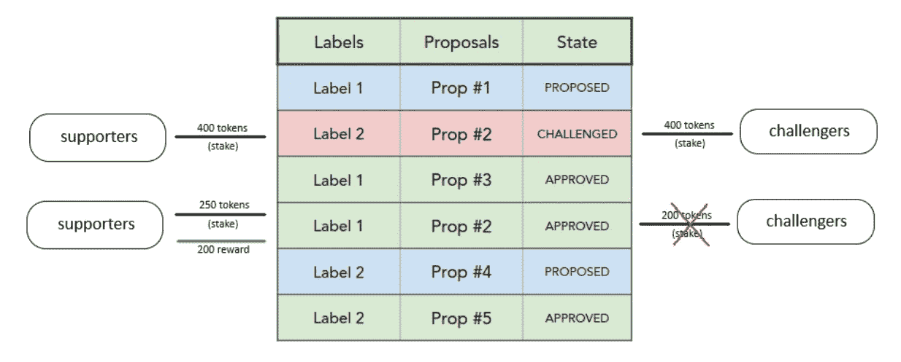
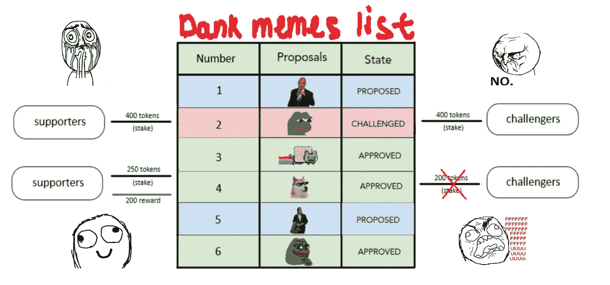

# 迷因来了

> 原文：<https://medium.com/coinmonks/memes-are-coming-8f9944f3ce97?source=collection_archive---------11----------------------->

我非常感谢迪米特里·德·容格和 T2 西蒙·德拉鲁维尔，他们的材料给了我写这篇文章的基础。

An image to attract the attention of the reader. [1]

就像互联网时代开始时一样，没人能预测新技术会给世界带来什么样的创新。有了区块链，如果有人可以想象比特币很可能会成为下一个去中心化金融系统的基础，那么随之而来的一连串想法很难被任何人预见到。有时，这些新的想法相当无缝地融入我们的生活。当我们听到这样的实现时，我们通常会想:“哦，太好了，这很有道理”。但是偶尔会有一些绝对美丽，但却荒谬和妄想的想法突然出现，给你带来一点认知上的冲击。

**比如……模因市场**

A comprehensive technical price analysis taken from [2].

## **等等，什么！？**

迷因市场。它们是市场，在这里人们可以将他们的财富投资于一个多元化的有趣(或不有趣)的图片组合，这些图片带有随机的字母，希望它们能像精神病毒一样在人与人之间传播，并最终到达美国消费者新闻与商业频道或你所在国家的任何主要渠道。在那里，它们将成为大众的终极乐趣，并迅速退化为过时的东西，甚至可能从你最不期待和害怕的地方——来自你父母或祖母的地方——回到你身边。

## 但是……为什么呢？

Cures cancer, walks on the water, and creates cute kitties

好吧，让我们引入一些理性。

首先，在 [Simon de la Rouviere](https://hackernoon.com/@simondlr?source=post_header_lockup) 的一篇文章《历史是押韵的:适应度函数&比较区块链令牌与 Web》【3】的基础上，我们将陈述“一切都将被令牌化”的论题。

根据西蒙的说法，现实是:

> *“区块链令牌已经将协调令牌化的成本降低了几个数量级，因此我们很可能会看到有效的令牌化(以及市场的引入)进入几乎所有事物。”*

事实上，这是有道理的。因为标记任何事物的成本是多少？您只需要编写几行代码来颁发您的令牌。想象一下一两年后的世界。你将能够在你的手机上编写一个简单的(甚至可能是一个奇特的)智能合同，发行任何一种代币，并把它空投到数百万个钱包里。

真正的问题在于用户对这种令牌的获取(以建立网络效应)。因为，如果你发行了自己的加密货币——bob coins，而没有其他人使用它，那么，你就创造了一堆其他加密的垃圾。但是，如果你是电报(也创造了吨！)并拥有 2 亿用户，你刚刚试图成为世界上另一个金融系统。

## 但是..模因..为什么会有人做这种事？

你可能会感到惊讶，但是这个世界已经成熟到可以进行模因符号化了(或者我们可以说模因化？).不相信我？看这个:

doge coin——最初是一种笑话迷因币，现在市值达到 4 亿美元(在撰写本文时)，是第 47 大加密货币。47 号！还有 1500 个其他的“以太坊杀手”、“更好的比特币”和“物联网未来”，然而，Doge 像老板一样统治着它们。

Had no ICO, still better than yours.

这里我想强调一下，Dogecoin 这些年并没有太大的发展。它也没有营销预算、战略合作伙伴、主节点、赌注机制、治理——没有人为其定价。然而，Doge 社区正在稳步增长，目前有 118.273 shibes。

You cannot buy this for dollars…

当然，另一个例子是**佩佩现金**——没有 papa Doge 那么令人印象深刻，但一种罕见的佩佩货币拥有 1700 万美元的市值，是与 meme 相关的硬币如何在市场上找到一席之地的又一个例子。

所以，现在，当我们知道迷因可以在市场上相当成功地被估价时，让我们来看看“最终用户”，他们可能会接受所有这些疯狂的东西。

我想和你分享的第一个地方在这篇文章中有一个完全正确的名字。这是一个名为“**模因经济”**的子栏目。

Become a memellionaire and make your mom proud of you [2].

那是什么鬼东西？

这是一个由 543.000 人组成的社区，他们分享迷因并对其进行投票。正如你所看到的，张贴和吸引人们为你的迷因投票的形式与迷因交易高度相关。我们甚至可以将它视为某种类型的原型市场，早期“买入”(发布一个模因)的人可以在增加他或她的声誉方面获得“利润”，如果其他用户用他们的投票“购买”(发现这个模因有吸引力)这个模因的话。

除了迷因经济集团，在遍布互联网的各种社交网络中，还有数百个网站和公众，专门致力于此:**关于迷因的分享和投票。9gag、dank memes subreddit 是其他一些例子。**

因此，从事模因“消费”或传播的人数是巨大的(让我们现实一点，使用互联网的几乎是任何人)。

## 模因生命周期

更令人吃惊的是，迷因流行的周期与典型的金融泡沫非常相似。正如在金融市场中，最初的价格行动始于“聪明的钱”，然后是机构和公众投资者，最终导致“过度购买”和市场崩溃，模因的传播有相似的阶段。

由于人是群居动物，他们的“群居”往往会在金融市场上造成巨大的价格失衡，并伴随着大规模的兴高采烈和萧条。有了迷因，我们可以追踪同样的羊群效应，这种效应始于相对狭窄的一群人，他们实际上可以产生迷因，后来扩展到广大受众，早期社区已经对迷因感到厌倦。

我想对迷因符号化的市场准备状态的论点补充的最后一点是，这个想法看起来如此荒谬，以至于有许多有趣的视频和迷因正是围绕“迷因投资者生活”和“迷因亿万富翁”创造的。想象一下，如果有这么多人真的尝试一下，那该有多有趣。以下是一些例子:

Druzhko Show (in Russian) and The Wolf of Meme Street [4,5].

现在，如果你还在阅读，你可能会问:

## “但是怎么可能交易……迷因呢？”

对此我有两个可能的答案:

**粘合曲线**

The picture and the idea taken from [6].

债券曲线——是智能合约，通过算法定义代币价格与其供应量之间的关系。换句话说，它根据代币的供应量来确定你买卖的每一个代币的价格。

让我们看一个例子:

1.  你通过智能合约向 ETH 购买债券曲线令牌(BCT)。你的 ETH 停留在那个特别聪明的契约里。它不会转移到任何团队或组织。
2.  你购买的价格被编入智能合约，并取决于当前代币的供应量。《出埃及记》:如果流通中有 10 枚 BCT 代币，你买 0.01 特；如果流通中有 11 枚 BCT，你买 0.011 特。**流通中的 BCT 越多=价格越高。**
3.  你的回售价格也是由相同的债券曲线算法决定的。如果有 11 个 BCT 在流通，你(和任何人)可以以 0.011 的价格出售你的 BCT，如果有 10 个，可以以 0.01 的价格出售。流通中的 BCT 代币越少=价格越低。

因此，你越早买 BCT，对你来说就越便宜。如果更多的人买进，你就可以把你的 BCT 卖出去，并获得利润。

尽管目前它可能类似于一个古老而良好的金融金字塔，但我肯定会看到迷因结合曲线可能会出现，而且重要的是，它会随着时间的推移继续进化。如果有人能够将一个模因的受欢迎程度(实际上可以通过谷歌趋势等工具轻松衡量)与智能合约中的象征性价格联系起来，影响将是巨大的。

我完全可以想象世界上数以百万计的青少年将如何开始失去他们的零花钱(或发财),因为一些佩佩青蛙迷因泡沫破裂=D

**令牌管理的注册管理机构(TCR)**

这个想法很简单:人们可以提议将一个项目包含在一个策划的注册表中。要做到这一点，人们应该用利害关系来支持它的提议。当提案对其他人可见后，他们可以用他们自己的“支持赌注”来支持它，或者如果他们认为某个项目不属于该列表，就用“挑战赌注”来挑战它。

经过一段时间后，如果支持提案的赌注高于“挑战赌注”，该项目将成为管理注册的一部分，“支持赌注”将退还给支持者，挑战者的赌注将被削减，并作为奖金重新分配给支持者。如果“挑战赌注”更高，支持者的赌注将被削减，而挑战者将得到奖励。

Mostly taken from “Curated Governance with Stake Machines” by [Dimitri De Jonghe](/@DimitriDeJonghe?source=post_header_lockup) [1].

这是迷因应该有的样子:

Mostly taken out of my head

有了 TCR，创建一个潮湿模因的精选列表并形成一个社区变得非常可能，这个社区将决定一个模因是否是潮湿的。从理论上讲，在未来，任何社交网络中的每一个子群或公共群都可以转变成某种有序列表。现在，subreddits 中的好帖子为帖子作者带来了额外的声誉(因果报应)。在转换为令牌管理的注册表之后，子编辑的成员将能够标记他们的令牌，以决定哪些内容可以添加到该组中，并将为此活动获得奖励。

## 结论:

区块链和令牌化可能会在人类活动的非常不寻常的领域带来创新。其中一个领域就是迷因。结合曲线开启了对模因流行进行金融投机的可能性，这具有潜在的巨大市场，并可能因其荒谬、不严肃和滑稽而成为病毒。如果我们记得第一个病毒 dapp 是区块链的可爱小猫，这种争论就特别有意义。

有了令牌管理注册中心(TCR)的概念，就有可能在迷因选择过程中引入赌博和经济奖励，这可能会改变像 9gag 和 Meme Economy 这样的子网站的工作方式。这样的社区由数十万甚至数百万用户组成，这就是为什么采用率可能会很高的原因。

我相信，模因令牌化有很大概率成真。迷因的病毒式流行、巨大的潜在潜在市场以及迷因的流行和金融市场价格运动之间的相似性——是这一想法背后的主要合理性。这就是为什么我认为关注迷因相关市场的发展是值得的。

这篇文章的主要目的是向读者介绍区块链改变世界的一些方法。无论模因符号化是否成功，跟踪创新发展的可能方式总是一个好主意。

粘合曲线和 TCR 本身就是有趣的话题。

## 以防你现在像这样:

## 迷因工厂项目

这是一个为潮湿迷因创造 TCR 的地区 0x 计画。用户将能够创建一个他们认为足够潮湿的迷因列表。

如果你想参加 Meme 工厂项目，那么你可以访问[他们的网站](https://memefactory.io/)并加入[区 0x 电报](https://t.me/district0x)了解更多详情。现在他们有一个迷因设计比赛(有奖励)。随后，他们将与 DNT(0x 区的本地令牌)和参与者举行几轮社区投票，这些参与者将他们的 DNT 令牌和投票稍后将与 Meme Factory 项目令牌一起空投。

另外，你可以看看[西蒙·德拉鲁维尔](https://github.com/simondlr/mememarkets)的作品——一个人，他的作品让我理解了 TCRs(希望我的概念是正确的)。

如果你喜欢这篇文章，请随时关注我/讨论这个话题/问我问题。我做 ICO 分析，写文章:

**推特:**https://twitter.com/0xd063

## 参考资料:

1.  这个想法是从迪米特里·德·容格那里借鉴和定制的。
2.  迷因经济 Reddit[https://www.reddit.com/r/MemeEconomy/](https://www.reddit.com/r/MemeEconomy/)
3.  [Simon de la Rouviere](https://hackernoon.com/@simondlr?source=post_header_lockup) “历史是押韵的:健身功能&将区块链代币与网络进行比较”[https://medium . com/@ simondlr/Tokens-2-0-curved-token-bonding-in-curation-markets-1764 a2 E0 bee 5](/@simondlr/tokens-2-0-curved-token-bonding-in-curation-markets-1764a2e0bee5)[https://hacker noon . com/History-Is-Rhyming-Fitness-Functions-comparising-区块链-Tokens-To-The-The-we b-3c 117239 F4 c](https://hackernoon.com/history-is-rhyming-fitness-functions-comparing-blockchain-tokens-to-the-web-3c117239f4c)
4.  德鲁日科秀[https://www . YouTube . com/channel/ucpbojnlbxpio azruojyia/videos](https://www.youtube.com/channel/UCpbOjOjnLBXpi0AzruoJYIA/videos)
5.  迷因街之狼[https://www.youtube.com/watch?v=e25DsEwA5hk](https://www.youtube.com/watch?v=e25DsEwA5hk)
6.  [Simon de la Rouviere](/@simondlr?source=post_header_lockup)Token 2.0:current Token Bonding in Curation Markets[https://medium . com/@ simondlr/Tokens-2-0-current-Token-Bonding-in-Curation-Markets-1764 a2 E0 bee 5](/@simondlr/tokens-2-0-curved-token-bonding-in-curation-markets-1764a2e0bee5)
7.  迷因工厂项目。[https://memefactory.io/](https://memefactory.io/)