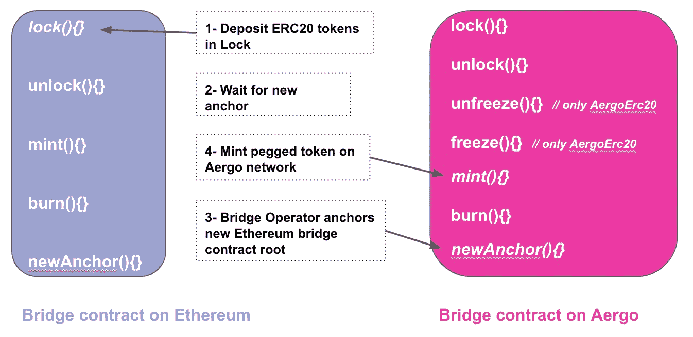

# 默克尔桥

> 原文：<https://medium.com/coinmonks/merkle-bridge-32bd0f06c308?source=collection_archive---------1----------------------->

## 一个简单的链间资产转移协议。

Merkle bridge 的目标是成为在区块链之间转移资产的简单而轻便的协议，同时提供分散的监管和审查阻力。第一个应用是将 Aergo ERC20 令牌转移到 Aergo Mainnet 本地令牌。一旦桥被部署，任何以太坊或 Aergo 资产将直接在这些网络之间转移。在本文中，我们将介绍该协议的一些技术细节。

# 语境

我们可以这样描述双向挂钩(2WP)资产转移:一个令牌首先存在于区块链 A 上；要将其转移到区块链 B，必须将其锁定，并在区块链 B 上以 1:1 的比率制作副本，最后，区块链 A 上锁定的令牌只有在其副本已在区块链 B 上刻录的情况下才能解锁

维持钉住汇率的简单方法是将资产锁定在一把钥匙或一份多重合约中(大多数交易所都是这样储存资金的)。第一种情况(单个密钥)是不安全的，因为密钥可能被盗或丢失。第二种情况(multisig)更安全，但转让费昂贵，因为它们要求每次转账都要进行 2/3 签名验证。让 multisig 处理每笔转账也意味着很容易审查单个用户的转账。其他更安全和不信任的方法存在，如 ETH-ETC 和平桥，但需要资金锁定，以进行锁定和削减。

我们的目标是实现分散的资金锁定/解锁，允许 20 多个验证者，但同时通过设计一个简单的协议来保持较低的桥接转账成本，该协议不需要桥接运营商处理单个转账。

# Merkle 桥设计

Aergo Merkle bridge 实现了资产的分散保管和高效铸造。

权威证明侧链通常使用其状态根在公共链上的锚定来提供可验证的真实来源。Merkle 桥使用这些锚定的状态根来允许用户提交侧链状态的证据。

## 资金托管

这种设计的安全性依赖于锚定根的有效性。钉住的区块链状态根包含锁定和烧毁余额的信息，因此任何无效的状态根都可以被用来窃取锁定的用户资金。

为了确保状态根的有效性，锚定使用简单形式的 DAO(分散自治组织),类似于 multisig oracle。这个 DAO 的成员被称为验证器。

验证者有几项职责:

*   就将要锚定的根达成一致(因此它们必须是具有声誉的已知实体，以确保锚有效)。
*   就验证器集更新提议达成一致(使用 2/3 当前验证器的签名来添加或删除验证器)。
*   就网桥设置更新提议达成一致(还需要 2/3 验证者的批准)。

## 操作

每隔一段时间，提议者(任何愿意支付锚定费的人)在桥接链上发布桥接契约的状态根。状态根只有在被 2/3 的验证者签名时才被记录。

然后，用户钱包可以通过用锚定状态根验证其锁定资产的 Merkle 证明，独立地铸造目的地桥契约上的资产。

该锁跟踪账户的总存款代币余额。一个包含这种平衡的 Merkle 证明被创建，并且这种平衡可以在桥的另一边被铸造。造币厂会记录铸造的总余额，这样一个账户的铸造金额就不会超过存款金额。相同的过程用于烧毁和解锁的天平。

这种设计使内存管理和契约操作变得简单，因为它不需要记录传输随机数或返回值。一个限制是，随着用户和固定令牌数量的增长，Merkle 证明的大小也在增加(契约状态树变得更深)，这使得传输变得更加昂贵。

Transfer an ERC20 token from Ethereum to Aergo with Merkle bridge

好处包括以下几点:

*   验证器实现起来很简单，因为它们只需要签署它们认为有效的最终状态根(通过在桥的两端运行完整的节点)。验证器不需要监视和验证用户传输。
*   用户钱包直接通过桥接合同进行转账，不需要验证者的批准。
*   锚定期是灵活的，状态根可以由许多验证者(20+)签名。
*   如果没有 2/3 验证者串通并广播无效的侧链状态根，令牌传输就不能被任意审查。
*   可以进行小额转账，并且可以随时铸造/解锁总存款余额。
*   链上 Merkle 证明验证比签名验证更便宜
*   任何新资产都可以通过桥梁转移，而不需要得到验证者的批准(第一次转移会更昂贵，因为铸造时将部署新的挂钩合同)。
*   向另一个链上的同一个账户的多次转账可以通过提取发送到该账户的总锁定余额的单笔交易来完成。

局限性:

*   一旦发起，传输应该在桥的另一端完成(没有超时限制)，但是这意味着传输不能被取消。
*   如果超过 1/3 的验证者停止合作，桥将无限期暂停(不可能有新的撤销)。

# 履行

位于区块链阿尔高 2 号之间的 Merkle 桥的 POC 实施可在以下存储库中找到:

 [## 阿尔戈约/梅克尔桥

### POC 实现的 Aergo Merkle 桥 https://merkle-bridge.readthedocs.io/en/latest/index.html 这个仓库…

github.com](https://github.com/aergoio/merkle-bridge) 

文档:[https://merkle-bridge . readthedocs . io](https://merkle-bridge.readthedocs.io/)

以太坊和阿尔戈区块链之间的 Merkle 桥的 POC 实现可以在以下存储库中找到:

 [## 阿尔戈约/埃斯-默克尔桥

### Eth Aergo Merkle 桥 https://eth-merkle-bridge.readthedocs.io/ Eth-Aergo Merkle 桥遵循类似的设计…

github.com](https://github.com/aergoio/eth-merkle-bridge) 

文档:[https://eth-merkle-bridge . readthedocs . io](https://eth-merkle-bridge.readthedocs.io/)

用于在以太坊和 Aergo 之间转移资产的 Javascript SDK 可以在以下存储库中找到:

 [## aergio/eth-merkle-bridge-js

### 以太坊 Aergo 桥资产转让的 JS SDK-aergio/eth-merkle-bridge-JS

github.com](https://github.com/aergoio/eth-merkle-bridge-js) 

## **舰桥操作员:**

它们为正在桥接的每个区块链运行一个完整节点。定期(每 10 分钟？)，它们将获得最新的最终状态根，并将其注册在桥契约的根和高度状态变量中的对面区块链上。

有两种类型的桥操作符:广播 set_root()事务的**提议者**和对提议者请求的两个桥链状态根进行签名的**验证者**。任何人都可以是提议者:桥契约将只允许在锚定期之后发生的、具有有效签名的状态根更新。验证器的数量可以根据所需的多重签名安全性而变化，如果请求的状态根有效，它们会对其进行签名。

newAnchor(…) is called by operators to anchor a new state root

**更新桥验证器集合:**

如果 2/3 的当前验证器同意新的验证器集合，则可以定义新的验证器集合。

Updating the set of bridge validators

**版本 0.2.0**

在 Merkle bridge 的 0.2.0 版本中，签名验证在一个单独的 oracle 契约中进行了重构，该契约将对桥契约拥有完全的控制权。这使得能够升级 oracle 契约的共识机制，并为用户转移保持相同的过渡契约。桥的安全属性保持不变。

**版本 0.3.0**

该版本是对 oracle 合同、验证者和提议者的升级。现在，验证器签署区块链的通用状态根(以前是桥契约存储根),它记录在 oracle 契约中供其他应用程序使用。提议者通过验证包括在一般状态根中的桥帐户存储根的 Merkle 证明来中继桥存储根。

## **用户资产转移:**

为了转移代币，用户将在桥契约中锁定代币，并等待目的地区块链上的下一个锚。

lock(…) records the total balance deposited by the user.

用户的钱包将读取目的地区块链上的新锚定的州根(root，Height ),并请求 Merkle 证明将他的锁定余额包含在该州根的完整节点中。用户的锁定余额记录在锁状态映射中，其中密钥是令牌的帐户引用。帐户引用是用户地址和令牌地址的串联。然后，可以在目的地区块链用锁定令牌的 Merkle 证明进行铸币交易。用户不能铸造超过合同规定的存款和记录的总金额。

mint(…) verifies the deposit Merkle proof and mints the right quantity of tokens. If a token was never minted, a new pegged token contract is deployed.

如果桥操作者在用户铸造他的余额之前锚定新的状态根，用户的钱包可以简单地为新锚定的状态根创建新的 Merkle 证明。

用户的钱包重复类似的过程来燃烧代币，然后在起点区块链上解锁代币。

有关 Merkle bridge 合同中 Merkle proof 验证的详细信息，请参见:

 [## 以太坊帕特里夏树的 Merkle 证明验证

### 以太坊区块链使用改进的 Merkle Patricia 树进行状态认证。这让区块链节点来了…

medium.com](/@ouvrard.pierre.alain/merkle-proof-verification-for-ethereum-patricia-tree-48f29658eec)  [## Aergo StateTrie 的 Merkle 证明验证

### Aergo 区块链使用改进的稀疏 Merkle 树来认证状态数据，方式与以太坊的类似

medium.com](/@ouvrard.pierre.alain/merkel-proof-verification-for-aergo-statetrie-41ca2ce5cabc) 

# 相关作品

Merkle bridge 采用的方法是使用最简单、最健壮的设计，这样验证者就不需要就用户迁移达成一致，而是将所有资源集中在他们锚定的区块链州根的有效性上。此外，用户在完成转账时没有任何时间限制，并且可以通过一次交易完成向同一账户的多次转账。这是与以下协议的主要区别:

**像宇宙 IBC 这样的其他项目采取了不同的方法，其中所有单个跨链资产转移都被抽象成数据包(这也可以支持契约调用)，并且钉住区域验证器对这些数据包达成共识。对于无信任的跨链资产转移，这是一种非常有趣的方法，但当 peg 验证者锁定的资金价值超过处于危险中的原子的价值时，这种设计就会产生问题，并且这种设计最终也会依赖于验证者的声誉。**

**值得注意的是，中继存款事件以转移代币对于连接区块链是必要的，如比特币和 EOS，它们不会使状态 merkelize。**

****等离子****

**Merkle 桥的设计灵感来自于对等离子体的研究和解决等离子体合同的问题。Merkle 桥不是 Plasma，因为它没有相同的安全属性:没有退出提示来挑战来自侧链的退出，撤销必须在侧链上发起。Merkle 桥的安全性依赖于锚定验证器的分散化。由于可以对单个状态根进行无限次数的传输，所以该状态根的签名的所需数量可能很高。用户不需要监视区块链的无效撤销和大规模退出情况，而是应该信任分散的验证器。此外，在 POA 企业侧链的上下文中，我们通常假设共识安全，因此在侧链上初始化撤销是可接受的，并且侧链操作者不需要监视父钉住链的退出。**

# **结论**

**Merkle 桥由一个简单的 DAO (multisig oracle)组成，用于验证锚点、更新验证器集和桥设置。用户钱包可以独立地创建他们的锁定/烧毁余额的 Merkle 证明，以进行跨链转移，而无需验证者监视转移事件。**

**EthAergo 桥将用于在 Aergo 和以太坊主网之间发送 AergoERC20 和任何其他令牌。**

**企业侧链的用户将使用 Aergo-Aergo 桥以经济高效和安全的方式在 Aergo mainnet 之间转移资产。**

**这使得令人兴奋的应用，如 MakerDAO 的 DAI stable coin 和任何其他 ERC20 可用于 Aergo mainnet 用户，并由 Merkle bridge peg 保护。**

**我希望你觉得这有用，欢迎反馈和贡献。**

> **[在您的收件箱中直接获得最佳软件交易](https://coincodecap.com/?utm_source=coinmonks)**

****