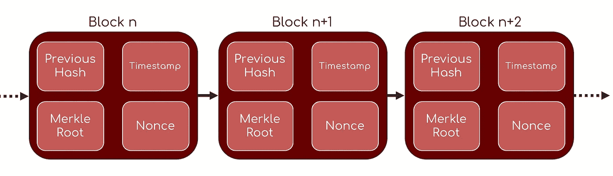
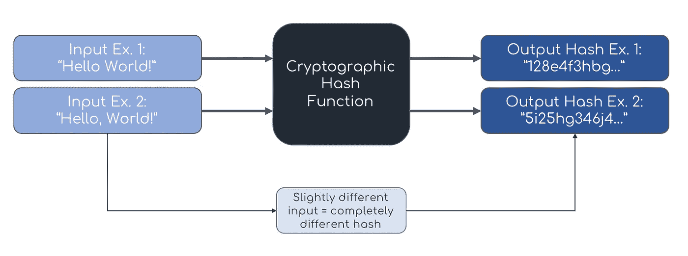
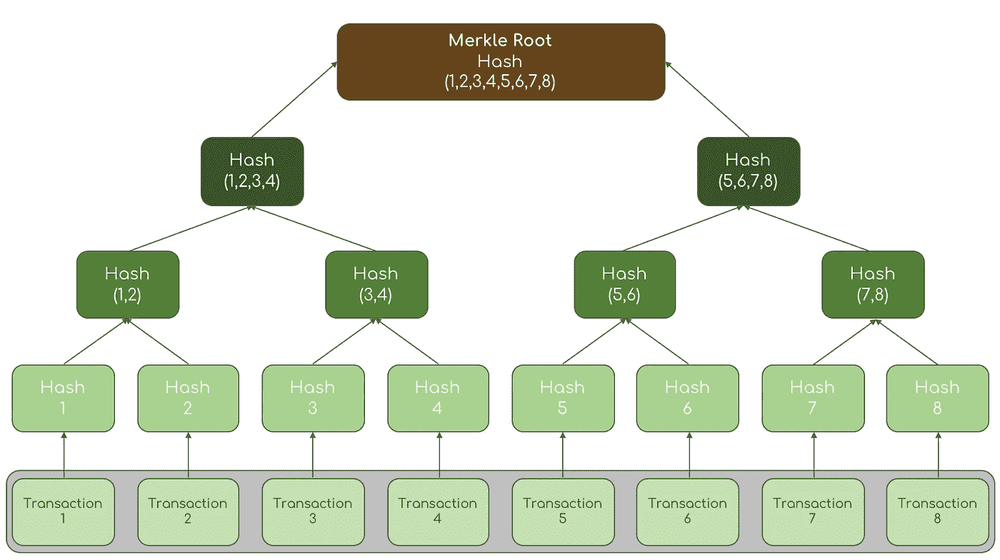

# Merkle Trees 在 3 分钟或更短时间内完成

> 原文：<https://medium.com/coinmonks/merkle-made-palatable-94e6662f4caf?source=collection_archive---------2----------------------->

因为区块链仍然是一个新兴的生态系统，仍然有许多事情阻碍它的广泛采用。在这些因素中，有一个是对组成这些项目的核心技术概念的固有理解。与对加密货币和/或区块链技术持怀疑态度的人进行至少一次对话几乎是一种通行权利，但当被追问时，他们会因为不知情的论点崩溃而承认。因此，我的目标是简化一些更复杂的术语和概念。通过这种方式，它们可以成为日常话语的一部分，我们可以开始清除围绕这项新技术的一些污名。

好的，让我们从默克尔树开始。

Merkle 树是用于以有效的方式验证大量数据的结构。他们不仅能够验证从对等网络(如比特币或以太坊)中的其他对等方接收的数据未被更改，还能够验证发送的数据块是合法的。然而，Merkle 根可以理解为包含在单个块中的所有事务的签名。例如，在比特币中，Merkle 根可以在块头中找到(连同前一个块的散列、时间戳和随机数)。Merkle 根是如何确定的，它的目的是什么，以及它与 Merkle 树的关系是什么，这些都是我希望阐明的基本问题。

Figure 1: Bitcoin Block Header Simplified

为了理解 Merkle 树是如何工作的，首先要理解什么是加密哈希函数(CFH)。

从广义上讲，哈希函数接受某个输入，并返回一个输出(哈希)，通常是字母数字字符串的形式。

这里有一个 CFH 的五个基本要素的快速总结(这里不会深入讨论):

1)散列必须容易(通过计算)从函数中获得

2)从散列向后工作以获得原始输入在计算上必须是不可行的

3)它必须是确定性的—相同的输入必须给出相同的散列

4)输入中的微小变化会产生完全不同的散列(参见图 2)

5)并且找到产生相同散列的两个消息也必须是不可行的

Figure 2: Cryptographic Hash Function

现在你对 CHF 有了一个了解，Merkle 树的复杂性变得更容易理解了。

Figure 3: The Merkle Tree and Merkle Root

创建 Merkle 树的第一步是获取块中包含的事务，并通过 CHF 获取它们的散列。在此之后，所有这些事务散列被彼此配对并再次散列。这个过程不断发生，直到只剩下一个散列:这就是 Merkle 根。通过成对散列，Merkle 树有效地使事务防篡改，因为对先前事务的任何改变将沿着树向上传播，沿途改变每个散列，这将不可避免地改变 Merkle 根(参见 CHF 的支柱 4)。为了验证一个交易，你所要做的就是跟踪它在树上的分支。

我希望您现在能够理解加密哈希函数的基础，它与 Merkle 树和 Merkel 根的关系，以及它们与区块链技术的整体联系。

哦，希望你喜欢这个快速总结(和非常明显的企图拖延任何和所有期末考试的努力)。

更多即将到来。