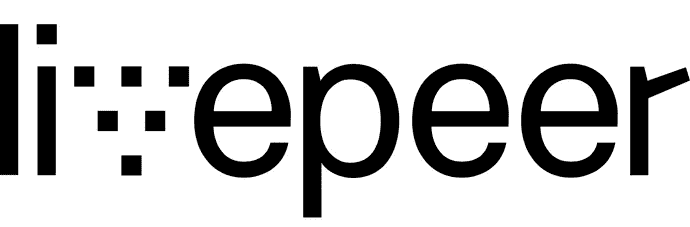

# merkle Mine—一个简短的笔记

> 原文：<https://medium.com/coinmonks/merkle-mine-a-short-note-de0bd4dbd31d?source=collection_archive---------6----------------------->

[https://forum.livepeer.org/t/introducing-the-merklemine/204](https://forum.livepeer.org/t/introducing-the-merklemine/204)

**什么是 Merkle 矿？**

Merkle mine 是一个为赌注协议中感兴趣的参与者生成初始令牌的算法过程。在当今的生态系统中，当需要部署新的标桩协议时，令牌通过 ico 或空投来分发，这两种方式都被视为集中令牌分发。

Merkle mining 促进了一个去中心化的过程来为利益证明(POS)协议生成一个起源状态。

**它试图达到什么目的？**

这是一种独特的令牌分发方式，可以避免整个网络的集中参与。这将是任何桩协议可用于启动网络初始状态的第一个算法过程之一。

**它是如何工作的？**

这是一个两步走的过程。

**第一步** —缓慢启动期(3 个月)。

该协议是通过创建创世状态来启动的，实际上设置了某些 Merkle 参数。这些参数是基于以太坊网络在特定块高度的快照来评估的。

例如:对于主网络发布，Livepeer 协议选择在块高度 5264265 拍摄快照。在这个街区高度，他们收集了所有余额大于 0.1 ETH 的以太坊账户的账户地址。这是参与 Livepeer 协议所需的最低赌注金额。在该区块有该余额的账户总数约为 2598071 个。每个帐户将有资格获得 2.44 LTP 代币。这样，他们在创世状态下总共生成了 6，343，700 个 LTP 令牌(2598071 * 2.44)。

要申请他们各自的 2.44 LTP 令牌，必须提交一份证明，该证明必须确认两件事:

1.该帐户包含在创建状态的快照中。

2.拍摄快照时，该帐户的余额为 0.1 ETH。

如果无人认领，这些令牌将在 merkle mining 的第二阶段由他人认领。

**第二步** —申领期从 3 个月后开始，持续 15 个月。

在这一阶段，证明不仅可以由包括在创世国的账户持有人提交，也可以由外部 ETH 账户提交。外部帐户代表已经包含的帐户提交证明。

例如:有一个帐户 Alice 在拍摄快照时有 0.1 ETH。Alice 在慢速启动期之前没有申请 2.44 LTP。那么可以包括/不包括在起源状态中的 Bob 可以代表 Alice 提交证明。一旦被接受，令牌将根据 Merkle Mine 算法中的条件在 Bob 和 Alice 之间分配，例如 Bob 在声明期内提交了证明。

Bob 可以代表任意数量的无人认领账户持有人提交证明。对此没有限制。

假设剩余的令牌将在 15 个月期限结束时申请。在此申请期之后，merkle 采矿流程结束。

**在哪里实施的？**

目前，Livepeer 是第一个使用 Merkle Mine 流程的协议。是他们提出了这个算法，并提供了计算和提交证明的工具..他们的代码在 GitHub 上开源。

**问题**

为了提交证明，帐户需要使用天然气。在申请期间的某个时间点，30%的网络气体是由于 Livepeer 交易。应该有某种方法来限制每个事务的存储需求。

**有用链接**

1.  Merkle 矿简介—[https://forum.livepeer.org/t/introducing-the-merklemine/204](https://forum.livepeer.org/t/introducing-the-merklemine/204)
2.  Merkle 矿的 Github 回购—[https://github.com/livepeer/merkle-mine](https://github.com/livepeer/merkle-mine)
3.  技术规范—[https://github.com/livepeer/merkle-mine/blob/master/SPEC.md](https://github.com/livepeer/merkle-mine/blob/master/SPEC.md)
4.  live peer token Miner—[https://github.com/livepeer/minecraft](https://github.com/livepeer/minecraft)

**Read Today’s Top story**

> [直接在您的收件箱中获得最佳软件交易](https://coincodecap.com/?utm_source=coinmonks)

