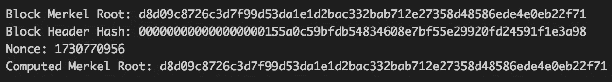

# 用 C#计算的比特币块的 Merkle 根

> 原文：<https://medium.com/coinmonks/merkle-root-of-a-bitcoin-block-calculated-in-c-8c659a3b3290?source=collection_archive---------1----------------------->

> (本文假设您对区块链的工作原理有基本的了解，目的是让您对块中包含的事务有一点了解)

## 什么是 Merkle 树？

Merkle 树又名二进制哈希树，是一种用于有效总结和验证大型数据集完整性的数据结构
Merkle 树是一种倒置的树结构，其根(称为 **Merkle 根**)在顶部，叶子在底部。请参见下面的示例。
比特币和区块链技术中使用这种数据结构来总结一个区块中的所有交易，提供了一个非常有效的流程来验证一个交易是否包含在一个区块中。


## 一点历史

Merkle 也是公钥密码学的发明者之一，他似乎早就从密码学转移到解决更有趣的问题上了。你可以在这里查看他的网页。
在学习 Merkle tree 的时候，我有一个想法，想快速编写一些代码，从比特币链下载一个区块，并计算交易的 Merkle 根，看看我是否会到达由区块挖掘器计算并由网络验证的相同的 Merkle 根，因为……为什么不呢？

维基百科对 merkle 树的定义是

*Merkle 树递归定义为* [*哈希列表*](https://en.wikipedia.org/wiki/Hash_list) *的二叉树，其中父节点为其子节点的哈希，叶节点为原始数据块的* ***哈希。***

这与比特币区块链中 merkle 树的实现方式一致。

**算法大致如下**

*   事务表示原始数据块，这些数据块被散列以产生形成叶节点的事务散列(事务 id)。
*   叶节点的数量必须是偶数，这样二进制散列树才能工作，因此如果叶节点的数量是奇数，则复制最后一个叶节点，使计数为偶数。
*   每对叶节点被连接和散列以形成第二行散列。
*   重复该过程，直到获得只有两个散列的行
*   这最后两个散列被连接起来形成 Merkle 根。

从算法来看，它看起来非常简单，我非常有信心能够立即编写代码并验证比特币区块链[https://block chain . info](https://blockchain.info/r)中某个区块的 Merkle 根。

拿着我的(隐喻的)啤酒…

**递归……真的吗？**

嗯……你可以只使用 while 循环，但是这里的重点是**区块链**，而不是算法，递归总是很有趣。:)


几个小时后，我感到非常恼火；算法很简单，但是，我的 Merkle 根与块中的根不匹配，我真的不知道为什么。

**魔鬼总是在细节中**

在查看《比特币开发者参考》时，我发现了以下内容

*如果一个块有三个或三个以上的事务，则形成中间 merkle 树行。TXID 按顺序成对放置，从 coinbase 事务的 TXID 开始。每一对被连接在一起作为 64 个原始字节，并且****sha 256(sha 256())****被散列以形成第二行散列。*


看起来我需要对连接的对进行双重散列，而不是仅仅进行一次散列，所以我很高兴地进行了更改，编译并运行了代码。令人失望的是，仍然没有喜悦，我认真考虑只是把它留在那里，因为开始只是一个随机的想法，现在花费我的时间，而让我不满意。但是我被迷住了，我必须知道为什么我的代码不起作用。在谷歌上搜索了一段时间，并与一位区块链爱好者交谈后，我偶然发现了一个我并不太熟悉的概念…

**小端和大端**

本质上，这指的是计算机如何存储多字节数。

**“小端序**”机器将数字的**低位**顺序字节存储在内存的**最低**地址，将**高位**顺序字节存储在**最高**地址。

**【大端】**机器将数字的**高位**顺序字节存储在**最低**地址，将**低位**顺序字节存储在**最高**地址。

比方说，你有一个 4 字节的长度

字节 3 字节 2 字节 1 字节 0

```
**In little endian machines , it will be arranged in memory as**     Address0   Byte0
    Address1   Byte1
    Address2   Byte2
    Address3   Byte3**In big endian machines , it will be arranged in memory as **     

    Address0   Byte3
    Address1   Byte2
    Address2   Byte1
    Address3   Byte0
```

在比特币中，交易数据中的大多数字段都是小端格式。 ***从小端转换到大端*** *时，先交换每对字符，然后反转字符串。*

**所以修复只是简单的**

*   之前将事务哈希从小端转换为大端。运行 BuildMerkleRoot 算法。
*   将 Merkle 根转换回小端字节序



瞧啊。最后，我得到了我的 merkle 根，现在我的啤酒呢？:).

**总结**

那么，区块链的默克尔树有什么意义呢？

在本文中没有过多的细节，Merkle 根最终包含在块头中，并提供了一种验证块中事务的方法。

块头包含先前块头的散列，该散列包括先前块的 Merkle 根等..将事务链接到第一个块(起源块),这意味着事务数据中的任何微小变化都会导致不同的 Merkle 根，这将使块无效

Merkle 树的另一个关键用例是在**简单支付验证**中，您可以通过显示事务的 Merkle 分支来证明事务存在于块中。

我已经包含了一个 GitHub 链接到完整的代码【https://github.com/chidionyema/merkleroot。

你可以用来自 https://www.blockchain.com/[的任何块散列替换代码中的块散列，Merkle 根应该是相同的。](https://www.blockchain.com/)

放弃

*   这只是*获取它的工作代码*:)

> [直接在您的收件箱中获得最佳软件交易](https://coincodecap.com/?utm_source=coinmonks)

[](https://coincodecap.com/?utm_source=coinmonks)