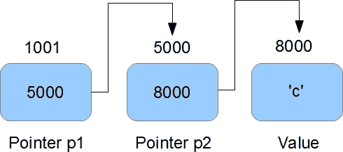
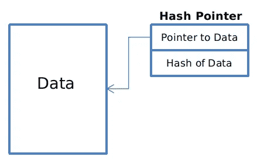
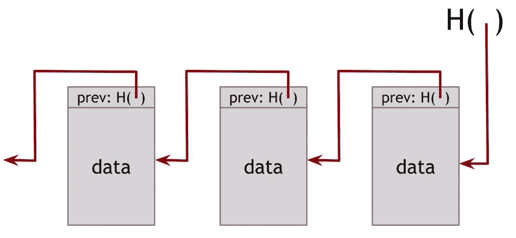
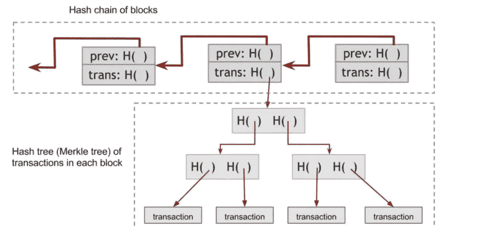

# 默克尔树 101！

> 原文：<https://medium.com/coinmonks/merkle-tree-101-a3ca025dc318?source=collection_archive---------0----------------------->

当我遇到术语**‘区块链’，**时，第一件引起我兴趣的事情是，“**为什么区块链为数据**提供安全性和不变性？”。所以，找到答案的最好方法就是做一些研究。

**研究时间:**当我浏览不同的文章时，每次弹出的术语都是 Merkle tree 以及它如何使用密码学的力量和**“树”**数据结构来为区块链提供不变性。但是在理解 Merkle 树如何工作之前，我们首先需要熟悉 Hash 指针。我们在 c 语言中学习指针的时候一定都挠过头，指针是存储其他变量地址的简单变量。

Pointer P1 stores the address of value 8000 i.e. 5000(address of 8000)

**那么，散列指针到底是什么？**

因此，哈希指针是一个具有加密哈希附加属性的指针。哈希指针由两部分组成:

*   指向某些数据存储位置的指针。
*   数据块的加密哈希(由数据和哈希指针组成)。

Hash Pointer

**那又怎样？现在是最精彩的部分。哈希指针有助于检测数据篡改。让我们来看看:**

Use Case: Hash pointer for detection of data tampering.

TT**终端学**

*   **H( ):** hash 指针，包含第一个块(即最右边的块)的地址和存储在那里的整个块的加密哈希(数据+hash 指针)。
*   **H1、H2、H3** :散列指针存储在从右向左移动的块中。
*   块 1、块 2、块 3:数据块，从右向左移动。

现在假设我们改变了块 3 中的一些数据。

*   因为 H2 存储了 block3 的加密哈希。H2 的值也改变，并且随后其它散列指针的值也改变。
*   现在，我们如何检查数据是否被篡改了？我们需要验证的只是头指针的散列指针值(在本例中，最右边的 H()指向 block1)。如果值不匹配，则意味着数据已被篡改。

**最后 Merkle 树**

现在，我们有了理解 Merkle 树的工具。什么是 merkle 树？让我们来看看:

> 根据维基百科:在密码学和计算机科学中，哈希树或 Merkle 树是这样一种树，其中每个叶节点都用数据块的哈希来标记，每个非叶节点都用其子节点标签的密码哈希来标记。

简单的树数据结构使用指针来指向它的子节点，但是在 Merkle 树的情况下，我们使用散列指针来存储它的子节点的地址以及子节点的散列。

Blockchain using merkle tree to store transaction.

Merkle 树是如何提供不变性的？

*   假设我更改了叶节点中的任何事务。然后，其父节点中的哈希指针也需要更改，随后根节点中的哈希指针也需要更改，这需要大量的计算，我们检测区块链中的任何篡改所需要做的就是验证起源块(区块链中的第一个块)的哈希指针。
*   Merkle 树还用于通过检查特定块中事务的加密散列的存在来验证该块中事务的成员资格。

**优势部分:**

*   树包含许多条目，但是你只需要记住根节点的加密散列。
*   可以在 0(log n)时间/空间复杂度内验证事务的成员资格。
*   可以在 0(log n)时间内在排序的 merkle 树中验证非成员资格(检查丢失项前后的项)。

> [在您的收件箱中直接获得最佳软件交易](https://coincodecap.com/?utm_source=coinmonks)

