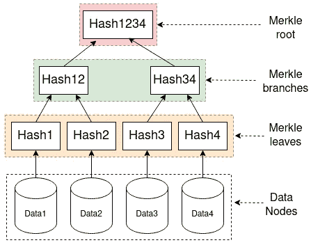

# Merkle 树:概念和用例

> 原文：<https://medium.com/coinmonks/merkle-trees-concepts-and-use-cases-5da873702318?source=collection_archive---------0----------------------->

## 比特币内部的数据结构，亚马逊迪纳摩 DB，ZFS，…

本文探讨了什么是 Merkle 树，以及它们在不同系统中的实际应用，包括比特币、亚马逊的 Dynamo DB 和 ZFS 文件系统。基本概念相当简单，但一些巧妙的应用并不那么明显。

首先，让我们从 Merkle 树的概念开始。如我所说，它的基本形式并不复杂。

# 什么是 Merkle 树

Merkle 树基本上就是一组层次化的[散列](https://en.wikipedia.org/wiki/Hash_function)值，从一组实际数据( *Merkle leaf* )到中间散列(*Merkle brachs*)直到将所有数据汇总到一个散列值中的 *Merkle root* 。

## 示例:一个基本的 Merkle 树

下图显示了一个非常小的 Merkle 树:

A very small Merkle tree. Image by author.

在该图中，底部节点(*数据 1* - *数据 4* )是应用程序处理的实际数据。其中的每一个都由它们各自的哈希值( *Hash1* - *Hash4* )汇总，作为 *Merkle leaf* 。从这些开始，Merkle 树构建了一个层次结构，将散列组合在一起，直到只剩下一个。组合其他哈希节点的节点称为 *Merkle 分支*(此处*哈希 12* ，*哈希 34* )。当只剩下一根时(此处*有 h1234* )，这叫做 *Merkle 根*。如下例所示，可以有多级分支和散列。

## 处理不平衡的 Merkle 树

上面的例子说明了 Merkle 树的基本情况。这是一个方便的例子，因为在每一层都有正好合适的节点数来形成精确的配对。如果您有奇数个叶(数据)节点，会发生什么情况？例如，如果您有 5 个数据节点，上面的示例会发生什么情况？可以将 Data1+Data2 散列在一起形成 Merkle 分支，Data3+Data4 也是如此。但是数据 5 没有一对散列到新分支中。

可以采取不同的方法来解决这个问题。例如，在这种情况下，比特币只是复制不可配对的(奇数)哈希，并将副本作为一对使用(奇数哈希与自身配对)。下图说明了这一点:

Handling odd (uneven) numbers of hashes Bitcoin style. Image by author.

在本例中，Hash 5 没有直接配对，它被复制以与自身配对。Hash55 也是如此。以上只是一个选项，有不同的方法来处理这个配对问题。在我看过的作品中，我最喜欢 Monero(或 [Cryptonote](https://en.wikipedia.org/wiki/CryptoNote) ？)一个最多。我将很快介绍它。首先，稍微有些不同。

## Python 中一个非常简单的 Merkle 树

理论和解释都很棒。但是对于技术人员来说，一些代码有助于形式化它。我的 [Github repo](https://github.com/mukatee/monero-scraper/blob/master/src/python/merkletrees/merkletree_simple.py) 中的以下代码展示了一个用 Python 实现 Merkle 树的简单例子(或者跳过它，以获得更多概念性解释):

A very simple and naive Merkle tree implementation in Python. Code by author.

上面代码中的最后四行运行示例，创建一个带有数据节点*数据 1* - *数据 5* 的 Merkle 树。用这种算法计算树看起来像这样(将散列裁剪为前 5 个字符):

Merkle tree calculation example with actual values. Image and animation by author.

我在这个例子中使用了 [*keccak*](https://keccak.team/index.html) 哈希函数，因为这是 [Monero](https://www.getmonero.org/) 加密货币/区块链使用的函数，而且我最近在研究 Monero 代码。这里的第 5 个(奇数)数据元素(使用我上面的 Python 代码)的处理方式与比特币示例略有不同，因为如果剩下一个数据元素，这只是重新使用散列(不可配对，上面的 *cf54b* )。实际上，这种重复使用应该与比特币算法中的复制具有相同的效果。

## 优化 Merkle 计算:Monero 风格

当我在研究 Monero 区块链以更好地理解它时，我发现它有一个不同但聪明的方法来散列 Merkle 树。它的代码可以在 [Monero Github 库](https://github.com/monero-project/monero)的 [tree-hash.c](https://github.com/monero-project/monero/blob/8286f07b265d16a87b3fe3bb53e8d7bf37b5265a/src/crypto/tree-hash.c) 文件中找到。我在我的 Github 中做了一个 Python 版本来实现同样的功能。

Monero 方法可以被描述为将散列树转换成一棵[完美的二叉树](https://cs.stackexchange.com/questions/32397/is-there-a-difference-between-perfect-full-and-complete-tree)。它在第一次迭代中散列了足够多的叶节点，因此后面的迭代将总是有一些 2ˣ(2 的幂)节点的变体。下图说明了这一点:

Monero approach to Merkle tree building, with 5 nodes (transactions in Monero). Image by author.

其工作方式如下:首先，计算 *x* ，使得 *2ˣ* 大于事务数(数据节点)。在这个例子中，它是 2 =8，因为 8 > 5(有 5 个事务/数据节点)。在此之前的 *x* 的值，2 =4，将不适合(4 > 5 不为真)。从中减去交易次数。在这种情况下，8–5 = 3。这 3 是开始迭代 1 的事务的索引。在本例中，使用基于 0 的索引，起始索引是*数据 4* 。

以上解释可能有点抽象。下表列出了事务计数的具体示例，以及在迭代 2 和后续迭代中，如何将事务计数转换为“完美的二叉树”形状(大小始终为 2ˣ，消除任何“奇数”计数或后续迭代中剩余的不可配对散列):

Example calculations of Merkle size with the Monero (Cryptonote) algorithm. Image/Table by author.

这些列:

*   *事务*:正在计算的块中的事务数
*   *最接近的 2^x* :大于*交易的第一个 2ˣ*
*   *迭代 1 开始索引*:从事务列表中的该索引开始散列对
*   *迭代 1 值*:从*迭代 1 起始索引*到交易列表结束的交易列表中的交易数
*   *迭代 1 对* : *迭代 1 值*除以 2(因为成对散列)
*   *迭代 2 公式*:上述值如何导致在下一次迭代中哈希的项数
*   *迭代 2 大小*:迭代 2 中要散列的事务数。正如你所看到的，它总是 2ˣ，并导致进入一个“完美的二叉树”。

我猜是数字和公式太多了。你睡着了吗？无论如何，如果您从上表中选择包含 23 笔交易的行，您可以按照我制作的这个漂亮的 8 位动画来查看 Merkle 根计算是如何针对该行进行的:

Calculating Merkle root in Monero for block 1407480\. Image/animation by author.

在这种情况下(上面的动画)，开始索引计算为 2⁶=32–23=9.这是交易号 10(零索引加 1)。接下来的迭代有 16 个节点，即 2⁵，下一个是 8 个或 2⁴，依此类推。上面的动画实际上展示了 Monero 代码如何在内存中操作散列数组。

# 示例使用案例

概念是好的，而具体的、真实的用例才是重点。在这里，我将讨论 Merkle 树在区块链/加密货币中的使用，以及亚马逊的 AWS DynamoDB 分布式数据库。我还将简要介绍一下 ZFS 文件系统和 Git 版本控制系统，因为它们有时也会作为 Merkle 树使用的例子被提及。

## 加密货币和区块链:比特币、Monero 等。

正如上面已经简要讨论的，比特币和类似的加密货币利用 Merkle 树来总结和验证块中的交易，并将 Merkle 根嵌入到它们的块头中，作为所有交易的总结。下图说明了这一点:

Blockchain and Merkle trees. Image by author.

每个块都有一个 ID 值，它是其头字段的散列值。其中一部分是 Merkle 根。另一部分是前一个块 ID(上图中的*父*)。通过与前一个块 ID 链接，并将其作为下一个块 ID 的一部分，这些块形成一个区块链。通过在其中嵌入 Merkle 根，他们在块中创建了一个不可变的事务记录。

例如，比特币块头包含:

*   难度目标值(比特币中称为*位*
*   **Merkle root** 块中的所有事务
*   *Nonce*；在挖掘中为查找接受的块而更改的值
*   *前一块哈希(块 ID)*；将这个块链接到链中的前一个块(在上图中，这个前一个散列被命名为*父块*)
*   *时间戳*；挖掘(创建哈希)块的时间
*   *块版本*；标识支持功能和格式(在一些区块链中也用于标识哈希函数，如 Monero)

这些报头字段都被散列在一起以形成块 ID。使块 ID 成为所有报头数据的散列使得实际上不可能修改块报头。在块 ID 中包括 Merkle 根进一步使得实际上不可能修改块中的事务。

但是让我们更详细地看看这些类型的区块链是如何以不同的方式使用 Merkle 树的。都是关于数据完整性的，但是方式不同，有时很巧妙。

**区块链用例 1:交易数据(区块)不变性**

正如我上面提到的，比特币区块链中 Merkle 树的基本用例是将 Merkle 根构建到块头中，并使用它来验证没有交易被更改。

举个例子，让我们把前面例子中的*数据 4* 改为*数据 6* :

Changing one node value invalidates (changes the root of) the Merkle tree. Image by author.

与之前的例子相比，使用*数据 4* ，Merkle 根是 *aa8d3* 。有了 *Data6* ，现在就是 *f8932* 。这样，任何事务数据的任何变化都会改变 Merkle 根，并且它不再匹配存储在该块的区块链中的 Merkle 根(在块头中)。并且通过块报头，该问题将传播到该块之后的整个区块链。

然而，如果你想一会儿，你可能会问一个问题:

**真的需要 Merkle 树来验证块数据吗？**

不。相反，我们可以将所有的事务数据连接在一起，构建一个单一的根哈希。考虑上述带有*数据 1* - *数据 5* 的示例，但只是将它们散列在一起:

Concatenate+hash all data at once. Image by author.

现在，只更改一个数据值会产生使摘要散列无效的相同效果:

Hash change detection in concat+hash all at once. Image by author.

该单个散列也可以用来代替块头和块散列中的 Merkle 根。目前为止效果相同。

那么在这里使用 Merkle 树的真正好处是什么呢？总的来说，我认为它在散列验证中给了您更多的粒度，并使其他巧妙的技巧能够更有效地处理区块链。同时还提供交易完整性保证/验证。

最初的[比特币白皮书](https://bitcoin.org/bitcoin.pdf)提供了另外两个使用 Merkle 树的例子:*区块链修剪*和*简化支付验证* (SPV)。除了这些，我最喜欢的是*地层开采池协议*。接下来我们来看看这些。

## 区块链剪枝

随着时间的推移，区块链会越积越多，变得越来越大。例如，今天(2021 年 2 月)[比特币区块链的大小约为 380GB](https://bitinfocharts.com/) 。区块链修剪是一种借助 Merkle 树来减少这种已用空间的方法。通过从不再需要的本地存储器中移除用过的事务。

我们希望拥有所有数据用于全面验证和历史记录，但不是对等网络中的所有节点都需要所有数据。在最初的比特币白皮书中提出的区块链修剪方法建议通过使用 Merkle 树从块中修剪(移除)花费(使用)的交易来解决这个问题。

下图说明了这一点:

Three out of five transactions used (spent) in the block (and Merkle tree). Image by author.

在这个例子中，我们使用了(失效的)事务 TX1、TX2 和 TX4。在这个块中，我们还有未使用的事务 TX3 和 TX5。假设我们对具有完整存档的完整节点不感兴趣，只是保留一个可消费事务的列表。Satoshi 的建议是从已使用的事务数据中删除块，只留下验证未使用的事务数据所需的 Merkle 树分支:

The Merkle tree pruned of the used transactions. Image by author.

如果我们还花费 TX3:

One more transaction used, leaving just one unused in the Merkle tree (and the block). Image by author.

该块现在可以被修剪为仅包含 TX5 数据，以及该块中另一个 Merkle 树分支的散列( *96b8d* ):

Pruned Merkle tree with only one transaction left. Image by author.

我们将节省存储 5 个事务中的 4 个和 9 个 Merkle 树节点中的 6 个所需的空间。该示例节省了大约 80%的空间。区块链越长，使用得越多，花费的事务就越多。因此可以节省更多的空间。这是一个非常聪明的想法，就像最初的比特币白皮书中的大多数想法一样。

但是就像块验证一样，我们总是可以问这样一个问题:

**你真的需要万年青来修剪区块链吗？**

[比特币交易](https://bitcoin.stackexchange.com/)充满了对修剪在实际实现中的实际应用方式的深刻讨论。虽然 Merkle 树修剪是一种聪明的方法，但在(至少)比特币核心软件中并没有以这种方式应用。

相反，[未用完的交易存储在单独的数据库中，以便快速查找](https://bitcoin.stackexchange.com/questions/2983/is-pruning-transaction-history-implemented-in-satoshis-bitcoin-client)。该数据库在首次启动时通过扫描区块链进行初始化，并在发现新的和失效的事务时更新数据库。随着比特币网络广播新的区块，数据库会不断更新。一个被删减的节点可以依赖于这个数据库。

一般来说，运行一个修剪过的节点对于基本操作来说已经足够了，但是[并不完全支持区块链](https://bitcoin.stackexchange.com/questions/101768/if-pruning-is-so-safe-why-arent-100-of-the-bitcoin-nodes-pruning-why-keep-th)的所有特性，所以一些节点仍然需要保存完整的数据。但是这超出了本文的范围。

我认为这里的基本要点是，Merkle 树很酷，但有时基本的甚至更简单的方法也很好，甚至更好。当然，困难的部分是识别什么时候这是真的，什么时候更酷(Merkle)的方法是最好的。不要以任何方式认为这是不使用 Merkle 树的建议。只是考虑一下整体情况。还有比特币和相关的区块链，我相信 Merkle 树可以实现许多其他事情，因此很有意义。如下文所示。

## 简化支付验证(SPV)

最初的[比特币白皮书](https://bitcoin.org/bitcoin.pdf)中也提出了[简化支付验证](https://en.bitcoinwiki.org/wiki/Simplified_Payment_Verification) (SPV)算法。在 SPV 中，一个轻量级区块链客户只存储块头，但也希望在区块链中验证它收到的付款是否为有效交易。由于缺乏完整的交易细节，SPV 客户端使用 Merkle 树与完整节点协作来有效地验证交易细节。

我将重复使用上面区块链修剪的例子。SPV 客户端想要验证给定块中的 TX5。下图说明了这一点:

SPV client node verifying a single transaction is part of a given Merkle tree. Image by author.

这里，SPV 客户端节点向一个完整节点请求 Merkle 分支，这是用 TX5 数据构建 Merkle 根所需的。通过从感兴趣的事务( *TX5* )重建 Merkle 根( *aa8d3* )以及由完整节点提供的 Merkle 分支( *96b8d* )，SPV 客户可以确信已经接收到有效的事务。通过对照存储在块头中的根来检查这个重建的 Merkle 根，可以验证整个树(以及 *TX5* )实际上是有效的，并且是区块链的一部分。

我发现 SPV 是一个有趣的例子，说明如何使用 Merkle 树，以及(块)数据过滤([比特币使用](https://bitcoin.stackexchange.com/questions/57328/the-use-of-bloom-filter-in-spv-nodes) [布鲁姆过滤器](https://en.wikipedia.org/wiki/Bloom_filter)，但这又是另一个话题)，来同步和验证分布式系统中所选数据的存在和正确性。

**池采:地层协议**

创建加密货币的传统方式是通过工作证明(PoW)哈希进行挖掘。采矿池是小型采矿者联合在一起，根据他们对池的计算(哈希)能力的贡献获得一些采矿奖励的一种方式。这导致需要一个中央实体，即采矿池，能够协调矿工。它需要一种方法来跨所有客户机有效地分布和跟踪整个挖掘过程。通过一些巧妙的技巧，[地层协议](https://en.bitcoin.it/wiki/Stratum_mining_protocol)使用 Merkle 树来实现这一点。

特别是 [Stratum 版本 1](https://braiins.com/stratum-v1/docs) 利用 Merkle 树高效地分发工作。池服务器向挖掘器节点提供构建块所需的块头元素。这包括部分 Merkle 树，为除比特币基地事务之外的所有其他事务计算分支。coinbase 交易是一种支付采矿报酬的特殊交易。下图说明了这一点:

Merkle templating with the Stratum mining pool protocol (v1). Image by author.

该图包含三个元素: *Merkle 树模板*、*比特币基地模板*和*对随机数的搜索*。该池向挖掘器提供 Merkle 树模板，包含块中事务的预先计算的 Merkle 分支(这里是 *96b8d* ，从而大大降低了挖掘器的带宽和计算需求)。然后，miner 需要用合适的 coinbase 事务填充 Merkle 树模板，该事务是从服务器提供的 coinbase 模板构建的。获胜者是用提供匹配区块链网络难度等级的散列值填充模板的人。意味着只是具有合适的小值的散列。

coinbase 模板由池提供，并由矿工使用他们选择的 *nonce* 和 *extranonce* 字段来填充。当与 Merkle 树模板结合时，这些模板中的每一个都提供不同的块散列，并且找到获胜块的唯一方法是尝试值，直到产生匹配网络困难目标的散列。如果挖掘器找到一个与这个 Merkle 模板的网络散列难度相匹配的 nonce，它就把它提交给挖掘池。coinbase 模板包含矿池地址，确保矿池收到区块奖励，并可以分发给所有矿工。

在更广泛的上下文中，这里的 Merkle 树用于分发部分解决方案(预先计算的 Merkle 树分支和 coinbase 模板)，同时允许不同的分布式节点独立工作，以尝试找到缺失部分的解决方案(coinbase 事务的 nonces，以构建可接受的 PoW 散列)。通过将池地址作为模板的一部分嵌入，它确保了所有分布的节点为共同的目标做出贡献，并且可以共享回报。

# AWS 发电机数据库

[Dynamo DB](https://aws.amazon.com/dynamodb/) 是一个分布式数据库，作为[亚马逊网络服务(AWS)](https://en.wikipedia.org/wiki/Amazon_Web_Services) 平台的一部分提供。它最初是为了处理亚马逊的全球零售基础设施需求而设计的。因此，在使其可扩展和优化其架构的所有部分的效率方面，已经投入了大量的考虑。在 2007 年的 [AWS Dynamo DB 论文中描述了 Dynamo DB 的架构，包括它使用 Merkle 树来有效地同步发散的节点(论文的第 4.7 节)。](https://www.allthingsdistributed.com/files/amazon-dynamo-sosp2007.pdf)

Dynamo DB 就是所谓的键值存储。实际数据(值)存储在数据节点中，并通过它们的键进行标识和索引。Dynamo DB 将这些数据存放在它称之为*的虚拟节点*中。每个虚拟节点拥有一个*键范围*。为了处理高可用性和可伸缩性需求，Dynamo DB 跨这些键范围分布数据，并将每个键范围托管在多个虚拟节点上(跨多个物理节点，或[分区](https://dzone.com/articles/partitioning-behavior-of-dynamodb))。

下图试图说明这一点，其中有 3 个(虚拟)Dynamo DB 节点，每个节点包含 2 个键范围，每个键范围在两个节点之间复制。我确信这并不完全符合所有的细节，而且自从这篇论文发表以来，这个系统已经发生了变化，但是我相信它已经很好地描述了总体概念:

DynamoDB virtual nodes and distributed key ranges. Image by author.

在这种类型的分布式系统中，总有一天，这些虚拟节点中的一些会与持有相同键范围的其他虚拟节点不同步。Dynamo DB 使用 Merkle 树对这些节点中的键范围进行有效的比较和同步。在上图中，我在每个键范围内做了一个小的 3 节点 Merkle 树来说明这一点。 *KR3* 键范围树部分显示为红色，以说明节点是如何发生分歧的，需要解析才能找到正确的值。

为每个键范围构建一个 Merkle 树，其中树的叶节点是键范围数据值。Merkle 根汇总了每个节点中的数据。通过比较托管相同键范围的每个虚拟节点的 Merkle 根，节点中的差异立即可见。这种完全的比较只需要单个值，即 Merkle 根的通信和比较。如果存在差异，可以继续比较树的分支，以有效地找到准确的分歧点，并同步数据值。

下图说明了这一过程:

DynamoDB using Merkle trees to find data nodes out of sync. Image by author.

正如你所看到的，我只是把区块链的例子复制到上图中。因为 fundamel 的结构，以及它所依赖的概念，是完全一样的！不同之处仅在于相同的基本原理在不同的环境中的(巧妙)应用。

是的，一些细节可能会有所不同。例如，DynamoDB 可能使用与 Keccak 不同的散列函数。但是，如这里所示，基本的方法和概念是相同的，因此不仅仅适用于常见的区块链 Merkle 树的例子。

# ZFS 文件系统

ZFS 是一个支持分布在多个卷上的数据的文件系统，是一种分布式文件系统。多个 ZFS 卷可以被分组到[存储池](https://arstechnica.com/information-technology/2020/05/zfs-101-understanding-zfs-storage-and-performance/)，这些存储池也可以托管数据的冗余副本。ZFS 被宣传为使用 Merkle 树来确保数据完整性。

[ZFS 使用 Merkle 树来检查数据](https://zedfs.com/checksumming-in-filesystems-and-why-zfs-is-doing-it-right/)，以识别写入或读取磁盘的部分数据损坏(或误读)等问题。).与大多数文件系统一样，数据存储为特定大小的块。这些块形成了用于构建 Merkle 树的自然叶节点。

我在网上找到的 ZFS 使用 Merkle 树的主要理由总是讨论 ZFS 如何将 Merkle 树作为校验和存储在块本身之外，为识别错误提供更高的弹性。这让我很不明白为什么你需要一个 Merkle 树，而不仅仅是在块外存储一个普通的校验和。有时候我觉得人们应该问更多的问题。

另一方面，我可以看到通过使用分层 Merkle 树跨多个存储池及其副本验证数据的好处。这种情况非常类似于 DynamoDB 如何操作并使用 Merkle 树来同步节点(相对于 ZFS 卷)。然而，我找不到任何使用 Merkle 树的描述。如果有人知道的更好，我很乐意听到。

在任何情况下，这似乎与 Dynamo DB 非常相似，因为它被用来更有效地验证分布式数据存储系统的完整性。其额外的好处是将一致性属性(校验和散列)与数据本身分开，以提高弹性。

# Git 版本控制系统

我发现另一个被引用作为 Merkle 树例子的例子是 [Git 版本控制系统](https://git-scm.com/)。Git 确实使用了大量的散列，它的基本功能在很大程度上基于散列文件内容和各种元数据。Git 形成了由这些散列标识的提交的[有向非循环图](https://stackoverflow.com/questions/26395521/dag-vs-tree-using-git) (DAG)。[这似乎被一些人认为是一棵大树](https://stackoverflow.com/questions/26395521/dag-vs-tree-using-git)。我不同意，所以我将以此作为概念中一些细微差别的例子。

DAG 是一种图，其中连接是单向的(有向的)，并且没有循环(无环的)。不幸的是，我不明白 Git DAG 怎么会是 Merkle 树。下图显示了一个 Git DAG，其中包含一些最常见的 Git 图形操作——分支和合并:

A made up DAG representing Git commits. Arrows point to parent commits. Image by author.

这里有由散列标识的节点和一个树形结构，其中每个节点指向一个父节点，并有一个或多个子节点。然而，我认为将这种树称为 Merkle 树有很多问题:

*   Merkle 树中的节点没有多个父节点。达格人知道。上图有两个这样的节点: *8e290* 和 *184da* 。
*   Merkle 树只在其叶节点中散列实际数据，叶节点之后的 Merkle 分支是散列的散列。Git DAG 没有基于散列的散列的分支，只有带有原始数据散列的节点。
*   Merkle 树从叶节点开始，沿着树向上，在每次迭代中不断地将分支数量减半。Git DAG 随着分支和合并一直收缩和扩展。因为它是图而不是树。

Git DAG 中的每个节点将它的父散列 ID 作为它自己的散列标识符的一部分进行散列，并且它是按时间排序的(定向的)。因此，它实际上非常类似于区块链。与加密货币不同，它允许分叉(分支)，并将这些整合为其结构的核心部分。然而，我认为放松这一点作为一般区块链定义的要求没有问题。我看不出区块链需要一棵默克尔树，正如我看不出吉特·达格需要一棵默克尔树一样。拥有一个加密货币是有用的，但是你可以拥有一个不同形式的加密货币，使用其他机制，比如 Git。

总之，不是所有的东西都需要成为 Merkle 树，即使它很酷。虽然你应该考虑 Merkle 树，因为它们很酷。然而，我在 Git DAG 中(或者在 Git 的其他地方)没有看到 Merkle 树。如果你比较了解，乐于聆听和学习:)。

# 结论

我发现 Merkle 树是一种简单但聪明的数据结构。我最喜欢我的算法和系统简单而聪明。我在本文中提到的例子有

*   区块链完整性验证，
*   区块链修剪
*   简化支付验证，
*   工作分配的挖掘池协议，
*   DynamoDB 数据同步
*   ZFS 校验和(以及可能的节点同步)

所有这些的共同点是什么？它们都使用 Merkle 树作为工具来获取潜在的大量数据元素，并在不同的步骤中分层验证它们的完整性。这允许有效的数据通信，并有效地处理全部数据的验证，仅在需要时进入更多细节。我相信这总结了我所看到的 Merkle 树的最佳用例:*支持分布式节点上的数据的有效验证和同步*。

当然，还有 stratum mining 协议，它更进一步，使用 Merkle 树作为一种手段来分配工作，同时在分散和不可信的设置中控制输出的特定属性。酷毙了。

在大多数日常的软件工程任务中，很少有机会使用和构建这些特性。但是学习它们肯定是有趣的，从而更好地理解一些基于它们的最新技术是基于什么。并在适当的时候做出明智的决定。对吗？

> 加入 Coinmonks [电报集团](https://t.me/joinchat/EPmjKpNYwRMsBI4p)，了解加密交易和投资

## 另外，阅读

*   什么是[闪贷](https://blog.coincodecap.com/what-are-flash-loans-on-ethereum)？
*   最好的[密码交易机器人](/coinmonks/crypto-trading-bot-c2ffce8acb2a) | [网格交易](https://blog.coincodecap.com/grid-trading)
*   [3 商业评论](/coinmonks/3commas-review-an-excellent-crypto-trading-bot-2020-1313a58bec92) | [Pionex 评论](/coinmonks/pionex-review-exchange-with-crypto-trading-bot-1e459d0191ea) | [Coinrule 评论](https://blog.coincodecap.com/coinrule-review-a-perfect-trading-bot)
*   [AAX 交易所评论](/coinmonks/aax-exchange-review-2021-67c5ea09330c) | [德里比特评论](/coinmonks/deribit-review-options-fees-apis-and-testnet-2ca16c4bbdb2) | [FTX 交易所评论](/coinmonks/ftx-crypto-exchange-review-53664ac1198f)
*   [n rave 零点回顾](/coinmonks/ngrave-zero-review-c465cf8307fc) | [Phemex 回顾](/coinmonks/phemex-review-4cfba0b49e28) | [PrimeXBT 回顾](/coinmonks/primexbt-review-88e0815be858)
*   [Bybit Exchange 审查](/coinmonks/bybit-exchange-review-dbd570019b71) | [Bityard 审查](https://blog.coincodecap.com/bityard-reivew) | [CoinSpot 审查](https://blog.coincodecap.com/coinspot-review)
*   [3 commas vs crypto hopper](/coinmonks/3commas-vs-pionex-vs-cryptohopper-best-crypto-bot-6a98d2baa203)|[赚取加密利息](/coinmonks/earn-crypto-interest-b10b810fdda3)
*   最好的比特币[硬件钱包](/coinmonks/the-best-cryptocurrency-hardware-wallets-of-2020-e28b1c124069?source=friends_link&sk=324dd9ff8556ab578d71e7ad7658ad7c) | [BitBox02 回顾](/coinmonks/bitbox02-review-your-swiss-bitcoin-hardware-wallet-c36c88fff29)
*   [莱杰 vs n 格拉夫](https://blog.coincodecap.com/ngrave-vs-ledger) | [莱杰纳米 s vs x](https://blog.coincodecap.com/ledger-nano-s-vs-x)
*   [加密副本交易平台](/coinmonks/top-10-crypto-copy-trading-platforms-for-beginners-d0c37c7d698c) | [比特码副本交易](https://blog.coincodecap.com/bityard-copy-trading)
*   [Vauld Review](https://blog.coincodecap.com/vauld-review)|[you hodler Review](/coinmonks/youhodler-4-easy-ways-to-make-money-98969b9689f2)|[BlockFi Review](/coinmonks/blockfi-review-53096053c097)
*   最好的[加密税务软件](/coinmonks/best-crypto-tax-tool-for-my-money-72d4b430816b) | [硬币追踪评论](/coinmonks/cointracking-review-a-reliable-cryptocurrency-tax-software-5114e3eb5737)
*   最佳[密码借贷平台](/coinmonks/top-5-crypto-lending-platforms-in-2020-that-you-need-to-know-a1b675cec3fa) | [杠杆令牌](/coinmonks/leveraged-token-3f5257808b22)
*   [莱杰纳米 S vs 特雷佐 one vs 特雷佐 T vs 莱杰纳米 X](https://blog.coincodecap.com/ledger-nano-s-vs-trezor-one-ledger-nano-x-trezor-t)
*   [BlockFi vs Celsius](/coinmonks/blockfi-vs-celsius-vs-hodlnaut-8a1cc8c26630)|[Hodlnaut 回顾](https://blog.coincodecap.com/hodlnaut-review)
*   [Bitsgap 审核](/coinmonks/bitsgap-review-a-crypto-trading-bot-that-makes-easy-money-a5d88a336df2) | [Quadency 审核](/coinmonks/quadency-review-a-crypto-trading-automation-platform-3068eaa374e1)
*   [埃利帕尔泰坦评论](/coinmonks/ellipal-titan-review-85e9071dd029) | [赛克斯斯通评论](https://blog.coincodecap.com/secux-stone-hardware-wallet-review)
*   [DEX Explorer](https://explorer.bitquery.io/ethereum/dex)|[w](https://explorer.bitquery.io/graphql)|[local bitcoins 评论](https://blog.coincodecap.com/localbitcoins-review)
*   最佳[区块链分析](https://bitquery.io/blog/best-blockchain-analysis-tools-and-software)工具| [赚比特币](https://blog.coincodecap.com/earn-bitcoin)
*   [加密套利](/coinmonks/crypto-arbitrage-guide-how-to-make-money-as-a-beginner-62bfe5c868f6)指南:新手如何赚钱
*   最佳[加密制图工具](/coinmonks/what-are-the-best-charting-platforms-for-cryptocurrency-trading-85aade584d80) | [最佳加密交易所](/coinmonks/crypto-exchange-dd2f9d6f3769)
*   [如何在印度购买比特币](https://blog.coincodecap.com/buy-bitcoin-app-india)？
*   [印度比特币交易所](/coinmonks/bitcoin-exchange-in-india-7f1fe79715c9) | [比特币储蓄账户](https://blog.coincodecap.com/bitcoin-savings-account)
*   了解比特币最好的[书籍有哪些？](/coinmonks/what-are-the-best-books-to-learn-bitcoin-409aeb9aff4b)

> [直接在您的收件箱中获得最佳软件交易](/coinmonks/newsletters/coinmonks)

