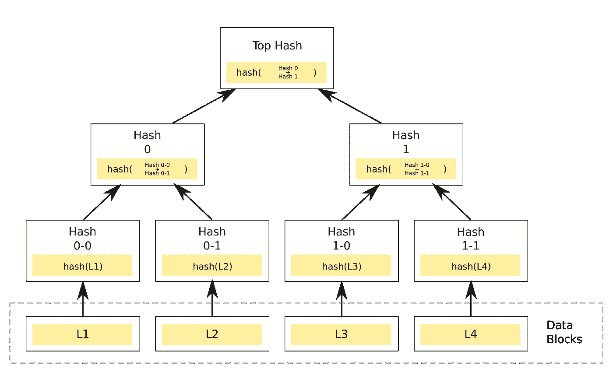

# Merkle 树:分布式软件的主干

> 原文：<https://medium.com/coinmonks/merkle-trees-the-backbone-of-distributed-software-4fa0805132c6?source=collection_archive---------3----------------------->

我知道这听起来很复杂，但请耐心听我说，这是值得的。

Merkle 树是一种在分布式场景中非常有用的数据结构，因为它允许您安全地验证数据结构，而不必传输整个数据结构。

# 例子

Thes 用例近年来呈爆炸式增长:

*   分布式版本控制(Git/Mercurial)
*   比特流
*   写时复制文件系统(btrfs/ [ZFS](https://blogs.oracle.com/bonwick/zfs-end-to-end-data-integrity)
*   分布式 NoSQL 数据库(Cassandra、Riak、Dynamo)
*   分布式网络！( [IPFS](https://taravancil.com/blog/how-merkle-trees-enable-decentralized-web/)
*   密码(比特币，[以太坊](https://blog.ethereum.org/2015/11/15/merkling-in-ethereum/))

这些都使用 Merkle 树来保证数据的一致性。

# Merkle 结构

Merkle 树的结构“是这样一种树，其中每个叶节点用数据块的散列来标记，每个非叶节点用其子节点的标签的加密散列来标记”

Merkle 树的各个部分是分支(节点之间的线条)、节点和根(最顶端的节点)。

哈希 0–0 和 0–1 分别是数据块(数据区块)L1 和 L2 的哈希值。散列 0 是散列 0–0 和 0–1 的串联，依此类推。通过遍历这棵树，可以验证一个数据块确实存在！

我还是不明白，为什么要用它们？

# 为什么使用 Merkle 树？

近几年来 Merkle 树的使用激增，这一定有充分的理由。现在就来列举一下吧！

1.  它们允许您安全地验证数据结构！ZFS 利用这一点来确保存储的数据实际上与早期版本的数据一致。
2.  它们大大减少了证明数据一致性所需的数据量。比特币“轻客户端”只需要下载其区块链中每个块的块头，而不是整个块，以验证其完整性。这是它们被用于分布式应用的主要原因。
3.  它将数据的验证与数据本身分开。Cassandra DB 的反熵服务使用 Merkle 树来检测副本之间的数据不一致，因为他们不必跨副本发送数据本身进行验证，只需哈希数据即可。

# 有哪几种证明？

有两种 Merkle 校样，允许您以不同的方式验证 Merkle 数据。

*   这种证明可以让你验证一个单独的块确实存在于树中。
*   `Consistency Proof`:这种证明只适用于只追加 Merkle 树。它允许您验证树的早期版本是否与树的较新版本一致，它们的顺序是否相同，以及所有新记录是否在所有旧记录之后。

关于这些证明的具体实现的更多信息，你可以参考[这篇博文](https://www.codeproject.com/Articles/1176140/Understanding-Merkle-Trees-Why-use-them-who-uses-t#WhoUsesMerkleTrees2)。

希望您现在能更好地理解分布式应用程序中 Merkle 树的用例。尽情享受吧！

> [在您的收件箱中直接获得最佳软件交易](https://coincodecap.com/?utm_source=coinmonks)

—

[https://en.wikipedia.org/wiki/Merkle_tree](https://en.wikipedia.org/wiki/Merkle_tree)