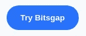
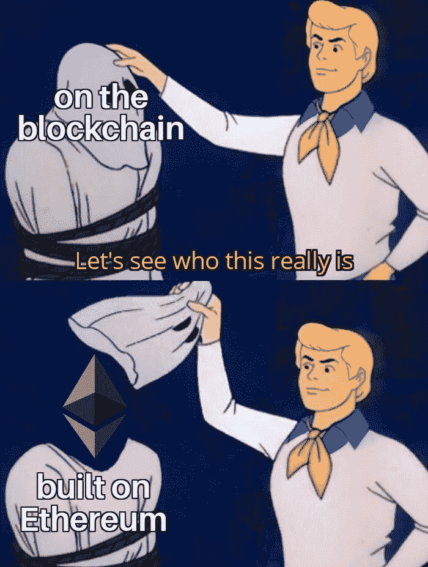
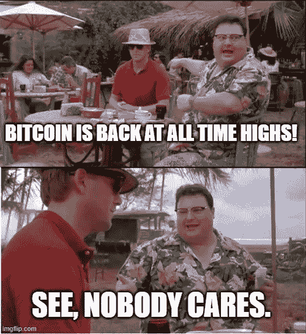
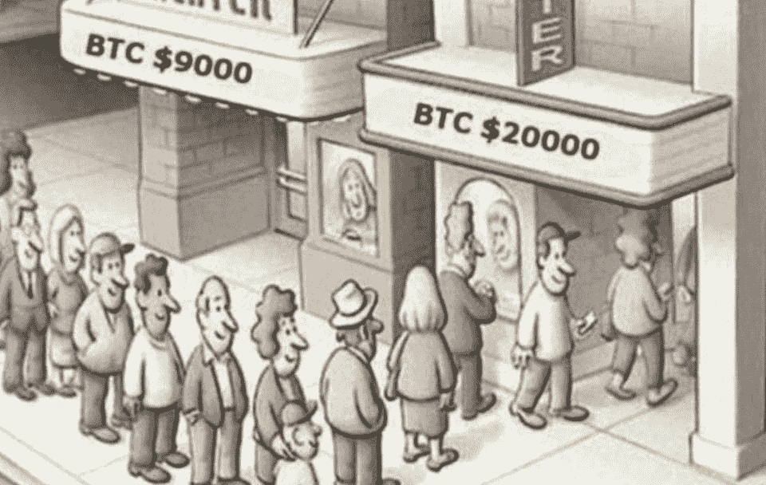

# 圣诞快乐🎄/ Ripple 被 SEC 起诉/比特币基地申请 IPO

> 原文：<https://medium.com/coinmonks/merry-christmas-ripple-sued-by-sec-coinbase-filed-for-ipo-3b96452fc7e5?source=collection_archive---------3----------------------->

[Source](https://www.reddit.com/r/Bitcoin/comments/gabq18/fucking_legend/)

## 美国政府正瞄准加密货币，以扩大其金融监控的范围

*   比特币基地[周四宣布](https://blog.coinbase.com/coinbase-announces-confidential-submission-of-draft-registration-statement-b140a9dfc9f5)已经秘密申请公开募股，成为一系列高调创业公司中最新一家寻求在 2020 年进行 IPO 的公司。
*   美国证券交易委员会(sec)指控 Ripple Inc .出售一种名为“XRP”的类似比特币的数字资产违反了投资者保护法，ripple Inc .表示将为自己辩护。
*   周五，财政部金融犯罪执法网络(FinCEN)宣布了一项[提议的法规](https://public-inspection.federalregister.gov/2020-28437.pdf)，该法规将要求货币服务企业(例如，包括加密货币交易所)收集使用自有加密货币钱包或外汇与客户交易的人的身份数据。

## [Bitsgap](https://bitsgap.com/?ref=2cb1231-3)

尝试 Bitsgap、专业交易工具和网格机器人来改善你的交易。阅读我们的 [Bitsgap 评论](/coinmonks/bitsgap-review-a-crypto-trading-bot-that-makes-easy-money-a5d88a336df2)。

> *查看我们的* [*最佳加密交易机器人*](/coinmonks/whats-the-best-crypto-trading-bot-in-2020-top-8-bitcoin-trading-bot-c16adeb13317) *列表。*

## 最新消息📰

*   涟漪为了[面对 SEC 关于 XRP 加密货币的诉讼](https://www.wsj.com/articles/ripple-to-face-sec-suit-over-xrp-cryptocurrency-11608598800)
*   加密货币交易报告的[午夜规则](https://www.coincenter.org/a-midnight-rule-for-cryptocurrency-transaction-reports/)
*   [MSFT & EY](/coinmonks/coinbases-s-1-journey-germany-legalizes-digital-securities-msft-ey-expanding-blockchain-96171fdccba6) 拓展区块链游戏平台
*   美国政府正在瞄准加密货币，以扩大其金融监控的范围
*   德国通过新法案引入全电子证券
*   CFTC 发布[数字资产初级读本](https://www.cftc.gov/PressRoom/PressReleases/8336-20)
*   MicroStrategy [宣布](https://www.microstrategy.com/en/company/company-videos/microstrategy-announces-over-1b-in-total-bitcoin-purchases-in-2020)2020 年比特币总购买量将超过 100 亿 1B
*   北海巨妖将于 2021 年[推出](https://blog.kraken.com/post/7225/a-need-for-speed-kraken-to-launch-bitcoin-lightning-%e2%9a%a1%ef%b8%8f-integration-in-2021/)比特币闪电整合
*   重大数据被黑，用户受到威胁[法律诉讼](https://cointelegraph.com/news/ledger-users-threaten-legal-action-after-hacker-dumps-personal-data)后，莱杰不会[赔偿](https://decrypt.co/52215/ledger-wont-reimburse-users-after-major-data-hack)用户
*   复合的[新区块链](https://www.coindesk.com/compounds-new-blockchain-readies-defi-for-central-bank-digital-currencies)为中央银行数字货币做好准备
*   丝绸之路的乌布里切特被特朗普考虑赦免
*   CME 集团[宣布](https://www.theblockcrypto.com/linked/88028/cme-group-announces-ethereum-futures)以太坊期货产品
*   图网[推出](https://thegraph.com/blog/the-graph-network-launches-mainnet)其主网
*   Exmo 加密交易所[遭遇](https://cointelegraph.com/news/exmo-crypto-exchange-suffers-hack-halts-all-withdrawals)黑客攻击，停止所有提款
*   为 PayPal 加密服务提供支持的 Paxos 公司[融资 1 . 42 亿美元](https://www.coindesk.com/paxos-raises-142m-series-c-following-paypal-deal-occ-bank-charter-application)
*   快速贷款攻击者[从 warp finance 抽走](https://thedefiant.io/flash-loan-attacker-drains-8m-from-warp-finance/)800 万美元
*   Tornado cash to [通过破损令牌分散](https://thedefiant.io/tornado-cash-to-decentralize-governance-via-torn-token/)治理
*   比特币基地[宣布](https://fortune.com/2020/12/17/coinbase-ipo-cryptocurrency-initial-public-offering-stock/)首次公开募股，这是密码产业的一个里程碑
*   周末，一件价值 350 万美元的加密艺术品在 T4 被售出

> *报税季即将来临，使用最好的* [***加密报税软件***](/coinmonks/best-crypto-tax-tool-for-my-money-72d4b430816b) *来申报你的加密报税吧。*

[Source](https://twitter.com/ChazSchmidt/status/1339412967872454656)

> BlockFi 首次推出加密奖励信用卡。在日常购物中获得 1.5%的比特币奖励。[现在加入等候名单](http://blog.coincodecap.com/go/blockfi)。

## 好的读物📑

*   [智人|抗脆弱性](/coinmonks/sapiens-antifragile-a-brief-history-of-money-bitcoins-antifragility-14d2edc489bc):货币简史&比特币的抗脆弱性
*   比特币[绳子](/coinmonks/the-bitcoin-rope-f294f353c3b9)
*   [加密货币的市盈率](/coinmonks/p-e-ratio-for-cryptocurrencies-63dad08d26fc)
*   我们的网络:覆盖面[图](https://ournetwork.substack.com/p/our-network-issue-51)和链环
*   阅读 [NXM 黑掉](/@hugh_karp/nxm-hack-update-72c5c017b48)的完整故事
*   对[自我主权](/coinmonks/attack-on-self-sovereignty-dda9d8323f6d)的攻击？
*   比特币价格[温度](/coinmonks/bitcoin-price-temperature-bands-d17695e164ea)(波段)
*   尼日利亚人超越法定货币
*   为什么我在收集黑色密码艺术
*   比特币[隐含波动率](/coinmonks/bitcoin-implied-volatility-surface-from-deribit-70fba845102a)表面来自 Deribit
*   密码市场的六个[部分](/coinmonks/the-six-segments-of-the-cryptomarket-c9e97f950954)
*   如何[确保您运行的是](/mycrypto/how-to-ensure-youre-running-the-legitimate-version-of-metamask-5fcd8ab32b96)合法版本的元掩码

> *买一个* [***硬件钱包***](/coinmonks/the-best-cryptocurrency-hardware-wallets-of-2020-e28b1c124069) *和* [*保护你的加密货币*](/coinmonks/how-to-prevent-cryptocurrency-hacking-and-theft-from-your-wallet-65c8ff767766) *。*

[Source](https://www.reddit.com/r/Bitcoin/comments/kgbzw5/things_are_just_getting_started/)

## 开发商

*   使用 GraphQL APIs 查询[区块链汇合点](https://bitquery.io/blog/conflux-blockchain-api)
*   Solidity 0.8.0 发布[公告](https://blog.soliditylang.org/2020/12/16/solidity-v0.8.0-release-announcement/)
*   学习如何用 [IPFS 和皮纳塔](/pinata/how-to-build-erc-721-nfts-with-ipfs-e76a21d8f914)建造 ERC-721 NFTs
*   建筑[以分散](https://blog.ceramic.network/building-with-decentralized-identity-on-idx-and-ceramic/)的身份出现在 IDX 和陶瓷上
*   为什么[以太坊钥匙](https://blog.space.storage/posts/why-ethereum-keys-are-the-core-of-space-accounts)是空间账户的核心
*   NodeJS 中的 IPFS 文件[加密](https://dev.to/codr/ipfs-file-encryption-in-nodejs-1ijd)
*   [将应用](/coinmonks/guide-to-deploying-applications-to-akash-decloud-b35dc97e5ca4)部署到 Akash DeCloud 的指南
*   坚实基础— [参考类型](/coinmonks/solidity-fundamentals-e4e4660e16c8)
*   [实时交易](https://www.blocknative.com/blog/mintable-interview)监控如何改变 NFT 体验
*   建立你的[分散的](https://decentralise.substack.com/p/snapshot-profiles-build-your-decentralised)治理声誉

> 想成为一名以太网和 **Web3 开发者**？[从这里开始](http://blog.coincodecap.com/go/learn)。

## 多方面的

*   货币[搬运工](https://money-movers.info/)
*   [铬](https://chromeisbad.com/)不好
*   设计你的圣诞毛衣 NFT

## 播客和视频💽

*   所有的加密方法都可以让游戏更有趣
*   深入挖掘[流动性](https://epicenter.tv/episodes/370)
*   来自外面的密码

[Source](https://www.reddit.com/r/CryptoCurrency/comments/kfwy6g/this_is_all_too_real/)

## 黑客马拉松、活动和峰会

*   [Inout 7.0](https://portis.medium.com/inout-7-0-virtual-hackathon-challenge-122591bb55e8) 虚拟黑客马拉松挑战赛
*   分散的[网络西雅图](https://www.meetup.com/ProtoSchool-Seattle-Learn-to-Make-the-Decentralized-Web/events/274586198/)在 12 月 17 日相遇
*   ETHGlobal 的[市场制作](https://marketmake.ethglobal.co/)黑客马拉松

## 加密交易和折扣🔖

*   注册参加[**by bit**](/coinmonks/bybit-exchange-review-dbd570019b71)exchange，赢取高达 625 美元的奖金。
*   当你加入[***mud rex***](https://mudrex.com/signup?referral_code=COIN3566)***时，你可以获得 25 美元的积分来支付费用。***
*   试用 [**Coinrule**](https://webapp.coinrule.io/coupon/coinmonks-7-25-3-e2bf6c60e795407381edf98d1a174ac2?fp_ref=coincodecap) ，使用 [**此链接**](https://webapp.coinrule.io/coupon/coinmonks-7-25-3-e2bf6c60e795407381edf98d1a174ac2?fp_ref=coincodecap) 可获得 7 天免费试用和 3 个月 25%优惠。

## 产品评论和其他加密软件📙

*   [加密税务软件](/coinmonks/best-crypto-tax-tool-for-my-money-72d4b430816b)
*   [2021 年最佳加密交易机器人](/coinmonks/crypto-trading-bot-c2ffce8acb2a)
*   2020 年排名前五的[密码借贷平台](https://blog.coincodecap.com/top-5-crypto-lending-platforms)
*   [莱杰 vs 特雷佐](/coinmonks/ledger-nano-s-vs-x-battery-hardware-price-storage-59a6663fe3b0)
*   [区块链审查](/coinmonks/blockfi-review-53096053c097)
*   [AAX 交易所评论](/coinmonks/aax-exchange-review-2021-67c5ea09330c)
*   [bits gap vs 3 commas vs quad ency](/coinmonks/bitsgap-vs-3commas-vs-quadency-must-read-2021-cdc1a40cf31d)
*   [PrimeXBT 审查](/coinmonks/primexbt-review-88e0815be858) —杠杆交易、费用和交易
*   [FTX 密码交易所评论](/coinmonks/ftx-crypto-exchange-review-53664ac1198f)
*   密码[复制交易](/coinmonks/top-10-crypto-copy-trading-platforms-for-beginners-d0c37c7d698c)机器人
*   [德里比特评论](/coinmonks/deribit-review-options-fees-apis-and-testnet-2ca16c4bbdb2) —选项、费用、API 和测试网
*   你的密码可以获得 12%的利息

想让我们展示你的产品吗？请通过 [Twitter @coinmonks](https://twitter.com/coinmonks) 联系我们

## 比特币 2 万美元

## 乔布斯👷

*   [DevOps 工程师](https://remoteok.io/remote-jobs/100451-remote-devops-engineer-district0x)，0x 区，远程
*   [生态系统开发者](https://jobs.lever.co/3box/ec1093c5-ed31-483c-b1b3-49b07bd0bd2e)，3 盒，远程
*   [位于 mStable 的 BD](https://angel.co/company/mstable/jobs/1096364-business-development-manager)
*   [动作设计师](https://cryptocurrencyjobs.co/design/kraken-digital-asset-exchange-motion-designer/) —北海巨妖
*   [全栈工程师](https://cryptocurrencyjobs.co/engineering/zapper-full-stack-engineer/) —扎珀
*   高级前端工程师 —乌玛
*   SigmaPrime，[区块链安全工程师](https://blog.sigmaprime.io/blockchain-security-engineer.html)
*   0x 寻找各种类型的[开发人员](https://0x.org/about/jobs)和一名[抹茶营销经理](https://boards.greenhouse.io/0x/jobs/4923909002)
*   Nexus Mutual: [在欧洲时区经历了稳健发展](https://angel.co/company/nexus-mutual-1/jobs/967538-smart-contract-engineer)

## 在 Coinmonks 上发布

如果你喜欢在 crypto/区块链空间上写教育文章，并且想在 Coinmonks 出版物上发表。只需发邮件给我***【gaurav@coincodecap.com】****或者 DM 我**[***推特***](https://twitter.com/coinmonks)*