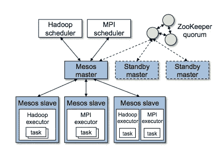
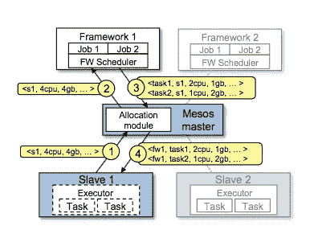

# Mesos:用于不同框架的集群调度器

> 原文：<https://medium.com/coinmonks/mesos-a-cluster-scheduler-for-diverse-frameworks-131ffbd082ca?source=collection_archive---------1----------------------->

## 介绍

在处理大型计算负载或数据集的公司或研究小组中，有许多应用程序使用不同类型的应用程序框架运行，如 map-reduce、spark、Dyrad、Pregel。没有一个单一的框架是万能的。面对如此多样的工作负载，不同的框架能够高效地共享集群资源是非常重要的。一种传统方法是通过对集群进行静态分区或为每个框架分配一定数量的虚拟机来预留容量。这种分配不是最佳的，会导致群集资源过度使用或利用不足。

为了提供集群资源的有效利用， [Mesos](https://amplab.cs.berkeley.edu/wp-content/uploads/2011/06/Mesos-A-Platform-for-Fine-Grained-Resource-Sharing-in-the-Data-Center.pdf) 提供了一个细粒度的资源调度器，它监视当前的集群资源使用情况，然后在资源可用时向这些框架提供资源。Mesos 是高度可扩展的，因为它可以处理集群中成千上万的节点和任务及其资源。此外，它还具有容错能力，因为关键应用程序依赖于它。Mesos 被设计成能够支持多种不同的框架，比如 map-reduce、MPI、spark。

## 设计方法

这种集群调度器的一种方法是拥有一个集中式调度器，它获取所有框架的资源需求，然后提出一个跨所有框架的最佳策略。虽然这看起来很有希望，但这也是一个很难解决的问题，它会影响这种调度程序的可伸缩性。另一个问题是，新的框架一直在发展，还不清楚是否可以建立一个考虑到未来需求的最佳调度程序。

相反，Mesos 使用一种分散的调度方法，该方法使用“资源提供”技术。Mesos 调度器根据一些高层组织策略决定它可以向给定的框架分发多少不同类型的资源。框架可以决定接受或拒绝所提供的资源。如果框架接受了这个提议，那么它可以使用这些资源安排自己的任务。虽然这可能不会导致最佳的调度方法，但它可以很好地扩展，并且在考虑数据局部性等因素的情况下执行得非常好。这也允许框架构建者构建专门的框架和调度器，这些框架和调度器能够很好地处理这些工作负载。

最初构建 Mesos 的经典工作负载由许多小任务和一些长任务组成。工作时间的中位数大约为 30 秒。传统上，facebook 和 yahoo 的这种集群用于加载日志数据，并在其上运行交互式查询或运行一些地图缩减任务。

## 高层建筑

Mesos master making resource offers and Framework scheduler using that to deploy tasks on nodes on the cluster where framework executors and mesos slave runs

Mesos 由运行在集群中每个节点上的从属进程组成。有一个 mesos 主进程连接到这些从进程，监视本地资源的使用。每个框架都有自己的调度器和执行器。执行程序运行在从程序运行的相同节点上。框架调度器决定哪些任务需要在哪些节点上运行，然后将它交给主节点。然后，主设备可以使用从设备和执行器在框架调度程序分配的节点上运行作业。第一个资源提供依赖于组织策略，例如资源应该被公平地分配还是使用一些其他基于优先级的机制。这些不同的策略可以通过使用分配模块插入到 Mesos master 中。

Resource offer sequence from slave->AllocationModule->Framework->Master->slave

在上图中，Mesos-slave1 注意到节点 1 有 4Cpus 和 4 GB 内存可用。它通知主设备。Master(基于组织策略)向 framework1 提供所有这些资源。框架当前只有 2 个任务需要调度:task1 需要 2 CPU 和 1GB 内存，而 task2 需要 1cpu 和 2GB 内存。框架通知主设备这一点。然后，主设备可以将这些资源分配给从设备 1，从设备 1 保留这些资源并通知框架执行器，然后框架执行器可以启动框架 1 感兴趣的两个任务。还有 1 个 CPU 和 1 GB 剩余空间，主服务器可以将这些空间提供给 framework2 或任何其他可能从 slave2 获得的资源。

仍然存在的问题是框架如何利用数据局部性。这是一个问题，因为主节点不知道每个框架需要什么来实现最佳局部性。这是通过让框架调度器拒绝提供资源来实现的，如果它认为这不是最佳的或者严重妨碍了局部性。框架还使用[延迟调度](https://cs.stanford.edu/~matei/papers/2010/eurosys_delay_scheduling.pdf)来等待节点变得可用，这可以实现接近最佳的局部性。

资源提供需要是可扩展的。这是通过在主机上实现过滤器来实现的。框架可以指定过滤器，比如“只给我某个节点列表中的节点，忽略没有 x 的节点”。此外，对于主设备的扩展，主设备激励框架快速响应它的提议:或者通过撤销花费很长时间由框架确认的提议，或者通过将未确认的资源提议计入框架的使用。

## 分配模块和撤销

如前所述，分配模块是主流程中的一个可插拔实体。因此组织可以用一种帮助他们的方式来引导它。两个默认选择是公平调度和严格优先级。

有了延迟调度的帮助，大部分短任务都不用等很久。他们一般会在等待一小段时间后获得资源。长时间运行的任务或错误代码可能会阻塞短时间运行的任务。在这种情况下，主进程可以通过给它们一些宽限期来终止长时间运行的进程。宽限期通过在进程再次启动时设置恢复模式来帮助长时间运行(无错误)的进程。

一般来说，短期任务不会受到撤销的干扰。此外，每个框架都可以要求一些有保证的分配。只要框架处于这种分配下，它就不会有任何任务被终止。如果框架高于分配限制，那么任何任务都可能被终止。这种简单化的方案可以通过给框架的任务分配优先级来改进，并且较低优先级的任务可以被杀死，直到使用率下降到低于分配限制。

## Mesos 主容错

Mesos 奴隶已经分布，死亡时需要本地恢复机制。框架也会得到从机和执行器失败的通知。

失败的主要中心点是主控者。主人使用 zookeeper 进行容错。一旦 zookeeper 注意到主设备故障，就向 zookeeper 注册一个热备用设备(和其他备用主设备)来接管。此外，主机被设计为在软状态下运行，即它可以使用来自从机和框架调度程序的周期性消息来重建其状态。

类似地，框架调度器也会死亡。因此框架调度程序可以注册它们的故障转移调度程序，以便操作可以无缝地继续。但是框架需要找到一种方法在它们之间共享状态。

## 定义和衡量 Mesos 的有效性

作者讨论了 Mesos 可能需要调度什么样的工作负载，以及如何衡量这些情况下调度的有效性。作者考虑的不同类型的工作负载是:可以弹性扩展或缩减的工作负载。工作负载可以按持续时间划分，即短期、中期和长期。另一种类型的工作负载可能需要等待一定数量的资源可用。

在存在此类工作负载的情况下，Mesos 测量以下指标:

1.  框架加速时间:框架完成分配所需的时间
2.  作业完成时间:作业完成需要多长时间
3.  集群利用率:给定集群的占用率与空闲率之比。

这篇论文在一个表格中总结了他们在另一篇论文中的工作，解释了时间安排对这些数字的影响。虽然这对于同类任务来说相当有效，但是对于长任务和短任务来说还是有问题的。你不想让长任务饿死短任务。这可以通过对给定群集中长任务的百分比利用率设置上限来实现，例如，分配给大任务的资源不超过 50%。Master 可以为任务撤销设置不同的超时，并确保它激励短任务。

## 框架激励

如前所述，Mesos 让框架可以控制它们的调度需求。这意味着构建 Mesos 非常重要，这样可以激励框架的高利用率。对于该框架想要启动的任务，这里有一些内置于 Mesos 中的激励结构。

1.  短期任务:这是有激励的，因为短期任务会很快找到资源，而且如果那些任务被杀死，恢复成本也会更低。
2.  缺乏有保证的分配:这确保了框架可以在任何一个资源变得可用时就开始使用资源，而不是所有的资源。
3.  弹性资源使用:这是有保证的，因为当集群处于压力之下时，框架可以缩小规模，而不会导致整个作业被终止；当资源可用时，框架可以通过抓取资源来扩大规模。
4.  可用资源:只有可用资源应该被框架(例如 GPU)接受，否则它会占用计入集群使用的资源，但实际上并没有使用。这会影响到未来对自身的资源分配。

## 什么时候分布式调度是最优的？

正如我们所见，Mesos 不是一个集中式调度器。当任务是异构的时，Mesos 可能无法像知道所有不同任务的集中式调度器那样有效地进行装箱。这将导致调度程序的不完整使用。也有一些大任务饥饿的机会，因为小资源一释放，小任务就占据了那个槽。这可以通过设置 Mesos 向框架提供的最小大小来防止，并确保在提供之前有一定大小的资源集可用。就框架调度器的复杂性而言，框架无论如何都需要知道它们的需求，然后将其表达给集中式调度器或使用由分散式调度器提供的资源——事实上，许多调度器无法预测任务时间，需要对调度器进行在线调整。

## 结论

Mesos 对于集群中的细粒度调度非常有用，因此不同类型的框架可以高效地访问集群的资源。框架可以根据集群的利用率进行伸缩，并使用主机提供的资源来优化任务调度。我认为 Mesos 的分布式调度方法非常新颖。

> [在您的收件箱中直接获得最佳软件交易](https://coincodecap.com/?utm_source=coinmonks)

