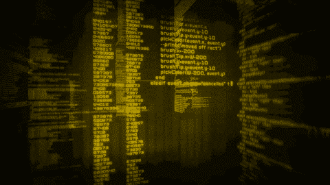
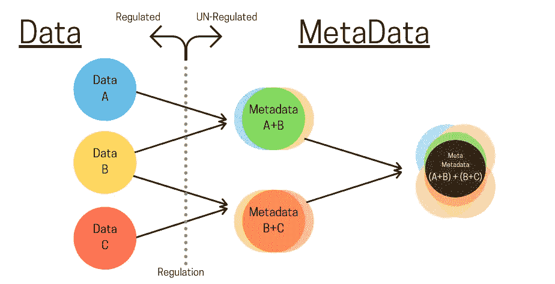
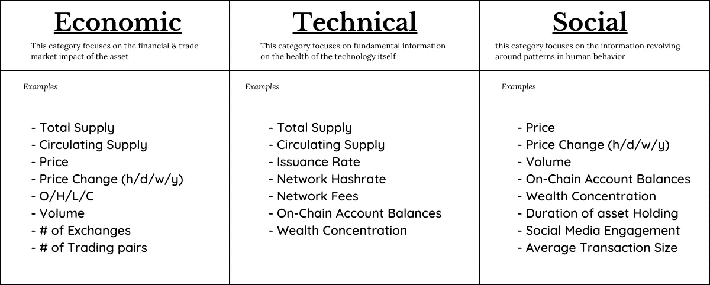
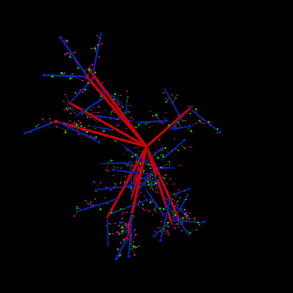
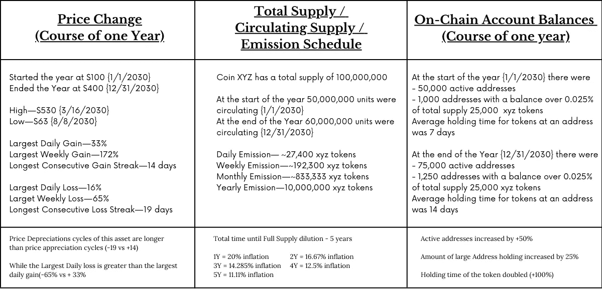

# 加密货币时代的元数据

> 原文：<https://medium.com/coinmonks/metadata-in-the-age-of-cryptocurrency-105b16e5983?source=collection_archive---------5----------------------->

## 没有老大哥压力的经济

数字时代的数据被誉为数字石油。

随着每天产生的数据超过过去 20 年产生的总和(再加上计算和全球连接方面的技术进步)，数据已经成为一种具有内在价值且易于获取的商品。数据如此有价值、可访问、丰富，已经成为大佬们关注的焦点*(大技术、大数据、大政府)*

数据，就其本质而言，是非常广泛的；涵盖了从看似无关的到极其敏感的一切。天气是数据，产品库存供应是数据，你的生命体征(心率、血压)是数据。在所有数据中，最有价值的是 PII(个人身份信息)；专属于个人的信息。

人类的主要法律之一是隐私权，随着数字通信的超高连接性，这项法律被一次又一次地违反。



世界范围内的数据泄露已经引起了轩然大波，数十亿人的信息隐私权受到了侵犯&违反者几乎没有被追究责任(如果有的话)。

虽然个人/数据所有者正在努力保护他们的隐私，但大型科技公司正在不惜一切代价获取尽可能多的数据。为了应对数据竞赛，各国政府推出了各种法规，如欧洲的 GDPR 和美国的 SHIELD + CCPA，以保护个人隐私数据(也称为 PII[个人身份信息])免遭误用和滥用。

但是，数据竞赛才刚刚开始。

新的模型已经适应了数据的收集、存储和消化。这些是使用元数据构建的模型。

元数据是关于数据的数据。*数据*是受到监管部门审查的直接信息& ***元*** *数据* 是关于原始数据的抽象信息(不受监管)。



每当一个人获得两点信息并基于这两点推断出一个结果时，这个结果就被归类为元数据。

# 加密元数据

加密货币与生俱来的奇妙特性之一是它是开放的。加密资产所基于的分布式账本技术(区块链)是透明的，从某种意义上说，它允许在链上进行的所有活动都在极其精细的级别上被审计。从开盘价和收盘价到交易量，到连锁账户余额，到排放计划等等；由于其全球金融存在，加密货币具有丰富的数据。

crypto 中的数据可以分为三大类:经济、技术和社会。这三个类别有重叠的方面，但是，它们在各自领域的应用允许相同的数据点用于不同形式的演绎。



上表绝不是完整的或详尽的；有太多的信息需要使用，把它们都列出来会分散我们对谈话的焦点和目的的注意力；当对加密货币创建的元数据进行建模时，可以观察到人类互动的深层存在行为规律→进而允许个人获利&社会以指数速度进步。

为了充分理解和欣赏开放数据的延展性及其含义，我们可以模拟加密数据的消化。在这里，我们随机抽取 5 个数据点，分别检查每个数据点，并根据每个结果的总和撰写一篇论文。



```
**Simulation parameters:
Crypto Asset: XYZ*****Data point 1:*** Price Change (course of one Year) ***Data point 2:*** Total Supply / Circulating Supply / Emission ***Data point 3:*** On-Chain Balances / Duration of Holding (course of one year)**1) Price Change (over the course of one Year)**Coin XYZ started the year at $100 {1/1/2030}
Ended the Year at $400 {12/31/2030}
High — $530 {3/16/2030}
Low — $63 {8/8/2030}Largest Daily Gain — 33%
Largest Weekly Gain — 172%
Longest Consecutive Gain Streak — 14 daysLargest Daily Loss — 16%
Larget Weekly Loss — 65%
Longest Consecutive Loss Streak — 19 daysAccording to Price Action we draw the following possible conclusion:
Price Depreciations cycles of this asset are longer than price appreciation cycles.
While the Largest Daily loss is greater than the largest daily gain, signals huge short term volatility. **2) Total Supply / Circulating Supply / Emission Schedule**Coin XYZ has a total supply of 100,000,000
At the start of the year 50,000,000 units were circulating {1/1/2030}
At the end of the Year 60,000,000 units were circulating {12/31/2030}Daily Emission— ~27,400 xyz tokens
Weekly Emission — ~192,300 xyz tokens
Monthly Emission — ~833,333 xyz tokens
Yearly Emission — 10,000,000 xyz tokens**3) On-Chain Account Balances (over the course of one year)**At the start of the year {1/1/2030} there were
- 50,000 active addresses
- 1,000 addresses with a balance over 0.025% of total supply 25,000  xyz tokens
The average holding time for tokens at an address was 7 daysAt the end of the Year {12/31/2030} there were
- 75,000 active addresses
- 1,250 addresses with a balance over 0.025% of total supply 25,000 xyz tokens
Average holding time for tokens at an address was 14 days
```



任何一个单独的数据点本身都不能为宏观人类行为的发展提供足够可靠的信息；然而，当我们综合数据点的数据时，奇迹就开始发生了。

```
Starting point:
50,000,000 supply @ $100 @ 50,000 addresses 
$5,000,000,000mcap - average address balance 100,000End Point:
60,000,000 supply @ $300 @ 75,000 addresses
$18,000,000,000mcap - average address balance 240,000Over the course of 365 days:
 — Unit Price changed +300% (+$300) 
 — Mcap change +260% (+$13,000,000,000)
— Supply increase +20% (+10,000,000)
 — New Addresses +50% (25,000)
```

这意味着在 1000 万代币的供应中，130 亿美元的价值随着通货膨胀而进入。25，000 个新地址/人对一个项目充满信心，足以投入大笔资金。

第二年可以保证再次增加 1000 万的供给(16.67%)；如果在下一年创造了 25，000 个新地址& 13，000，000，000 美元的价值涌入该项目，MCAP 将变成 310 亿美元，增长 72.2% &单价将上升到 442 美元(+47.33%)。

**利润论题:**
在这个模型中，如果任何数据点出现根本性的背离(比如新地址的激增或价格的暴跌)，就预示着积极；同样，如果价格在短时间内大幅上涨(今年 3 个月内价格上涨 100%)，最小化风险敞口将保护资本。

**存在论:**
【不顾极端通胀目标，130 亿美元的努力已经投入到这个项目中。有更多的人参与进来，人们现在为这种资产支付更多的钱，持有这种资产的时间更长。似乎更富有的人发现这个项目的风险和回报是值得的。也许相邻的系统会崩溃。

与封闭的情况不同，开放的加密数据将隐私/假名融入到数据结构中，不会遭受中央系统中经常出现的违规行为。个人和政府都有获取信息的权利。

加密货币是大数据领域绝对的范式转变。

有新的规则、新的玩家和新的想法。

不存在单个执政企业泄露信息。没有政府批准活动。

让我们用我们的数据，按照我们的方式去建设我们的未来。


## 另外，阅读

*   最好的[密码交易机器人](/coinmonks/crypto-trading-bot-c2ffce8acb2a)
*   [密码本交易平台](/coinmonks/top-10-crypto-copy-trading-platforms-for-beginners-d0c37c7d698c)
*   最好的[加密税务软件](/coinmonks/best-crypto-tax-tool-for-my-money-72d4b430816b)
*   [最佳加密交易平台](/coinmonks/the-best-crypto-trading-platforms-in-2020-the-definitive-guide-updated-c72f8b874555)
*   最佳[加密贷款平台](/coinmonks/top-5-crypto-lending-platforms-in-2020-that-you-need-to-know-a1b675cec3fa)
*   [最佳区块链分析工具](https://bitquery.io/blog/best-blockchain-analysis-tools-and-software)
*   [加密套利](/coinmonks/crypto-arbitrage-guide-how-to-make-money-as-a-beginner-62bfe5c868f6)指南:新手如何赚钱
*   最佳[加密制图工具](/coinmonks/what-are-the-best-charting-platforms-for-cryptocurrency-trading-85aade584d80)
*   [莱杰 vs 特雷佐](/coinmonks/ledger-vs-trezor-best-hardware-wallet-to-secure-cryptocurrency-22c7a3fd391e)
*   了解比特币最好的[书籍有哪些？](/coinmonks/what-are-the-best-books-to-learn-bitcoin-409aeb9aff4b)
*   [3 商业评论](/coinmonks/3commas-review-an-excellent-crypto-trading-bot-2020-1313a58bec92)
*   [AAX 交易所评论](/coinmonks/aax-exchange-review-2021-67c5ea09330c) |推荐代码、交易费用、利弊
*   [Deribit 审查](/coinmonks/deribit-review-options-fees-apis-and-testnet-2ca16c4bbdb2) |选项、费用、API 和 Testnet
*   [FTX 密码交易所评论](/coinmonks/ftx-crypto-exchange-review-53664ac1198f)
*   [n 零审核](/coinmonks/ngrave-zero-review-c465cf8307fc)
*   [Bybit 交换审查](/coinmonks/bybit-exchange-review-dbd570019b71)
*   [3Commas vs Cryptohopper](/coinmonks/cryptohopper-vs-3commas-vs-shrimpy-a2c16095b8fe)
*   最好的比特币[硬件钱包](/coinmonks/the-best-cryptocurrency-hardware-wallets-of-2020-e28b1c124069?source=friends_link&sk=324dd9ff8556ab578d71e7ad7658ad7c)
*   最佳 [monero 钱包](https://blog.coincodecap.com/best-monero-wallets)
*   [莱杰 nano s vs x](https://blog.coincodecap.com/ledger-nano-s-vs-x)
*   [bits gap vs 3 commas vs quad ency](https://blog.coincodecap.com/bitsgap-3commas-quadency)
*   [莱杰纳米 S vs 特雷佐 1 vs 特雷佐 T vs 莱杰纳米 X](https://blog.coincodecap.com/ledger-nano-s-vs-trezor-one-ledger-nano-x-trezor-t)
*   [block fi vs Celsius](/coinmonks/blockfi-vs-celsius-vs-hodlnaut-8a1cc8c26630)vs Hodlnaut
*   Bitsgap 评论——一个轻松赚钱的加密交易机器人
*   为专业人士设计的加密交易机器人
*   [PrimeXBT 审查](/coinmonks/primexbt-review-88e0815be858) |杠杆交易、费用和交易
*   [埃利帕尔泰坦评论](/coinmonks/ellipal-titan-review-85e9071dd029)
*   [SecuX Stone 评论](https://blog.coincodecap.com/secux-stone-hardware-wallet-review)
*   [BlockFi 评论](/coinmonks/blockfi-review-53096053c097) |从您的密码中赚取高达 8.6%的利息

> [直接在您的收件箱中获得最佳软件交易](/coinmonks/newsletters/coinmonks)

[](https://medium.com/coinmonks/newsletters/coinmonks)