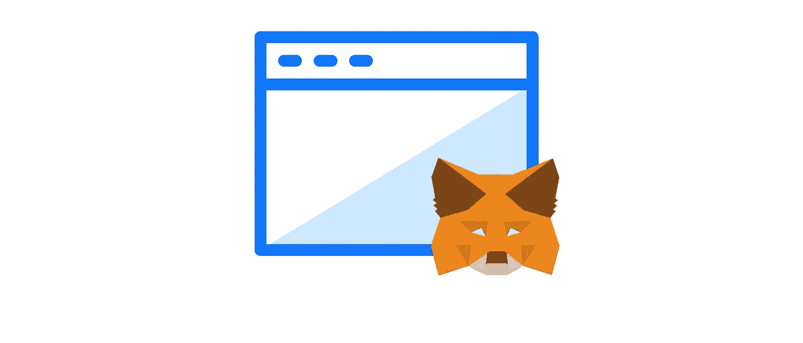
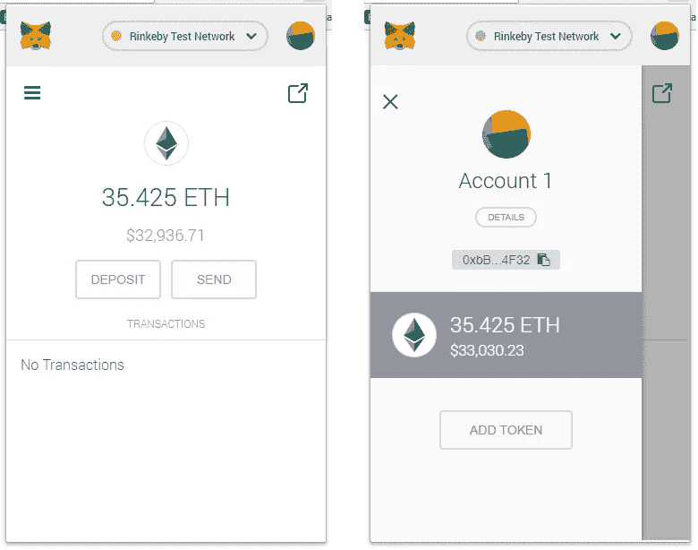
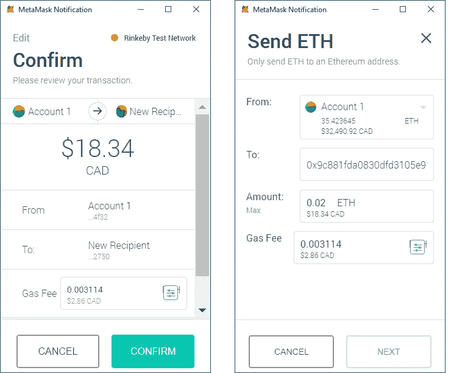

# 什么是元掩码，为什么 DApps 需要元掩码

> 原文：<https://medium.com/coinmonks/metamask-introduction-f89ac80bd30f?source=collection_archive---------2----------------------->

让我们从他们网站上的简单描述开始。

> 元掩码是一座桥梁，它允许你今天在浏览器中访问明天的分布式 web。它允许您在浏览器中运行以太坊 dApps，而无需运行完整的以太坊节点。

换句话说，要与以太坊区块链进行任何形式的互动，并尽可能地消除这一过程中的摩擦，你需要元蒙版。

Browser with Metamask talking with the ethereum blockchain

您也可以将 Metamask 视为一个**浏览器钱包**，其中包含您要转移到的任何基于以太坊的令牌。作为一个例子，这是 RinkeBy 网络上 35.425 ETH 的 UI，这不是真的钱，它是为了测试目的。通过点击左侧的汉堡按钮，您可以访问更多细节，如公钥和私钥。**一个小小的提醒，永远不要和任何人分享任何私人密钥，永远不要。**

Metamask wallet

现在让我们来揭穿分散式应用程序使用元掩码可以做什么样的事务。假设您正在浏览一个销售数字收藏品小猫的应用程序。你可以决定收养/购买一只可爱的小猫，因此你可以点击购买按钮。下面是一个示例窗口，元掩码突然弹出，意味着应用程序需要您的签名来批准涉及值的事务。本例中的金额为 0.02 ETH，有一笔 0.003114 ETH 的费用直接支付给将要执行该交易的矿商。Ethers 从“Account 1”钱包转移到“New Recipient”钱包，他将收到 0.02 ETH。单击“确认”按钮，即表示您同意该交易是合法的，并且您希望对其进行数字签名。祝贺您，交易现已发送，一名矿工将在大约 20 秒内将其纳入一个区块，这是交易结算的实际平均时间。

Basic Metamask transaction

这就是分散式应用程序如何与以太坊区块链进行价值交换和对话。

就是这样。
我的意思是，这只是 Metamask 真正力量的一小部分，但它公平地介绍了它可以实现的功能以及它在整个去中心化生态系统中的作用。

如果我做错了什么或者需要一些澄清，请随意写一个回复。

最好的