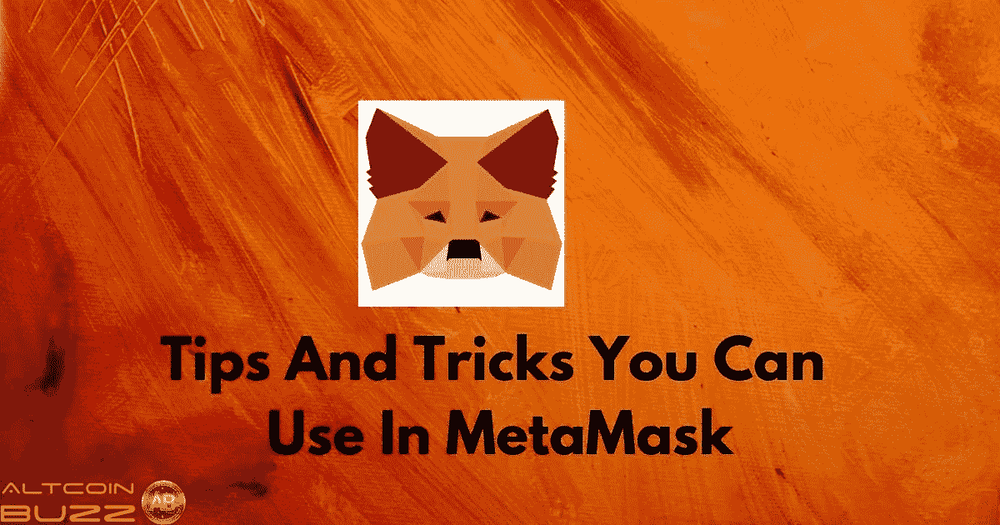
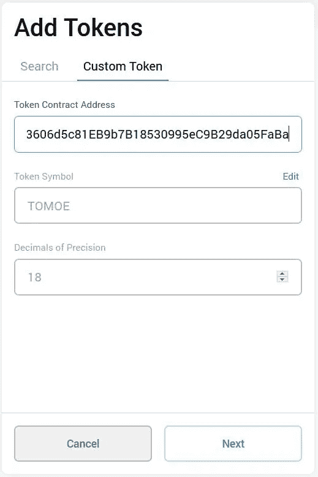
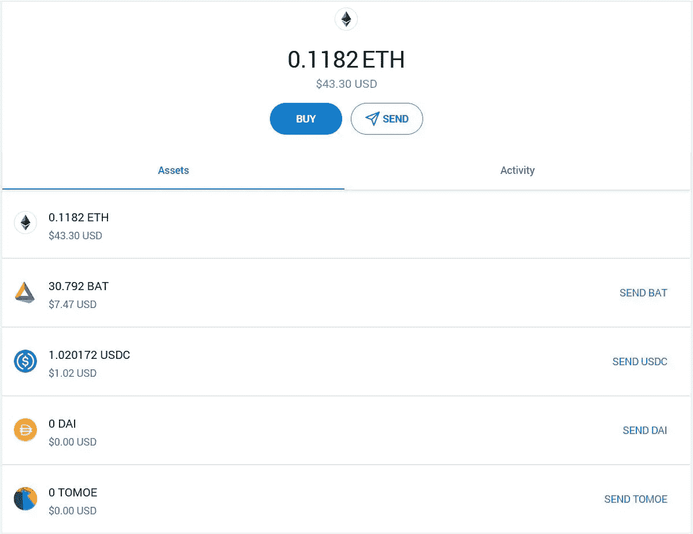
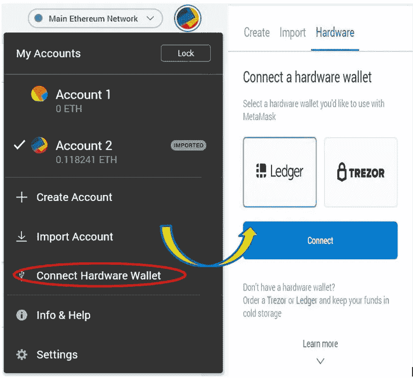
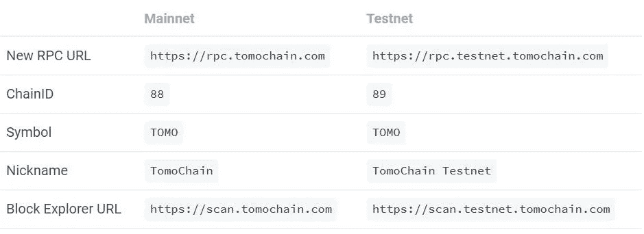
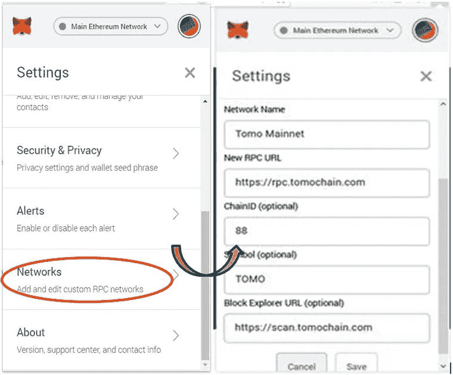
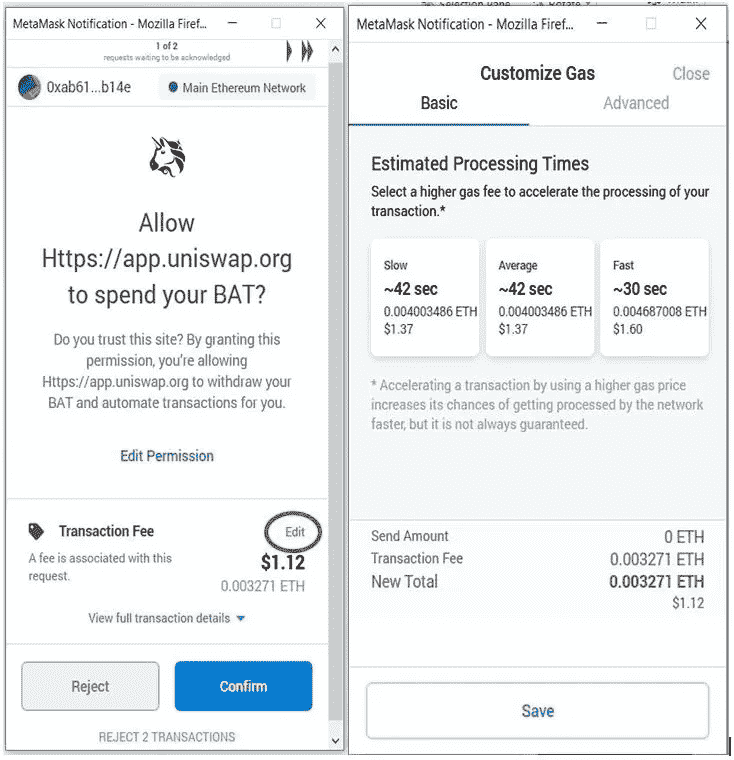
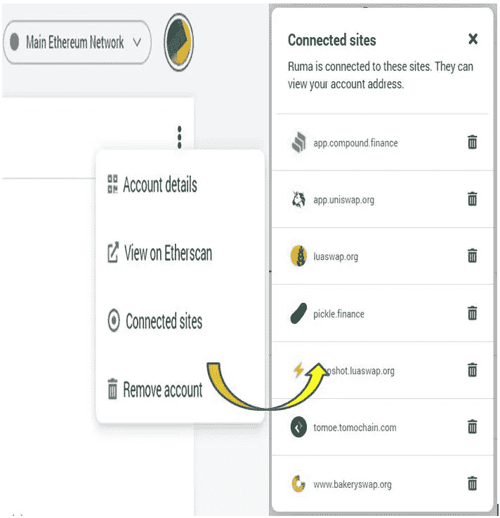

# 您可以使用的元掩码提示和技巧

> 原文：<https://medium.com/coinmonks/metamask-tips-and-tricks-you-can-use-8ff952655df5?source=collection_archive---------3----------------------->

## MetaMask 是一个浏览器插件，被用作以太坊钱包。在本文中，我们将分享一些你可以在 MetaMask 钱包上使用的重要技巧。

MetaMask 是最著名的浏览器扩展，它允许用户在不作为以太坊节点成为以太坊网络的一部分的情况下运行 dApps。

MetaMask 管理您的以太坊钱包。您可以在 MetaMask 钱包中存储 Ether 和其他 ERC20 令牌，并与分散式应用程序(dApps)进行交互。

除了允许用户轻松安全地访问资金，还有一些有用的元掩码提示和技巧可供用户使用:

**添加自定义令牌**

您可以通过提供令牌的**合同地址**来添加任何**自定义令牌**。你可以从[以太扫描](https://etherscan.io/)获得一个令牌合约地址。

**示例:**参见以下步骤添加 TOMOE 令牌。

填写以下详细信息:

*   合同地址:0x 05d 3606 D5 c 81 EB 9 b7b 18530995 EC 9 b 29 da 05 faba
*   令牌符号:TOMOE
*   小数:18

您现在可以在帐户中看到 TOMOE 令牌。

**连接硬件钱包**

您可以将您的分类帐或 Trezor 钱包与 [MetaMask](https://metamask.io/) 钱包连接。

**自定义网络**

一个最好的 MetaMask 提示和技巧是，你可以通过 MetaMask 连接不同的网络。

MetaMask 允许用户通过提供一些细节来设置自定义 RPC。

**示例:**您可以通过 MetaMask 按照以下步骤连接 TomoChain 网络。

选择**自定义 RPC** 选项。将打开**设置选项卡**，并要求您提供一些详细信息。

现在，您可以看到 Tomo 网络已添加到网络列表中。

**自定义燃气费**

您还可以通过**编辑选项卡**自定义燃气费，加快交易处理速度。

**连接的站点**

从连接的网站，您可以检查您最近使用的应用程序列表。此外，如果您尝试再次连接到这些应用程序， [MetaMask](https://www.altcoinbuzz.io/cryptocurrency-news/product-release/huge-metamask-users-can-swap-tokens-within-their-wallet/) 将不会要求您提供密码。

但是这个特性有它自己的缺点。如果有人进入了你的电脑，他们可以很容易地进入你的钱包。

**取消元掩码上的交易**

如果交易正在以太坊网络上等待确认，那么 MetaMask 允许用户取消交易。

要取消交易，用户需要增加取消窗口。这可以通过编辑交易费来实现。费用少了会拖慢交易速度。

**阅读更多:** [保险丝网络概述(保险丝)](/coinmonks/an-overview-of-the-fuse-network-fuse-679c1ff3422d)

***注:*** *本帖首发* [*此处*](https://www.altcoinbuzz.io/bitcoin-and-crypto-guide/metamask-tips-and-tricks-you-can-use/) *上*[***altcoinbuzz . io***](http://www.altcoinbuzz.io/)*。*

**通过我的推荐加入**

[Crypto.com](https://binance.com/en/register?ref=E8PCD3AF)——[币安](https://platinum.crypto.com/r/sut3pd9bzn)

跟我来吧

**👉** [推特](https://twitter.com/rumadas123)

**👉**[**Linkedin**](https://www.linkedin.com/in/ruma-das-a1439320/)

> **包括附属链接**

****亦读:****

*   **[印度加密货币投资指南](https://blog.coincodecap.com/crypto-investing-guide)**