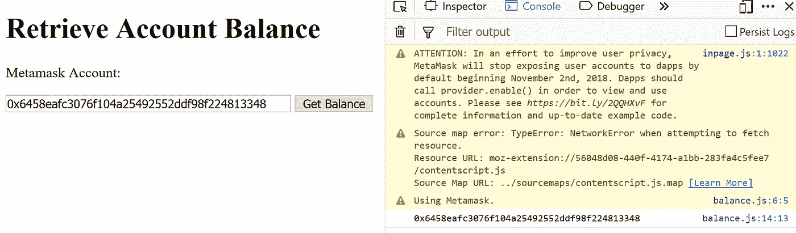
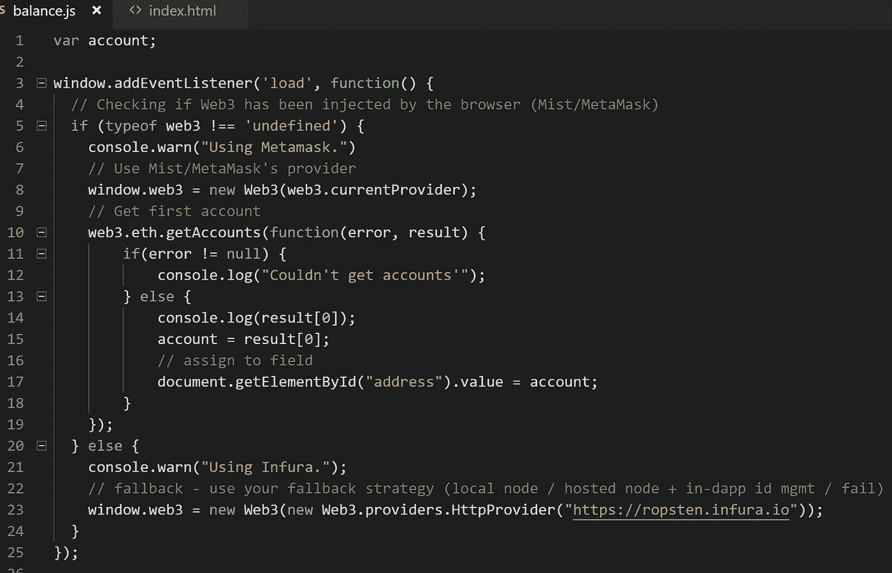
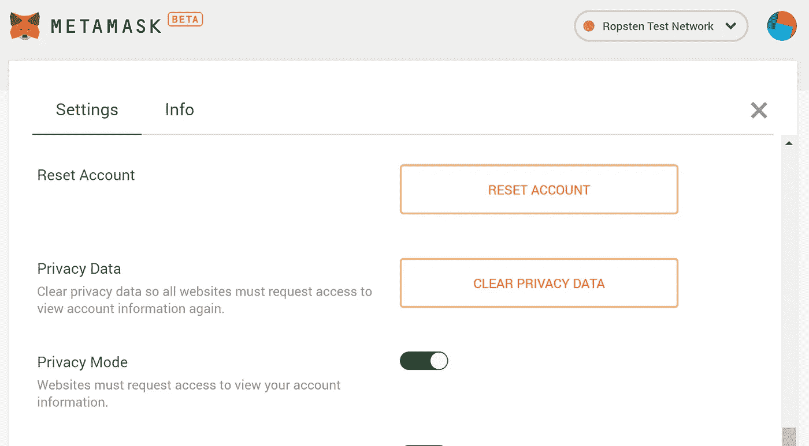
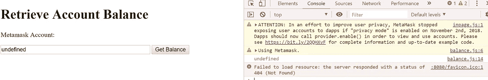
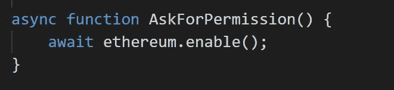
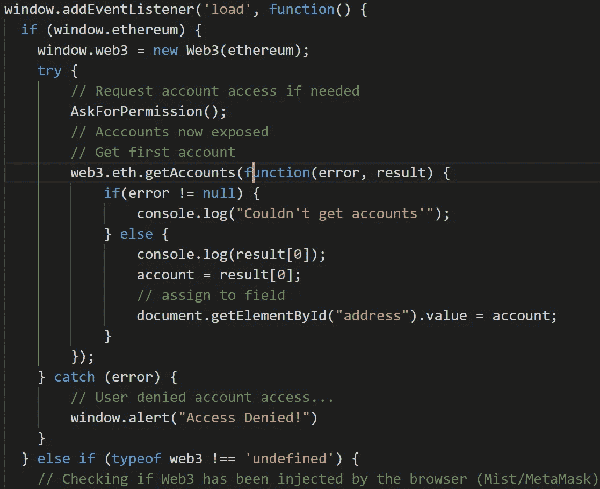
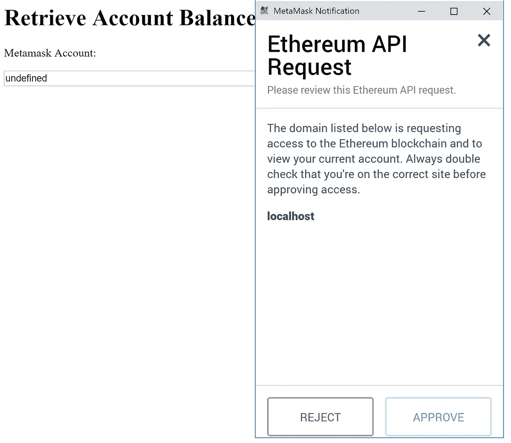
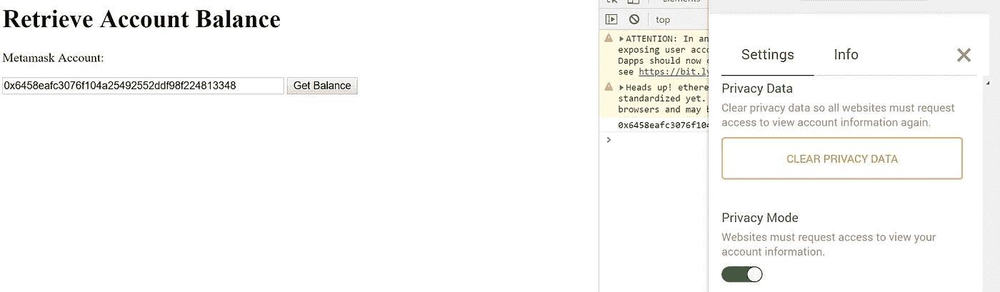

# 元掩码更新—隐私模式

> 原文：<https://medium.com/coinmonks/metamask-update-privacy-mode-5439bb6253bb?source=collection_archive---------4----------------------->

几个月前，Metamask 的 awesome 团队发布了一篇博客文章([https://medium . com/metamask/https-medium-com-meta mask-breaking-change-injecting-web3-7722797916 A8](/metamask/https-medium-com-metamask-breaking-change-injecting-web3-7722797916a8))，声明从 11 月 2 日起，meta mask 将进行更新，以停止 web 3 默认暴露用户帐户；而是要求 dApp 明确请求访问元掩码帐户的许可。

目前，“隐私模式”推出时，仍将被默认禁用；但是，在将来的版本中，它最终会默认启用。

所以让我们来看看这个是什么样子的。

在这里做一个快速测试，用我当前安装的 Metamask 来检索 Metamask 的第一个帐户。

Works as is.

Using a pretty standard provider listener.

一切都很好。现在我们将安装自定义元掩码构建发现[这里](https://github.com/MetaMask/metamask-extension/pull/4703#issuecomment-434615101)，并打开隐私模式:

Turning Privacy Mode on.

And it fails to get the address now!

现在我们看到隐私模式确实阻止我们直接访问元掩码，让我们添加启用提供者所需的代码:

Creating an async function to ask for permission.

Detect web3 provider and calling for permission.

刷新我们的测试，我们应该会看到一个提示:

Prompting for permission — Click Reject/Approve to your fancy.

After we click Approve — Refresh the page and it works!

所选的设置将被 Metamask 记住，并且可以通过点击选项正上方的“清除隐私数据”来清除，以启用“隐私模式”

就是这样！非常简单。非常感谢 Metamask 团队做出了如此必要的改变——哦，期待着在 DevCon4 上发布的 Metamask 移动客户端！；)

> [在您的收件箱中直接获得最佳软件交易](https://coincodecap.com/?utm_source=coinmonks)

