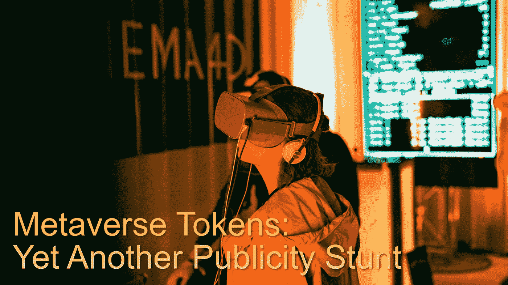
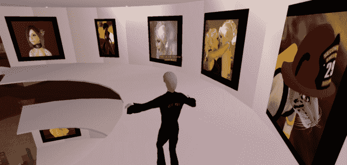

# 元宇宙代币:又一个宣传噱头

> 原文：<https://medium.com/coinmonks/metaverse-tokens-yet-another-publicity-stunt-5227ac514cc?source=collection_archive---------4----------------------->

*Image* [*Unsplash*](https://unsplash.com/photos/-hcfzUuQ3uw) *(modified)*

“元宇宙代币”真的存在吗？

有时，加密货币市场就像一个无休止的炒作剥削行业，只基于叙事和流行语。

在脸书宣布更名为 Meta 之后，区块链所有与游戏相关的平台现在都以元宇宙应用、平台或游戏的形式进行营销。

我们期待元宇宙的未来发展将包括互联网提供的几乎所有东西。元宇宙将结合各种现有技术(VR、AR、互联网、5G)，以及下一代发展(人工智能、物联网、AR 云、神经接口等)。加密空间希望 NFT 协议将成为提供数字所有权证明的有价值的组成部分。

我们甚至不知道元宇宙会如何发展，扎克伯格的方法只是一个有限的游戏平台，用户戴着 Oculus 耳机玩一些 VR 游戏。

然而，加密领域最新的炒作现在被称为“元宇宙令牌”。突然，我们在新闻中读到，与元宇宙背后的核心理念毫不相关的项目有可能在这个领域竞争。然而，一些加密项目作为“元宇宙令牌”的广告是误导性的。

# 分散的土地——沙盒——第二人生

Source: [Flickr](https://www.flickr.com/photos/therefore/288157789), by [Dean Terry](https://read.cash/@Pantera/metaverse-tokens-yet-another-publicity-stunt-58e9beb6#bad-link) (CC 2.0)

因此，我们突然意识到，分散化的土地(第二人生的低级版本)将成为元宇宙，因为这是市场决定的。

NFT 技术无疑是进步的。然而，到目前为止，数十亿的资金投入到了分散化的土地上，结果却很糟糕。

另一个名为“沙盒”的区块链“3D 世界”受到了同样的大肆宣传，也被描述为开发互联网未来的元宇宙项目。虽然，沙盒在币安智能链上，一个被广泛认为由币安交易所运行的大多数验证器集中的智能链。

到目前为止，游戏和企业界有理由忽略区块链的这些发展，因为游戏行业的技术比区块链领先几十年。

重新设计一个有 20 年历史的平台(Second Life)的模型并增加 NFT 功能并不是进步。使用类似《我的世界》的图形也不是进步。《我的世界》的成功在于它的游戏性，这是几乎所有区块链游戏都没有的另一个特点。

也许投资者忽略了主要游戏公司提供的真实 3D 世界的发展，游戏性，以及奖励动作和认可游戏技巧的用户友好界面。

分散的土地也应该是一个虚拟现实世界，然而，开发者从来没有实现虚拟现实的能力。

Second Life (date: 2014) — Fountain Plaza *Source:* [*Wikipedia*](https://commons.wikimedia.org/wiki/File:Fountain_plaza_(14232652879).png)*(CC 2.0)*

我们只能希望有一个比 2003 年发行的《第二人生》更好的尝试，并获得了不错的人气。然而，甚至连“第二人生”也没有被大规模采用。

2013 年,“第二人生”世界的日活跃用户达到了 100 万。在巅峰时期，分散的土地可能有 1000 名用户，而 ERC20 令牌 MANA 的市值高达 80 亿美元，这是不切实际的。

虽然分散土地是最接近区块链的发展，最终将是元宇宙，它仍然没有接近今天的游戏世界的技术进步，因此将无法吸引游戏世界。

区块链奥运会的情况也好不到哪里去。两个最受欢迎的游戏是卡牌游戏《碎片之地》和 Axie Infinity 这样的静态游戏。他们的普遍受欢迎程度来自于“付费玩赚”的模式。如果没有盈利因素和向玩家承诺财富的广告，这些游戏早就灭绝了。

然而，创造一个包含一些区块链元素的游戏和仅仅为了追随新趋势而将一些秘密项目称为元宇宙代币之间有着巨大的差异。

# 最后

Source: [Wikipedia](https://commons.wikimedia.org/wiki/File:Ocean%27s_Breeze_(12774768825).jpg) (CC 2.0)

在未来的 3D 世界和游戏中整合 NFT 是必要的，也是不可避免的，但这并不能改变今天在区块链领域没有元宇宙开发的事实。

我们看到的只是讨论和有限的承诺，可能永远也不会继续下去。

虽然，区块链宇宙不包含标准，但有限的需求，关于到达“月球”的令牌的价格。对于密码交易所、投资者和绝大多数“密码爱好者”来说，这才是最重要的。

我们有足够的侵略性广告，但劣质的区块链游戏和虚拟世界的稳定性问题和过时的图形设计。

也许我们将会遇到在主导协议上试图获胜的竞争项目。游戏机巨头任天堂、索尼和微软是一些可能的竞争者，它们将与不同版本的元宇宙竞争。

虽然，我们可以在元宇宙区块链开发的技术优势上欺骗自己，也许可以说服加密投资者继续向没人会使用的“分散”平台投入资金。

或者，我们可以建设性地批评不必要的和误导性的炒作，严格对待我们所营销的未来金融和未来互联网。

Writing at the following websites: ● [ReadCash](https://read.cash/@Pantera) ● [NoiseCash](https://noise.cash/u/Pantera99) ● [Medium](/@panterabch) ● [Hive](https://hive.blog/@pantera1) ● [Steemit](https://steemit.com/@pantera1) ●[Vocal](https://vocal.media/authors/pantera) ● [Minds](https://www.minds.com/pantera99/) ● [Twitter](https://twitter.com/Panterabch) ● [LinkedIn](https://www.linkedin.com/in/panterabch/) ● [email](https://read.cash/@Pantera/localcryptos-p2p-exchange-is-now-offering-bitcoin-cash-trading-06637230#bad-link)

> **免责声明**:本内容发布的所有材料均用于娱乐和教育目的，并符合**公平使用准则**。无意侵犯版权。如果您是或代表本文所用材料的版权所有者，并且对所述材料的使用有疑问，请发送 [**电子邮件**](https://read.cash/@Pantera/cryptouknowns-battlegrounds-the-crypto-battle-royal-part-i-0ca762da#bad-link) 。

***支持内容创作者。***

如果你喜欢这个故事，就订阅吧！

*原载于*[*https://read . cash*](https://read.cash/@Pantera/metaverse-tokens-yet-another-publicity-stunt-58e9beb6)*。*

> 加入 Coinmonks [电报频道](https://t.me/coincodecap)和 [Youtube 频道](https://www.youtube.com/c/coinmonks/videos)了解加密交易和投资

## 也阅读

 [## 杠杆代币[多头代币]终极指南

### 杠杆化令牌是具有杠杆化风险敞口的 ERC20 令牌，不考虑保证金、要求、管理…

medium.com](/coinmonks/leveraged-token-3f5257808b22)  [## 如何在印度购买比特币？2021 年购买比特币的 7 款最佳应用[手机版]

### 如何使用移动应用程序购买比特币印度

medium.com](/coinmonks/buy-bitcoin-in-india-feb50ddfef94)  [## 加密税务软件——五大最佳比特币税务计算器[2021]

### 不管你是刚接触加密还是已经在这个领域呆了一段时间，你都需要交税。

medium.com](/coinmonks/best-crypto-tax-tool-for-my-money-72d4b430816b)  [## 存储比特币的最佳加密硬件钱包[2021] | CoinCodeCap

### 保管您的数字资产很容易，但找到正确的存储方式却是一项繁琐的任务。在线钱包有一个风险…

blog.coincodecap.com](https://blog.coincodecap.com/best-hardware-wallet-bitcoin)  [## Pionex 评论 2021 |免费加密交易机器人和交换

### Pionex 是为交易自动化提供工具的后起之秀。Pionex 上提供了 9 个加密交易机器人…

medium.com](/coinmonks/pionex-review-exchange-with-crypto-trading-bot-1e459d0191ea)  [## 仙境提供了 83，412%的 APY 赌注:仙境是一个骗局吗？CoinCodeCap

### 仙境是雪崩网络的第一个基于时间令牌的分散储备货币协议。一篮子…

blog.coincodecap.com](https://blog.coincodecap.com/wonderland-offers-an-83412-apy-on-staking-is-wonderland-a-scam)  [## 天秤座货币——脸书的加密货币

### 自 2018 年马克·扎克伯格决定致力于改善区块链以来，关于天秤座货币的传言就一直存在…

blog.coincodecap.com](https://blog.coincodecap.com/libra-currency-a-cryptocurrency-by-facebook)