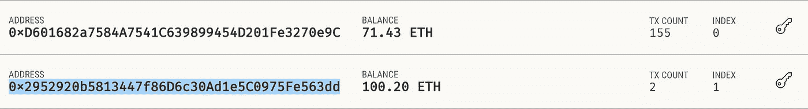

# 流星以太坊交易服务器

> 原文：<https://medium.com/coinmonks/meteor-ethereum-transaction-server-784b26a247e?source=collection_archive---------4----------------------->


这可能会扼杀去中心化的想法，但是对于某些应用程序，我们需要一个服务器在区块链中进行事务处理。如果我们将使用 [Meteor](https://www.meteor.com) 作为服务器，那么由于 [DDP 技术](https://blog.meteor.com/introducing-ddp-6b40c6aff27d)，当一个新的交易被包含在块中并被确认时，客户端会及时收到更新。

为了制作一个流星以太坊交易服务器，我们在项目智能合同中加入了[工件](https://github.com/sevriugin/LoyaltyCrowdsurance/tree/mainnet/build/contracts)，在我们的例子中，这些工件是由 [Truffle](https://truffleframework.com) 生产的。我们还需要 *Web3* 库和一个密钥库来保存服务器帐户。在我们的例子中，我们使用[*truffle-HD wallet-provider*](https://github.com/trufflesuite/truffle-hdwallet-provider)作为密钥库，我们希望服务器可以使用两个地址来签署以太坊交易:

```
import { Meteor }           from 'meteor/meteor';
import Web3                 from 'web3';
import contract             from 'truffle-contract';
import HDWalletProvider     from 'truffle-hdwallet-provider';
import TokenLoyaltyArtifact from './build/contracts/TokenLoyalty.json';export default class TokenLoyalty {
  constructor() {
    this.instance = undefined;
    this.data = undefined;
    this.web3Provider = new HDWalletProvider(Meteor.settings.mnemonic, Meteor.settings.networks.rinkeby, 0, 2);this.address = this.web3Provider.addresses[0];    // contract owner
this.tokenAddr = this.web3Provider.addresses[1];  // token owner// ...}
```

*HDWalletProvider* 构造函数中的最后一个参数要求*truffle-HD wallet-provider*生成两个账户，之后提供者可以签署来自这两个账户的交易。请注意，如果您不喜欢收到这样的错误

```
TypeError: private key should be a Buffer
```

在交易签名期间，您最好确保来自参数值的*中的所有字母都是小字母。*

```
instance.payment(data.tokenId, {**from: this.tokenAddr**, gas:700000, gasPrice:"20000000000"})
  .then(result => cb(result))
  .catch(error => console.error(error));
```

例如，在我们的例子中，当我们试图使用下面的常量代替 this.tokenAddr 时，就会产生**‘私钥应该是一个缓冲区’**错误

```
const ownerAddress = "0x2952920b5813447f86D6c30Ad1e5C0975Fe563dd";
```

这里有一些大写字母，但不是全部，这就是为什么很难注意到这一点。这个常数只是从 [Ganache](https://truffleframework.com/ganache) 账户部分复制和过去的:



Ganache 1.1.0 ACCOUNTS

现在，当我们的密钥库准备就绪，我们可以使用 *HDWalletProvider* 到sing 事务时，我们可以编写方法来调用智能契约函数，就像前面的例子一样，这时我们调用 *payment* 并开始监听事件来更新我们服务器上的 MongoDb 集合。例如，当*payed*事件到达时，我们使用 *_setData* 方法调用更新数据库状态的回调函数:

```
instance.Paid().watch((err, responce) => {
  if(err) {
    console.error(err)
  }
  else {
    that._setData({ event:responce.event,
      tx:responce.transactionHash,
      tokenId:responce.args.tokenId.toString(),
      supPoolId:responce.args.subPoolId.toString(),
    });
  }
});_setData(data) {
  if(this.data !== data) {
    this.data = data;
    if(this.watch !== undefined) {
      this.watch(data);
    }
  }
}setWatch(cb) {
  this.watch = cb;
}// ...let tokenLoyalty;if (Meteor.isServer) {
  tokenLoyalty = new TokenLoyalty();
  tokenLoyalty.setWatch(Meteor.bindEnvironment((data) => {
    // ...
    if(data.event === "Paid" && 
      Tokens.collection.findOne({ nft_id: data.tokenId })) {
        Tokens.collection.update({ nft_id: data.tokenId }, 
          { $set: { paid:true, inprogress:false } });
        //...
    }
    // ...
  }));
}
```

在我们的例子中，我们的智能合约有以下我们处理的事件:

```
/// payment eventevent Paid(uint subPoolId, uint tokenId, uint value, uint debit, uint payment, uint timeStamp, uint closure);
```

因此，我们使用 *responce.args.tokenId* 进行集合更新。如果事件主题的类型是 *uint* 和*在这种情况下， *responce.args.tokenId* 的值将是一个大数字，如下所示*

```
BigNumber { s: 1, e: 0, c: [ 3 ] }
```

这就是为什么我们使用 *toString()* 函数来拥有更方便的对象类型来存储和搜索。我们还需要在服务器端将回调函数封装在*meteor . bind environment()*方法调用中，否则您会得到以下错误消息:

```
Error: Meteor code must always run within a Fiber.
```

我们在使用我们的服务器进行智能合约测试时发现的另一个非常重要的发现是，函数调用的 gas 量必须设置为函数在所有情况下可以消耗的最大值。例如，下面的代码在大多数情况下都没有问题，但是当我们需要在 *create* 调用期间将子池添加到我们的结构中时，会出现错误。

```
instance.create(data.member, data.clientId, {from: that.address,
  gas:500000, gasPrice:"20000000000"})
    .then(result => cb(result))
    .catch(error => console.error(error));
```

不幸的是，在这种情况下，我们会收到错误消息

```
Transaction: 0x4dbcf824185eb06d68e94f01b2542c134409b6793cadf9b3a1eb325a731769e2 exited with an error (status 0). Please check that the transaction:
  - satisfies all conditions set by Solidity `require` statements.
  - does not trigger a Solidity `revert` statement.
```

没有提到气体问题，我们已经花了一些时间在 [etherscan.io](https://rinkeby.etherscan.io/vmtrace?txhash=0x4dbcf824185eb06d68e94f01b2542c134409b6793cadf9b3a1eb325a731769e2) 中了解到，SSTORE 指令已经消耗了大部分剩余气体。


etherscan.io **GETH** Trace for TxHash

因此，在我们将气体量从 500000 更改为 900000 后，*创建*事务顺利通过。需要说明的是，在 DAPP 环境中，由于有了 [Metamask.io](http://Metamask.io) 气体预测功能，我们将不会遇到这样的问题，气体量将会相应调整。

你可以在我们的 [REGA 风险分担库](https://github.com/REGA-RS/meteor-token/tree/ethereum)找到流星以太坊交易服务器的代码，所有智能合约都在[这里](https://github.com/sevriugin/LoyaltyCrowdsurance)。

> [直接在您的收件箱中获得最佳软件交易](https://coincodecap.com/?utm_source=coinmonks)

[](https://coincodecap.com/?utm_source=coinmonks)