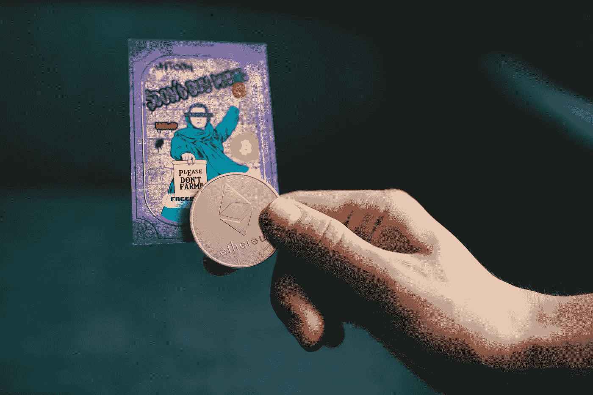

# NFT 蒙版铸造方法

> 原文：<https://medium.com/coinmonks/methods-for-nft-masked-minting-ddd05dceed32?source=collection_archive---------1----------------------->

许多 NFT 项目的一个非常理想的特点是在铸造过程中有一个惊喜的元素。这复制了购买收藏卡的体验，你购买一包随机分类的卡片。部分乐趣在于随机抽取，因此用户不能提前确定他们的 NFT，这一点很重要。在这篇文章中，我概述了几个这样做的方法。



Photo by [Old Money](https://unsplash.com/@moneyphotos?utm_source=unsplash&utm_medium=referral&utm_content=creditCopyText) on [Unsplash](https://unsplash.com/s/photos/nfts?utm_source=unsplash&utm_medium=referral&utm_content=creditCopyText)

# ERC-721 标准

对于那些新手来说，有一点关于 NFTs 的背景知识(如果你熟悉 ERC-721，可以跳过这一步)。NFT 只是一个遵循标准结构的智能合约。大多数 NFT 使用 ERC-721 标准。遵循此标准的合同将具有带有以下属性的令牌:

*   独一无二的`tokenId`
*   所有者的地址
*   答`tokenURI`

除了在极少数情况下，所有其他关于 NFT 的信息都存储在`tokenURI`位置。这可以是 http 地址，也可以是分散的 IPFS 地址。比如 BAYC #231 的`tokenURI`是[ipfs://qmesjsinhppnmxmspmjwixyn 6 zs 4 e 9 zccarigr 3 jxcawtq/231](https://bafybeihpjhkeuiq3k6nqa3fkgeigeri7iebtrsuyuey5y6vy36n345xmbi.ipfs.dweb.link/231)。如果我们对该地址进行操作，会得到以下结果:

```
{
  "image":"ipfs://QmbxRyCLRimkb6QRfw2xbv9dywcGn7zKMXtxtrvRQnhao1",
  "attributes":[
    {"trait_type":"Mouth","value":"Rage"},
    {"trait_type":"Hat","value":"Beanie"},
    {"trait_type":"Eyes","value":"X Eyes"},
    {"trait_type":"Clothes","value":"Bone Tee"},
    {"trait_type":"Background","value":"Orange"}, 
    {"trait_type":"Fur","value":"Pink"}
]}
```

这是储存 NFT 信息的地方。为了进行假面造币，你需要改变`tokenURI`，或者改变从`tokenURI`返回的信息。

# 方法 1:为每个令牌设置 TokenURI

第一种方法利用了`ERC721URIStorage`契约中的`_setTokenURI`函数。这允许您更改给定`tokenId`的`tokenURI`。合同可能是这样的:

Note the onlyOwner decorator on setTokenURI. We shouldn’t let non-owners use this method

这种方法是最显而易见的解决方案，但是像大多数显而易见的解决方案一样，它不是一个非常好的解决方案(尽管我已经看到了多个使用这种方法的项目)。它的效率低得令人难以置信，因为你需要为每个生成的令牌调用这个函数。通过把它变成 for 循环，你可以得到稍微好一点的气体效率，但是仍然要花费很多 ETH。

# 方法 2:设置元数据服务器

设置服务器，仅在 NFT 元数据生成后才提供它们。您的服务器将需要监视铸造事件的区块链，并“揭示”该令牌的文件。

您需要在合同中设置一个`baseURI`来指向您的服务器。

然后设置一个服务器，监视区块链的更新，并在令牌生成时打开端点。Node.js 中有一个例子。

相反，如果你想一次展示所有的作品，你可以从一个目录提供静态文件(展示前的文件),然后在展示日提供真实的文件。

这种方法的好处是不需要任何额外的 gas，并且更新令牌元数据非常容易。你所需要做的就是更新你的服务器来管理你的用户所看到的。然而，这种方法也有一些缺点。您将需要无限期地维护元数据服务器，否则项目将停止工作。服务器也代表了一个集中点，这是加密用户所担心的。如果一个项目被它的所有者放弃，并且服务器被关闭，NFT 可能变得一文不值，因为它们不再与它们应该代表的艺术品相链接。

# 方法 3:更新 baseURI

允许业主更改合同的`baseURI`。由于默认情况下`tokenURI`是`_baseURI() + tokenId`，更新它将一次更新每个令牌的`tokenURI`。

Remember to add the onlyOwner decorator

这是非常高效的，因为你只需要做一个简单的函数调用来更新你的整个集合的`tokenURI`。它还可以防止你被锁定到一个服务器或 IPFS 地址。您可以从元数据服务器开始，然后更改为使用 IPFS。

# 方法四:IPNS

使用 IPNS 地址，您可以在以后更新该地址。IPNS 是 IPFS 的一个命名系统。这允许所有者更新从一个地址返回的文件，同时保持 IPFS 网络的分散性。


如果有兴趣，我可以为这种方法做一个教程，但我不会真的推荐这种方法。IPNS 是 IPFS 体系的一大特色，但它仍然存在一些问题。它没有 IPFS 那样的稳定性，我经常很难向它发表文章。此外，IPNS 记录有一个截止日期，因此它们需要长期维护，并且需要开发人员进行更多的私钥管理。

# 结论

我的一般建议是使用第二种或第三种方法(或者两者的组合)。他们允许更大的灵活性，而没有高昂的天然气费用，因此 NFT 项目可以提供最令人兴奋的用户体验！

> 加入 Coinmonks [电报频道](https://t.me/coincodecap)和 [Youtube 频道](https://www.youtube.com/c/coinmonks/videos)了解加密交易和投资

## 另外，阅读

*   [如何开始通过加密贷款赚取被动收入](https://blog.coincodecap.com/passive-income-crypto-lending)
*   [BigONE 交易所点评](/coinmonks/bigone-exchange-review-64705d85a1d4) | [电网交易 Bot](https://blog.coincodecap.com/grid-trading)
*   [氹欞侊贸易评论](https://blog.coincodecap.com/anny-trade-review) | [CoinSpot 评论](https://blog.coincodecap.com/coinspot-review)
*   [新加坡十大最佳加密交易所](https://blog.coincodecap.com/crypto-exchange-in-singapore) | [购买 AXS](https://blog.coincodecap.com/buy-axs-token)
*   [投资印度的最佳加密软件](https://blog.coincodecap.com/best-crypto-to-invest-in-india-in-2021) | [WazirX P2P](https://blog.coincodecap.com/wazirx-p2p)
*   [7 个最佳零费用加密交易平台](https://blog.coincodecap.com/zero-fee-crypto-exchanges)
*   [最佳网上赌场](https://blog.coincodecap.com/best-online-casinos) | [期货交易机器人](/coinmonks/futures-trading-bots-5a282ccee3f5)
*   [分散交易所](https://blog.coincodecap.com/what-are-decentralized-exchanges) | [比特 FIP](https://blog.coincodecap.com/bitbns-fip) | [宾邦评论](https://blog.coincodecap.com/bingbon-review)
*   [用信用卡购买密码的 10 个最佳地点](https://blog.coincodecap.com/buy-crypto-with-credit-card)
*   [加拿大最佳加密交易机器人](https://blog.coincodecap.com/5-best-crypto-trading-bots-in-canada) | [Bybit vs 币安](https://blog.coincodecap.com/bybit-binance-moonxbt)