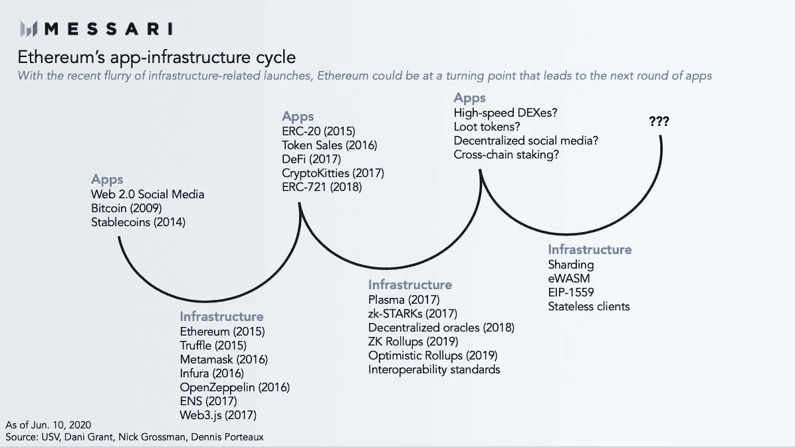

# 墨西哥区块链行业上涨 90% /摩根大通全押 Crypto /阿里巴巴数字化中国最大港口

> 原文：<https://medium.com/coinmonks/mexicos-blockchain-sector-up-90-jpmorgan-all-in-on-crypto-alibaba-to-digitize-china-s-45427979e4cf?source=collection_archive---------4----------------------->

*2020 年 6 月 11 日*

*本周景观…* ***墨西哥*** *尽管有新冠肺炎的影响，区块链板块在过去两年中增长了 90%。* ***阿里巴巴*** *将致力于数字化* ***招商局港口*** *，与区块链同为全国最大的港口运营商。* ***比特币基地*** *正在寻求将其区块链分析软件出售给美国国税局(IRS)和缉毒署(DEA)。中国的* ***云南*** *省为其* ***【普洱】*** *茶场推出了一个区块链供电的追溯平台，追踪价值 25 亿美元的茶叶。* ***可口可乐*** *分销商为自动售货机提供比特币支付选项。* ***基线*** *整合了* ***微软动态 365*** *和* ***谷歌电子表格*** *使用以太坊 mainnet。* ***微软*** *的基于比特币的去中心化身份(DID)工具****ION****，现已上线。而韩国的一个城市向区块链的 ID 应用程序开放公共服务，据报道，区块链的游戏玩家赚了 2000 万美元。此外，我们还有多份 Q2 2020 区块链开发者报告&分析、****DApps****新闻、书籍推荐等等。尽情享受吧！*

***奖金*** *:我最近发布了最新的 Q2 2020 版 my* [*DApp“栈”景观图*](https://s3.amazonaws.com/spoke-profiles-prod-assets/uploads/a069e1e1e798c975d4eca968c72f4ac1352d62a4/original/DApps_Stack_Landscape_Q2_2020.pdf?utm_source=Social%20Media&utm_medium=LinkedIn&utm_campaign=Topio%20-%20Dapps%20Landscape%20update&utm_content=S3%20Link) *(包含在下面供下载)，它提供了一个行业概述，突出了 400 多家全球公司、生态系统参与者和工作小组。如果这是你看到的第一个版本，就把它当作你在这个行业中进一步导航的路线图。在这里获得高分辨率的免费！*

> [在 CoinCodeCap 上购买最佳加密交易](https://coincodecap.com/deals)

## 🇲🇽 [尽管有新冠肺炎的影响，墨西哥的区块链地区在两年内增长了 90%](https://cointelegraph.com/news/mexicos-blockchain-sector-grows-90-in-2-years-despite-covid-19)

根据专注于区块链的律师事务所 Legal Paradox 的数据，墨西哥区块链和金融科技行业的规模在短短两年内几乎翻了一番。据该律师事务所称，墨西哥金融技术领域有超过 640 家实体在运营，其中 443 家或 69.1%的公司位于墨西哥城……[阅读更多信息](https://cointelegraph.com/news/mexicos-blockchain-sector-grows-90-in-2-years-despite-covid-19)

*相关:🇭🇰* [*香港 40%的新金融科技公司与区块链*](https://cointelegraph.com/news/40-of-new-fintech-firms-in-hong-kong-operate-with-blockchain) 合作

## 🇨🇳 [阿里巴巴将与区块链合作数字化中国最大的港口运营商](https://thedailychain.com/alibaba-to-digitize-chinas-biggest-port-operator-with-blockchain/)

中国大型企业阿里巴巴是首批获得中国政府支持的加密货币的七家机构之一。该公司还一直在开发一个区块链网络，旨在支持其金融科技子公司蚂蚁金服旗下的中小企业。阿里巴巴与中国最大的港口运营商招商局港口达成协议，允许开发和实施一个总部位于区块链的平台，该平台将有多个用例……[阅读更多](https://thedailychain.com/alibaba-to-digitize-chinas-biggest-port-operator-with-blockchain/)

*相关:📖* [*PUBG 靠山正在建立联盟，以改善中国区块链发展*](https://thedailychain.com/pubg-backer-is-establishing-an-alliance-to-improve-blockchain-development-in-china/)

## 📖[美联储支持以太坊支持的 Libor 替代方案](https://www.forbes.com/sites/jasonbrett/2020/06/03/federal-endorses-ethereum-backed-alternative-to-libor/)

在 5 月 28 日的一份声明中，美国美联储董事会主席 Jerome H. Powell 就 AMERIBOR 替代 LIBOR 的合适性发表了意见。AMERIBOR 使用区块链以太坊的许可版本来获取银行间拆借利率。他在回应中还指出，“美联储召集并支持替代参考利率委员会(ARRC)的工作，认为 SOFR 是一个强大的替代方案，将帮助许多市场参与者从 LIBOR 过渡到… [阅读更多信息](https://www.forbes.com/sites/jasonbrett/2020/06/03/federal-endorses-ethereum-backed-alternative-to-libor/)

## 📖[比特币的“最大敌人”摩根大通似乎突然将全部赌注押在了加密上](https://www.forbes.com/sites/billybambrough/2020/05/30/jp-morgan-bitcoins-biggest-enemy-suddenly-appears-to-be-going-all-in-on-crypto/)

在银行业巨头摩根大通与比特币基地及其竞争对手比特币和加密交易所 Gemini 签约后，摩根大通与比特币的动荡关系似乎正在迅速融化。摩根大通上个月批准了两个比特币交易所账户，并已开始处理交易，这可能标志着加密行业银行业困境的结束……[阅读更多](https://www.forbes.com/sites/billybambrough/2020/05/30/jp-morgan-bitcoins-biggest-enemy-suddenly-appears-to-be-going-all-in-on-crypto/)

## 📖[比特币基地想在收购中微子一年后向国税局和 DEA 出售区块链分析软件](https://www.theblockcrypto.com/post/67551/coinbase-irs-dea-analytics-neutrino)

比特币基地正在寻求将其区块链分析软件出售给美国国税局(IRS)和缉毒署(DEA)。两家机构都计划获得批准。4 月和 5 月发布的几份公开文件显示，两家机构都有意为比特币基地分析公司购买许可证。然而，美国政府将为许可证支付多少费用还不确定……[阅读更多](https://www.theblockcrypto.com/post/67551/coinbase-irs-dea-analytics-neutrino)

## 📖[区块链平台追踪价值 25 亿美元的茶叶产品](https://thedailychain.com/alibaba-to-digitize-chinas-biggest-port-operator-with-blockchain/)

中国云南省为其普洱茶农场推出了一个区块链供电的追溯平台。该平台将用于对全省 42，000 公顷农田进行质量控制、销售和贷款融资操作……[阅读更多](https://thedailychain.com/alibaba-to-digitize-chinas-biggest-port-operator-with-blockchain/)

*相关:📖* [*可口可乐经销商为澳元自动售货机提供比特币支付选项*](https://www.coindesk.com/coca-cola-bottler-signs-on-to-bring-crypto-transactions-to-the-mainstream)

## 📖[新冠肺炎追踪招致批评，微软发布基于比特币的身份识别工具](https://www.coindesk.com/microsoft-releases-bitcoin-based-id-tool-as-covid-19-tracing-draws-criticism)

微软基于比特币的分散身份工具 ION 周三在 mainnet 上推出了测试版，这是[分散身份基金会(DIF)](https://identity.foundation/) 成员为快速跟踪任何人都可以用于新冠肺炎危机应对计划的工具所做的许多努力之一。微软和 ConsenSys 的 uPort 项目都是 DIF 的主要成员。另外，微软还与比特币初创公司 Casa 合作，创建一个用户友好的界面来管理多个数字身份……[阅读更多](https://www.coindesk.com/microsoft-releases-bitcoin-based-id-tool-as-covid-19-tracing-draws-criticism)

*相关:📖* [*分散身份可以取代所有登录功能，LG 称*](https://cointelegraph.com/news/decentralized-identity-could-replace-all-login-functions-says-lg)

*相关:* 🇰🇷 [*韩国城市向区块链身份证 App*](https://cointelegraph.com/news/south-korean-city-opens-public-services-to-blockchain-based-id-app) 开放公共服务

## 📖 [Baseline 使用以太坊 Mainnet 整合了微软和谷歌的电子表格](https://cointelegraph.com/news/baseline-integrates-microsoft-and-google-spreadsheets-using-ethereum-mainnet)

Baseline Protocol 已经开始整合 Google Sheets 和 Microsoft Dynamics 365。新功能允许结合企业资源规划解决方案使用电子表格维护可核实的一致记录。Baseline 周一发布了一份[概念验证](https://www.youtube.com/watch?v=JDQmatMZrr8&feature=youtu.be)，展示了电子表格数据的“基线”，以验证多个独立的私有数据库保存相同的记录。… [阅读更多](https://cointelegraph.com/news/baseline-integrates-microsoft-and-google-spreadsheets-using-ethereum-mainnet)

*相关:📖* [*基线协议解释*](https://limechain.tech/blog/the-baseline-protocol-explained/)*——*[*石灰链*](https://medium.com/u/85f25135ff7a?source=post_page-----45427979e4cf--------------------------------)

# 本周的更多内容:

📖[美第奇风险投资公司着手创建数字死亡证书](https://businessblockchainhq.com/business-blockchain-news/medici-ventures-creates-digital-death-certificates/)——[金斯利·阿洛](https://medium.com/u/be2ffefc8a4b?source=post_page-----45427979e4cf--------------------------------)

📖[沙特阿拉伯央行引领区块链驱动的转账](https://www.forbes.com/sites/michaeloloughlin/2020/06/08/saudi-arabia-central-bank-leads-the-way-with-blockchain-powered-transfer/)

🎮[区块链游戏玩家第一年赚了 2000 万美元](https://cointelegraph.com/news/blockchain-gamers-earned-20m-in-their-first-year)

📖 [Web3 品牌和去中心化复兴](https://cointelegraph.com/magazine/2020/06/01/blockchain-web3-brands-decentralized-renaissance)

📖“去中心化的网络”并不畅销。下面是为什么

📖 [Bison Trails 增加了对近区块链协议的支持](https://cointelegraph.com/news/bison-trails-adds-support-for-near-blockchain-protocol)

📖[区块链媒体创业 Civil 关停](https://www.theblockcrypto.com/linked/67235/blockchain-media-startup-civil-shuts-down)

📺[投资金融科技和区块链](https://youtu.be/o4oBYint828)——[拉托肯](https://medium.com/u/eb73c6f6ed28?source=post_page-----45427979e4cf--------------------------------)

# 分散式应用程序手表

## 📖[比特币核心 0.20.0 发布:新功能](https://bitcoinmagazine.com/articles/bitcoin-core-0-20-0-released-whats-new)

比特币推出比特币核心 0.20.0，这是比特币原创软件客户端的第 20 个版本。新版本清理并硬化了比特币核心代码库。除此之外，它还带来了一些改进，如将硬件钱包集成到 GUI 中，一个名为 Asmap 的新配置选项，该选项通过自治系统号(ASN)映射 IP 地址……[阅读更多信息](https://bitcoinmagazine.com/articles/bitcoin-core-0-20-0-released-whats-new)

## 📖 [AVA 实验室集成了 Chainlink 的分散式 Oracles 以改进 DeFi Dapps 开发](https://bitcoinexchangeguide.com/ava-labs-integrates-chainlinks-decentralized-oracles-to-improve-defi-dapps-development/)

分散式金融应用平台 [AVA 实验室](https://medium.com/u/f7c9f4ea738f?source=post_page-----45427979e4cf--------------------------------)宣布了其与 [ChainLink](https://medium.com/u/87d28920d977?source=post_page-----45427979e4cf--------------------------------) 的价格和数据甲骨文在区块链的合作关系。这种整合将允许开发者减少开发时间，直接启动 DeFi DApps。Chainlink 的多个数据源 oracles 将防止价格数据检索中的单点故障(SPOF)攻击。… [阅读更多信息](https://bitcoinexchangeguide.com/ava-labs-integrates-chainlinks-decentralized-oracles-to-improve-defi-dapps-development/)

*相关:📖* [*Algorand 和 Blockstack 正在打造多链智能合约语言*](https://www.coindesk.com/algorand-and-blockstack-are-building-a-multi-chain-smart-contract-language)

## 📖[以太坊可能并不完美，但大多数 DApps 还是喜欢带着它跑](https://www.geezwild.com/ethereum-may-not-be-perfect-but-most-dapps-still-like-to-run-with-it/)

以太坊是分散式应用程序开发人员部署其产品和服务的首选。由[Dapp.com](https://medium.com/u/52849c27fcd5?source=post_page-----45427979e4cf--------------------------------)发布的《2020 年 Q1 Dapp 市场报告》展示了这一持续的趋势，因为统计数据显示，635 个 Dapp，即市场上所有运行的 Dapp 的大约一半，基于以太坊网络，拥有 616，369 个活跃用户。这篇文章调查了为什么大多数 DApp 开发者仍然选择以太坊区块链… [阅读更多](https://www.geezwild.com/ethereum-may-not-be-perfect-but-most-dapps-still-like-to-run-with-it/)

*相关:📖* [*以太坊上效用的进化*](https://messari.io/article/the-evolution-of-utility-on-ethereum)*——*[*威尔逊*](https://twitter.com/WilsonWithiam/status/1271494935003500546) */* [*梅萨里*](https://medium.com/u/7cf93d3c3400?source=post_page-----45427979e4cf--------------------------------)

[Source: Messari](http://messari.io/)

📖[什么是 dApps？以太坊 dApp](https://bitcoinexchangeguide.com/ava-labs-integrates-chainlinks-decentralized-oracles-to-improve-defi-dapps-development/) — [LimeChain](https://medium.com/u/85f25135ff7a?source=post_page-----45427979e4cf--------------------------------) 的趋势与挑战

📖[eth 2 的状态，2020 年 6 月](https://blog.ethereum.org/2020/06/02/the-state-of-eth2-june-2020/)——[丹尼·瑞恩](https://medium.com/u/d607259e3794?source=post_page-----45427979e4cf--------------------------------)

📖[利用 Infura 节省开发和扩展时间:来自领先以太坊 Dapps 的经验](https://consensys.net/blog/blockchain-development/how-to-save-time-on-devops-and-scale-with-infura-lessons-from-leading-ethereum-dapps/) — [ConsenSys](https://medium.com/u/6c7078bf7b01?source=post_page-----45427979e4cf--------------------------------)

📖[2020 年分散式网络开发者报告](/fluence-network/decentralized-web-developer-report-2020-5b41a8d86789) — [Evgeny Ponomarev](https://medium.com/u/5e00b001daf0?source=post_page-----45427979e4cf--------------------------------)

📖[区块链开发者报告 Q2 2020](/outlier-ventures-io/blockchain-developer-report-q2-2020-773b3b90ac9a)——[西奥特纳](https://medium.com/u/28e9f455cb56?source=post_page-----45427979e4cf--------------------------------) / [离群风险投资](https://medium.com/u/5751ee054871?source=post_page-----45427979e4cf--------------------------------)

📖[为什么以太坊是游戏项目的最佳区块链](/sorare/why-ethereum-is-the-best-blockchain-for-gaming-items-5dbbd963a3e7) — [阿德里安·蒙特福特](https://medium.com/u/8d69158446d1?source=post_page-----45427979e4cf--------------------------------)

# 📚图书角:

*这些天我们都比平时读得多一点，所以我想分享一些我目前正在读的书，并推荐(排名不分先后)给你，以防你正在寻找新的东西。快乐阅读！*

1.  [抵押品市场和金融管道](https://www.amazon.com/Collateral-Markets-Financial-Plumbing-Manmohan-ebook/dp/B08627Q6NC/ref=sr_1_1?dchild=1&keywords=Collateral+Markets+and+Financial+Plumbing&qid=1591941647&s=digital-text&sr=1-1)——曼莫汉·辛格博士，主演[凯特琳·龙](https://medium.com/u/7262834671c1?source=post_page-----45427979e4cf--------------------------------)
2.  [比特币&黑美国](https://www.amazon.com/Bitcoin-Black-America-Isaiah-Jackson-ebook/dp/B07V1SJ7XY/ref=sr_1_1?crid=2IUI7CM3F5PD9&dchild=1&keywords=bitcoin+and+black+america&qid=1591996273&sprefix=bitcoin+and+black%2Cdigital-text%2C212&sr=8-1)——[以赛亚·杰克逊](https://twitter.com/bitcoinzay)
3.  [明天的价格:为什么通货紧缩是未来富足的关键](https://www.amazon.com/dp/B08334WFSQ/ref=nav_timeline_asin?_encoding=UTF8&psc=1) — [杰夫·布斯](https://twitter.com/JeffBooth)
4.  [重塑商业之魂:在数据时代保持人性](https://www.amazon.com/Restoring-Soul-Business-Staying-Human/dp/1400210542/ref=pd_ybh_a_23?_encoding=UTF8&psc=1&refRID=ZJJ4V9FYF7TW6R3FYPFC)——[里沙德·托巴克瓦拉](https://twitter.com/rishad)
5.  [用于自我主权数字身份的区块链](https://www.amazon.com/Blockchain-Self-Sovereign-Digital-Identity-ebook/dp/B0881X2V6M/ref=sr_1_1?crid=1V0OHWXD1AMAP&dchild=1&keywords=blockchain+for+self+sovereign+digital+identity&qid=1591996541&s=books&sprefix=blockchain+for+sel%2Cstripbooks%2C212&sr=1-1)——[德巴贾尼·莫汉蒂](https://twitter.com/debimr75)

# 🎙️区块链工业状况 2020 年第一季度:

*现已发售，下载你的高清副本* ***Q1 2020*** *版* [*区块链景观图*](https://www.linkedin.com/posts/kyleellicott_q12020-blockchain-landscapekyleellicotttopionetworks-activity-6638879840634310656-UNtB) *。这是我发布的第五版景观，包括****747****家公司(* ***900+全部独特公司*** *包括更广泛的关键生态系统参与者)和超过***22010 年至 2020 年在整个景观中筹集的 220 亿美元资金，自 2010 年以来投资超过 180 亿美元—出现明显的循环，并有完整的分解。**

**一个完整的 60 分钟的景观概述视频现在可以在这里***免费获得。在视频中，我对 2020 年的前景进行了细分，提供了 2019 年的总结、2020 年的新兴趋势、DeFi、Libra、CDBCs、Stablecoins、DApps 等等！***

****

**Source: [Topio Networks](https://www.topionetworks.com/markets/blockchain-landscape-5bf43854b9abe4633c1f87da)**

> **👉下载新的[区块链基础设施景观 Q1 2020](https://s3.amazonaws.com/spoke-profiles-prod-assets/uploads/d21d960161f92e629f68bf78b3d148743e4b3f49/original/Blockchain_Landscape_Q1_Feb2020_KyleEllicott.pdf?utm_source=pdf&utm_medium=email&utm_campaign=kyle) 版，了解关于 DeFi、DApps、基础设施、数字货币等的见解！**

**不想等到下周，[现在就订阅](http://click1.m.readwritelabs.com/xsdqkbbrgsdtqkmntpjlstcnkytvpvphsnhsqlvbrhhd_yfqbfcmslnskglmckvqv.html?source=post_page---------------------------)📥有关区块链、DApps 等的实时行业见解！**

> **[直接在您的收件箱中获得最佳软件交易](https://coincodecap.com/?utm_source=coinmonks)**

****