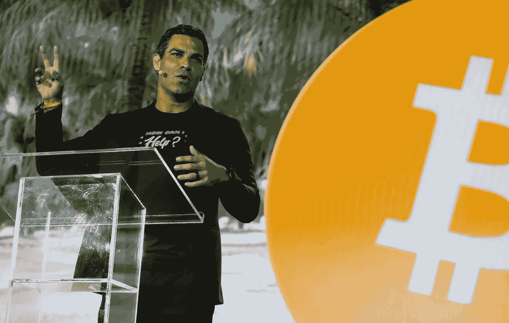

# 迈阿密市长希望比特币退休

> 原文：<https://medium.com/coinmonks/miamis-mayor-wants-a-bitcoin-retirement-d0c2e3cba692?source=collection_archive---------16----------------------->

比特币最大化者，弗朗西斯·苏亚雷斯已经在用比特币领薪水了。但是迈阿密市长也想将他的部分退休基金转换成 BTC。

迈克尔·塞勒可能是当今对比特币投资最多的企业家。包括基兰·吉布斯在内的运动员也在投资这种加密货币，他们在 BTC 领取全部或部分薪水。

