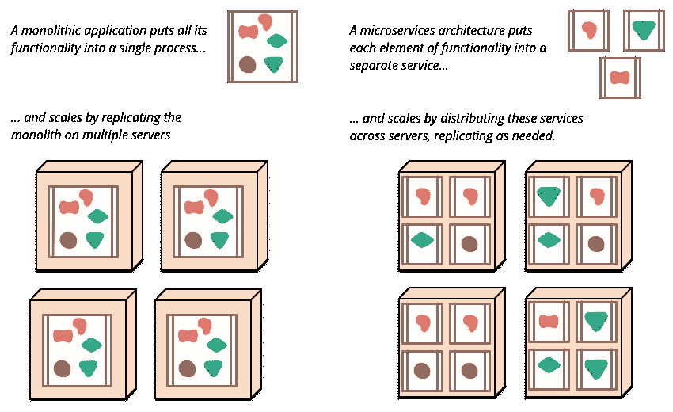
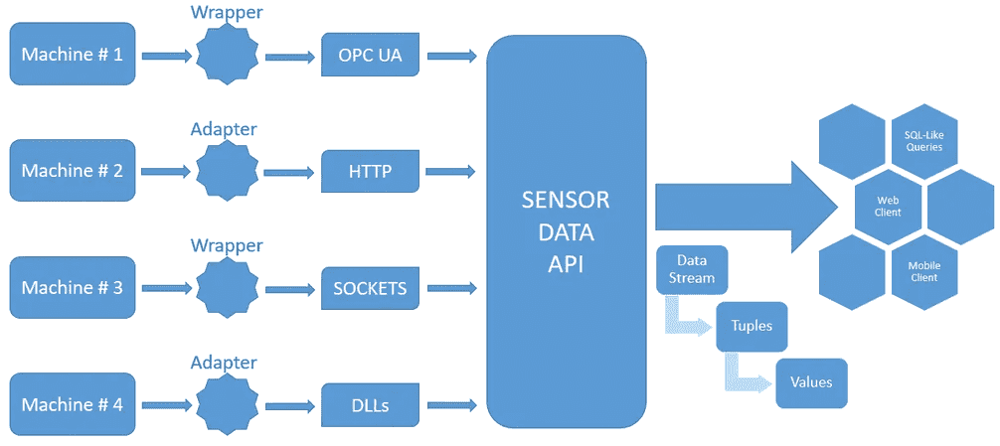
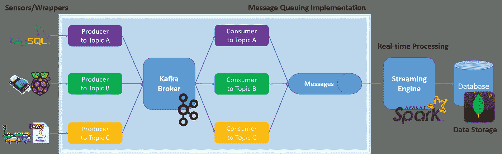
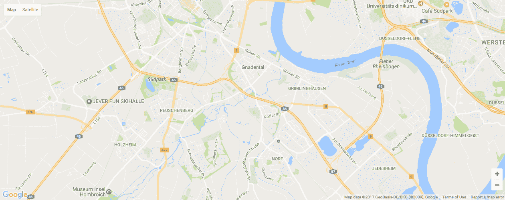

# 面向数据工程的工业物联网(IIOT)框架的微服务管道

> 原文：<https://medium.com/coinmonks/micro-services-pipeline-for-an-industrial-internet-of-things-a8cdd67f1eb9?source=collection_archive---------4----------------------->

这是我第一次在 Medium 上分享我硕士论文的摘录；微服务架构如何帮助我在 6 个月的时间内开发出一个工业物联网框架。

这也是为了写给渴望论文(或最后一年项目)的学生，渴望了解多个小应用程序如何在企业级应用程序中发挥更大作用的新开发人员，以及所有经验丰富/熟练的观众，他们会对我如何在论文实施中取得辉煌给予反馈。这篇论文是我在德国亚琛工业大学**🇩🇪.**攻读硕士学位的一部分

> “我们的想法是利用物联网中的技术，并将它们与第四代工业革命(即工业 4.0)重叠。”

[SuperC Building, RWTH Aachen University](https://www.amec.com.vn/du-hoc-duc-voi-10-truong-dai-hoc-hang-dau-dao-tao-nganh-y.html)

现在几乎每个人都听说过微服务这个词；专用于执行一些特定任务的小型应用程序/服务，独立于任何其他软件或服务。对于新手来说，这并不是什么太复杂的事情，只是一个松散耦合(几乎没有依赖性)的软件服务的概念，它们结合在一起形成了一个完整的应用程序。

> 微服务架构(有时也称为面向服务的架构)是一个复杂应用程序的服务集合。它的概念是，如果应用程序的任何部分出现故障，它不应该影响周围的其他特性和功能。听起来很可靠，很健壮，对吧？

虽然微服务架构(MSA)没有正式的定义，但是有一些特征可以证明这一点。**马丁·福勒**将**微服务描述为；具有可扩展性、业务能力、自动化部署、端点智能以及语言和数据分散控制的软件应用**。

> 微服务架构的***替代方案**是**单片应用**，构建在单个编程堆栈上，每个组件高度相互依赖。

[Monoliths and Microservices](https://martinfowler.com/articles/microservices.html)

组合所有:软件应用程序是可独立部署的，本质上是模块化的，运行具有良好定义的范围的独特过程，拥有轻量级机制来服务于业务目标，并且以高内聚松散耦合，最终成为微服务架构的一部分。这种架构最适合处理不同的编程堆栈，并使它们按照实现管道协同工作。

这就是我所做的…制作几个小应用程序的管道，作为我硕士论文实现的一个构建块。这些应用程序的实现基于 **Apache Kafka** (用于消息传递系统)**、Apache Spark** (用于实时数据流和处理)**、MEAN Stack** (Node.js，Angular 用于数据摄取和可视化)**、Python 用于 RaspberryPi** (以及传感器编程) **MySQL** (样本数据) **JAVA Spring** (用于地图匹配)和**因此，考虑到 6 个月的总时间框架，我选择微服务架构是合适的。通过这种方式，我能够亲自动手使用这些技术进行实施，并节省了按照硕士论文的要求撰写详细报告的时间。**

Technology (Implementation) Pipeline

> “硕士论文通常为期 6 个月。在这 6 个月中，每个学生都必须开发一个 POC / MVP(概念证明/最小可行产品)以及研究论文/作品，以便在大学教授(导师)面前进行答辩。这样，它可以成为某个研究项目的一部分，也可以成为某个工业项目的基础。”

> **现在将范围**限制为分解包括不同技术堆栈的硕士论文实现，以及我如何在 6 个月的时间跨度内将它们与微服务架构结合起来？

在我提交论文的时候，大学导师提出了两个主要问题。第一个问题是所涉及的各种技术，第二个问题是在 6 个月内实施的可行性。第二个问题的答案在前面的段落中已经清楚了，关于第一个问题，是的，变化是为了实现。因为目标是开发“**工业物联网环境下传感器数据的可扩展框架**”。因此，我需要各种传感器来使它们按照我的 Node 和 Python 管道工作，类似地，为了处理来自传感器的各种输入数据，我需要足够快速和健壮的消息传递系统来处理任何时间点的多个流，所以我选择了 Kafka。同样，传入的数据要用 Spark 的流引擎进行处理，然后数据被转储到基于文档的数据库 MongoDB 中。

Master Thesis Phase (Flow) Diagram

因此，当您拥有各种各样的技术时，您不能依赖单一的体系结构(单一的应用程序是作为一个独立的单元构建的，其中一个组件的变化会影响整个应用程序)。因此，微服务架构(MSA)拯救了我们！MSA 的概念是，如果应用程序的任何部分出现故障，它不应该影响周围的其他特性和功能。我对它进行了一点建模，并为我的硕士论文实现制作了这种微应用程序(服务)的管道。

# 工业物联网的背景

这个想法是利用**物联网**中的技术，并将其与第四代工业革命**工业 4.0** 重叠。我们都知道物联网(IOT)背后的理念，即每一个电子设备都以一种有意义的方式相互连接，使我们的生活变得更加轻松；为我们的日常生活提供便利。同样，工业 4.0 也有自动化的想法。让工厂完全基于机器人；也就是说，更少的人为参与将导致更少的人为错误和更少的事情需要担心。一个简单的例子是制造业，你提供原材料，然后在有限或没有人工参与的情况下获得成品。因此，未来的工厂。

## 未来的城市和未来的工厂

其概念是开发这样一个框架，它足够灵活，可以根据输入数据的性质进行调整。在工业物联网的背景下，这些传入的数据流大多来自机器传感器和工业机器人。这些数据随后被我的框架处理和利用。从而产生有意义的数据，这些数据可以成为该特定行业流水线中的后续运输机器的输入。

> 在实际的实现中，被吸收到数据湖中的数据实际上是行业管道的下一个组件的输入。

**框架处理来自几个不同来源的输入数据流，随时进行分析，并将有意义的信息吸收到数据湖中。**其中，输入数据来自多个巨型工业机器人，这些机器人采用不同的通信协议，以极高的速度生成不同数据类型和格式的数据。通信协议从 OPC-UA 到传统的网络套接字各不相同，而数据格式则从低级二进制到 JSON 和 XML 各不相同。这是另一个流程图，展示了数据如何从工业机器人流向数据湖的架构。

Master Thesis Architecture Diagram

这解释了“传感器数据的框架”部分，但是“**可扩展**”部分呢？由此产生的框架可以在工业物联网环境中执行上述任务，但也足够健壮，可以处理来自其他域的输入数据；这是一种即插即用的思想，只需轻微的配置，无需更改或更新应用程序的任何组件。

> 为了捍卫框架的可扩展性，我还开发了一个基于 Car-to-X 应用程序的 POC，可以帮助实时监控交通拥堵，包括**地图匹配**。

## 阶段# 1 —包装来自机器的输入数据

由于工业系统是基于异构数据源的，我们需要这样的软件组件，它们足够动态以适应可能发生的变化。从消息队列系统开始的功能和涉及的流引擎将或多或少保持不变，但是数据的来源将随着输入数据或传感器的相关协议的变化而变化。最初，我开始工作的机器人的目标是 Web 套接字、TCP 客户端和 OPC-UA 客户端。它们可以通过相关的 XML 资源文件根据传感器的预期输入进行配置，这有助于它们与本文构建的生态系统进行高效通信。我为这些输入编写的包装应用程序通过配置文件处理数据，通过配置文件可以控制来自传感器、机器人和工业机器的数据流。

## 第 2 阶段—使用 Apache Kafka 的消息队列系统

一个基于 Apache Kafka 的 API，一个分布式消息传递框架被开发并部署在一个大学云上(得到了一个专用的**云服务器**用于实现消息传递系统，这要感谢我的教授😃).Apache Kafka 的目标功能是处理来自多个传感器的生成数据。我选择 Apache Kafka 是因为它具有重放数据的功能和主题订阅的实现。Kafka 的主题订阅本身充当了订阅的框架，不同的生产者和消费者在不同来源的基础上处理传入的数据。通过这种方式，使用 Apache Kafka 作为容错和低内存消耗系统，大大降低了流媒体引擎之前的负载。这是一个流程图，代表了卡夫卡在我的硕士论文中扮演的角色。其他选项将是阿帕奇水槽，但是的卡夫卡赢了！

Kafka Messaging System Implementation

## 阶段# 3 —实时流引擎

Apache Spark 被用作流引擎来实时处理传入的数据流。这种实时处理利用了数据，并为进一步的分析提供了便利。Apache Spark 提供了很多支持，比如窗口技术、滑动步骤和数据流挖掘。Apache Kafka 也可以充当流媒体引擎，但我们选择 Apache Spark，因为它可以在需要涉及机器学习时进行扩展，Spark MLib 可以在实时预测中发挥主要作用。Apache Spark 提供了这样一个令人敬畏的生态系统，这是 Apache Kafka 或任何其他流媒体引擎都无法提供的。这包括对动态查询语言的原生支持、图形库和机器学习库。

> 就像各种数据收集来源一样，Apache Kafka 和这个实时流引擎实现也是一个独立的项目，与我论文中的其他组件没有任何依赖关系。Spark 的实现是基于 Scala 的，可以在任何有 Java 虚拟机的系统上配置和执行。

## 第 4 阶段—摄入数据湖

从生成传感器数据的机器开始的过程，在数据湖中结束。对于我的论文，一个基于文档的数据库 MongoDB 充当了一个数据湖，供以后使用收集到的有意义的数据。我选择 MongoDB 有几个原因，但是我相信这些原因不打算在这个摘录中解释。然而，除了 MongoDB，我还可以选择 Apache Cassandra 或 Apache Hbase。

除了将数据接收到最终位置之外，我还编写了一个小的 **MEAN Stack 应用程序(MongoDB，Express，Angular，Node)** 来直观地表示流向数据湖的数据。

Visualized MongoDB 是一个简单的应用程序，是使用 MongoDB 控制台的一种替代方法，它表示特定 MongoDB 数据库集合中文档的文本格式。使用这个应用程序，我们可以避免在控制台上使用文本命令来检查数据库中的数据。这种替代方法帮助我监控每一组数据的插入，如果没有实现，就必须非常频繁地手动执行，以监控数据的接收。

> 这份申请并不是我最初申请硕士论文的一部分，而是为了显示我的奉献精神而付出的额外努力……这一小小的努力得到了我的教授的认可。

# 联网汽车，地图匹配实现

最后但同样重要的是，为了证明我硕士论文的可扩展性，我提出了基于联网汽车的**用例**。我没有对我的实际实现做任何更改，只是切换了数据源。我将机器传来的数据与车内传感器产生的数据进行了交换，开始实时获取每辆车的位置。我的 Spark 流引擎中的地图匹配算法的额外实现让我通过检测道路上的交通拥堵来证明我的框架的可扩展性。这里有一个 GIF 图像形式的可视化表示。

Connected Car — Map Matching Algorithm

> 地图匹配是如何将记录的地理坐标与现实世界的逻辑模型相匹配的问题，通常使用某种形式的地理信息系统 via [维基百科](https://en.wikipedia.org/wiki/Map_matching)

就这些了，希望这对阅读的人有所帮助。
拍手欣赏。一次、两次或多次鼓掌。谢谢你😃

> 可以找/关注我 [@ok_ansari](https://twitter.com/intent/follow?screen_name=ok_ansari) 。干杯，[奥迈尔·卡利姆·安萨里](https://medium.com/u/bb020ae5c9a8?source=post_page-----a8cdd67f1eb9--------------------------------)