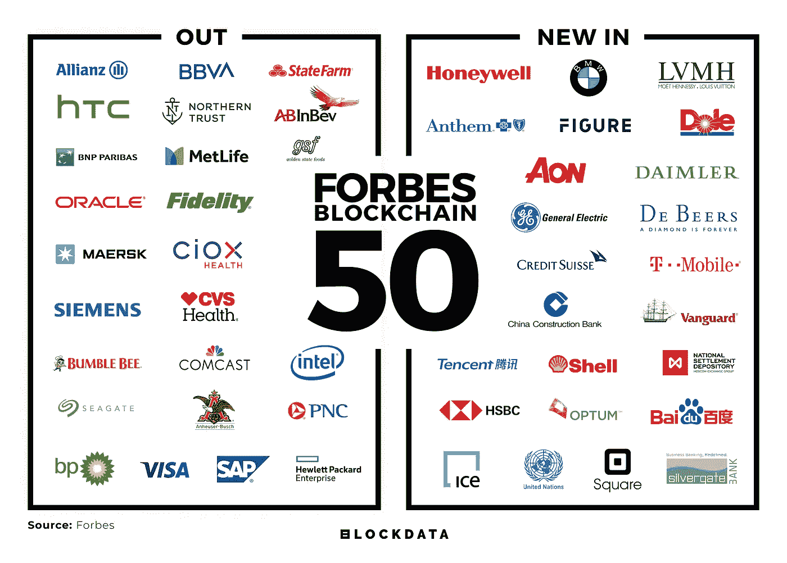
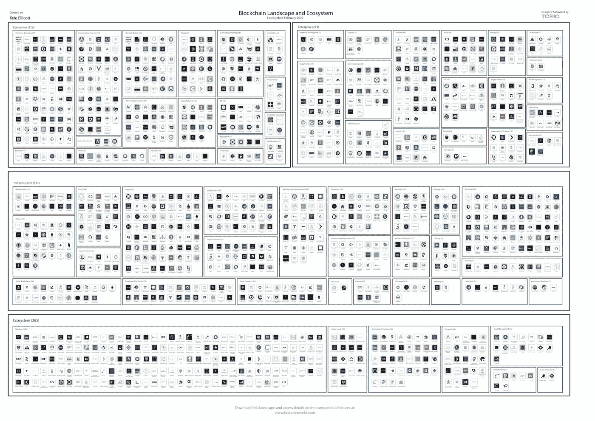

# 微软、EY、ConsenSys 携手 Baseline Protocol /脸书 Libra 改变路线/ Brave Browser 引领安全和区块链 50 项数据深度挖掘

> 原文：<https://medium.com/coinmonks/microsoft-ey-consensys-team-up-with-baseline-protocol-facebook-libra-changing-course-brave-f004d02251e7?source=collection_archive---------1----------------------->

## *2020 年 3 月 5 日*

*直接进入本周的版本，再一次，一些大动作在风景中出现。游戏已经改变为* ***微软*******EY****和****ConsenSys****宣布他们的倡议，* ***基线协议*** *，承担起为企业打造以太坊安全的重任——大家密切关注。随着* ***天秤座*******脸书*** *现在将提供政府发行的货币，如美元和欧元，以支持自己的令牌。* ***亚马逊网络服务*** *(AWS)让数字资产对所有人来说都更容易(与我的 2020 年预测一致)。* ***勇敢*** *浏览器屹立在 Chrome 之上，Firefox & Safari 拥有最安全的浏览器。****block data****团队提供了福布斯最新区块链 50 强榜单的完整细分。* ***毕马威*** *表示，加密托管机构拥有“巨大的”增长潜力(为 2020 年这一类别的扩张做好准备)。《辛普森一家》改变了碳排放的电视节目向我们展示了数字货币的未来。* ***解密*** *宣布推出自己的令牌。更多关于****TRON****/****ste emit****的关系，问题 DeFi 用户应该问 DeFi 开发者，如何建立一个去中心化的社交网络以及* ***Messari 的*** *推出新的图表工具。为了了解更多信息，让你跟上时代的步伐，这里有一张本周业内热门新闻的快照。***

*****奖金*** *:我最近发布了最新的 Q1 2020 版 my* [*区块链版图*](https://www.linkedin.com/posts/kyleellicott_q12020-blockchain-landscapekyleellicotttopionetworks-activity-6638879840634310656-UNtB) *(包含在下面供下载)，它提供了一个行业概述，突出了 900 多家全球公司、风险基金和工作组。如果这是你看到的第一个版本，就把它当作你在这个行业中进一步导航的路线图。在这里获得高分辨率的免费！***

## **📈[微软、EY 和 ConsenSys 让公共以太坊区块链对企业安全](https://www.forbes.com/sites/biserdimitrov/2020/03/04/microsoft-ey-and-consensys-to-make-the-public-ethereum-blockchain-safe-for-enterprises/#20b8d23515c9)**

**一切都将很快改变，因为区块链领域的一些最大的参与者，如[微软](https://twitter.com/MSFTBlockchain)、 [EY](https://twitter.com/EY_US) 和 [ConsenSys](https://medium.com/u/6c7078bf7b01?source=post_page-----f004d02251e7--------------------------------) 正在与区块链的公共以太坊展开他们称为[基线协议](https://consensys.net/blog/press-release/ey-and-consensys-announce-formation-of-baseline-protocol-initiative-to-make-ethereum-mainnet-safe-and-effective-for-enterprises/)的倡议。这是该领域的一个重大发展，因为该倡议采取了与以前完全不同的方法。过去，企业大多将区块链网络视为一个结算层，一个存储其交易最终状态的地方……[阅读更多](https://www.forbes.com/sites/biserdimitrov/2020/03/04/microsoft-ey-and-consensys-to-make-the-public-ethereum-blockchain-safe-for-enterprises/#20b8d23515c9) &查看更多由 [Biser Dimitrov](https://medium.com/u/f91a4cb3fbb7?source=post_page-----f004d02251e7--------------------------------)**

## **♎[脸书改变天秤座的路线，提供更包容的钱包](https://cointelegraph.com/news/facebook-changing-course-on-libra-offering-more-inclusive-wallet)**

**虽然 Libra 仍在发展，但脸书现在将提供政府发行的货币，如美元和欧元，以支持自己的令牌。此举似乎是为了安抚不情愿的监管机构，并为该计划赢得更多支持，该计划仍计划在第四季度推出。根据彭博 3 月 3 日发布的一份报告，加密货币和国家发行的货币都可以在该公司的数字钱包上使用，Calibra… [阅读更多信息](https://cointelegraph.com/news/facebook-changing-course-on-libra-offering-more-inclusive-wallet)**

## **📖[不需要区块链，数字资产与亚马逊网络服务集成](https://www.forbes.com/sites/biserdimitrov/2020/02/25/no-blockchain-needed-digital-asset-integrates-with-amazon-web-services/)**

**随着企业区块链公司受欢迎程度的提高，一些技术专家反对区块链分权的想法，因为这并不总是需要的。Amazon Web Services 推出了他们的 Quantum Ledger 数据库(QLDB ),旨在提供透明、不可变和可加密验证的交易，而无需分散化或区块链。这项成熟的技术结合了 DAML 和 AWS 的力量，通过与 DAML 区块链技术合作伙伴(BTP)平台六分仪的集成成为可能。… [阅读更多信息](https://www.forbes.com/sites/biserdimitrov/2020/02/25/no-blockchain-needed-digital-asset-integrates-with-amazon-web-services/)**

## **📈[隐私研究:勇敢的浏览器击败 Chrome、Firefox & Safari](https://cointelegraph.com/news/privacy-study-brave-browser-smacks-down-chrome-firefox-safari)**

**Douglas Leigth 博士撰写了一项研究，比较了 Chrome、Firefox、Brave、Safari、Microsoft Edge 和 Yandex 与后端服务器共享的个人数据量。 [Brave](https://brave.com/) 在所有被比较的浏览器中被证明是最隐私的浏览器，因为它不允许随着时间的推移跟踪 IP 地址，也不共享被访问网页的详细信息。微软 Edge 和 Yandex 排在最后，因为这两种浏览器都有永久的硬件标识符，即使重新安装浏览器也无法撤销… [阅读更多信息](https://cointelegraph.com/news/privacy-study-brave-browser-smacks-down-chrome-firefox-safari)**

## **📖[人力资源巨头任仕达探索区块链快速匹配人才与招聘人员](https://www.coindesk.com/human-resources-giant-randstad-explores-blockchain-to-quickly-match-talent-with-recruiters)**

**人力资源巨头任仕达已经开始测试 T2 区块链和谷歌云的组合，以提供一种更快、更简单的方法来验证合适的劳动力人才。此举旨在将相关候选人与寻求即时角色履行的公司相匹配，例如需要急救人员的医疗服务……[阅读更多](https://www.coindesk.com/human-resources-giant-randstad-explores-blockchain-to-quickly-match-talent-with-recruiters)**

## **📖[区块链存储提供安全性，但保持数据透明](https://cointelegraph.com/news/blockchain-storage-offers-security-but-leaves-data-transparent)**

**根据安全公司 Risk Based Security 的数据，去年被称为数据泄露“有史以来最糟糕的一年”，近 80 亿条记录受到影响。随着脸书、Canva 等公司遭遇黑客入侵，人们开始质疑区块链未来安全存储数据的能力。随着微软推出分散 ID 或 d ID，以及 SDS 在其面向企业的 Nexledger 中集成 QEDIT 的零知识证明，区块链已经开始回答围绕该技术提出的潜在安全责任问题……[阅读更多信息](https://cointelegraph.com/news/blockchain-storage-offers-security-but-leaves-data-transparent)**

## **📖[区块链企业为何失败:没有经济激励](https://www.coindesk.com/why-enterprise-blockchains-fail-no-economic-incentives)**

**Gartner 预测，到 2030 年，区块链将产生 3.1 万亿美元的新商业价值。然而，许多项目在最初的试点后未能成功，促使行业领导者公开辩论该技术是否过时。一些失败背后的原因是由于公司将技术置于经济设计之前。经济因素与技术因素同样重要，必须加以反映。此外，公司推迟了对收入的关注，包括完善的货币化计划……[阅读更多](https://www.coindesk.com/why-enterprise-blockchains-fail-no-economic-incentives)**

# **福布斯区块链 50 大数据深度挖掘**

**团队 [BLOCKDATA](https://medium.com/u/279c07ad0b4d?source=post_page-----f004d02251e7--------------------------------) 花时间为我们提供了福布斯最新区块链 50 强的完整细分，以获取今年榜单上最受欢迎的用例和开发平台的所有见解。与去年的名单相比，新增/删除了 24 家公司……[阅读更多](/blockdata/forbes-blockchain-50-data-deep-dive-117fc230822f)**

****

**Source: [Blockdata](/blockdata/forbes-blockchain-50-data-deep-dive-117fc230822f)**

# **本周的更多内容:**

**📈[毕马威表示，加密托管公司有“巨大的”增长潜力](https://www.theblockcrypto.com/post/57556/crypto-custodians-have-tremendous-growth-potential-says-kpmg)**

**📈[2020 年代:以太坊的崛起](/@davidschwartz_34333/2020s-the-rise-of-ethereum-a01a19f806d8)作者[大卫·施瓦茨](https://medium.com/u/be031b2a3edd?source=post_page-----f004d02251e7--------------------------------)**

**📈[《辛普森一家》预测加密货币和区块链将会越来越受欢迎](https://thecryptotime.com/the-simpsons-predict-that-cryptocurrency-and-blockchain-will-gain-in-popularity/)**

**📖[六个问题将帮助你在 160 亿美元的区块链市场中胜出](https://www.forbes.com/sites/alisonmccauley/2020/02/26/six-questions-that-will-help-you-win-in-a-16-billion-blockchain-market/#481f08431057)**

**📖[迪拜用首个区块链 KYC 平台欢迎全球企业](https://cointelegraph.com/news/dubai-welcomes-global-businesses-with-first-blockchain-kyc-platform)**

**📖[什么是隐私币？](/shapeshift-stories/what-are-privacy-coins-6df8622ebf76)通过[变形](https://medium.com/u/5ee4b8323e7a?source=post_page-----f004d02251e7--------------------------------)**

**📖[从这份由](https://www.forbes.com/sites/biserdimitrov/2020/02/28/six-things-we-learned-about-jpmorgans-blockchain-strategy-from-this-new-report/#61e33de96a02) [Biser Dimitrov](https://medium.com/u/f91a4cb3fbb7?source=post_page-----f004d02251e7--------------------------------) 撰写的新报告中，我们了解到了关于摩根大通区块链战略的六件事**

**📖[解密宣布推出自己的令牌](https://decrypt.co/21234/decrypt-announces-the-launch-of-its-own-token)**

**📖[用分散的域名对抗网络审查](https://builtin.com/blockchain/censorship-decentralized-domains)**

**📖[区块链给铀市场带来透明度](https://cointelegraph.com/news/blockchain-to-bring-transparency-to-uranium-markets)**

**📖[新的超级英雄:他们将使用游戏和区块链来解决气候问题](https://www.forbes.com/sites/nisaamoils/2020/03/04/the-new-superheros-theyll-use-gaming-and-blockchain-to-solve-climate/#785dd09b9616)**

# **分散式应用程序手表**

## **📖[从 IOST 到伊尔库因:区块链将于 2020 年推出 DApps](https://ambcrypto.com/from-iost-to-ilcoin-blockchains-for-launching-dapps-in-2020/)**

**整个 DApps 生态系统在年度令牌营业额方面已经超过 100 亿美元，而日活跃用户(dau)数量达到 100 万。有三种类型的 DApps:金融应用、部分金融应用和非金融应用。基于以太坊的 DApps 的日均用户基数在 2019 年增长了 118%，涉及的令牌数量增长了 166%(以美元计算)。排名前三的 DApps 平台还包括 EOS 和创区块链。伊尔库因区块链为 POS 终端等企业提供方便简单的解决方案……[阅读更多](https://ambcrypto.com/from-iost-to-ilcoin-blockchains-for-launching-dapps-in-2020/)**

## **📖[开发者对以太坊 2.0 将于 7 月发布有 95%的信心](https://nulltx.com/developers-are-95-confident-that-ethereum-2-0-will-launch-in-july/)**

**以太坊 2.0 的 0 期和 1 期分别完成了 99%和 90%。以太坊 2.0 将实现一个利益证明(PoS)算法，该算法将通过启动信标链来巩固以太坊区块链。信标链设计为独立于主区块链的并行网络。在 Reddit AMA 上，ETH 2.0 团队表示，直到三个客户端能够成功运行 testnets 至少八周，该网络才会启动… [阅读更多](https://nulltx.com/developers-are-95-confident-that-ethereum-2-0-will-launch-in-july/)**

## **📖 [Steemit 常务董事与 Tron 的合作——独家](https://cointelegraph.com/news/steemit-managing-director-on-acquisition-by-tron-exclusive)**

**[TRON Foundation](https://medium.com/u/7c2f78c9d321?source=post_page-----f004d02251e7--------------------------------) 于 2020 年 2 月 14 日收购了 Steemit，这是一个拥有超过 10，000 名日活跃用户的去中心化社交媒体平台。Steemit 董事总经理 Elizabeth Powell 对新的战略合作伙伴关系表示了热情，她希望 Tron 能够提供帮助 Steemit 生态系统发展所需的资源。 [Steemit](https://medium.com/u/a3df9c24e249?source=post_page-----f004d02251e7--------------------------------) 用户对 STEEM token 和 Steem witnesses 于 2 月 24 日发起的可逆软叉的未来表示担忧。根据 Powell 的说法，Tron 合作伙伴关系使 Steemit 免于达到崩溃点，并指出新功能已经开始在 Steemit 平台上实现。她还说，可逆软叉是人们对 Tron 与 Steemit 合作的快速反应的结果。… [阅读更多](https://cointelegraph.com/news/steemit-managing-director-on-acquisition-by-tron-exclusive)**

**📖[DeFi 用户应该问 DeFi 开发者的问题](https://diligence.consensys.net/blog/2020/03/questions-defi-users-should-be-asking-defi-developers/)**

**📖[Storj Labs](/@storjproject/use-cases-for-the-decentralized-cloud-9d6352095306)[的分散式云](https://medium.com/u/31bb19d6e641?source=post_page-----f004d02251e7--------------------------------)的使用案例**

**📖[如何建立一个去中心化的社交网络](https://feedweave.co/post/47zeUWFxruVhf9l-IZpxw-I7No7up2wSGekw7gQFwhE)作者[丹尼斯·纳扎罗夫](https://medium.com/u/90390ed722bf?source=post_page-----f004d02251e7--------------------------------)**

**📖[NFT 2019 年度报告现已发布！](https://nonfungible.com/blog/nft-yearly-report-2019)**

# **🚨区块链行业状况 Q1 2020:**

***上周我发布了* ***Q1 2020*** *版* [*区块链景观图*](https://www.linkedin.com/posts/kyleellicott_q12020-blockchain-landscapekyleellicotttopionetworks-activity-6638879840634310656-UNtB) *。这是我现在发布的第五版景观，包括****747****家公司(* ***900 多家独特公司*** *包括更广泛的关键生态系统参与者)和超过***2010 年至 2020 年在整个景观中筹集的超过 220 亿美元资金**——自 2010 年以来投资超过 180 亿美元—出现明显的循环，并有完整的分解。****

***一个完整的 60 分钟的景观概述视频现在可以在* [*这里*](https://www.topionetworks.com/markets/blockchain-landscape-5bf43854b9abe4633c1f87da) *免费获得。在视频中，我对 2020 年的前景进行了细分，提供了 2019 年的总结、2020 年的新兴趋势、DeFi、Libra、CDBCs、Stablecoins、DApps 等等！***

**

Source: [Topio Networks](https://www.topionetworks.com/markets/blockchain-landscape-5bf43854b9abe4633c1f87da)** 

> ***👉下载新的* [*区块链基础设施景观 Q1 2020*](https://s3.amazonaws.com/spoke-profiles-prod-assets/uploads/d21d960161f92e629f68bf78b3d148743e4b3f49/original/Blockchain_Landscape_Q1_Feb2020_KyleEllicott.pdf?utm_source=pdf&utm_medium=email&utm_campaign=kyle) *版，了解关于 DeFi、DApps、基础设施、数字货币等的见解！***

**不想等到下周，[现在就订阅](http://click1.m.readwritelabs.com/xsdqkbbrgsdtqkmntpjlstcnkytvpvphsnhsqlvbrhhd_yfqbfcmslnskglmckvqv.html?source=post_page---------------------------)📥有关区块链、DApps 等的实时行业见解！**

> **[直接在您的收件箱中获得最佳软件交易](https://coincodecap.com/?utm_source=coinmonks)**

********