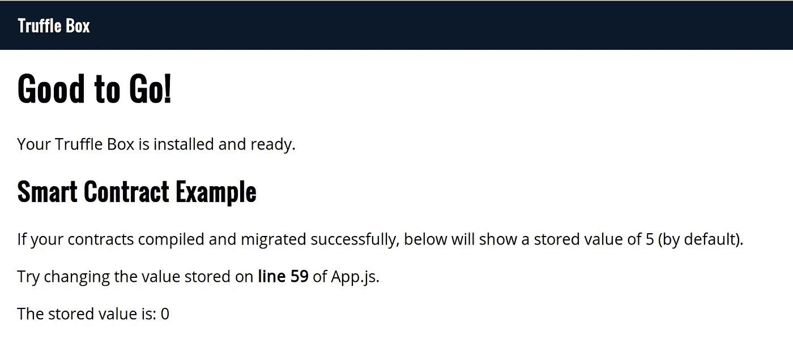
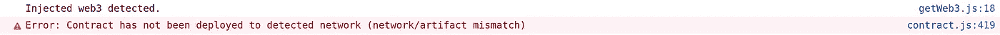
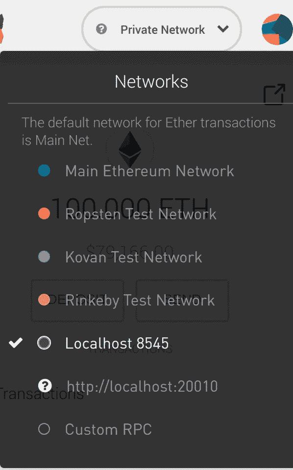
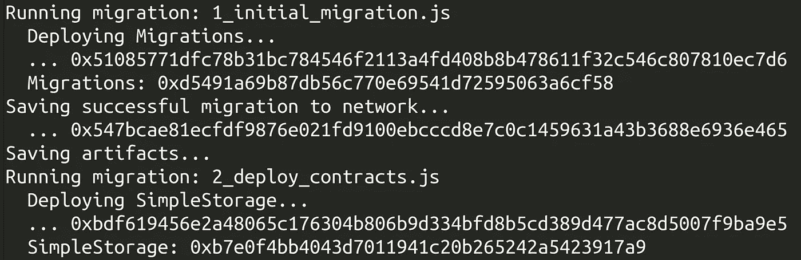
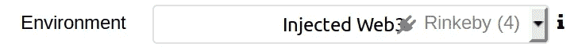

# 使用 Truffle 将以太坊智能合约迁移到实时网络

> 原文：<https://medium.com/coinmonks/migrating-an-ethereum-smart-contract-to-a-live-network-with-truffle-d5d35fcec327?source=collection_archive---------4----------------------->

一旦你建立了你的第一个以太坊智能合约，下一步就是将它部署到一个活跃的网络中，因为运行在`localhost`上的孤独的智能合约是悲伤和孤独的。

为了简单起见，本教程将使用简单的[反应松露盒](http://truffleframework.com/boxes/react)作为起点。首先，我们将在本地测试以太坊环境中测试和运行这个应用程序，然后我们将智能合约部署到 Rinkeby 测试网，并从那里运行它。

***免责声明* *本教程面向已经熟悉以太坊和智能合约基础的人。如果你是以太坊的新手，可以跟着这个教程学习，但是建议先从一个简单的“建立你的第一个 dapp”教程开始。*

# 设置

*(如果您有一个现有的 truffle 项目在本地运行，请随意跳过这一部分，并转到下面的* ***部署到 Rinkeby*** *部分。)*

第一个要求是设置您的 javascript 环境(如果您已经安装了 npm，那么您就成功了)。我首选的安装 node/npm 的方法是用 Linux/Mac 的 [nvm](https://github.com/creationix/nvm) (节点版本管理器)，或者只使用标准的[安装程序](https://nodejs.org/en/download/)。你还需要一个支持 web 3/以太坊的浏览器，我推荐使用[元掩码](https://metamask.io/)来实现这个目的。

接下来你需要安装*块菌*和*ganache；*用`npm install -g truffle ganache-cli`做这个。

然后在你想要工作的文件夹中打开终端并运行`truffle unbox react`。这将下载预先制作的样板文件，这是松露和 react 的最小设置，准备好等待几分钟来下载和配置一切。

然后运行`npm start`启动 UI，在浏览器中查看，网址为 [http://localhost:3000](http://localhost:3000.) ，界面如下。



The running truffle box.

表面上看起来一切正常，但如果您打开浏览器控制台，您将看到以下错误:



这个错误是因为合同还没有被部署到以太网，MetaMask 正在注入到浏览器中(耶，读取错误消息！).如果您没有看到“检测到注入的 web3”这一行请确保您的元掩码设置正确。

因此，我们需要做的是将智能合同部署到网络中。我们通过打开另一个终端并运行`ganache-cli -m “your twelve work pass phrase from metamask …”`来做到这一点。当我们打开 MetaMask 并将网络设置为“Localhost 8545”时，我们会看到 100.0 Eth 出现在我们的帐户中。



Selecting the Ganache testnet in MetaMask

现在我们需要告诉 Truffle 这个网络，这样它就可以部署到这个网络上。编辑“truffle.js”(或 Windows 上的“truffle-config.js”)文件，包含以下内容:

```
module.exports = {
  networks: {
    development: {
      host: 'localhost',
      port: 8545,
      network_id: '*' // Match any network id
    }
  }
};
```

现在跑`truffle compile`接着跑`truffle migrate --network development`。重新加载 UI，将显示一个元掩码对话框，要求您确认交易；前提是元掩码已解锁。接受交易后，代码会将智能合约中的一个变量设置为“5 ”,并在浏览器中显示。

到目前为止一切顺利！我亲爱的朋友们。

## 部署到林克比

设置元掩码以使用“Rinkeby 测试网络”。如果您的余额为零，请到这个[龙头](https://faucet.rinkeby.io/)为您的主要以太坊地址(您在 MetaMask 中的第一个地址)获取一些测试以太。将合同部署到以太坊是一个昂贵的过程(复杂的合同可能高达 50 美元)，所以我强烈建议使用测试以太网进行练习。

为了方便起见，我们将使用 Infura 作为托管节点；因此，请继续操作，在这里创建一个 Infura 帐户[，并记录您收到的密钥。我将在下一节介绍如何使用本地运行的以太坊节点。](https://infura.io/signup)

接下来，运行`npm i -s truffle-hdwallet-provider`来安装一个提供者，它会将您连接到所选的网络，签署您的交易并将这些交易提交给网络。

web3 使用“提供者”向以太坊网络提交交易，并在这种情况下签署这些交易。要使用该提供程序，请将以下内容添加到您的`truffle.js`文件中。我们对 rinkeby 使用 3 的`network_id`,但是其他可能感兴趣的网络 id 分别是 main-net、ropsten 和 kovan 的 1、4、42。

```
const HDWalletProvider = require("truffle-hdwallet-provider");
const memonic = "your twelve work pass phrase from metamask …"
module.exports = {
  networks: {
    development: {
      host: 'localhost',
      port: 8545,
      network_id: '*' // Match any network id
    },
    rinkeby: {
      provider: function() {
        return new HDWalletProvider(memonic, "[https://rinkeby.infura.io/](https://rinkeby.infura.io/KbYGhpVayiCZmhG8JMXE)<<your_infura_access_token>>")
      },
      network_id: 3
    }
  }
};
```

现在您已经准备好再次运行迁移`truffle migrate --network rinkeby`。这将比上次我们使用 Ganache 时花费更长的时间，因为我们需要等待网络挖掘数据块。



然后，您可以从交易中复制散列，在本例中为`0xbdf619456e2a48065c176304b806b9d334bfd8b5cd389d477ac8d5007f9ba9e5`，并在 [rinkeby etherscan](https://rinkeby.etherscan.io) 上搜索它，以确认和查看您的交易的详细信息。

再次打开用户界面，确认设置存储的交易，并确认交易在 [etherscan](http://rinkeby.etherscan.io) 上通过。

祝贺您，您已将您的第一份合同部署到公共网络！

## 挑战

如果您想尝试稍微困难一点的东西，您可以尝试使用这个修改过的[提供者引擎](https://gist.github.com/JasoonS/11fca1a98f1eb41a79987a041541e8c8)来部署您的合同，它直接使用私钥，而不是 memonic 短语。这是直接从原来的[松露-高清钱包-供应商](https://github.com/trufflesuite/truffle-hdwallet-provider/blob/master/index.js)修改而来。

# 使用本地运行的节点

您也可以使用未锁定的帐户直接部署到本地节点。请特别小心使用这种方法，如果你的以太坊节点对公众开放，他们可以用你的未锁定账户执行交易。这可以通过在本地运行奇偶校验或 geth 来实现。请参考各自的文档进行设置。

一旦您的节点正确运行，您就可以像使用 Ganache 一样部署您的合同，因为它也只是为您提供一组解锁的帐户。

## 将合同部署到公共网络的另一种有趣方式

您可以使用[https://remix.ethereum.org](https://remix.ethereum.org/#optimize=false&version=soljson-v0.4.23+commit.124ca40d.js)，将您的代码粘贴到那里，或者使用 [remixd，](https://github.com/ethereum/remixd)选择您的环境(注入的 web3 指的是元掩码，如下图所示)，然后单击部署。如果你使用这种方法，你需要手动保存并链接合同地址到 Truffle，如果你想为你的 UI 使用 Truffle 的话。



我希望你在部署你的第一个 dapp 到世界上的时候玩得开心！

如果您有任何问题或建议，请在下面留下评论。