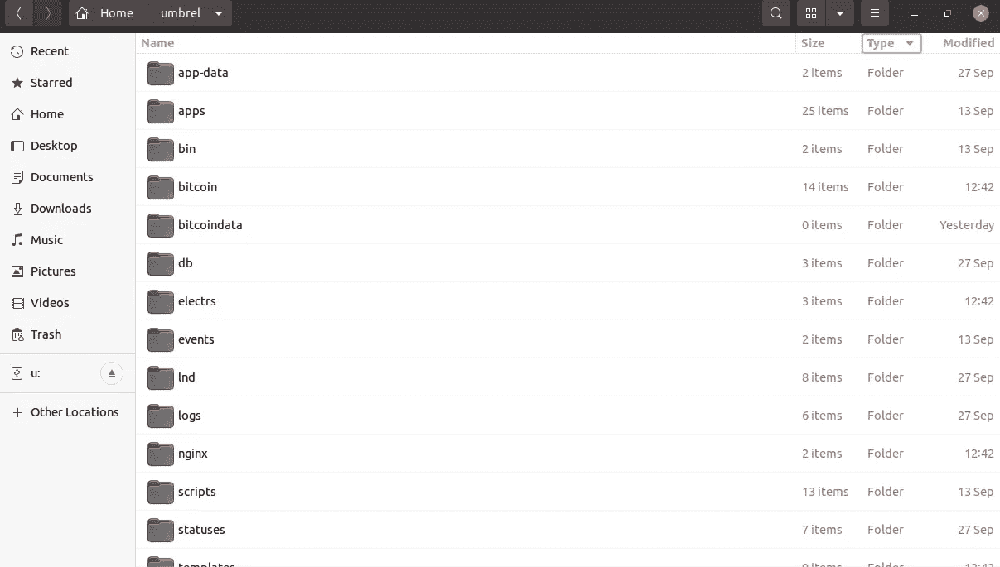
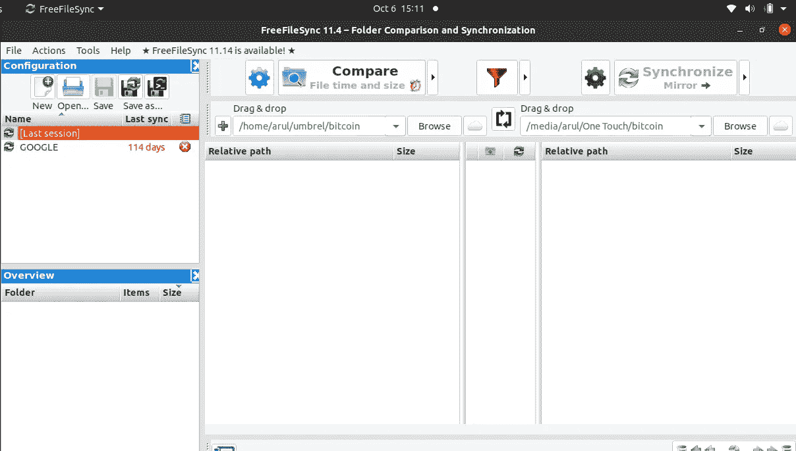
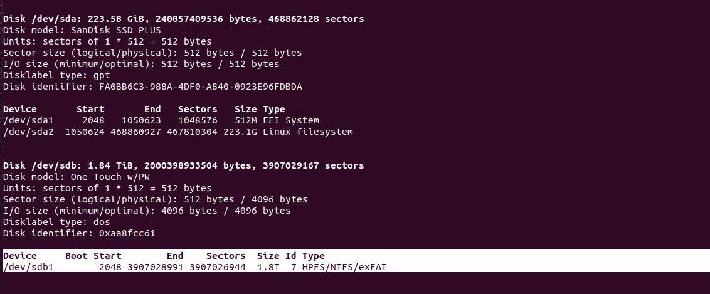
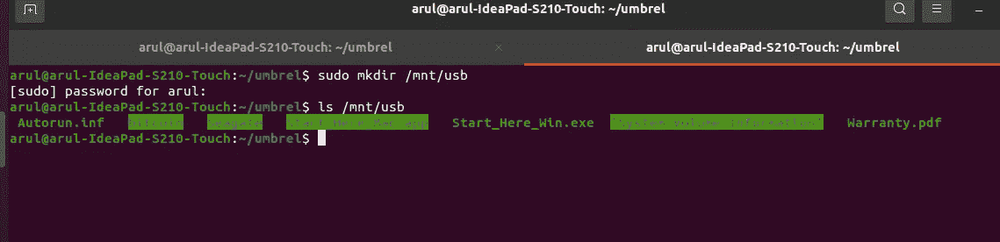
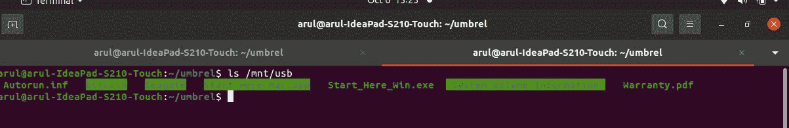
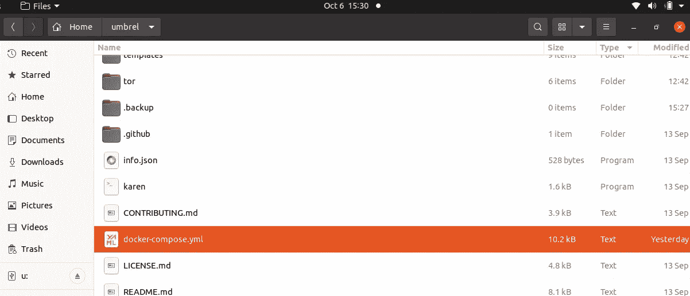
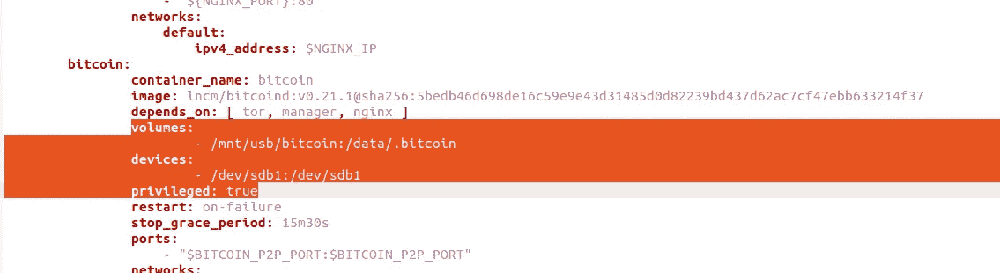
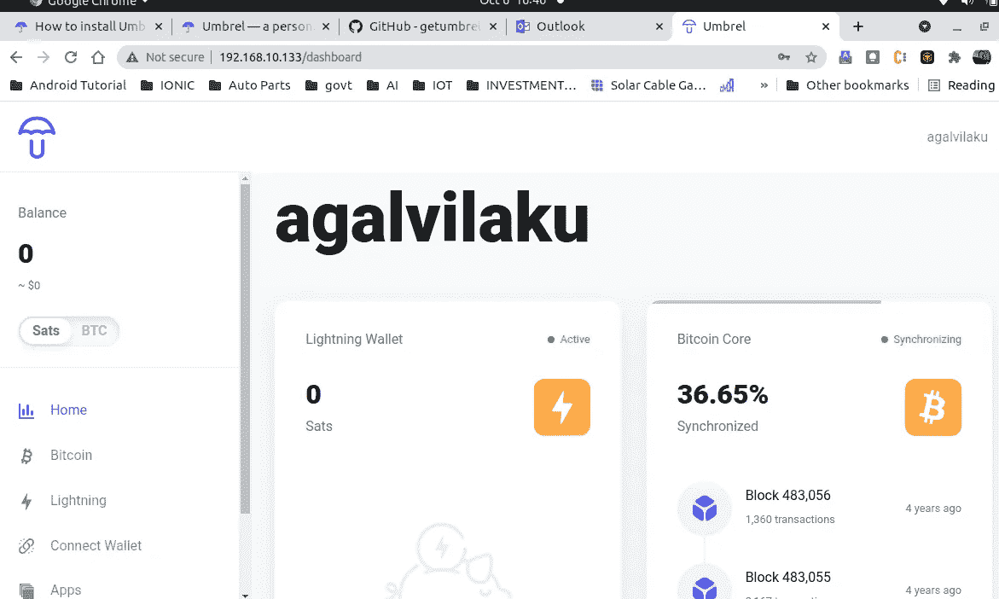

# 将 Umbrel 比特币块迁移到外部存储

> 原文：<https://medium.com/coinmonks/migrating-umbrel-bitcoin-blocks-to-external-storage-a886821d2b3e?source=collection_archive---------1----------------------->

这篇文章是我之前关于在 Ubuntu 上安装 Umbrel 的文章的延续。之前文章的链接在这里——[“在 ubuntu](/@cmdevendran/running-your-own-bitcoin-node-6590935f6790) 上运行自己的比特币节点”。

正如我在之前的文章中提到的，我使用的是一台只有 256 GB 硬盘空间的旧笔记本电脑。我很清楚，我的硬盘空间不足以下载所有用于验证的比特币块，但是，由于 Umbrel 在他们的产品报道中提到他们正在使用 Docker image，我有信心在某个时间点，我将能够将我的比特币块移动到外部硬盘，而无需再次重新同步。

在我最初安装 Ubuntu 之后，比特币核心和 Umbrel 之间的同步非常快，我的硬盘已经达到了其存储容量的 95%，我知道是时候将存储空间转移出去了。订购了一个新的 2TB USB 硬盘，到货后，开始将存储从本地存储转移到外部存储。

## 准备工作

在我们开始做任何事情之前，我们需要了解 Umbrel 中的文件夹结构。正如下面的 screeshot(图 1)所示，有许多文件夹，但对我们来说，我们只关心名为“比特币”的文件夹，所有比特币块都在其中同步。在与比特币核心同步 35%时，该文件夹接近 142 GB。我们的目标是只移动这个存储空间，而不是整个 Umbrel docker。

Umbrel 文件夹结构

figure 1

## *需要做些什么？*

1.  将比特币文件夹从本地存储移动到外部存储。
2.  将您的外部存储(USB 驱动器)安装到 Ubuntu。
3.  将 docker-compose.yml 文件配置为指向新的存储位置。
4.  再次运行你的伞。

## 从本地存储移动到外部存储:

1.  将外置硬盘插入 USB 驱动器。
2.  在你的外置硬盘上新建一个文件夹，名为“比特币”。
3.  将“您的 umbrel 安装文件夹”/bitcoin 中的所有文件复制到外部 HDD bitcoin 文件夹中。就我而言，我使用的是 Ubuntu 的 freefilesync 软件。它是开源的，可以免费使用。你可以从这里下载软件->【https://freefilesync.org/ 

## 将外置 USB 硬盘安装到 ubuntu

1.  一旦所有的文件都被复制。是时候把 USB 硬盘安装到 Ubuntu 上了。进入 Ubuntu 终端，输入命令 ***sudo fdisk -l.*** 它会列出你的硬盘和 USB 硬盘的所有信息。你可以看看下面的截图，我的外置硬盘被分配了设备名 **/dev/sdb1。**记下计算机中 USB 硬盘的设备名称。

2.现在，我们需要把这个设备安装到 Ubuntu 上。首先，我们需要在外部 USB 硬盘的本地驱动器 w.r.t .中创建一个参考文件夹。因此，当您调用本地驱动器时，它总是会引用外部 USB 硬盘。

运行命令创建参考文件夹

***sudo mkdir/mnt/USB***

3.将设备挂载到我们创建的参考文件夹中。在终端中键入以下命令。

**sudo mount/dev/SD B1/mnt/USB**

为了理解命令， **/dev/sdb1** 是 Ubuntu 分配给我的外置硬盘的设备名。
**/mnt/usb** 是我们之前创建的映射到外置硬盘的参考文件夹。即类似于调用 USB 的名称，而不是通过设备名称来调用它。

4.通过键入以下命令，检查您的安装是否正确。

**ls /mnt/usb**

你可以在截图中看到，当我运行命令列出我的参考文件夹时，它实际上列出了我的 USB 外部硬盘中的所有文件夹。这意味着参考路径“/mnt/usb”工作正常。

## 配置 Umbrel Docker

到目前为止，我们已经实现了将比特币文件夹从本地复制到外部硬盘，并将我们的硬盘安装到 Ubuntu。

现在，我们需要告诉 Umbrel Docker 映像在外部 HDD 而不是本地 HDD 文件夹中查找比特币文件夹。为此，我们需要对 docker-compose.yml 文件做一些更改。

1.  转到您的 umbrel 安装文件夹，并寻找 docker-compose.yml 文件

2.在进行任何更改之前，请先备份该文件。不要跳过这一部分。备份完成后，在任何文本编辑器中打开文件，滚动到比特币配置引用的部分。我们将对突出显示的部分进行更改。

***请注意缩进是非常重要的。yml 文件。遵循与现有文件中相同的缩进。更改缩进将导致无法启动 docker 图像，即使您的输入是正确的。***

3.更改音量:在比特币下:查找音量并进行如下更改

***前变***-$ { PWD }/比特币:/data/。比特币

***改*** 后-/mnt/USB/比特币:/data/。比特币

因此，前面的配置说，比特币控制器是当前目录/比特币，即本地

现在，我们告诉它寻找外部硬盘，我们已经将它挂载到 **/mnt/usb** ，并且还将比特币文件从本地复制到外部。

4.设备名称:创建一个名为 devices 的新条目，并从您的计算机中给出您的外部 HDD 设备名称，我们之前看到了如何通过 ***fdisk -l*** 来查找它

**设备:
- /dev/sdb1:/dev/sdb1**

通过在这里提到设备名，我们告诉 docker 明确地查看设备/dev/sdb1，它只不过是我们的外部 HDD。

5.给予许可:

**特权:真**

这是为了授予 docker 在外部安装的文件夹上读取、写入和执行的权限。 ***由于我的区块正在同步中，我稍后将尝试删除此权限，看看它是否仍然有效，并将在评论中更新。*

6.保存并关闭文件。

## 运行您的 Umbrel:

须藤。/脚本/启动

如果一切顺利，那么您的仪表板将启动并运行。块将从它离开的地方开始同步。例如，我的在 35%处停止，并从那里开始同步，而不是从 0 开始。

## 考虑

1.  在我将比特币块文件夹从内部硬盘移动到外部硬盘后，与比特币核心同步的性能大幅下降。以前，实现 35%的同步只需不到 10 个小时，而移动到外置硬盘后，1%的额外同步需要 1 个多小时。因此，我发现移动到外置硬盘后，同步速度下降了。如果有选择的话，我会把它保存在内存中。

**我犯的错误**

我至少花了 5 到 6 个小时才使这东西运转起来。一路上犯了一些错误并改正了它。例如，在 Docker 文档中，他们会要求您通过 Docker 命令创建卷，我遵循了它，但并不真正成功。此外，设备名称在。yml 文件，而不是可能的文档明确要求你这样做。最后一个，在对。yml 文件，我运行它作为传统的 docker 作曲家，即 ***docker 组成。虽然它启动了 docker 映像，但最终它因出错而终止，后来意识到我应该通过启动脚本来启动 Umbrel。***

快乐学习！！

> 加入 Coinmonks [电报频道](https://t.me/coincodecap)和 [Youtube 频道](https://www.youtube.com/c/coinmonks/videos)了解加密交易和投资

## 也阅读

 [## 最佳加密交易所| 2021 年十大加密货币交易所

### ICON _ PLACEHOLDEREstimated 预计阅读时间:28 分钟加密货币交易所的加密交易需要知识…

blog.coincodecap.com](https://blog.coincodecap.com/crypto-exchange)  [## 2021 年 10 大最佳加密贷款平台| CoinCodeCap

### 当谈到加密货币贷款时，大量因素等同于良好的收入状况。此外，借款的一部分…

blog.coincodecap.com](https://blog.coincodecap.com/crypto-lending)  [## 2021 年最佳免费加密交易机器人

### 2021 年币安、比特币基地、库币和其他密码交易所的最佳密码交易机器人。四进制，位间隙…

medium.com](/coinmonks/crypto-trading-bot-c2ffce8acb2a)  [## BlockFi 评论 2021:利弊和利率| CoinCodeCap

### 今天，我们提出了一个全面的 BlockFi 评论，这是一个成立于 2017 年的加密贷款平台，拥有其…

blog.coincodecap.com](https://blog.coincodecap.com/blockfi-review)  [## 如何在印度购买比特币？2021 年购买比特币的 7 款最佳应用[手机版]

### 如何使用移动应用程序购买比特币印度

medium.com](/coinmonks/buy-bitcoin-in-india-feb50ddfef94)  [## 加密税务软件——五大最佳比特币税务计算器[2021]

### 不管你是刚接触加密还是已经在这个领域呆了一段时间，你都需要交税。

medium.com](/coinmonks/best-crypto-tax-tool-for-my-money-72d4b430816b)  [## 存储比特币的最佳加密硬件钱包[2021] | CoinCodeCap

### 保管您的数字资产很容易，但找到正确的存储方式却是一项繁琐的任务。在线钱包有一个风险…

blog.coincodecap.com](https://blog.coincodecap.com/best-hardware-wallet-bitcoin)