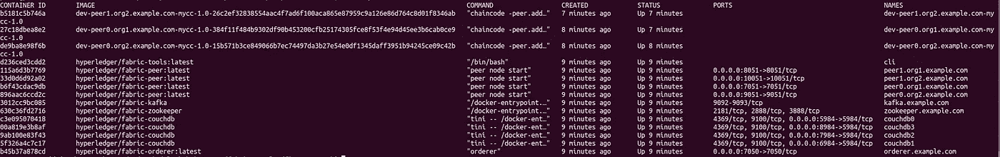

# 从 Kafka 到 Hyperledegr 面料的 RAFT 迁移 1.4.3

> 原文：<https://medium.com/coinmonks/migration-from-kafka-to-raft-in-hyperledegr-fabric-1-4-3-6a7b893da4c8?source=collection_archive---------1----------------------->

点击下载[的面料样品。请访问[安装说明](](https://github.com/hyperledger/fabric-samples) [链接](http://hyperledger-fabric.readthedocs.io/en/latest/install.html))以确保您安装了正确的先决条件。

使用 1.4.3 下载最新的二进制文件和 Docker 映像。所有安装说明都将使用``scripts/bootstrap.sh` `
。如果您没有找到任何`script/bootstrap.sh``文件，请使用以下命令从 fabric 存储库中获取 bootstrap.sh

curl-sS[https://raw . githubusercontent . com/hyperledger/fabric/master/scripts/bootstrap . sh](https://raw.githubusercontent.com/hyperledger/fabric/master/scripts/bootstrap.sh)-o ./scripts/bootstrap . sh

#将文件模式更改为可执行文件
chmod+x ./scripts/bootstrap . sh

从结构示例目录执行以下命令。

。/脚本/bootstrap.sh

默认情况下，它将下载最新的二进制文件和最新的 docker 映像。如果您想下载特定的，请执行以下命令，给出特定的版本

。/scripts/bootstrap . sh[版本] [ca 版本][第三方版本]。

你可以看到所有的二进制文件都下载到了`/bin`文件夹。

转到第一个网络文件夹`cd first-network`

在创建证书之前，请在`crypto-config.yaml the the` 文件中进行以下更改，注释 EnableNodeOUs: true 并添加 CA，如下所示(粗体)。对于版本 1.4.3，cryptogen tool 正在生成节点组织单元(ou ),作为订购方的客户端，对于对等方，它正在按预期创建正确的节点组织单元(作为管理员的节点 OU)。

> [发现并回顾最佳区块链软件](https://coincodecap.com)

```
OrdererOrgs:# ---------------------------------------------------------------------------# Orderer# ---------------------------------------------------------------------------- Name: OrdererDomain: example.com# EnableNodeOUs: true**CA:****OrganizationalUnit: admin**# ---------------------------------------------------------------------------# "Specs" - See PeerOrgs below for complete description# ---------------------------------------------------------------------------Specs:- Hostname: orderer- Hostname: orderer2- Hostname: orderer3- Hostname: orderer4- Hostname: orderer5Users:Count: 1
```

使用以下命令生成证书(默认使用 cryptogen 工具)

。/byfn generate -o 卡夫卡

下一步是使用以下命令启动网络。这里我们使用状态数据库作为沙发数据库，使用 Kafka zookeeper 订购服务节点。

。/byfn.sh up -o 卡夫卡-s couchdb

一旦网络启动，您将能够看到以下成功消息。


通过执行命令，您可以看到所有容器都在运行

` docker ps `或 docker 容器列表



对于任何类型的配置块更改，我们遵循以下相同的步骤。


我们需要遵循以下三个步骤将 Kafka 迁移到 RAFT

. 1)打开维护模式
2)将共识类型更改为 etcdraft
3)关闭维护模式

第一步

打开维护模式
登录 cli 容器

```
docker exec -ti cli bash
```

如果我们从 v1.3 升级到 v1.4.3，我们需要将系统通道名设置为`testchainid`:

```
CHANNEL_NAME=testchainid
```

如果我们从 v1.4.1 升级到 v1.4.3，我们需要将系统通道名设置为`byfn-sys-channel`:

```
CHANNEL_NAME=byfn-sys-channel
```

注意:确保正确使用系统通道名

对 mychannel 执行以下命令

```
# export all needed env varsexport ORDERER_CA=/opt/gopath/src/github.com/hyperledger/fabric/peer/crypto/ordererOrganizations/example.com/orderers/orderer.example.com/msp/tlscacerts/tlsca.example.com-cert.pemexport CHANNEL_NAME=mychannel # make sure channel name is correct# change work directoriesmkdir maintenance_on_$CHANNEL_NAME && cd maintenance_on_$CHANNEL_NAME# fetch current channel configpeer channel fetch config config_block.pb -o orderer.example.com:7050 -c $CHANNEL_NAME --tls --cafile $ORDERER_CA# decode fetched channel configconfigtxlator proto_decode --input config_block.pb --type common.Block | jq .data.data[0].payload.data.config > config.json# save old config, to calculate delta in the futurecp config.json config_mod.json# set maintenance mode in configssed -i 's/NORMAL/MAINTENANCE/g' config_mod.json# encode old config to protopufconfigtxlator proto_encode --input config.json --type common.Config --output config.pb# encode new config to protopufconfigtxlator proto_encode --input config_mod.json --type common.Config --output modified_config.pb# compute delta between configsconfigtxlator compute_update --channel_id $CHANNEL_NAME --original config.pb --updated modified_config.pb --output config_update.pb# decode delta configconfigtxlator proto_decode --input config_update.pb --type common.ConfigUpdate | jq . > config_update.json# wrap delta config with a headerecho '{"payload":{"header":{"channel_header":{"channel_id":"mychannel", "type":2}},"data":{"config_update":'$(cat config_update.json)'}}}' | jq . > config_update_envelope.json# encode wrapped config to protopufconfigtxlator proto_encode --input config_update_envelope.json --type common.Envelope --output config_update_in_envelope.pb# export all needed env vars
export CORE_PEER_LOCALMSPID="OrdererMSP"export CORE_PEER_TLS_ROOTCERT_FILE=/opt/gopath/src/github.com/hyperledger/fabric/peer/crypto/crypto/ordererOrganizations/example.com/orderers/orderer.example.com/tls/ca.crtexport CORE_PEER_MSPCONFIGPATH=/opt/gopath/src/github.com/hyperledger/fabric/peer/crypto/ordererOrganizations/example.com/users/Admin@example.com/msp/export CORE_PEER_ADDRESS=peer0.org1.example.com:7051# submit new channel config
peer channel update -f config_update_in_envelope.pb -c $CHANNEL_NAME -o orderer.example.com:7050 --tls --cafile $ORDERER_CA
```

预期产出:

```
2019-11-26 07:15:08.563 UTC [channelCmd] InitCmdFactory -> INFO 001 Endorser and orderer connections initialized2019-11-26 07:15:08.711 UTC [channelCmd] update -> INFO 002 Successfully submitted channel update
```

对系统通道也执行相同的过程。

```
# export all needed env varsexport CHANNEL_NAME=byfn-sys-channel# change work directoriescd ..mkdir maintenance_on_$CHANNEL_NAME && cd maintenance_on_$CHANNEL_NAME# fetch current channel configpeer channel fetch config config_block.pb -o orderer.example.com:7050 -c $CHANNEL_NAME --tls --cafile $ORDERER_CA# decode fetched channel configconfigtxlator proto_decode --input config_block.pb --type common.Block | jq .data.data[0].payload.data.config > config.json# save old config, to calculate delta in the futurecp config.json config_mod.json# set maintenance mode in configssed -i 's/NORMAL/MAINTENANCE/g' config_mod.json# encode old config to protopufconfigtxlator proto_encode --input config.json --type common.Config --output config.pb# encode new config to protopufconfigtxlator proto_encode --input config_mod.json --type common.Config --output modified_config.pb# compute delta between configsconfigtxlator compute_update --channel_id $CHANNEL_NAME --original config.pb --updated modified_config.pb --output config_update.pb# decode delta configconfigtxlator proto_decode --input config_update.pb --type common.ConfigUpdate | jq . > config_update.json# wrap delta config with a headerecho '{"payload":{"header":{"channel_header":{"channel_id":"byfn-sys-channel", "type":2}},"data":{"config_update":'$(cat config_update.json)'}}}' | jq . > config_update_envelope.json# encode wrapped config to protopufconfigtxlator proto_encode --input config_update_envelope.json --type common.Envelope --output config_update_in_envelope.pb# sign channel update config#peer channel signconfigtx -f config_update_in_envelope.pb# export all needed env varsexport CORE_PEER_LOCALMSPID="OrdererMSP"export CORE_PEER_TLS_ROOTCERT_FILE=/opt/gopath/src/github.com/hyperledger/fabric/peer/crypto/crypto/ordererOrganizations/example.com/orderers/orderer.example.com/tls/ca.crtexport CORE_PEER_MSPCONFIGPATH=/opt/gopath/src/github.com/hyperledger/fabric/peer/crypto/ordererOrganizations/example.com/users/Admin@example.com/msp/export CORE_PEER_ADDRESS=peer0.org1.example.com:7051# submit new channel configpeer channel update -f config_update_in_envelope.pb -c $CHANNEL_NAME -o orderer.example.com:7050 --tls --cafile $ORDERER_CA
```

预期产出

```
2019-11-26 07:22:58.069 UTC [channelCmd] InitCmdFactory -> INFO 001 Endorser and orderer connections initialized2019-11-26 07:22:58.221 UTC [channelCmd] update -> INFO 002 Successfully submitted channel update
```

通过运行以下命令重新启动所有必需的容器

```
docker restart $(docker ps -a | grep "hyperledger/fabric" | awk '{print $1}')
```

步骤 2
更改配置块中的共识类型

登录到 cli 容器

`docker exec -it cli bash`

执行以下命令

```
# export all needed env varsexport ORDERER_CA=/opt/gopath/src/github.com/hyperledger/fabric/peer/crypto/ordererOrganizations/example.com/orderers/orderer.example.com/msp/tlscacerts/tlsca.example.com-cert.pemexport CHANNEL_NAME=mychannelexport CORE_PEER_LOCALMSPID="OrdererMSP"export CORE_PEER_TLS_ROOTCERT_FILE=/opt/gopath/src/github.com/hyperledger/fabric/peer/crypto/crypto/ordererOrganizations/example.com/orderers/orderer.example.com/tls/ca.crtexport CORE_PEER_MSPCONFIGPATH=/opt/gopath/src/github.com/hyperledger/fabric/peer/crypto/ordererOrganizations/example.com/users/Admin@example.com/msp/export CORE_PEER_ADDRESS=peer0.org1.example.com:7051# change work directoriesmkdir switch_to_raft_${CHANNEL_NAME} && cd switch_to_raft_${CHANNEL_NAME}# fetch current channel configpeer channel fetch config config_block.pb -o orderer.example.com:7050 -c $CHANNEL_NAME --tls --cafile $ORDERER_CA# decode fetched channel configconfigtxlator proto_decode --input config_block.pb --type common.Block | jq .data.data[0].payload.data.config > config.json# save old config, to calculate delta in the futurecp config.json config_mod.json
```

打开 **Config_mod.json** 在这个文件中做如下更新。该文件应该位于位置 workdir/switch _ to _ raft _ my channel 中

替换 config_mod.json 文件中的以下块

```
"ConsensusType": {"mod_policy": "Admins","value": {"metadata": {"consenters": [{"client_tls_cert": "LS0tLS1<…>LS0tLQo=","host": "orderer.example.com","port": 7050,"server_tls_cert": "LS0tLS1<...>tLQo="}],"options": {"election_tick": 10,"heartbeat_tick": 1,"max_inflight_blocks": 5,"snapshot_interval_size": 20971520,"tick_interval": "500ms"}},"state": "STATE_MAINTENANCE","type": "etcdraft"},"version": "1"}
```

client_tls_cert 和 server_tls_cert 字段实际上是相等的，并且应该包含 base64 编码的订购者服务证书。您可以通过在我们已经打开的 CLI 容器中执行以下命令来获得该值。

```
base64 /opt/gopath/src/github.com/hyperledger/fabric/peer/crypto/ordererOrganizations/example.com/orderers/orderer.example.com/tls/server.crt -w0 && echo ""# encode old config to protopufconfigtxlator proto_encode --input config.json --type common.Config --output config.pb# encode new config to protopufconfigtxlator proto_encode --input config_mod.json --type common.Config --output modified_config.pb# compute delta between configsconfigtxlator compute_update --channel_id $CHANNEL_NAME --original config.pb --updated modified_config.pb --output config_update.pb# decode delta configconfigtxlator proto_decode --input config_update.pb --type common.ConfigUpdate | jq . > config_update.json# wrap delta config with a headerecho '{"payload":{"header":{"channel_header":{"channel_id":"mychannel", "type":2}},"data":{"config_update":'$(cat config_update.json)'}}}' | jq . > config_update_envelope.json# encode wrapped config to protobufconfigtxlator proto_encode --input config_update_envelope.json --type common.Envelope --output config_update_in_envelope.pb# sign channel update config# peer channel signconfigtx -f config_update_in_envelope.pb# export all needed env varsexport CORE_PEER_TLS_ROOTCERT_FILE=/opt/gopath/src/github.com/hyperledger/fabric/peer/crypto/crypto/ordererOrganizations/example.com/orderers/orderer.example.com/tls/ca.crtexport CORE_PEER_MSPCONFIGPATH=/opt/gopath/src/github.com/hyperledger/fabric/peer/crypto/ordererOrganizations/example.com/users/Admin@example.com/msp/export CORE_PEER_ADDRESS=peer0.org1.example.com:7051# submit new channel configpeer channel update -f config_update_in_envelope.pb -c $CHANNEL_NAME -o orderer.example.com:7050 --tls --cafile $ORDERER_CA
```

预期产出

```
2019-11-26 07:55:38.417 UTC [channelCmd] InitCmdFactory -> INFO 001 Endorser and orderer connections initialized2019-11-26 07:55:38.572 UTC [channelCmd] update -> INFO 002 Successfully submitted channel update
```

对系统通道执行上述相同的步骤

```
export CHANNEL_NAME=byfn-sys-channelcd ..# change work directoriesmkdir switch_to_raft_${CHANNEL_NAME} && cd switch_to_raft_${CHANNEL_NAME}# fetch current channel configpeer channel fetch config config_block.pb -o orderer.example.com:7050 -c $CHANNEL_NAME --tls --cafile $ORDERER_CA# decode fetched channel configconfigtxlator proto_decode --input config_block.pb --type common.Block | jq .data.data[0].payload.data.config > config.json# save old config, to calculate delta in the futurecp config.json config_mod.json
```

打开 **Config_mod.json** 在这个文件中做如下更新。文件应该在位置 workdir/switch _ to _ raft _ byfn-sys-channel 中可用

替换 config_mod.json 文件中的以下块

```
"ConsensusType": {"mod_policy": "Admins","value": {"metadata": {"consenters": [{"client_tls_cert": "LS0tLS1<…>LS0tLQo=","host": "orderer.example.com","port": 7050,"server_tls_cert": "LS0tLS1<...>tLQo="}],"options": {"election_tick": 10,"heartbeat_tick": 1,"max_inflight_blocks": 5,"snapshot_interval_size": 20971520,"tick_interval": "500ms"}},"state": "STATE_MAINTENANCE","type": "etcdraft"},"version": "1"}
```

client_tls_cert 和 server_tls_cert 字段实际上是相等的，并且应该包含 base64 编码的订购者服务证书。您可以通过在我们已经打开的 CLI 容器中执行以下命令来获得该值。

```
base64 /opt/gopath/src/github.com/hyperledger/fabric/peer/crypto/ordererOrganizations/example.com/orderers/orderer.example.com/tls/server.crt -w0 && echo ""
```

在 CLI 上执行以下命令

```
# encode old config to protopufconfigtxlator proto_encode --input config.json --type common.Config --output config.pb# encode new config to protopufconfigtxlator proto_encode --input config_mod.json --type common.Config --output modified_config.pb# compute delta between configsconfigtxlator compute_update --channel_id $CHANNEL_NAME --original config.pb --updated modified_config.pb --output config_update.pb# decode delta configconfigtxlator proto_decode --input config_update.pb --type common.ConfigUpdate | jq . > config_update.json# wrap delta config with a headerecho '{"payload":{"header":{"channel_header":{"channel_id":"byfn-sys-channel", "type":2}},"data":{"config_update":'$(cat config_update.json)'}}}' | jq . > config_update_envelope.json# encode wrapped config to protopufconfigtxlator proto_encode --input config_update_envelope.json --type common.Envelope --output config_update_in_envelope.pb# sign channel update config# peer channel signconfigtx -f config_update_in_envelope.pb# export all needed env varsexport CORE_PEER_LOCALMSPID="OrdererMSP"export CORE_PEER_TLS_ROOTCERT_FILE=/opt/gopath/src/github.com/hyperledger/fabric/peer/crypto/crypto/ordererOrganizations/example.com/orderers/orderer.example.com/tls/ca.crtexport CORE_PEER_MSPCONFIGPATH=/opt/gopath/src/github.com/hyperledger/fabric/peer/crypto/ordererOrganizations/example.com/users/Admin@example.com/msp/export CORE_PEER_ADDRESS=peer0.org1.example.com:7051# submit new channel configpeer channel update -f config_update_in_envelope.pb -c $CHANNEL_NAME -o orderer.example.com:7050 --tls --cafile $ORDERER_CA
```

预期产出

```
2019-11-26 07:55:38.417 UTC [channelCmd] InitCmdFactory -> INFO 001 Endorser and orderer connections initialized2019-11-26 07:55:38.572 UTC [channelCmd] update -> INFO 002 Successfully submitted channel update
```

退出 CLI 并重新启动所有与 fabric 相关的

```
docker restart $(docker ps -a | grep "hyperledger/fabric" | awk '{print $1}')
```

20 秒后，检查订购者日志，它应该显示如下


你可以搜索“etcdraft 迁移检测”，你将能够看到 raft 订购服务的日志。

步骤 3
关闭维护模式

现在我们已经更新了必要的配置，我们需要将两个通道(mychannel 和 sys-channel)的维护模式禁用为正常模式

登录到 CLIcontainer

```
docker exec -it cli bash
```

在 CLI 中运行以下代码

```
# export all needed env varsexport CORE_PEER_LOCALMSPID="OrdererMSP"export CORE_PEER_TLS_ROOTCERT_FILE=/opt/gopath/src/github.com/hyperledger/fabric/peer/crypto/crypto/ordererOrganizations/example.com/orderers/orderer.example.com/tls/ca.crtexport CORE_PEER_MSPCONFIGPATH=/opt/gopath/src/github.com/hyperledger/fabric/peer/crypto/ordererOrganizations/example.com/users/Admin@example.com/msp/export CORE_PEER_ADDRESS=peer0.org1.example.com:7051export ORDERER_CA=/opt/gopath/src/github.com/hyperledger/fabric/peer/crypto/ordererOrganizations/example.com/orderers/orderer.example.com/msp/tlscacerts/tlsca.example.com-cert.pemexport CHANNEL_NAME=mychannel# change working directorymkdir maintenance_off_$CHANNEL_NAME && cd maintenance_off_$CHANNEL_NAME# fetch current channel configpeer channel fetch config config_block.pb -o orderer.example.com:7050 -c $CHANNEL_NAME --tls --cafile $ORDERER_CA# decode current configconfigtxlator proto_decode --input config_block.pb --type common.Block | jq .data.data[0].payload.data.config > config.json# save to perform changes in the configurationcp config.json config_mod.json# modify new config filesed -i 's/MAINTENANCE/NORMAL/g' config_mod.json# encode old config to protopufconfigtxlator proto_encode --input config.json --type common.Config --output config.pb# encode new config to protopufconfigtxlator proto_encode --input config_mod.json --type common.Config --output modified_config.pb# compute delta in configurationsconfigtxlator compute_update --channel_id $CHANNEL_NAME --original config.pb --updated modified_config.pb --output config_update.pb# decode deltaconfigtxlator proto_decode --input config_update.pb --type common.ConfigUpdate | jq . > config_update.json# wrap delta with headerecho '{"payload":{"header":{"channel_header":{"channel_id":"mychannel", "type":2}},"data":{"config_update":'$(cat config_update.json)'}}}' | jq . > config_update_envelope.json# encode delta configconfigtxlator proto_encode --input config_update_envelope.json --type common.Envelope --output config_update_in_envelope.pb# sign config update transaction# peer channel signconfigtx -f config_update_in_envelope.pb# export needed env varsexport CORE_PEER_LOCALMSPID="OrdererMSP"export CORE_PEER_TLS_ROOTCERT_FILE=/opt/gopath/src/github.com/hyperledger/fabric/peer/crypto/crypto/ordererOrganizations/example.com/orderers/orderer.example.com/tls/ca.crtexport CORE_PEER_MSPCONFIGPATH=/opt/gopath/src/github.com/hyperledger/fabric/peer/crypto/ordererOrganizations/example.com/users/Admin@example.com/msp/export CORE_PEER_ADDRESS=peer0.org1.example.com:7051# submit channel updatepeer channel update -f config_update_in_envelope.pb -c $CHANNEL_NAME -o orderer.example.com:7050 --tls --cafile $ORDERER_CA
```

对系统通道重复同样的操作

```
export CHANNEL_NAME=byfn-sys-channelcd ..# change working directoriesmkdir maintenance_on_$CHANNEL_NAME && cd maintenance_on_$CHANNEL_NAME# fetch current channel configpeer channel fetch config config_block.pb -o orderer.example.com:7050 -c $CHANNEL_NAME --tls --cafile $ORDERER_CA# decode fetched configconfigtxlator proto_decode --input config_block.pb --type common.Block | jq .data.data[0].payload.data.config > config.json# save config for further modificationscp config.json config_mod.json# modify channel configsed -i 's/MAINTENANCE/NORMAL/g' config_mod.json# encode old channel configconfigtxlator proto_encode --input config.json --type common.Config --output config.pb# encode new channel configconfigtxlator proto_encode --input config_mod.json --type common.Config --output modified_config.pb# compute delta between configurationconfigtxlator compute_update --channel_id $CHANNEL_NAME --original config.pb --updated modified_config.pb --output config_update.pb# decode deltaconfigtxlator proto_decode --input config_update.pb --type common.ConfigUpdate | jq . > config_update.json# wrap delta with headerecho '{"payload":{"header":{"channel_header":{"channel_id":"byfn-sys-channel", "type":2}},"data":{"config_update":'$(cat config_update.json)'}}}' | jq . > config_update_envelope.json# encode wrapped deltaconfigtxlator proto_encode --input config_update_envelope.json --type common.Envelope --output config_update_in_envelope.pb# sign peer channel update# peer channel signconfigtx -f config_update_in_envelope.pb# export all needed env varsexport CORE_PEER_LOCALMSPID="OrdererMSP"export CORE_PEER_TLS_ROOTCERT_FILE=/opt/gopath/src/github.com/hyperledger/fabric/peer/crypto/crypto/ordererOrganizations/example.com/orderers/orderer.example.com/tls/ca.crtexport CORE_PEER_MSPCONFIGPATH=/opt/gopath/src/github.com/hyperledger/fabric/peer/crypto/ordererOrganizations/example.com/users/Admin@example.com/msp/export CORE_PEER_ADDRESS=peer0.org1.example.com:7051# submit new channel configpeer channel update -f config_update_in_envelope.pb -c $CHANNEL_NAME -o orderer.example.com:7050 --tls --cafile $ORDERER_CA
```

退出 CLI 容器，并使用以下命令重新启动所有容器

```
docker restart $(docker ps -a | grep "hyperledger/fabric" | awk '{print $1}')
```

用于检查数据持久性和调用登录到

```
docker exec -ti cli bash
```

使用以下命令调用和查询链码

```
# export env varsexport ORDERER_CA=/opt/gopath/src/github.com/hyperledger/fabric/peer/crypto/ordererOrganizations/example.com/orderers/orderer.example.com/msp/tlscacerts/tlsca.example.com-cert.pemexport CHANNEL_NAME=mychannelexport PEER0_ORG1_CA=/opt/gopath/src/github.com/hyperledger/fabric/peer/crypto/peerOrganizations/org1.example.com/peers/peer0.org1.example.com/tls/ca.crtexport PEER0_ORG2_CA=/opt/gopath/src/github.com/hyperledger/fabric/peer/crypto/peerOrganizations/org2.example.com/peers/peer0.org2.example.com/tls/ca.crt# invoke chaincodepeer chaincode invoke -o orderer.example.com:7050 -C $CHANNEL_NAME -n mycc --peerAddresses peer0.org1.example.com:7051 --tlsRootCertFiles $PEER0_ORG1_CA --peerAddresses peer0.org2.example.com:9051 --tlsRootCertFiles $PEER0_ORG2_CA -c '{"Args":["invoke","a","b","10"]}' --tls --cafile $ORDERER_CA# query chaincodepeer chaincode invoke -o orderer.example.com:7050 -C $CHANNEL_NAME -n mycc --peerAddresses peer0.org1.example.com:7051 --tlsRootCertFiles $PEER0_ORG1_CA --peerAddresses peer0.org2.example.com:9051 --tlsRootCertFiles $PEER0_ORG2_CA -c '{"Args":["query","a"]}' --tls --cafile $ORDERER_CA
```

> [直接在您的收件箱中获得最佳软件交易](https://coincodecap.com/?utm_source=coinmonks)

[](https://coincodecap.com/?utm_source=coinmonks)