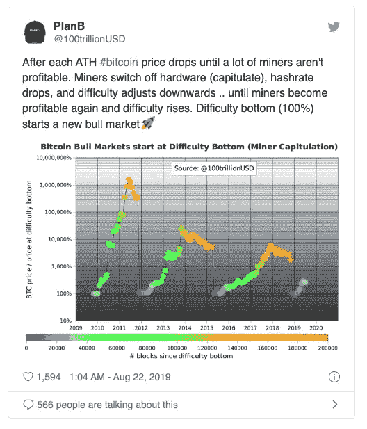
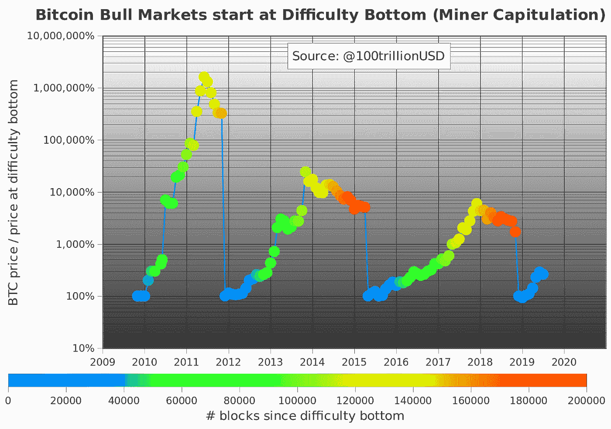
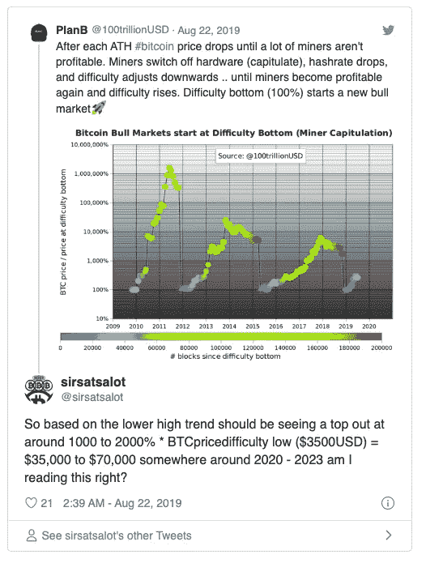

# 矿工们投降了。

> 原文：<https://medium.com/coinmonks/miner-capitulation-is-coming-d81b4e7b0ff5?source=collection_archive---------1----------------------->

## 一名研究人员表示，每次比特币牛市都是从矿工投降开始的

开采难度可能是预测 BTC 价格的一个指标。加密研究员普兰布表示，比特币历史上的三次主要牛市都是在挖掘难度达到底部后开始的，这意味着市场今年可能会出现强劲的上涨。

## 预测比特币牛市有挖掘难度

尽管密码市场以其难以置信的高波动性而闻名，但它仍处于周期性波动之中。密码分析师使用各种不同的工具和因素来预测每个周期持续多长时间，以及有多少不同的因素会左右市场。

移动平均线是分析师们的最爱，因为它们能够对主要的价格上涨做出相当准确的预测。然而，加密研究人员 PlanB 发现了一种不同的、可能更准确的方法来预测比特币的价格走势。

在一篇 Twitter 帖子中，这位研究人员解释了过去三次主要的比特币牛市是如何在挖掘难度达到最低点时开始的。

> 他解释说，每当采矿难度达到历史最高水平时，比特币的价格就会大幅下跌，并继续下跌，直到大部分矿工变得无利可图。当比特币价格上涨，竞争加剧时，许多矿商无法继续运营他们的硬件，迫使他们投降。

## 有利可图的采矿据称会推高比特币的价格

随着矿工离开网络，网络散列率降低。杂凑率下降之后，紧接着是挖掘难度的调整。

过去 10 年，每次比特币开采难度触底时，都会出现一轮大牛市。推特上分享的图表显示，底部是在 2012 年初、2015 年第二季度和 2019 年底达到的。

该图还显示，难度的下降每 3-4 年发生一次，或者自上次采矿难度触底以来约 20，000 个区块。

虽然不能保证这个市场周期会跟随前两个周期，但如果是这样，这可能意味着比特币可能会达到新的高度。根据图表中显示的低高趋势，比特币的下一个 ATH 可能比其在这个周期中挖掘难度最低时的价格高出 1000-2000%。

由于比特币的价格在去年年底徘徊在 3500 美元左右，当挖掘难度达到 100%时，这意味着它的价值可能在未来几年内达到 35000 美元至 75000 美元。

在一位 Twitter 用户指出这一点后，PlanB 表示这是一个相当保守的估计。他解释说，在矿工投降后，比特币价格达到历史最高水平的最后两次上涨了约 100 倍。

也就是说，PlanB 的分析可能是完全错误的。几位矿业专家告诉 CryptoSlate，开采难度是比特币价格的尾随指标，而不是领先指标。随着 BTC 价格的上升或下降，开采难度也相应调整，而不是相反。因此，这两者密切相关，但 PlanB 对因果方向的推理值得商榷。

 [## BTCiNSHOP -加密货币采矿设备经销商

### BTCinSHOP 是比特大陆官方合作伙伴，价格优惠，制造商保修。加密货币采矿设备分销商…

btcinshop.com](https://btcinshop.com) 

> [在您的收件箱中直接获得最佳软件交易](https://coincodecap.com/?utm_source=coinmonks)

