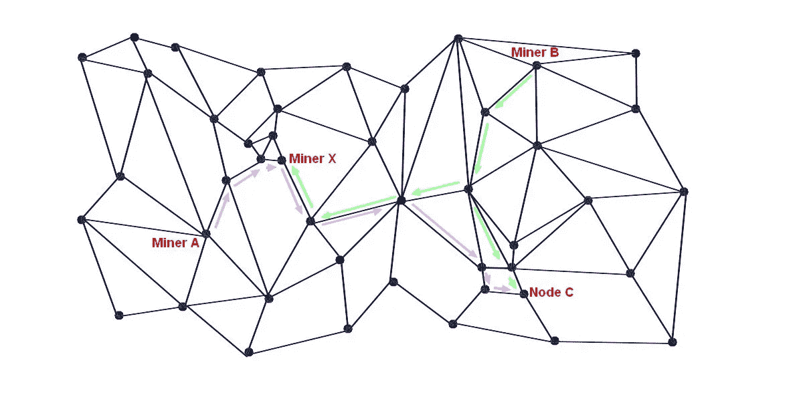
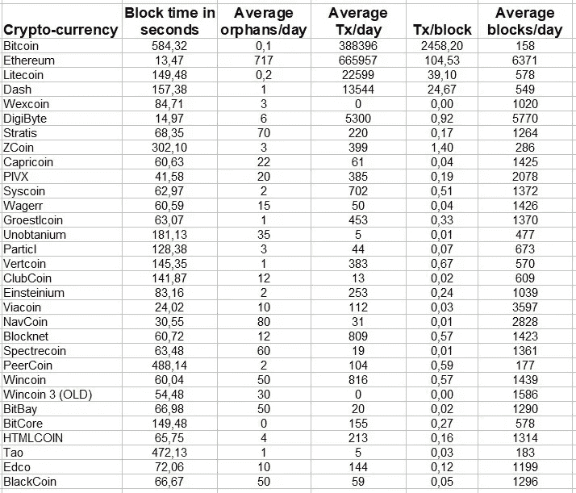

# 矿工，闭塞时间和孤儿，三位一体。

> 原文：<https://medium.com/coinmonks/miners-block-time-and-orphans-a-trinity-680f45f8dd42?source=collection_archive---------1----------------------->

([荷兰语版点击此处](/@aat.de.kwaasteniet/miners-blocktijd-en-orphans-een-drie-eenheid-60f490401af6) )
在本文中，我想尝试解释一下在[区块链](https://medium.com/coinmonks/blockchain/home)网络中，块时间与孤儿/陈旧块的创建之间的关系。事实上，它是我在以前的一篇文章中的一个段落的延伸，我在关于技术可用性的章节中写了“[这种加密成为新的支付系统](/coinmonks/which-crypto-becomes-the-new-payment-system-69f95b2d2ec3?source=your_stories_page---------------------------)”。而且还是在“[的胡言乱语中……TPS(每秒事务数)](/@aat.de.kwaasteniet/the-nonsense-of-tps-transactions-per-second-2d7156df5e53?source=your_stories_page---------------------------)“这个问题已经有所讨论。在本文中，我们将更详细地探讨这一现象。陈旧块和孤立块互不相同，但基本上是由相同的现象造成的，因为它们都被普遍称为孤立块，所以我也将使用这个术语。我会尽量不把它写得太专业，以便我们中技术不太熟练的读者也能理解。但是在这个[秘密](https://medium.com/coinmonks/crypto/home)的世界里，肯定有一些对事物的理解。

# “区块链”实际上是如何工作的？

正如大多数人所知，区块链是比特币和其他加密硬币使用的一种数据库形式。但简而言之，我会解释什么是区块链。
在[区块链](https://medium.com/coinmonks/blockchain/home)中，用户之间的[加密](https://medium.com/coinmonks/crypto/home)交易以非常特定的方式存储。不同交易的数据被收集在一个数据包(所谓的块)中，并且这些块以串行方式存储，其中每个块通过控制号或数字指纹(行话中称为“散列”)与前一个块链接，控制号或数字指纹是每个包的一部分。添加的数字指纹监控数据块中数据的完整性。因为这些区块通过数字指纹像链条一样连接在一起，所以整体被称为区块链。

比特币网络或另一种[加密货币](https://medium.com/coinmonks/crypto/home)的每一个完整节点用户的电脑上都有一份相关[区块链](https://medium.com/coinmonks/blockchain/home)的副本。所有这些用户都通过网络与其他用户联系。如果数据块中的数据有意或无意地发生了变异，数字指纹将与变异的数据块不同，所有后续数据块也是如此。通过简单地比较所有用户的最后一个数字指纹，就可以看出用户的区块链是好的还是坏的。这也允许新用户从其他用户那里接收整个区块链，以确保它没有被篡改。
你也可以在这里[找到一个很好的视频解释，让初学者了解什么是区块链。](https://youtu.be/_160oMzblY8)

## 如何创建块

尚不属于区块链的用户之间的新事务在网络中广播并存储在 mempool 中。矿工将这些事务的一部分(或者如果他们愿意，甚至没有)组装成一个块，以及他们插入的一些随机数据。它们反复修改这个随机数据，并“散列”新的控制号，以查看该块是否被认为是有效的。作为区块交易的一部分，矿工可以创建一个特殊的交易来支付“报酬”。因此，矿工们互相竞争，成为第一个组装出有效积木的人，这样他们就可以成为给自己报酬的人。然后，矿工通过网络向所有其他用户广播该块。但是将它传播到网络的其他部分需要时间。一个用户通常与网络中的一些其他用户联系，而不是同时与所有用户联系。因此，一条消息可能必须通过中间的几个其他用户从 A 传到 B。这意味着在所有用户意识到[区块链](https://medium.com/coinmonks/blockchain/home)的新状态之前需要一些时间。它是一个去中心化的网络，所有连接的计算机(网络行话中的节点)都是平等的，拥有相同的权利和义务。节点可以是普通用户，但也可以是挖掘者。一个节点通常只与另外 8 个节点相连。简化的示意图如下所示:

在图中，节点与其最近的邻居相连，但实际上并非如此。用户不需要连接到地理上最近的邻居，也可以很容易地连接到日本、阿根廷和阿拉斯加等地的某个人。但是后来画面变得太复杂，画不出来。

# 块在网络中的分布

当矿工 A 找到一个块并将其传输到所有其他节点时会发生什么？节点 C 需要多长时间才能知道新的块？需要多少时间取决于许多因素，例如:

*   网络上的平均互联网速度
*   运行区块链的旧计算机的速度。
*   块的大小
*   网络中的节点数
*   网络的建设。

我们来举个计算的例子。我们用下面的数字作为起点:平均网速是 10 兆位/秒(不是每个人的前门都有光纤。)块大小为 100k 字节。在电脑上的处理速度，真实处理 50 毫秒，上网 50 毫秒(Ping 时间)。

从矿工 A 到节点 C 的最短连接是通过 5 个节点和 6 个互联网连接。然后我们可以计算出，在节点 C 被告知一个新块已经被添加到[区块链](https://medium.com/coinmonks/blockchain/home)之前，需要 5 x(50 毫秒+50 毫秒)+ 6 x 0.1 秒= 1.1 秒。我们称这个时间为网络中的传播延迟。你会说:嗯，那还不算太差，但是如果你把块大小改成 1mb，传播延迟就是 6.5 秒。

如果加密货币有一个超过 1000 个节点的大型网络，50%的节点将在 6.5 秒内更新，但在不利的情况下，5%的节点可能在 40 秒后不知道最新的块。所有这些都是由克里斯蒂安·德克尔和罗杰·瓦腾霍夫的 r [研究员计算和构思出来的。](https://www.tik.ee.ethz.ch/file/49318d3f56c1d525aabf7fda78b23fc0/P2P2013_041.pdf)

传播延迟不是一个可以纠正的“缺陷”，但它是区块链网络的设计者必须考虑的事实。因为如果两个或更多的矿工同时或几乎同时解开谜题会发生什么？两个不同的区块被完全验证为区块链中的下一个区块。
但是只能接受一个块，另一个块必须丢弃。这完全取决于谁在开采下一个区块。

# 冲突

矿工 A 和矿工 B 试图独立找到下一个区块，他们几乎同时提出了一个解决方案。矿工 A 和矿工 B 开始向网络广播他们的块。挖掘器 A 的块首先到达挖掘器 X，而节点 C 首先面对挖掘器 B 的块。矿工 B 的块稍后到达矿工 X，但在那里不再被接受，因为矿工 X 上的[区块链](https://medium.com/coinmonks/blockchain/home)已经添加了一个具有相同编号的块。
区块链在网络中出现了两次，原则上都是正确的:

在节点 C:> N2 N1……..从矿工 B
到矿工 X: > N1，N2，…。来自矿工 A 的块

下一个区块将由矿工 X 开采，并且矿工 X 将他的新区块链接到他知道的区块链。该块看起来像这样:

N1，N2……来自矿工 A 的块，来自矿工 X 的块

矿工 X 将把这些发送出去。在某个时刻，它通过图中的紫色箭头到达节点 C，节点 C 看到这个[区块链](https://medium.com/coinmonks/blockchain/home)订单与他自己的订单不同，并且另一个订单更长。现在区块链定律的第一条规则生效了，那就是最长的链获胜，这代表了正确的价值。因此，节点 C 将移除其最后一个块(来自挖掘器 B 的块),并添加来自挖掘器 A 的块和来自挖掘器 x 的块。先前的挖掘器 B 块成为孤儿块。
这个过程对所有节点都发生，这样整个网络将再次与同一个区块链一起工作。

> 简而言之，这就是事情的运作方式。实际上，随着节点之间的通信越来越多，它的工作更加复杂。

# 孤儿“问题”有多大

孤儿是采用区块链技术的分散式网络所固有的，这并不是一场灾难。然而，这不应该是一个卑鄙的工作。如果一个网络很容易产生孤儿，那么也很容易在链中产生不想要的分叉。这可能是偶然的，但也可能是通过恶意快递完成的，这可能导致通过所谓的“双重花费”在网络上进行欺诈。现在深入研究这个问题需要很长时间，但是在互联网上可以找到很多关于这种现象的信息。

我一直在调查不同的加密硬币以及它们产生了多少孤儿。因此，网络中孤儿的出现取决于传播延迟，但更大程度上取决于特定加密硬币使用的阻塞时间。如果平均传播延迟为 6 秒，阻塞时间为 600 秒，就像比特币一样，孤儿几乎不会出现，网络有足够的时间来检测和修复出现的双重阻塞。
但是如果块时间很短，传播延迟很高，由于大量事务创建大块，网络无法及时恢复双块，问题就出现了。
单个矿工最终将在区块链的不同分支上进行挖掘和广播，将网络分成多个竞争部分，随着节点被所有竞争块淹没，进一步减缓块传播，最终导致区块链停滞或不稳定。
因此，谨慎选择块时间和最大块大小非常重要。过长的冻结时间会对确认时间(交易变得不可撤销的时间)产生负面影响，过短的冻结时间会导致上述影响。

为了能够声称每秒进行尽可能多的交易，与比特币相比，一些[加密](https://medium.com/coinmonks/crypto/home)硬币大幅缩短了它们的阻塞时间。此外，有些人还将最大块大小扩展到 4MB，有时甚至更大。这是一种危险的组合，在用户试图完全利用假定的额外事务处理能力的情况下，这种组合无法工作。

下面是一个封锁时间的列表，因为我可以找到他们不同的[加密](https://medium.com/coinmonks/crypto/home)硬币与他们的孤儿的表现。你有一个很好的机会，你最喜欢的硬币从列表中消失了，因为不是所有的硬币都显示出在他们的网络中有多少孤儿。然而，可以很好地描绘出剩余硬币的闭塞时间和孤儿化之间的关系。

> 值得注意的是，大部分币一旦知道自己是孤儿就不会再去宣传孤儿了。不是所有的孤儿都会在孤立他们的区块之前到达探险家。因此，在大多数情况下，网络上实际的孤儿数量会比浏览器报告的数量高很多。
> 网络越大，阻塞时间越快，浏览器看到的实际孤儿就越少%。

我们看到比特币、莱特币、Dash 这样的老朋友表现不错，几乎没有孤儿。但 Groestlcoin 的表现也很好，他们的封锁时间相当快，为 60 秒，平均每天只有 1 名孤儿。这是规则的例外。所有阻塞时间低于 100 秒的加密算法性能都不好。

我还将这些值绘制成了图表。

Digibyte 平均每天有 6 个孤儿，并且似乎以 15 秒的非常低的阻塞时间逃脱了。事实上，随着事务数量的增加，以及块大小的增加，问题在于它是否能很好地结束。目前，每个 DGB 数据块中平均只有一个交易，这并不占用太多空间，但 DGB 的数据块大小现在可以达到 4MB，因此网络阻塞是不可避免的事实。你可以和以太坊做一个比较，因为它的阻塞时间和 Digibyte 差不多，但是它处理大量的事务，所以得分很低。这也是 Digibyte 的最前沿。
以太坊的天平在什么边缘还是可能的。所有被开采的区块中有 11.26%会产生孤儿，尽管以太坊称之为“叔叔”,因为他们会奖励产生孤儿/叔叔的矿工。

列表中引人注目的是，只有以太坊、比特币、莱特币和 Dash 的每块交易超过一笔。Crypto 还处于初级阶段。

# 结论

孤儿不是一个“错误”,而是分散式网络和区块链技术的使用所固有的。除非经常发生，否则通常不会引起任何问题。选择的频率取决于块时间和块的大小。作为一般规则，可以说大于 100 秒的阻塞时间不会导致任何重大问题。并且小于 60 秒的阻塞时间处于危险区域。

解释到此结束，希望对你理解一些困难的事情有所帮助，如果是这样，我很高兴。

**该作者的其他文章有:**

[比特币的真正价值是什么？](/coinmonks/what-is-the-real-value-of-bitcoin-2c80c621568e?source=your_stories_page---------------------------)
[按节点数排名密码](/coinmonks/ranking-cryptos-by-number-of-nodes-57a12e4ae51a?source=your_stories_page---------------------------)
[比特币需要改变](/coinmonks/bitcoin-needs-to-change-96c793d3523b?source=your_stories_page---------------------------)
[恢复短语，防故障还是不防故障？](/altcoin-magazine/the-recovery-phrase-fail-safe-or-not-668146453cba?source=your_stories_page---------------------------)
[哪个 crypto 成为未来的支付系统？](/coinmonks/which-crypto-becomes-the-new-payment-system-69f95b2d2ec3)
[好的、坏的、丑的，对加密硬币进行分类。](/coinmonks/the-good-the-bad-and-the-ugly-classifying-the-crypto-coins-9d192154579a)
[白帽子道德投资者](/coinmonks/the-white-hat-ethical-investor-8a3ba9b3028e)
[的废话…TPS(每秒交易数)](/@aat.de.kwaasteniet/the-nonsense-of-tps-transactions-per-second-2d7156df5e53)
[按用户数量排序的加密](/coinmonks/crypto-ranked-by-numbers-of-users-c736d1543d8c?source=your_stories_page---------------------------)

感谢捐赠。
居尔登:gjhgkae 88n 21d 2 tnucvaxjrcxcgbr 7 mald
比特币:3q R1 yvpr 1 VCM 3 dfyzrfpjslf 4 vggvzhsk

> [直接在您的收件箱中获得最佳软件交易](https://coincodecap.com/?utm_source=coinmonks)

