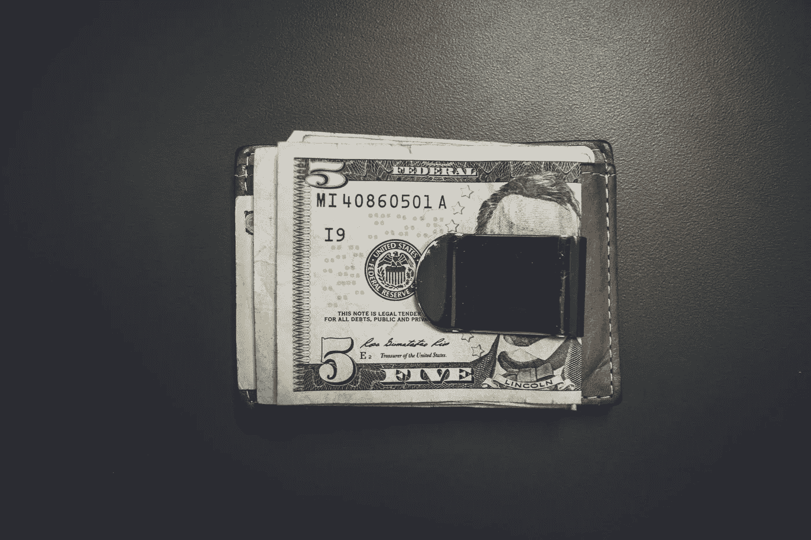

# 最小可行以太坊移动钱包第 3 部分:账户和私钥

> 原文：<https://medium.com/coinmonks/minimum-viable-ethereum-mobile-wallet-part-3-account-private-key-1f8fa3d20f3?source=collection_archive---------1----------------------->

在最小可行钱包教程的第 3 部分，我将解释最小可行以太坊钱包的帐户创建和安全私钥存储的代码。

Photo by [NeONBRAND](https://unsplash.com/photos/4N3iHYmqy_E?utm_source=unsplash&utm_medium=referral&utm_content=creditCopyText) on [Unsplash](https://unsplash.com/search/photos/wallet?utm_source=unsplash&utm_medium=referral&utm_content=creditCopyText)

MVW 的源代码可以在这里找到。

在这一部分，我将解释让我创建一个新的以太坊钱包帐户的代码，以及我如何在…