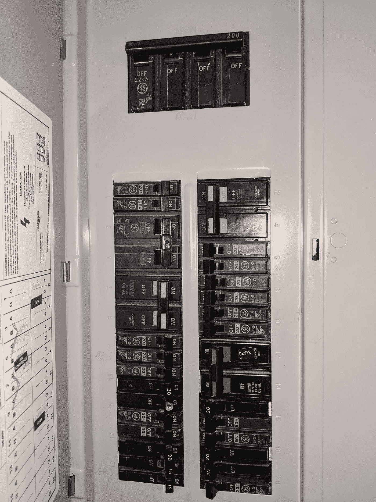
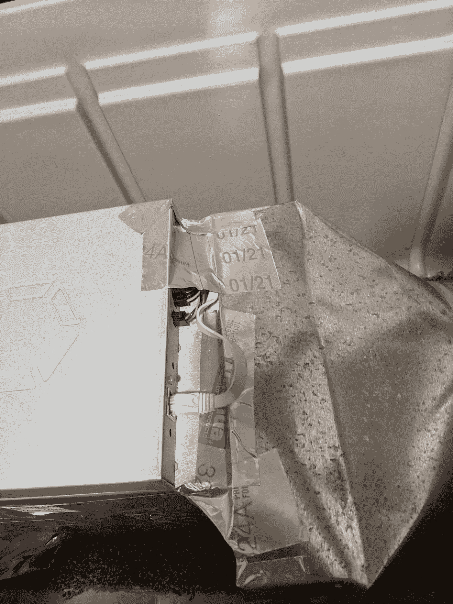

# 在家采矿——作为平民

> 原文：<https://medium.com/coinmonks/mining-at-home-as-a-pleb-ca63d0681996?source=collection_archive---------0----------------------->

## 二月的某个时候，我偶然看到了[@生态化学家](https://twitter.com/econoalchemist)的这篇文章。

让我印象深刻的是:

> “但你会看到，我没有支付溢价。我其实是在家里挖矿，以折扣率获得比特币。这与我认为真实的叙述相悖。”

等等，拿着电话，这个人刚才是不是说他得到了*的优惠*免 KYC sat 考试？？就在这时，我下了采矿兔洞。这篇文章的其余部分将带你经历我的兔子洞之旅。也许这会激励你们中的一个去我家，也许会让你泄气，不管我在做什么，写下来。

Ok 酷所以采矿*可以*在国内盈利。但我需要以下东西:

*   矿工
*   240 伏插座
*   某种排热系统

即使我能核对整个列表，我能找到多少 sat？我将使用多少电力，这将花费我多少钱？该算数字了。

我住在一所住宅里。我得到的住宅电价不会让你大吃一惊。我的提供商提供可变费率计划，在一天中的不同时间、一周中的某些天、一年中的不同季节将收取不同的费率。知道我将一天 24 小时运行矿工，这使数学变得简单了一点。通过一些复杂的数学运算，我能够确定每千瓦时的总平均成本: **$0.10629** ，这足以让我八年级的代数老师感到自豪

有了电力的基准成本，我就可以打开一个采矿盈利能力计算器，开始输入一些其他变量。我喜欢[这个](https://cryptomining.tools/calculator)。我研究了一些变量，比如 hashrate、功耗，当然还有 BTC 的美元价格。通过查看经常在电报频道出售的矿工的规格，我可以填写散列率和功耗的值。如果你只遵循这三个价值观，你可以说服自己在三个月内达到收支平衡，或者在接下来的两年内保持 HFSP。这是一个有趣的游戏，直到你尝试真正得到一个这样的芯片。

所以我向电报走去。一个我知道会充斥着骗子和好得不像真的交易的地方。在某些历史背景下，这是 2021 年 3 月初，BTC 的价格约为 5 万美元。每个人和他们的屎硬币表弟都想在采矿行动，好线索是少之又少。每份清单似乎都要求很高的最低订货量(MOQ ),或者只在采购总量超过一个适度的城堡时才作为一批出售。作为一个平民，我需要找到一个最低起订量为 1，价格不高于 6000 美元(坦率地说，我可能会花更多，因为时间是至关重要的)。我是关注这些频道的鹰派人物:

*   [硬件市场验证列表](https://t.me/Hardwaremarketchannel)
*   [区块软件解决方案](https://t.me/BlockwareSolutionsOfferings)
*   [Kaboomracks 市场](https://t.me/kaboomracks)

有很多组之间的交叉张贴，但每天都有足够的新内容，我乐观地认为我会找到一个符合我的标准的列表。最终我偶然发现了一个并伸出手:

吱吱响的轮子得到油脂。我不会分享我交换的确切的 DMs，但在 [@Kaboomracks](https://twitter.com/kaboomracks) 的好家伙很快给我回复，让我知道最小起订量是 1，价格是 5400 美元，预计在 4 月底交货。

oh lfgggggg

合同签了，钱寄了，我觉得自己比一个 Bitmex 100x yolo 还活着。说真的，我这么做只是为了有一天能告诉我的孙子们(猜猜那笔交易是怎么结束的？).

yeah this is OC wanna fight about it?

现在是最困难的部分:等待 7 周交货。哦，我还想出了如何获得 240 伏的电力，建立一个排热系统，选择一个采矿池，以及一种管理声音的方法，这样就不会让我的室友太生气了。我是不是忘了告诉你的 nocoiner 室友你将在地下室存放一台 75dB 的新机器？先说电。

panel doxx

在权衡了不再使用我的干衣机和安装一个新的 240 伏电源插座的选择后，后者胜出了。我的面板(虽然看起来很满)实际上有一个可用的插槽，可以用来安装一个新的 240v 插座。现在，我只有有限的电气经验，结合我中等的灵巧能力和 10 个 DIY 240v 插座视频的知识，我觉得我很有信心可以自己完成这项工作。冷静的头脑占了上风，我雇佣了一位专业人士，他不仅比我做得更好，而且会让我晚上高枕无忧，因为我知道不可避免的电气火灾并不完全是我的错。

选中该框后，是时候设计一个有利于散热的隔音罩了。生态化学家在他的文章中对此进行了深入探讨。搜索 Bitcointalk 论坛和各种 YouTube 视频，似乎有三种常见的噪音管理方法:饮料冷却器、DIY 木箱、液体浸泡。出于多种原因，我不打算处理液体浸泡，在我建造这个的时候，木材的价格巧合地高得惊人。幸运的是，饮料冰柜市场并没有受到商品价格飙升的影响，我决定围绕这一点进行设计。

有了一些更酷的设计[灵感](https://www.youtube.com/watch?v=HhNS2ElN5Mk)我知道我需要从一边吸入凉爽的地下室空气，然后从另一边排出，这样会把空气排到屋外。据我所知，冷却器不仅可以降低噪音，还可以作为连接排气管的基础。我看到的大多数外壳设计都很好地降低了噪音，但有一个重要的区别:avalonminer 有 4 个风扇，而不是 S9 上常见的 2 个风扇。这将意味着连接进气/排气管道必须堆叠在另一个的顶部，以连接到每个风扇，或者是一个巨大的管道，可以封装每侧的两个风扇。无论我选择哪种方法，结果要么是在冷却器的每一侧钻两个孔，要么是在每一侧各钻一个更大的孔。冷却器的截面积越大，逸出的噪音就越多。

two fans, one stacked on the other, on each side (this is the intake side)

所以是的，所有那些旧的 YouTube 视频和指南都有点过时了，因为最新一代的矿工(不包括 Whatsminer 模型)都有这种堆叠的风扇设计。我还没有找到一个针对这一代矿工的围栏指南，似乎每个人都沉浸其中，也许这是因为它*是*保持凉爽和安静的唯一方法。也许这是网上第一个记录双风扇 ASIC 型号 DIY 机箱的指南。TLDR:它对空气流动有效，但对降低噪音无效。

我得到的任何设计和决定我可以使用[寄存器盒](https://www.homedepot.com/p/Master-Flow-14-in-x-6-in-to-8-in-Universal-Register-Box-RB14X6X8/100135879)和[减压器](https://www.homedepot.com/p/HydroFarm-8-in-to-6-in-Galvanized-Duct-Air-Ventilation-Reducers-ACR0806/316513396)来引导进气和排气。我找不到一个能完美贴合风扇的收纳盒，我知道我会用[箔带](https://www.homedepot.com/p/Nashua-Tape-2-5-in-x-60-yd-324A-Premium-Foil-UL-Listed-HVAC-Duct-Tape-1542698/100048600)尽我所能做一个最好的气密密封。任何排出的(热)空气都不能被进气风扇吸入，否则我会冒着矿工过热的危险。我的粗略设计看起来是这样的:

I used an expensive tool called Pen n’ paper to design this (A and D are reducers, B and C are register boxes)

为了清楚起见，在订购冷却器之前，我绘制了设计草图并估算了尺寸。我去家得宝的次数比我愿意承认的要多，以确定可用的登记盒和减速器，并测量每个零件的长度/宽度。有了这个设计，我找到了一个足够大的沃尔玛冷藏箱。

I too could not believe Walmart had free delivery on this

drilling circles can be fun

Register box to 8" to 6" reducer to 6" hole

same register box and reducer and hole on other side, miner in the middle

birds eye view, before air tight foil tape seal

birds eye view through reducer

air tight seal with foil tape to register box (exhaust side)

An early design with some MS Paint like tool showing the exhaust system

该计划是建立这种冷却器外壳，让废气从地下室的窗户排出，通过一些管道，空气在管道风扇的帮助下流动，最终排出烟囱。以防我上面的图表和那句话没有意义，下面是它从外面看起来的样子。

yeah that box was structurally important at the time of this photo, I ended up securing the ducting later on with hanger strap. Note: the duct fan is hidden in there on the horizontal part

随着外壳建成，我安装了“木窗”与 6“孔排气。

I would end up sealing the cracks with gorilla tape

Enclosure ready for install on rack

我制作了机架，必须将它放在双层床的竖板上，以使机箱达到合适的高度，然后准备好将它放到合适的位置。这东西一个人搬起来很重，如果我把它摔了，这是一个昂贵的错误，但这是 YOLO 的行动，不是专业设置。

I actually had to saw off the cooler handle on the window side to get it to fit

In line duct fan hooked up to 6" intake hole

然后我决定这是一个帮助气流的好主意。图中的管道风扇实际上没有照片左下方的风扇有效。我目前使用的风扇正对着进气冷却器孔，由白色箱式风扇支持，将新鲜空气带入房间。请注意，电源和以太网电缆是通过进水孔进入的。

7 周，2 次传统银行付款，6900 封电报信息阅读，12 次家得宝旅行，以及 2 次电工安装会议之后，我实际上已经开始运行了。

亲爱的伙计，当小红帽的狼吹倒你的 janky 装置时，它看起来会倒。那可能是真的。但这也是事实，这个设置每天给我带来了大约 45，000 个 sat。我已经连续 7 周没有任何问题了。是的，在某些时候，我将不得不关闭，做一些灰尘维护。

sorry for awful quality

全押 **~$6271** 。我可以通过浸入式冷却来省钱吗？也许吧。冷却器对噪音有帮助吗？几乎没有。我给我的地下室装了一扇门，这创造了奇迹。我是 stackin sats everyday，这确实是我的目标:不含 KYC 的低于市场价格的 sat。我不会进入池的细节或我的确切预计回报率在这里。生态化学家在解释这方面做得更好，我只是想从平民的角度来记录这个过程。如果数字上升，我达到收支平衡的时间就会减少。只要价格保持在 2 万英镑以上，我就能盈利。不要相信任何家庭采矿 FUD，直到你自己运行的数字。

奔跑👏这👏数字👏

非常感谢在这一路上帮助过我的人，不管他们知不知道:[@ econoalchemist](https://twitter.com/econoalchemist)[@ nick fost _](https://twitter.com/nickfost_)[@ kaboomracks](https://twitter.com/kaboomracks)[@ brettinthewoods](https://twitter.com/brettinthewoods)[@ vicarious drama](https://twitter.com/vicariousdrama)Bitcointalk 上的人，以及我的室友们允许这一切发生。

如有任何问题，请在这里或 twitter 上联系我们 [@bitcoincoderbob](https://twitter.com/BitcoinCoderBob)

注意:敏锐的眼睛可能已经注意到我购买的矿工(a1246)不是我收到的(1166 pro)。我最终收到了 1166 pro，并支付了折扣价。这在本文其他地方的等式中没有考虑到。

编辑:

想补充一点关于矿工的电力电缆。我不清楚的是，当你买了一个矿工，它没有一个电源电缆。我的最佳猜测是，由于这些矿工将被运往世界各地，制造商不可能知道他们将插入什么类型的插座，因此，对他们来说，没有一个更容易和更便宜。我的设备有一个 C20 连接器，所以我需要相应的 C19 插头。C19(C20 的母接头)需要作为插头的一端，另一端需要连接到 240v 插座。NEMA L6–20 是 240v 的普通插头，可以处理这种负载(3400W，根据制造商网站的说法为-5%~+8%)。所以我继续前进，买了[这种](https://www.amazon.com/dp/B005KG3WKY?psc=1&ref=ppx_yo2_dt_b_product_details)电缆。在电缆长度(6 英尺。)电缆摸起来没有发热。

C20

编辑 2:

事实上，我不是第一个为双风扇 ASIC 设计外壳的人。看看@Diverter_NoKYC 写的[的精彩文章](https://diverter.hostyourown.tools/mining-for-the-streets/)。在文章中，外壳使用了[这些导管罩](https://www.ebay.com/itm/Antminer-DR5-S11-S15-T15-S17-T17-Z9-Z11-6-Double-fan-duct-Shroud-eBit-10-2-also/303149608185/)，这正是我应该用来代替收银台的。我真希望在我建造之前能看到这篇文章。

> 加入 [Coinmonks 电报频道](https://t.me/coincodecap)，了解加密交易和投资

## 另外，阅读

 [## 用 4GB 的采矿钻机开采什么？

### 对于矿工来说，这是艰难的一年，今年早些时候比特币的回报减半，独立矿工最喜欢的…

blog.coincodecap.com](https://blog.coincodecap.com/4gb-mining-rigs)  [## 7 大有利可图的新手矿池

### 为什么在池中开采比单独开采更好？答案很简单——当在一个池上采矿时，你的收入…

blog.coincodecap.com](https://blog.coincodecap.com/top-7-profitable-mining-pools-for-beginners)  [## 管理比特币挖矿的 6 大软件

### 你可能会认为开采比特币并不那么有利可图，因为它的汇率在不久的将来会大幅下跌…

blog.coincodecap.com](https://blog.coincodecap.com/top-6-softwares-for-managing-bitcoin-mining)