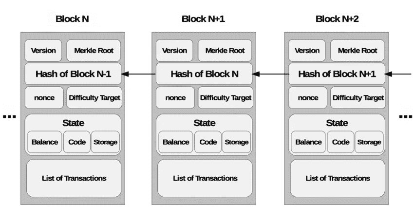
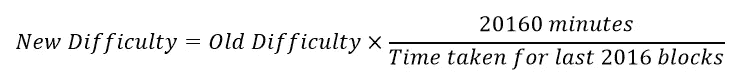
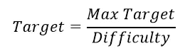
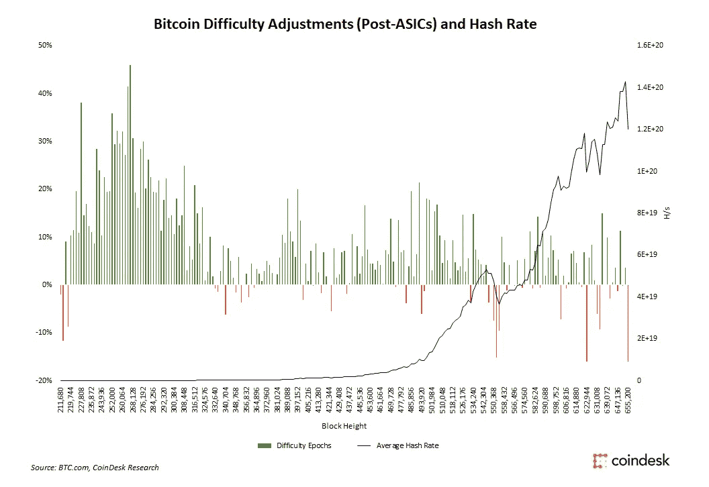

# 挖掘难度解构

> 原文：<https://medium.com/coinmonks/mining-difficulty-deconstructed-396b7009339b?source=collection_archive---------4----------------------->


Photo by [Dmitry Demidko](https://unsplash.com/@wildbook?utm_source=unsplash&utm_medium=referral&utm_content=creditCopyText) on [Unsplash](https://unsplash.com/s/photos/bitcoin-mining?utm_source=unsplash&utm_medium=referral&utm_content=creditCopyText)

当我第一次了解比特币挖矿的时候，我认为它就像坐在家里随心所欲一样简单，而我的 PC 会投入工作，在睡梦中赚钱。

不完全是。事实证明，还有很多其他因素使得上述场景完全不可能。

但是为了理解为什么，我们首先必须理解挖掘的整个概念，以及这对于加密货币来说意味着什么。

# 什么是采矿？

本质上，挖掘是创建新区块、用交易记录填充新区块、并将它们添加到区块链中以供每个人查看并同意特定硬币是如何被花费的过程。

然而，为了添加块，矿工必须解决“密码难题”，或者用更专业的术语来说，他们必须**解决块的有效*散列*。**

我不会过多地讨论哈希函数，但简单地说，哈希是通过获取块上的所有信息，然后投掷、旋转、拉伸、揉捏它(你明白了)直到它返回一个正好有 64 位的十六进制数，或者对一个典型的人来说，它看起来是一堆随机的字母和数字，与它以前的样子没有任何关系。

```
For example, the phrase “Hello!” would return 334D016F755CD6DC58C53A86E183882F8EC14F52FB05345887C8A5EDD42C87B7.
```

如果您更改了块中的任何数据，混乱将会大不相同，但是如果什么都没有更改，它将总是返回相同的内容。你可以自己试试[这里](https://passwordsgenerator.net/sha256-hash-generator/)！

但是您如何知道散列是否有效呢？这就是困难目标*出现的地方。**目标定义了一个阈值，散列值必须小于目标值才能有效。***

您可能会问，如果不能改变事务信息，如何获得不同的散列？嗯，在创建散列时，块的另一个组成部分被考虑在内——这个部分您可以*更改，它被称为 nonce。*



A diagram of the anatomy of a block. Source: [Khaled Salah](https://www.coindesk.com/bitcoin-mining-difficulty-large-drop)

矿工们摆弄这个数字，直到输出的散列值小于目标值。**由于哈希值是随机的，所以目标越低，就越难找到有效的哈希值。就像掷骰子一样，掷出小于 3 的数字比掷出小于 4 的数字更难。**

但是，您如何得出目标的价值呢？这个问题的答案就是我们进入今天话题的地方:挖掘难度。

# 什么是挖掘难度？

这是不言自明的，但挖掘难度只是指**为块找到一个有效的哈希有多困难和耗时。**一个更好的问题应该是，为什么采矿首先需要变得困难。

区块链的全部意义在于在一个网络中的多个个体之间建立共识，也就是同意一个真理。他们是如何做到这一点的，他们采用网络中最长的有效链，由投入了多少工作(猜测散列所花费的时间)来确定，并接受这一点作为构建的主链。

这一困难确保了网络的安全性，因为它防止了欺诈。如果很容易添加阻止，有人可以发出欺诈性交易，然后在网络上发送垃圾邮件，以创建自己的最长链。然而，随着挖掘难度的增加，添加区块的过程被减慢以防止垃圾邮件，因此平均需要 10 分钟来挖掘一个区块。

这里棘手的部分是，攻击者可以通过找到增加计算能力的方法来轻松绕过这一困难。谢天谢地，我们未雨绸缪，想出了一个系统调节难度的方法。

# 挖掘难度是如何确定的？

难度周期性调整，保证平均 10 分钟总可以开采一个区块。每添加一个 2016 数据块，系统都会查看创建这些 2016 数据块需要多长时间。正常情况下，大约需要 2 周，或者 20160 分钟。如果超过 2 周，难度会降低，如果不到 2 周，难度会增加。难度可以确定如下。



Formula to derive the new difficulty.

从反比可以看出，如果花的时间超过 2 周，分数就会小于 1，新的难度就会降低。如果花费的时间超过 2 周，分数将大于 1，新的难度将增加。

如果难度降低，目标值增加，更容易找到有效的 hash，反之亦然。最大目标值为 1，由此可见，难度也与目标成反比。



Relationship between the difficulty and the target.

为了防止突然的变化，难度在一次调整中不能增加或减少超过 4 倍。

但是回到我们如何得出目标的问题，我们需要探索影响开采一个区块所需时间的不同因素。

有两件事可能会影响这一次:

1.  计算能力
2.  网络中的人数

## 计算能力

在比特币的早期，你可能已经能够成功地用我过去认为人们会做的方式——用他们的个人电脑——进行挖掘。然而，矿工很快被迫升级。

由于挖掘本质上是一场比赛，人们竞相首先找到哈希并获得奖励，那些拥有更强大的计算机的人将能够在相同的时间内做出更多的猜测，从而有更高的胜算。

升级始于从 CPU 到显卡的简单转换，但近年来，已经进行了更多的升级，所谓的**ASIC(专用集成电路)——一种专为采矿设计的设备——**现在是能够竞争所需的最低要求。

但即便如此，你也不太可能赚到什么。目前，你可以预期每 40 年开采一个区块。如果你想赚钱，你可能必须加入一个矿池——矿工们联合起来增加他们获胜的可能性。

考虑到所有这些进步和计算机不断变得越来越快的事实，难度必须补偿这一点，以便跟上它们并保持 10 分钟的平均速度。

## 网络的规模

等等，但这并不意味着我们每两周就能得到更快的电脑，对吗？虽然计算机的不断改进是需要调整机制的主要原因，但该系统也对网络中的个人数量进行补偿。

挖掘者越多，找到一个有效散列所需的时间就越少，因为在同样长的时间内会进行更多的猜测。因此，矿工越多，难度越大，矿工越少，难度越小。

# 把一切都包起来

那么回到我们开始的地方——在今天这个时代，用你的 PC 挖掘比特币几乎不可能的原因是因为挖掘难度不断增加，这是由设备升级和网络规模增加带来的补偿造成的。你的电脑已经没有足够的计算能力来跟上其他人，所以你成功开采一个区块的机会非常非常低。

即使系统被设计成可以降低难度，但它很少能做到。更快、更强大的设备正在不断开发，同时越来越多的人加入比特币网络。事实上，自 2009 年 1 月创造比特币至 2020 年 11 月，共出现 250 次难度增加，只有 53 次难度降低。



Difficulty increases and decreases after the invention of ASICs. Source: [Coindesk](https://www.coindesk.com/bitcoin-mining-difficulty-large-drop)

# TL；速度三角形定位法(dead reckoning)

*   挖掘是添加新块的过程，通过查找块的有效散列来完成。
*   有效散列小于目标散列，通过改变块的 nonce 找到。
*   通过评估相对于 2 周的标准时间创建区块所需的时间，每 2016 个区块调整一次开采难度。
*   采矿难度是为了确保区块链的安全，防止攻击，并跟上哈希力量的增长。

> 如果你喜欢读这篇文章或者学到了一些新东西，一定要在 Medium 上关注我，并通过 [**LinkedIn**](https://www.linkedin.com/in/samantha-ouyang) 与我联系！此外，如果你想了解我正在进行的项目，请随时订阅我的 [**月刊**](http://subscribepage.com/samanthaouyang) 。感谢阅读！

## 另外，阅读

*   [学习以太坊和 Web3 开发](http://blog.coincodecap.com/go/learn)
*   最好的[加密交易机器人](/coinmonks/crypto-trading-bot-c2ffce8acb2a)
*   [3 商业评论](/coinmonks/3commas-review-an-excellent-crypto-trading-bot-2020-1313a58bec92)
*   [Pionex 审查](/coinmonks/pionex-review-exchange-with-crypto-trading-bot-1e459d0191ea)
*   [AAX 交易所评论](/coinmonks/aax-exchange-review-2021-67c5ea09330c) |推荐代码、交易费用、利弊
*   [Deribit 审查](/coinmonks/deribit-review-options-fees-apis-and-testnet-2ca16c4bbdb2) |选项、费用、API 和 Testnet
*   FTX 密码交易所评论
*   [n 零审核](/coinmonks/ngrave-zero-review-c465cf8307fc)
*   [Bybit 交换审查](/coinmonks/bybit-exchange-review-dbd570019b71)
*   [3Commas vs Cryptohopper](/coinmonks/3commas-vs-pionex-vs-cryptohopper-best-crypto-bot-6a98d2baa203)
*   最好的比特币[硬件钱包](/coinmonks/the-best-cryptocurrency-hardware-wallets-of-2020-e28b1c124069?source=friends_link&sk=324dd9ff8556ab578d71e7ad7658ad7c)
*   [密码本交易平台](/coinmonks/top-10-crypto-copy-trading-platforms-for-beginners-d0c37c7d698c)
*   最佳 [monero 钱包](https://blog.coincodecap.com/best-monero-wallets)
*   [莱杰纳诺 s vs x](https://blog.coincodecap.com/ledger-nano-s-vs-x)
*   [bits gap vs 3 commas vs quad ency](https://blog.coincodecap.com/bitsgap-3commas-quadency)
*   最好的[加密税务软件](/coinmonks/best-crypto-tax-tool-for-my-money-72d4b430816b)
*   [最佳加密交易平台](/coinmonks/the-best-crypto-trading-platforms-in-2020-the-definitive-guide-updated-c72f8b874555)
*   最佳[加密贷款平台](/coinmonks/top-5-crypto-lending-platforms-in-2020-that-you-need-to-know-a1b675cec3fa)
*   [莱杰纳米 S vs 特雷佐 1 vs 特雷佐 T vs 莱杰纳米 X](https://blog.coincodecap.com/ledger-nano-s-vs-trezor-one-ledger-nano-x-trezor-t)
*   [block fi vs Celsius](/coinmonks/blockfi-vs-celsius-vs-hodlnaut-8a1cc8c26630)vs Hodlnaut
*   Bitsgap 评论——一个轻松赚钱的加密交易机器人
*   为专业人士设计的加密交易机器人
*   [共同追踪审查](/coinmonks/cointracking-review-a-reliable-cryptocurrency-tax-software-5114e3eb5737)
*   [优霍德勒评论](/coinmonks/youhodler-4-easy-ways-to-make-money-98969b9689f2)
*   [埃利帕尔泰坦评论](/coinmonks/ellipal-titan-review-85e9071dd029)
*   [赛克斯·斯通评论](https://blog.coincodecap.com/secux-stone-hardware-wallet-review)
*   [BlockFi 评论](/coinmonks/blockfi-review-53096053c097) |赚取高达 8.6%的加密利息
*   [Coinrule 评论](https://blog.coincodecap.com/coinrule-review-a-perfect-trading-bot)
*   [最佳区块链分析工具](https://bitquery.io/blog/best-blockchain-analysis-tools-and-software)
*   [加密套利](/coinmonks/crypto-arbitrage-guide-how-to-make-money-as-a-beginner-62bfe5c868f6)指南:新手如何赚钱
*   最佳[加密制图工具](/coinmonks/what-are-the-best-charting-platforms-for-cryptocurrency-trading-85aade584d80)
*   了解比特币的[最佳书籍有哪些？](/coinmonks/what-are-the-best-books-to-learn-bitcoin-409aeb9aff4b)

> [直接在您的收件箱中获得最佳软件交易](/coinmonks/newsletters/coinmonks)

[](https://medium.com/coinmonks/newsletters/coinmonks)