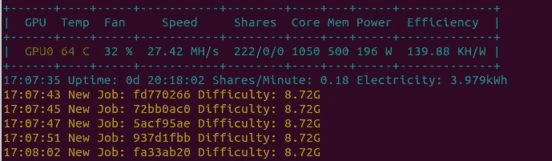
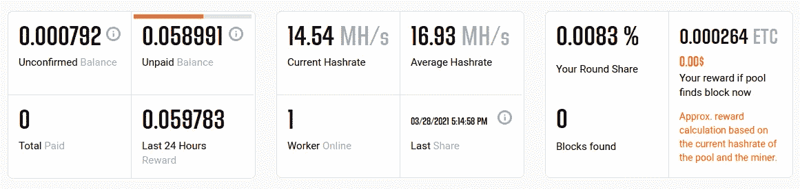
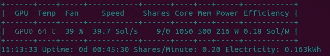
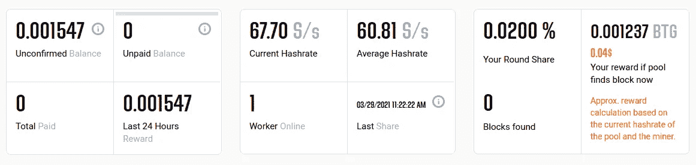

# 使用 GMiner 挖掘 ETC(以太坊经典)和 BTG (BitCoinGold)

> 原文：<https://medium.com/coinmonks/mining-etc-ethereum-classic-using-gminer-6325efe0a37d?source=collection_archive---------1----------------------->

冬天冷我有一个老 GPU ( *AMD 镭龙(tm) r9 fury 系列*)；让我们一起取暖吧。先是尝试用 *Xmrig* 挖掘 *Monero* ，然而 GPU 挖掘效率不高。

> 如果你有一个 GPU，通过在你的 GPU 上挖掘不同的硬币(ETH，RVN 等)同时在你的 CPU 上挖掘 Monero 来最大化你的回报。([https://minexmr.com/miningguide](https://minexmr.com/miningguide))

我试过很多其他的采矿软件使用 GPU，最后最简单的是 GMiner。

## 装置

1.  在这里下载可执行文件:[https://github.com/develsoftware/GMinerRelease/releases](https://github.com/develsoftware/GMinerRelease/releases)
2.  提取文件
3.  用你的钱包地址更新你想要挖掘的硬币的脚本。比如我这里的 *mine_etc.sh* 。
4.  使用您更新的脚本启动 miner:*sh mine _ etc . sh*
5.  查看泳池网页上的挖掘统计:[https://etc.2miners.com/](https://etc.2miners.com/)

## 为什么 ETC 和 BTG？

我选择了 ***等*** 和 ***BTG*** 因为他们足够出名(对我来说容易推销)而且不需要太多记忆。我不能挖掘 ETH，因为我的 GPU 没有足够的内存。

## 统计数字

Mining log for ETC

我每天开采大约 0.1 等，现在(2021/04)大约是 1 欧元，使用大约 10kWh。在我那里，1 千瓦时大约值 0.15 欧元。所以，1.5 欧元的电赚 1 欧元。我赔钱了，但我的脚现在更暖和了。

Pool page statistics for ETC

Mining log for BTG

Pool page statistics for BTG

**也读作**

*   用 4GB 采矿钻机开采什么？