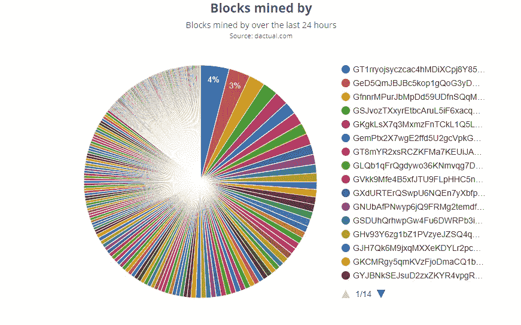
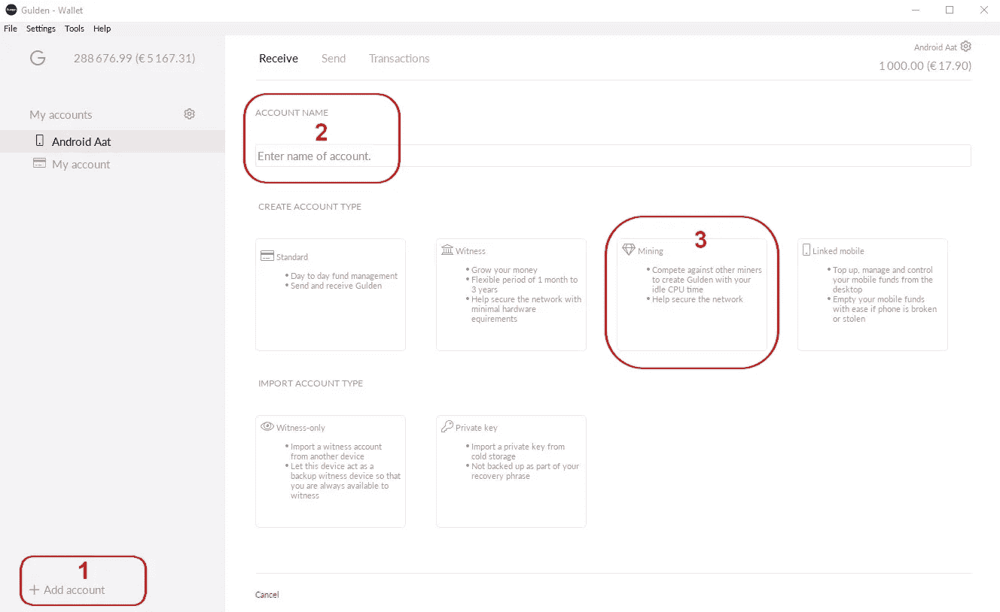
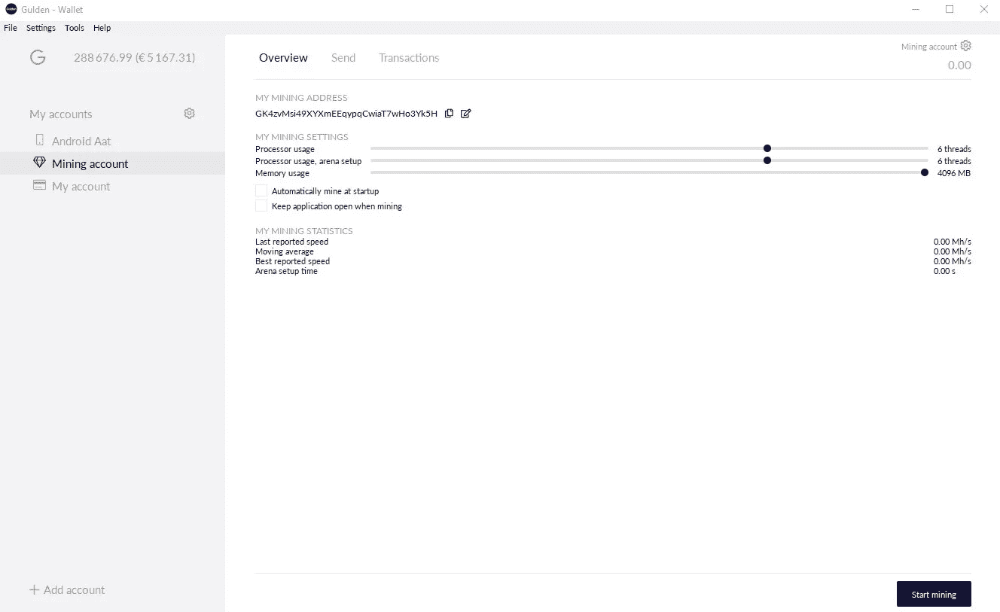
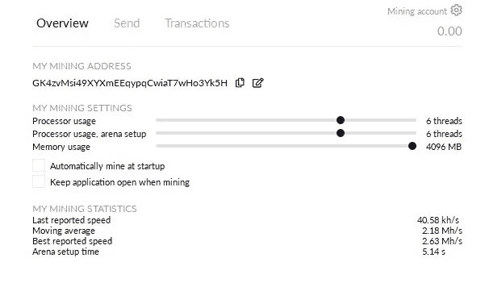

# 居尔登矿业公司

> 原文：<https://medium.com/coinmonks/mining-gulden-d4fe8c690939?source=collection_archive---------0----------------------->

[荷兰语版此处](/@aat.de.kwaasteniet/het-minen-van-gulden-46b54cc9d6da)

自 2021 年 8 月 30 日起修订(新奖励和布局变化)

# 介绍

在这个故事中，给出了一个关于挖掘加密货币居尔登的解释。
从 2014 年居尔登开始， [scrypt](https://en.wikipedia.org/wiki/Scrypt) 算法被用于居尔登的挖掘，但是它有太多的缺点，所以它决定寻找一种合适的 scrypt 替代方案。scrypt 算法的最大缺点是存在 scrypt 跳转池。Jumppools 是一群矿工，他们有一个非常大的 hashrate，只在难度低的时候喜欢居尔登，所以他们可以轻松快速的开采很多区块。一旦难度再次上升，她就“跳到”另一枚硬币上做同样的把戏。这些池的行为导致了非常不稳定的散列值，从而导致了不同的阻塞时间。一分钟内发现 5-6 个街区，然后 15 分钟内一无所获，这是常有的事。跳跃池主宰了居尔登网络，这不利于网络的稳定性和分散性。

# 希腊字母表中第十八个字母

自 2019 年 10 月 17 日以来，居尔登团队已经实现了适马算法，从那时起，无需额外的设备就可以单独开采居尔登。
适马是基于 Argon 算法的专有算法。适马是抗 ASIC 和 GPU 的，只能用于 CPU 挖矿。适马可以通过居尔登的桌面钱包进行设置、管理和激活。有了这个，居尔登把加密挖掘带回给普通用户，居尔登的分散性再次得到改善。庞大的矿工基数也确保了稳定的工作网络。在撰写本文时，矿商数量约为 300 家，其中最大的矿商仅占 4%的市场份额，相比之下，在加密时代，矿商数量约为 40 家，2-3 家矿商占 45%的市场份额。

如果你想了解更多关于 SIGMA 的技术背景和选择适马的原因，我推荐这个博客。

# 池采矿

其他算法通常以池挖掘的形式使用。这对于适马来说是不可能的，因为没有池支持适马算法。此外，在池中采矿在技术上毫无意义，因为你的单独采矿同样有效，甚至更有利可图。你只需等待一段时间，就能找到一个区块，而这些区块往往以区块的零头支付，当然，他们会以收费的形式收取部分费用。与 solominer 相比，Pools 没有优势。

# 如何开始

其实很简单，

*   **下载桌面钱包软件**
    所需的软件只是标准的居尔登钱包软件。请注意，挖掘只能在桌面版本中进行。所以不要选移动版或者 Lite 版，因为没用。安装并启动钱包软件。请等到区块链完全加载并同步后再继续。此过程是一次性的，最多需要一两个小时，即可检索到完整的居尔登区块链。下次启动 wallet 时，同步将很快完成。别忘了写下你的恢复句子，万一遇到麻烦你需要它！！
*   **在钱包里创建一个采矿账户**
    按照下面的顺序操作。点击“+添加账户”后，包含步骤 2 和 3 的共享窗口打开。

*   几秒钟后，采矿屏幕将打开，可在其中输入采矿参数。根据您的硬件规格，线程数量和内存使用可能与图片中的不同。

*   **线程和内存**
    你可以根据自己的需要定制线程和内存的滑块。请记住，您使用的线程越多，它的挖掘速度就越快。但是，选择最大数量的线程会导致您在计算机上做的事情不多。在上面的示例中，6 个线程的设置仍然可以在挖掘过程中执行其他任务。您可以对 arena 设置的线程进行一些调整，以确定哪个设置在 hashrate 和 setuptime 中给出最好的结果。
    该挖掘被设计为使用 4096Mb 内存进行优化工作。因此，如果你的电脑只有最低 8Gb 的内存，建议将滑块保持在 4096Mb。更少是可能的，但对性能有负面影响。一些矿工问:我的电脑里有 12Gb 可用空间，可以用它们来增加采矿功率吗？答案是**否**。4Gb 是适马的最佳选择，滑块不会超过这个值。
*   然后，您可以按下右下角的“开始挖掘”按钮，开始挖掘过程。您还可以使用两个刻度来确保在启动 wallet 后立即开始挖掘，并使用一个刻度来使 wallet 在挖掘过程中保持打开状态。

采矿屏幕显示一些关于采矿活动的统计数据。hashrate 被跟踪。对于一台普通的笔记本电脑来说，2 到 6Mh/s 是一个正常值

# 利润或损失

你是盈利还是亏损取决于很多因素，比如..：

*   你的安装是什么样的？
*   你的电脑有效用于采矿的功率是多少？
*   你付多少电费？
*   你考虑到你的计算机的折旧了吗？(它可能会因为变热而磨损得更多一点)
*   居尔登网络上总共有多少哈希码？
*   开采的居尔登的价格水平如何？
*   每个区块的采矿奖励是多少

> 所以对于你我的是否有意义这个问题，并没有明确的答案。举个例子:一台使用了 5 年的笔记本电脑，配有 i7 处理器和 8096Mb 可用内存，挖掘过程中每天额外消耗大约 0,5kWh 的能量，使用 6 个线程以大约 2.5 MH/s 的速度进行挖掘，每天发现+/-1 块(10 居尔登)，目前(2021 年 8 月 30 日，总哈希速率为 1400Mh/s，居尔登价格约为 1.8 欧分)在荷兰每天获得 0.18€的适度利润。当然，额外的电费必须从中扣除..建议是，**不要购买专门用于开采居尔登的硬件**，只使用你已经拥有的电脑。否则你会亏本。

在 T2，你可以在居尔登网络上找到一些关于采矿活动的统计数据。另外还有一个[采矿利润计算器。](https://www.dactual.com/miningcalculator.php)

# 孤儿

*本部分仅供技术感兴趣的人员使用*😃
在居尔登系统中，与其他硬币相比，孤立块的数量增加是正常的。因为在找到一个矿块后，矿工必须等到一个见证人检查并认可了这个矿块。这比只使用 PoW 作为批准机制的硬币花费更多的时间，同时另一个矿工可以找到相同的块。但是如果你的矿工产生了超过 1/5 的孤儿，这可能是你系统的问题。例如，一个与世界其他地方不完全匹配的时钟。或者网络中导致额外时间延迟的不良位置。因此，检查您的时钟并重启钱包，以便他可以连接到居尔登网络中的其他对等点。

如果您选中了“启动时自动挖掘”复选框，您将在每次启动时看到最少一个孤儿，因为即使钱包尚未同步，它也会开始挖掘。因为钱包知道的最后一个块是相当“旧”的，此时钱包以非常低的难度挖掘以快速找到块。
如果区块链运行正常，这种*感觉*像是愚蠢的行为，可以/应该避免，因为现在我们看到了所有这些孤立块。
然而:还没有同步的钱包还不能知道区块链的状态，因此必须根据它*所知道的*来行动，而那只是它自己的区块链的副本。
钱包确实*应该*以其对区块链的理解在启动的那一刻开始挖掘，这有几个原因。其中一些与可能发生的计划内或计划外的软分叉有关，另一些与可能的攻击媒介有关。

希望这个解释对你有帮助。如果你想更多地了解居尔登，你可以访问居尔登的网站或者参加 T2 的 Slack 论坛，在那里你可以找到热情的居尔登用户。

该作者的其他文章有:

[恢复短语，故障安全与否？](/altcoin-magazine/the-recovery-phrase-fail-safe-or-not-668146453cba?source=your_stories_page---------------------------)
[矿工、工读生和孤儿，三位一体。](/altcoin-magazine/miners-blocktime-and-orphans-a-trinity-4596de8afd00?source=your_stories_page---------------------------) [哪款 crypto 成为未来支付系统？](/coinmonks/which-crypto-becomes-the-new-payment-system-69f95b2d2ec3)
[好的、坏的、丑的，对加密硬币进行分类。](/coinmonks/the-good-the-bad-and-the-ugly-classifying-the-crypto-coins-9d192154579a)
[白帽子道德投资者](/coinmonks/the-white-hat-ethical-investor-8a3ba9b3028e)
[的废话……TPS(每秒交易数)](/@aat.de.kwaasteniet/the-nonsense-of-tps-transactions-per-second-2d7156df5e53)
[按用户数量排名的 Crypto](/coinmonks/crypto-ranked-by-numbers-of-users-c736d1543d8c?source=your_stories_page---------------------------) [事实查看居尔登网站](/@aat.de.kwaasteniet/fact-check-gulden-website-ce66a947dcf9?source=your_stories_page---------------------------)
[比特币汇率能否达到 10 万美元？](/altcoin-magazine/can-the-bitcoin-exchange-rate-reach-100-000-b291aed38ae7?source=your_stories_page---------------------------)
[居尔登，区块链如愿](/coinmonks/gulden-blockchain-as-intended-582bab190cf)

> [直接在您的收件箱中获得最佳软件交易](https://coincodecap.com/?utm_source=coinmonks)

