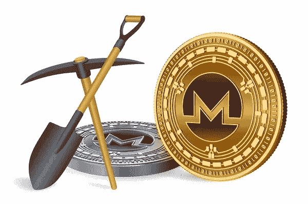
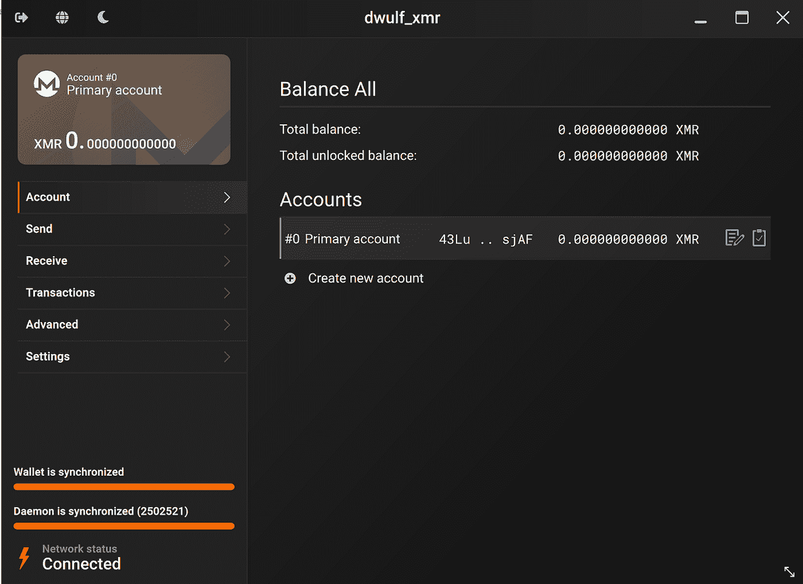
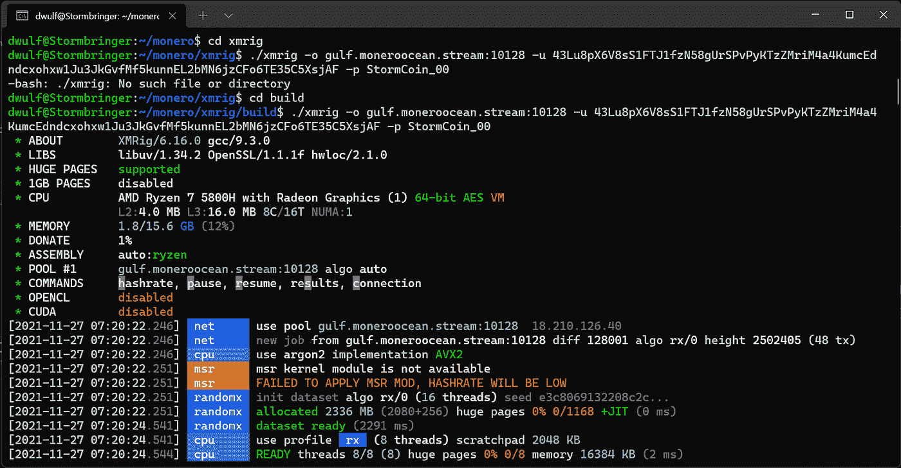
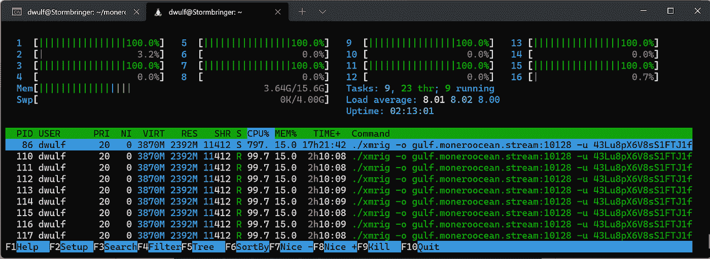
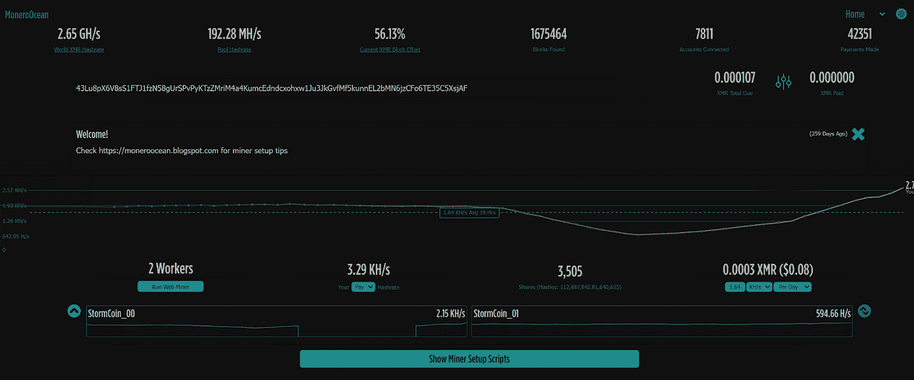

# 采矿 Monero (XMR)，来自环境能源的资本

> 原文：<https://medium.com/coinmonks/mining-monero-xmr-capital-from-ambient-energy-6e9f9c92be25?source=collection_archive---------4----------------------->

## ~dwulf

这些是我安装 XMR 矿工的笔记。我知道任何有 CPU 的设备都可以采矿，我甚至考虑在树莓 Pi 上这样做，为了酷点。但核心在软件，运行在云上和我的个人军团 Pro 5 上。

Monero XMR 是一种秘密货币，从硬币层面建立匿名交易。你将需要一个 XMR 加密钱包，虽然你可以在一个集中的交易所获得 XMR，并把 XMR 放在他们的热钱包上，但这不是一个好的做法，你总是想拥有自己的钱包，在那里你可以 100%控制助记词和私钥。

[**先做好自己的钱包**](https://www.getmonero.org/downloads/)

既然 XMR 钱包已经制作完成，您就拥有了“xmrig”的公钥。拿着你的公钥，我的是

**43 Lu 8 px 6 V8 ss 1 ftj 1 fzn 58 gurspvpyktzzmrim 4 a 4 kumcedndcxohxw 1 ju 3 jkgvfmf 5 kunl 2 BmN 6 jzcfo 6 te 35 C5 xs jaf**

**Linux 打嗝**

我喜欢 linux，但是 Linux 有一个细微的差别。只要你知道你想要什么，知道命令是什么，linux 机器就能做你想让它做的事情。

如果您没有获得 xmrig 的先决条件、必要的依赖项和库，那么 Ubuntu 将会是 trippen。注意这些装置。全新安装的 Ubuntu 可能包含也可能不包含 xmrig 使用的依赖项。因此，除了我的更新命令之外，我还必须包含以下命令。

*`sudo 安装 git build-essential cmake lib uv1-dev libssl-dev libhwloc-dev-y `*

*`更新`*

确保在升级后立即安装，否则会出错。我们正在从头编译它(这总是训练你从 github 库构建的好方法)。

作为一个 linux 爱好者，我想挑战自己，通过 Ubuntu 20.04 完成这项工作，我创建了一个别名文件`. bash_alias`。命令“update”执行全部更新、升级和清理。

**获取 xmrig repo**

*`git 克隆*[*https://github.com/xmrig/xmrig`*](https://github.com/xmrig/xmrig`)

*`cd xmrig`*

*`mkdir build`*

*`光盘制作`*

在我们的构建目录中，输入以下命令:

*`cmake..`*

*`make`*

**构建完成后**

*`。/xmrig-o gulf . moneroocean . stream:10128-u 43 Lu 8 px 6 V8 ss 1 ftj 1 fzn 58 gurspvpyktzzmrim 4 a 4 kumcedndcxohxw 1 ju 3 jkgvfmf 5 kunl 2 BmN 6 jzcfo 6 te 35 C5 xs jaf-p storm coin _ 00 `*

现在，我们使用命令 th-o[**在此处添加池**]-u[**在此处添加公共钱包**]-p[**工作器名称** ]来调用该咒语

**启动 xmrig**

之后你就是黄金了，就让它在终端后台运行吧。“htop”命令显示负载

使用我的 16 个核心的一半，理想情况下，您希望使用 50%或更少，以便不干扰日常计算活动。

**监视你的矿工**

这个网站 Monero Ocean，可以跟踪你的矿工，只要插入你的公钥，它就会变魔术

【https://moneroocean.stream/ 

**我的工人(矿工)**

**风暴币 _00**

我的主驱动程序贡献了 16 个内核中的 8 个，显然做出了大部分的采矿贡献(为钱包带来了更大的 XMR 回报)

**风暴币 _01**

正如你所看到的，我有多个矿工运行，一个在我的旧笔记本电脑上，亲切地称为我的母狗盒，不是很强大，只有 4 个核心和 4g 内存。

**风暴币 _03**

我的旧游戏装备，运行 12g 内存的 i7，还没有上线，因为我要格式化我的旧游戏装备的硬盘，在上面安装 Ubuntu 并在上面运行 xmrig，处于无头状态。

**风暴币 _04**

我的 Avado 适用于托管区块链特定的相关项目，包括以太坊(或者如果你没有 32 ETH 的带宽)，Polkadot 验证器，Sifnode，当然还有 XMRig。

**StormCoin_？？**

C & C 服务器控制下的其他设备。

**结论**

虽然我不是工作证明硬币/代币的粉丝，但运行一些工作证明矿工(如 xmrig)并不是一个坏习惯，主要是为了酷点，如果你能找到其他符合奖励目标的设备，并且你拥有(p0wn？)，矿工军团再加一个矿工。

XMRig 是一个很好的挖掘工具。在线 BTC 需要国家预算和专门的 ASICs 芯片组。或者以太坊，这将是赌注的证明，XMRig，或其他类似的工作证明硬币/令牌很有趣。

考虑到安全和舒适，对你的收入保持警惕是有好处的。

需要注意的几件事是要有一个冷藏钱包，比如一个分类账。此外，如果你的账本丢失或被盗，你的助记单词的二级存储应该保存在某个安全的地方，并写在[密码钢上。这应该可以保护你的话，而不是真的遭受火灾，水毁，或地震。](https://cryptosteel.com/product/cryptosteel-capsule/?csr=614&campaign=DazeoftheWolf)

> 加入 Coinmonks [电报频道](https://t.me/coincodecap)和 [Youtube 频道](https://www.youtube.com/c/coinmonks/videos)了解加密交易和投资

## 也阅读

 [## 杠杆代币[多头代币]终极指南

### 杠杆化令牌是具有杠杆化风险敞口的 ERC20 令牌，不考虑保证金、要求、管理…

medium.com](/coinmonks/leveraged-token-3f5257808b22)  [## 最佳加密交易所| 2021 年十大加密货币交易所

### 编辑描述

blog.coincodecap.com](https://blog.coincodecap.com/crypto-exchange)  [## 2021 年最佳加密借贷平台| 6 大比特币借贷平台

### 获得比特币和其他加密货币的最佳贷款利率

medium.com](/coinmonks/top-5-crypto-lending-platforms-in-2020-that-you-need-to-know-a1b675cec3fa)  [## 2021 年最佳免费加密交易机器人

### 2021 年币安、比特币基地、库币和其他密码交易所的最佳密码交易机器人。四进制，位间隙…

medium.com](/coinmonks/crypto-trading-bot-c2ffce8acb2a)  [## 最佳 4 个加密交易信号电报通道

### 这是乏味的找到正确的加密交易信号提供商。因此，在本文中，我们将讨论最好的…

medium.com](/coinmonks/best-crypto-signals-telegram-5785cdbc4b2b)  [## 5 个最佳社交交易平台[2021] | CoinCodeCap

### 编辑描述

blog.coincodecap.com](https://blog.coincodecap.com/best-social-trading-platforms)  [## BlockFi 评论 2021:利弊和利率| CoinCodeCap

### 编辑描述

blog.coincodecap.com](https://blog.coincodecap.com/blockfi-review)  [## 如何在印度购买比特币？2021 年购买比特币的 7 款最佳应用[手机版]

### 如何使用移动应用程序购买比特币印度

medium.com](/coinmonks/buy-bitcoin-in-india-feb50ddfef94)  [## 加密税务软件——五大最佳比特币税务计算器[2021]

### 不管你是刚接触加密还是已经在这个领域呆了一段时间，你都需要交税。

medium.com](/coinmonks/best-crypto-tax-tool-for-my-money-72d4b430816b)  [## 存储比特币的最佳加密硬件钱包[2021] | CoinCodeCap

### 编辑描述

blog.coincodecap.com](https://blog.coincodecap.com/best-hardware-wallet-bitcoin)  [## Pionex 评论 2021 |免费加密交易机器人和交换

### Pionex 是为交易自动化提供工具的后起之秀。Pionex 上提供了 9 个加密交易机器人…

medium.com](/coinmonks/pionex-review-exchange-with-crypto-trading-bot-1e459d0191ea)