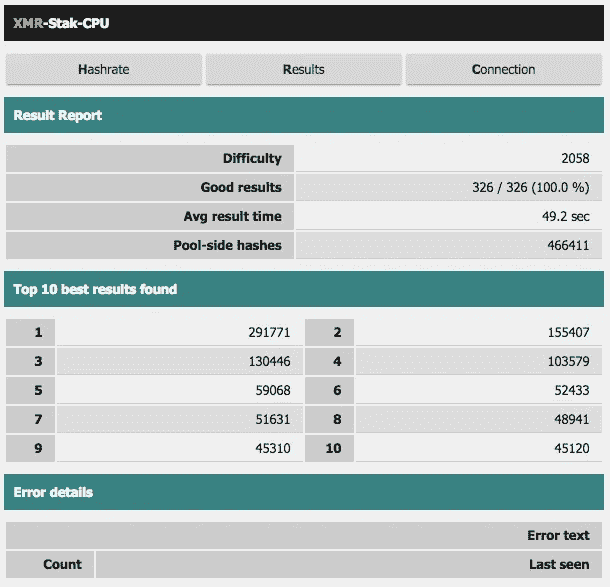
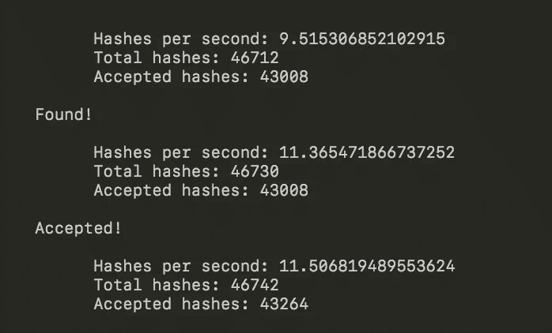
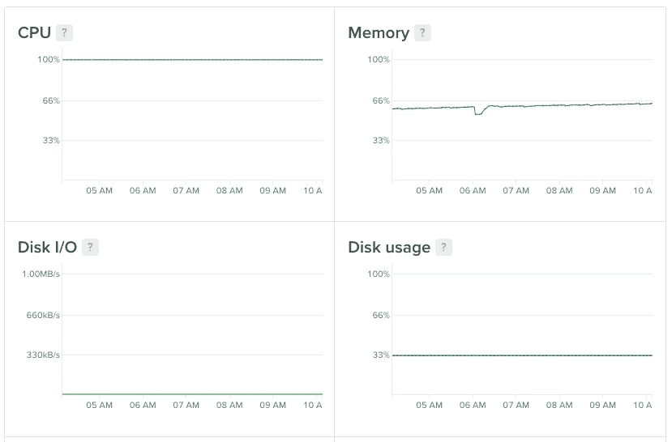
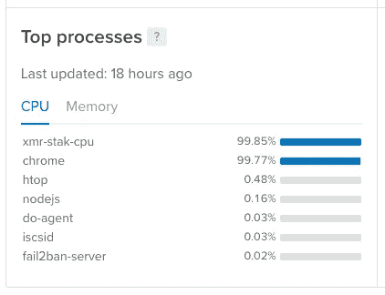
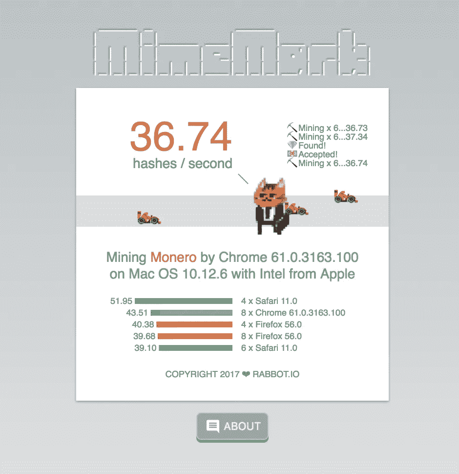

# 数字海洋上的⛏矿业？

> 原文：<https://medium.com/coinmonks/mining-on-digitalocean-97713deabd66?source=collection_archive---------1----------------------->

## TL；博士不要这样做！

# 先决条件

*   [**数字海洋**](https://www.digitalocean.com/?refcode=6dcfcc2a3392) 512 MB/ 20 GB 磁盘/ SGP1 — Ubuntu 16.04.3 x64
*   咖啡☕️

# 怎么会？

## 第一次尝试

我用的是[**xmr-stak-CPU**](https://github.com/fireice-uk/xmr-stak-cpu)**这对于 Ubuntu 来说不是那么简单，需要一些学习曲线。好消息是我的 [**工作设置步骤**](https://cnhv.co/d5u) (投币式链接)将为此进行部署。**

****

> **结果:大约每秒 25 次散列**

**但是你必须达到最低支付门槛****，也就是 1.000 XMR，所以在这种情况下几乎是永久的。所以我决定关机:)******

## ******第二次尝试******

******我通过 npm 使用 [coin-hive，但是在 Ubuntu 上部署还是有点棘手。猜猜我的](https://github.com/cazala/coin-hive) [**工作设置步骤**](https://cnhv.co/d5o) (投币式链接)是什么！******

********

****Poor nodejs****

> ****结果:~10 次散列/秒****

# ****摘要****

****这是它燃烧的东西****

********

****饥饿的家伙在那里；)****

********

****我们宁愿关闭它，这对那里的任何人都没有好处:)****

# ****值得吗？****

## ****TL；不博士****

****支出为每 1M 哈希 0.00016287 XMR，阈值为 1XMR，但我们只能在**【每月 5 美元液滴成本**上执行 10 h/s(每月约 26，784，000 个哈希=每月 0.00436231008 XMR per】【每月 0.4 美元)，这意味着我们每月仅损失了**-4.6 美元**！****

# ****还有一点****

****另一种方法是在浏览器中挖掘，同时提供一个好的服务，让用户知道他们必须挖掘你的网络应用程序。****

****还有[**下面是我的尝试**](https://rabbot.io/minemark/) 提供挖矿基准服务，你可以试试看你的浏览器能挖矿多少。(你会对那里的结果感到惊讶)****

********

****[https://rabbot.io/minemark/](https://rabbot.io/minemark/)****

****我会收集结果并写在博客上，所以要冷静，鼓掌并尝试挖掘基准:D****

****与此同时，去试试吧->[https://rabbot.io/minemark/](https://rabbot.io/minemark/)****

## ****注意(参考)****

> ****不要错过免费获得 10 美元 [**数字海洋**](https://www.digitalocean.com/?refcode=6dcfcc2a3392) ← 2 个月免费托管的机会！****

> ****[在您的收件箱中直接获得最佳软件交易](https://coincodecap.com/?utm_source=coinmonks)****

********