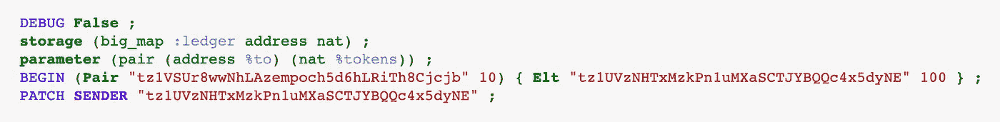
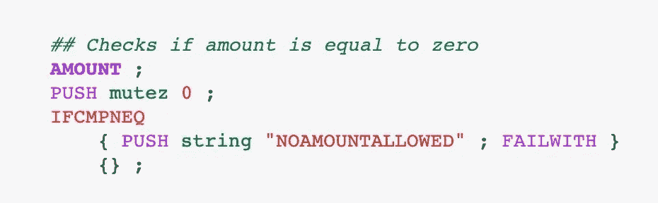
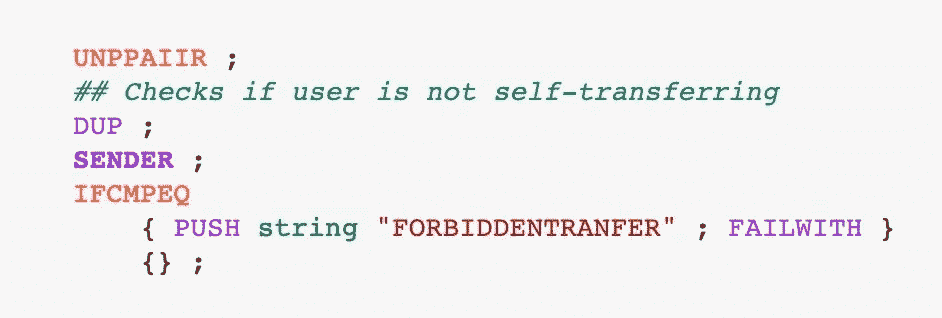
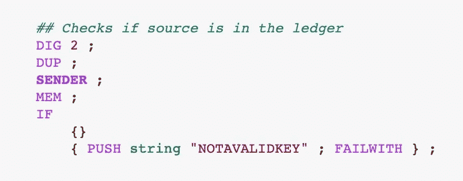
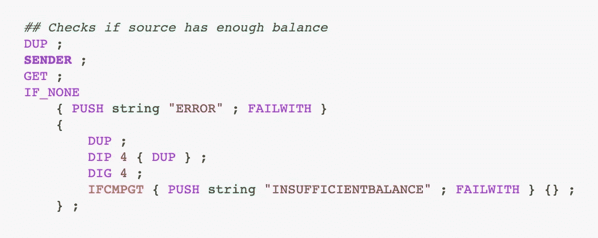
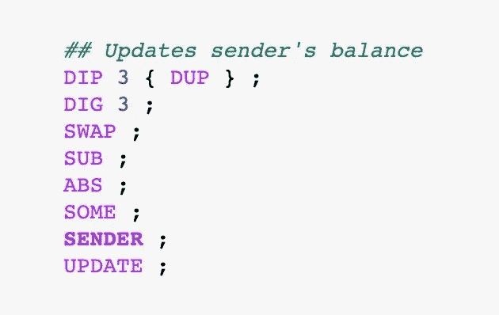

# mini tez:Tezos 上的极简标志

> 原文：<https://medium.com/coinmonks/minitez-a-minimalistic-token-on-tezos-f77e8c0f7a97?source=collection_archive---------0----------------------->

## 通过构建您自己的令牌来学习迈克尔逊和令牌合同最佳实践！


Image by [Tim C. Gundert](https://pixabay.com/users/timcgundert-3157574/?utm_source=link-attribution&amp;utm_medium=referral&amp;utm_campaign=image&amp;utm_content=1633073) from [Pixabay](https://pixabay.com/?utm_source=link-attribution&amp;utm_medium=referral&amp;utm_campaign=image&amp;utm_content=1633073)

Tezos 上的每个人都说代币！不同的提案，如 [TZIP7](https://gitlab.com/tzip/tzip/-/blob/master/proposals/tzip-7/tzip-7.md) 和最近的 [TZIP12](https://gitlab.com/tzip/tzip/-/blob/master/proposals/tzip-12/tzip-12.md) ，允许在 Tezos 区块链上创建复杂的代币。对于不太懂技术的读者来说，阅读这些提议可能有点让人不知所措，因为它们充满了技术术语和对[迈克尔逊](https://tezos.gitlab.io/whitedoc/michelson.html)的引用。他们也是基于为区块链礼物，可能是以太坊或 Tezos 开发的共同特征令牌。

有时候，理解一个东西如何工作的最好方法就是自己动手做！这是这篇文章的目标，我们将建立 miniTez，一个极简的 Tezos 区块链令牌。令牌只做一件事:它将价值从一个用户转移到另一个用户(有点像比特币做的)。转移价值是代币使用的核心，也是理解的基本机制。MiniTez 没有更精细的功能，如支出批准或铸造，它做一件事，而且做得很好！

令牌是使用迈克尔逊语言构建的。语言的基础知识将有助于理解代码，但我会解释每个指令做什么，并在整个过程中指导你。使用迈克尔逊的开发体验一开始可能会有点粗糙，但它真的会让人上瘾！

如果你想看看完成的代码，你可以在 Mainnet 上找到它[。](https://better-call.dev/mainnet/KT1TUx83WuwtA2Ku1pi6A9AZqov7CZfYtLUS/code)

我们开始吧😊

# 准备开发环境

为了编写迈克尔逊代码，我们将使用我最喜欢的工具之一:由 [Baking Bad 团队](https://baking-bad.org/)开发的带有迈克尔逊内核的 [Jupyter 笔记本](https://mybinder.org/v2/gh/baking-bad/michelson-kernel/binder?filepath=michelson_quickstart.ipynb)。这个环境将允许我们在执行的每一步可视化堆栈，并使调试它变得容易得多！

笔记本可以用来写完整的合同，也可以用来写说明，看看基本设置后会发生什么。这就是我们在这里要用的。这样，我们可以随时看到堆栈的状态，并更好地理解不同部分是如何组合在一起的。让我们现在设置它:



在我们开始编写迈克尔逊代码之前，有 5 行代码，每一行都做一些重要的事情:

*   `DEBUG False`:这将禁止堆栈中发生的各种变化，并且会占用大量空间。如果你想看到一个接一个的变化，你可以把它去掉。
*   `storage (big_map :ledger address nat) ;`:这建立了合同的存储，一个大的映射，其中 Tezos 地址与`nat`(非负数)类型的余额相关联。
*   `parameter (pair (address %to) (nat %tokens)) ;`:契约只有一个入口点，接受的参数总是与接收者的地址和要转移的令牌成对。
*   `BEGIN (Pair “tz1VSUr8wwNhLAzempoch5d6hLRiTh8Cjcjb” 10) { Elt “tz1UVzNHTxMzkPn1uMXaSCTJYBQQc4x5dyNE” 100 } ;`:`BEGIN`指令是笔记本特有的，它将参数(对)传递给合同，就好像它们是与交易和初始存储(大图)一起发送的一样。
*   `PATCH SENDER “tz1UVzNHTxMzkPn1uMXaSCTJYBQQc4x5dyNE” ;`:该指令也是笔记本特有的，它向编译器指示哪个地址用于`SENDER`指令(通常与事务一起出现的地址)。

现在，我们已经拥有了编写代码所需的一切！

# 传输前验证参数是否正确

在两个帐户之间交换任何值之前，我们必须确保满足一些条件，以确保转移的安全性。在 miniTez 的情况下，就像许多令牌的情况一样，我们希望检查四个条件:

1.  没有金额必须发送到合同:事实上，任何发送到合同的资金将被锁定，永远失去，所以你想中止任何交易与 XTZ。
2.  必须禁止自我转移:虽然大多数情况下是无害的，但自我转移是多余的，可能会让你的合同暴露给你没有想到的黑客。最好是禁用它们。
3.  发送者必须在令牌分类帐中注册:为了简化起见，miniTez 是一个特例，其中只有在分类帐中注册了地址的用户才能发送令牌，并且拥有注册地址的唯一方式是从注册的人那里接收令牌。
4.  发送者必须有足够的令牌来发送所请求的号码。对超过当前余额的令牌数量的请求必须导致契约失效，并且阻止任何进一步的改变。

在允许任何转移之前，这四个条件必须被实现为迈克尔逊码。检查令牌数量的方式如下:



这相当容易！`AMOUNT`是将随交易发送的金额压入堆栈的指令。然后，我们将`mutez 0`推到它的顶部，并使用`IFCMPNEQ`(*ifcomparenote equal*)宏来检查金额是否不等于`0`。如果是这样，第一对花括号内的代码将会运行。代码将一个错误代码推入堆栈，并使用`FAILWITH`来停止执行。如果金额等于`0`，则运行第二对花括号中的代码。代码的缺失仅仅意味着无论条件后面有什么代码，执行都会继续。

现在，我们可以检查我们聪明的用户是否没有试图向自己发送令牌！



`UNPPAIIR`指令是我们用来解开嵌套对的宏。在这一点上，我们在栈顶有一个 pair，左边是另一个 pair(参数)，右边是一个大 map(存储)。`UNPPAIIR`指令告诉迈克尔逊展开根对和左边的对。然后我们剩下一个堆栈，看起来像这样:

```
.-----.--------------.-------------------------------------------.
| Pos |    Value     |                   Type                    |
:-----+--------------+-------------------------------------------:
|  0  | "tz1...jcjb" | address %to                               |
:-----+--------------+-------------------------------------------:
|  1  | 10           | nat %tokens                               |
:-----+--------------+-------------------------------------------:
|  2  | {Elts}       | big_map :ledger address nat               |
'-----'--------------'-------------------------------------------'
```

我们希望使用堆栈顶部的地址来检查参数中提供的地址和发送方的地址是否不同。因为我们以后还会需要它，所以我们现在必须用`DUP`指令复制它，因为迈克尔逊指令消耗了它们被调用的值。完成后，我们可以使用`SENDER` 来推送发送事务的地址，并使用`IFCMPEQ`(*ifcompareeequal*)来验证这两个地址是否相同。像第一个例子中的`AMOUNT`一样，如果两个地址相同，将调用`FAILWITH`指令，否则执行将继续。

接下来，我们必须确保发件人的地址已登记在分类账中:



首先，我们将让大地图放在堆栈的顶部来使用它。从上表可以看出，大地图位于 **2** 位置。我们可以使用`DIG`指令“挖掘”出堆栈中的一个元素，并将其放在顶部。所以`DIG 2`获取位置 2 的元素并把它放在顶部。正如你可能已经猜到的，我们必须用`DUP`复制大地图，因为我们将在整个代码中使用它。`SENDER`再次将发送者的地址压入堆栈，这样我们可以使用`MEM`来验证该地址是否是大地图的一个键。如果是，我们将执行第一对花括号内的代码，如果不是，我们将执行第二对花括号内的代码，即停止执行契约的代码。如果发件人的地址在分类帐中，我们的堆栈现在看起来是这样的:

```
.-----.-------------.-------------------------------------------.
| Pos |    Value    |                   Type                    |
:-----+-------------+-------------------------------------------:
|   0 | {Elts}      | big_map :ledger address nat               |
:-----+-------------+-------------------------------------------:
|   1 | "tz...jcjb" | address %to                               |
:-----+-------------+-------------------------------------------:
|   2 | 10          | nat %tokens                               |
'-----'-------------'-------------------------------------------'
```

为了完成我们的一系列验证，我们将验证汇款人的余额，并检查转账请求的代币数量是否等于或小于当前余额:



因为我们将再次使用大地图，我们必须用`DUP`复制它，以便为以后保留一份副本。我们再次将`SENDER`的地址压入堆栈，并使用`GET`指令来检索与堆栈顶部的键相关联的值。该值将作为一个`optional`值被推送到堆栈上:如果该键存在于大映射中，则该值将为`(Some value)`，否则将返回`(None)`。从上一步我们知道，关键存在于大地图中，所以在这里没有什么好惊讶的！我们可以使用`IF_NONE`来检查值是否为`(None)`，这是极不可能的，但是安全总比遗憾好，我们将使契约失败。我们现在在栈顶有了与发件人地址相关的值，即他的余额:

```
.-----.-------------.-------------------------------------------.
| Pos |    Value    |                   Type                    |
:-----+-------------+-------------------------------------------:
|   0 | 100         | nat %balance                              |
:-----+-------------+-------------------------------------------:
|   1 | {Elts}      | big_map :ledger address nat               |
:-----+-------------+-------------------------------------------:
|   2 | "tz...jcjb" | address %to                               |
:-----+-------------+-------------------------------------------:
|   3 | 10          | nat %tokens                               |
'-----'-------------'-------------------------------------------'
```

以下花括号中的代码是一个很好的例子，说明了在用迈克尔逊编码时要花很多时间做的事情:将所有需要的部分放在正确的位置😅让我们来看看它有什么作用:

1.  `DUP`复制余额。
2.  `DIP 4 { DUP }`找到堆栈中的第四个元素并复制它。
3.  `DIG 4`找出位置 4 的元素(令牌值的副本)并将其放在堆栈的顶部。
4.  `IFCMPGT`检查第一个元素(值)是否大于第二个元素(余额)。如果是，则合同失败。

在所有这些操作之后，我们得到了和以前一样的堆栈状态！

# 更新发送方的余额

对于接下来两个步骤的顺序，有两种思想流派:像我这样来自以太坊的人可能会选择在接收者的余额之前更新发送者的余额(因为这在可靠性上有意义)，其他人更喜欢先更新接收者的余额。我认为，在某处添加令牌之前，先减去令牌总是好的，就像您处理物理令牌一样，这就是我们为什么要先这么做的原因:



如果您需要回忆一下此时堆栈的状态，请查看上一段末尾的图表。

现在，我们要计算发送者在扣除他发送给接收者的令牌后的新余额。我们在堆栈中有了所有需要的元素，但不幸的是，顺序不对😬我们可以先用`DIP 3 { DUP }`复制堆栈底部的令牌数，然后用`DIG 3`将复制的值放在堆栈顶部。因为我们想从余额中减去代币的数量，所以我们必须用`SWAP`将这两个值按正确的顺序排列。接下来，我们可以使用`SUB`来得到结果。迈克尔逊中的`SUB`指令总是返回一个`int`类型的值，即使你减去`nat`值，所以我们必须使用`ABS`得到一个`nat`。让我们检查堆栈此时的状态:

```
.-----.-------------.-------------------------------------------.
| Pos |    Value    |                   Type                    |
:-----+-------------+-------------------------------------------:
|   0 | 90          | nat                                       |
:-----+-------------+-------------------------------------------:
|   1 | {Elts}      | big_map :ledger address nat               |
:-----+-------------+-------------------------------------------:
|   2 | "tz...jcjb" | address %to                               |
:-----+-------------+-------------------------------------------:
|   3 | 10          | nat %tokens                               |
'-----'-------------'-------------------------------------------'
```

在将新的余额添加到大图之前，我们需要解决两个问题:首先，只有类型为`option`的值可以用于更新大图中的值，因此我们必须将`nat`包装到可选的。第二，更新一个大图的元素的正确顺序是 **KEY + VALUE + BIGMAP** ，所以我们又需要发件人的地址了。

`SOME`是把一个值变成可选的指令。用了之后，我们的`nat 90`就变成了`(option nat) (Some 90)`。然后，我们可以简单地再次使用`SENDER`将发送者的地址压入堆栈，然后*瞧*！一切准备就绪，等待`UPDATE`指令。之后，我们在堆栈顶部获得更新后的大地图:

```
.-----.-------------.-------------------------------------------.
| Pos |    Value    |                   Type                    |
:-----+-------------+-------------------------------------------:
|   0 | {New Elts}  | big_map :ledger address nat               |
:-----+-------------+-------------------------------------------:
|   1 | "tz...jcjb" | address %to                               |
:-----+-------------+-------------------------------------------:
|   2 | 10          | nat %tokens                               |
'-----'-------------'-------------------------------------------'
```

# 更新收款人的余额

这一步比前一步稍微复杂一些，因为我们可能会面临两种不同的情况:在第一种情况下，接收者已经有了一个帐户和一个余额，我们必须将令牌添加到现有的余额中。在第二个场景中，接收者在分类帐中不存在，我们必须用余额创建一个新的键/值对。

下面是创建或更新收款人余额的代码:


从`DIP`、`DUP`、`SWAP`的数量可以看出，会有很多移动的棋子😅

首先，我们复制大地图和收件人的地址，并将它们按正确的顺序排列，这就是`DIP { DUP } ; SWAP ; DIP { DUP } ;`的工作。现在，我们的堆栈看起来像这样:

```
.-----.-------------.-------------------------------------------.
| Pos |    Value    |                   Type                    |
:-----+-------------+-------------------------------------------:
|   0 | "tz...jcjb" | address %to                               |
:-----+-------------+-------------------------------------------:
|   1 | {New Elts}  | big_map :ledger address nat               |
:-----+-------------+-------------------------------------------:
|   2 | {New Elts}  | big_map :ledger address nat               |
:-----+-------------+-------------------------------------------:
|   3 | "tz...jcjb" | address %to                               |
:-----+-------------+-------------------------------------------:
|   4 | 10          | nat %tokens                               |
'-----'-------------'-------------------------------------------'
```

我们可以打电话给`MEM`来检查收件人的地址是否是大地图的一个键。让我们深入到代码的底部，看看如果接收者不是一个键(这是更简单的情况)，我们该怎么办。`DUG 2`将把大地图放在位置 2，而`DIP { SOME }`将忽略堆栈的第一个元素(地址),并将第二个元素(令牌)包装在一个可选值中。现在，我们的筹码看起来像这样:

```
.-----.-------------.-------------------------------------------.
| Pos |    Value    |                   Type                    |
:-----+-------------+-------------------------------------------:
|   0 | "tz...jcjb" | address %to                               |
:-----+-------------+-------------------------------------------:
|   1 | Some 10     | option (nat %tokens)                      |
:-----+-------------+-------------------------------------------:
|   2 | {New Elts}  | big_map :ledger address nat               |
'-----'-------------'-------------------------------------------'
```

如您所见，通过调用`UPDATE`，元素以正确的顺序将新值插入到大图中。这条指令将在大映射中创建一个新的绑定，其键是接收者的地址，其值是令牌的数量。

现在，让我们看看如果收件人已经存在于大地图中会发生什么！我们从复制和移动一些值开始，稍后我们将使用下面的指令:`SWAP ; DIP { DUP } ; DUP ; DIP { SWAP } ;`之后，这是堆栈的样子:

```
.-----.-------------.-------------------------------------------.
| Pos |    Value    |                   Type                    |
:-----+-------------+-------------------------------------------:
|   0 | "tz...jcjb" | address %to                               |
:-----+-------------+-------------------------------------------:
|   1 | {New Elts}  | big_map :ledger address nat               |
:-----+-------------+-------------------------------------------:
|   2 | "tz...jcjb" | address %to                               |
:-----+-------------+-------------------------------------------:
|   3 | {New Elts}  | big_map :ledger address nat               |
:-----+-------------+-------------------------------------------:
|   4 | 10          | nat %tokens                               |
'-----'-------------'-------------------------------------------'
```

此时，我们可以使用`GET`指令来获取接收者的余额，因为我们在堆栈的顶部有了正确顺序的键和大地图。`GET`是一条返回类型为`optional`的值的指令，所以我们可以预期`(Some nat)`会被推到堆栈的顶部。为了得到可选值的参数值，我们必须使用`IF_NONE`或`IF_SOME`。我们可以在这里使用`IF_NONE`，在返回值为`None`的极不可能的情况下，我们使契约失败(即使余额为`0`，返回值也将为`(Some 0)`)。否则，堆栈顶部会出现现有余额:

```
.-----.-------------.-------------------------------------------.
| Pos |    Value    |                   Type                    |
:-----+-------------+-------------------------------------------:
|   0 | 15          | nat %balance                              |
:-----+-------------+-------------------------------------------:
|   1 | "tz...jcjb" | address %to                               |
:-----+-------------+-------------------------------------------:
|   2 | {New Elts}  | big_map :ledger address nat               |
:-----+-------------+-------------------------------------------:
|   3 | 10          | nat %tokens                               |
'-----'-------------'-------------------------------------------'
```

我们现在要做的唯一事情是将转移的代币添加到当前余额中。为此，我们必须用`DIG 3`从栈底到栈顶获取令牌值。现在，两个`nat`值叠加在一起，我们可以调用`ADD`来得到它们的和。在将新值保存到大图中之前，我们必须用`SOME`将它包装在一个`optional`值中，一旦完成，我们可以使用`UPDATE`将它推回到大图中。

现在，更新后的大地图被单独留在堆栈的顶部，这对于结束当前合同的执行来说是完美的。在`IF`检查接收者是否已经注册为大图中的一个键之后，我们编写通常的指令`NIL operation ; PAIR ;`来返回一对，左边是一个空的操作列表，右边是新的大图！

就这样，你在🥳的泰佐斯区块链上创造了一个类似比特币的极简代币

代币的数量将被限制为您在创建合同时向创建的账户提供的余额(不能铸造新代币)，并且当代币被发送到分类帐中不存在的地址时，代码仅处理代币的转移和新账户的创建。

# 结论

这个小练习是一个很好的机会，可以让你了解更多关于迈克尔逊智能合约的知识，它们的结构，它们的指令，以及在继续执行之前，移动堆栈中的元素，使它们按照要求的顺序排列的逻辑。编写迈克尔逊的大部分时间将用于输入指令，如`DUP`、`SWAP`、`DIG`和`DUG`，以获得您想要的元素。

还要记住，大多数指令消耗它们在堆栈中使用的元素:`GET`将返回一个大映射中的键值，但它将同时从堆栈中删除该键和大映射！

浏览一些用迈克尔逊语言编写的代码，展示了泰佐斯·区块链用于智能合约的语言的健壮性和安全性:没有意外的值，没有意外的边缘情况，没有双重含义。在迈克尔逊，聪明的合同只能以确定的特定方式工作，任何篡改它的企图都会使合同失败，并保证你宝贵的 XTZ 的安全😊

# 买 miniTez！

无论您认为 miniTez 将来会成为一个收藏项目，还是希望帮助 Tezos 开发更多的教育资源，您都可以自己获得一些 miniTez！

想买 miniTez 代币可以去 [miniTez 商店](https://minitez.netlify.app/)买代币！之后，您可以保留它们，或者通过商店界面将其发送给您的亲人。

> [*在您的收件箱中直接获得最佳软件优惠*](https://coincodecap.com/?utm_source=coinmonks)

[](https://coincodecap.com/?utm_source=coinmonks)