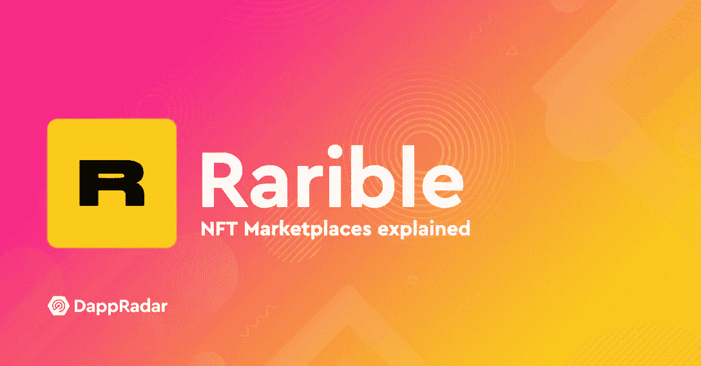
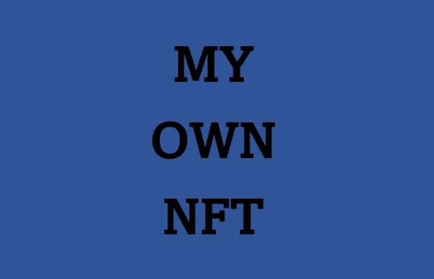
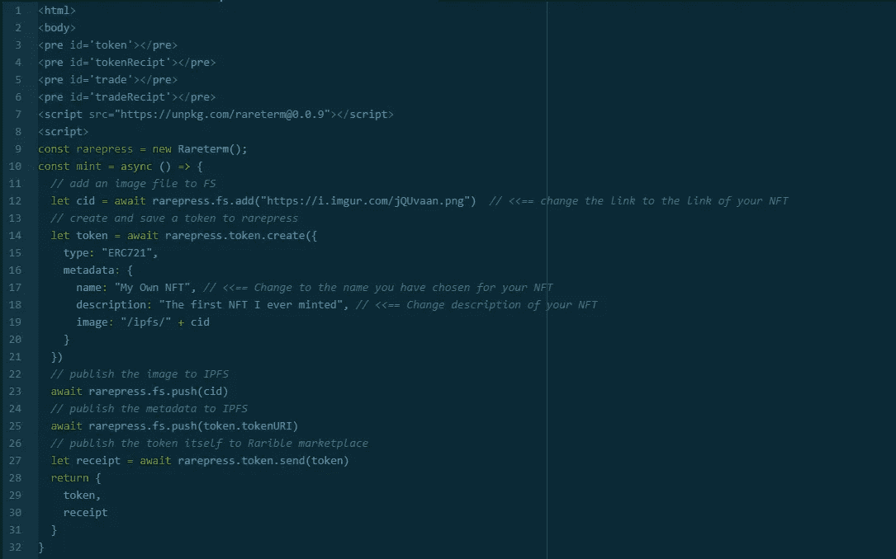
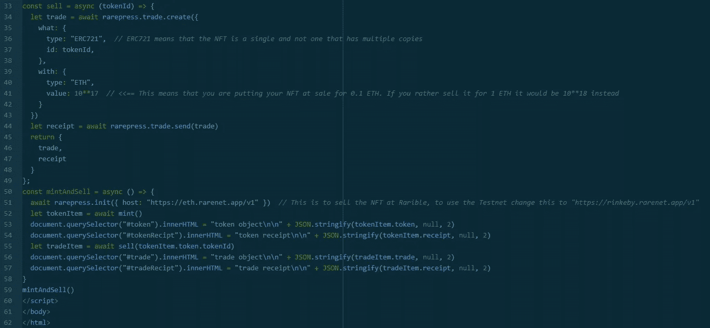
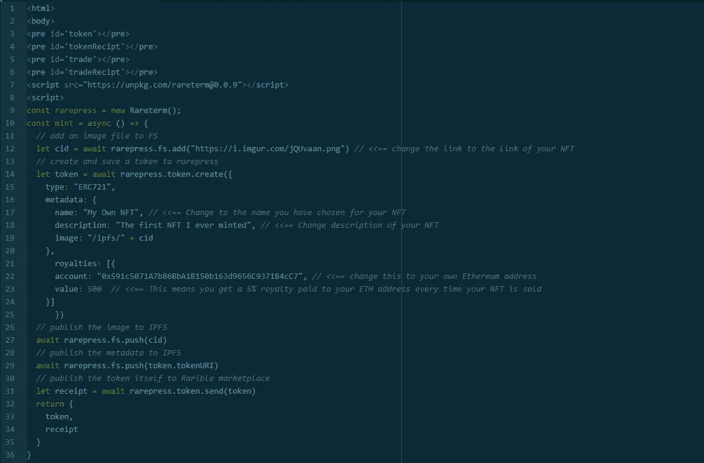
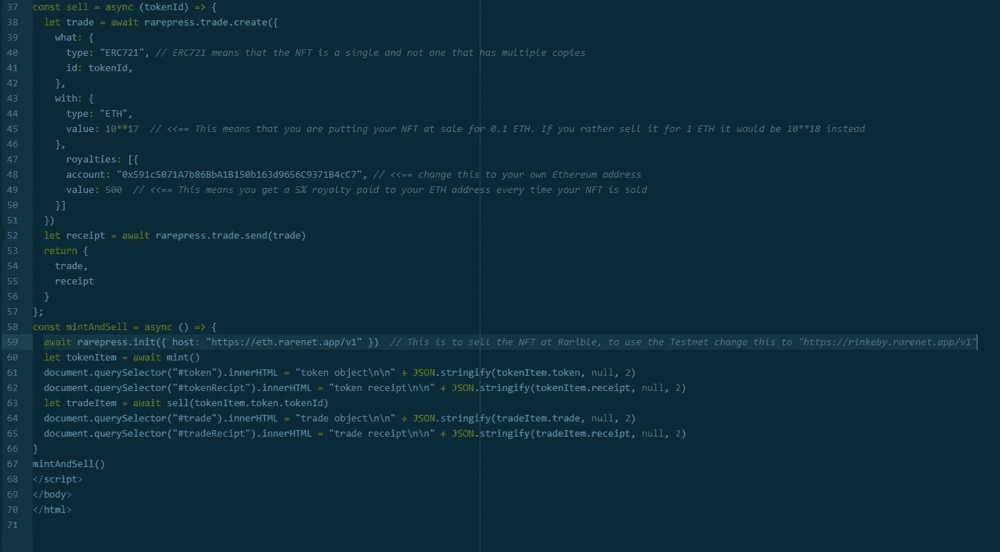

# 在稀有出版社的帮助下铸造 NFT

> 原文：<https://medium.com/coinmonks/minting-nfts-with-the-help-of-rarepress-67b083b25330?source=collection_archive---------8----------------------->

铸造和出售以太坊上的 NFT 区块链可以变得昂贵，由于高汽油费的。通过使用 [RarePress](https://rarepress.org/) 、一点代码、 [Metamask](https://metamask.io/) 和一个[本地网络服务器](https://github.com/http-party/http-server)或者你自己的网站，你可以制造和销售 NFT，而不需要你付出任何代价。



*看不懂全文？成为中等* [***的一员这里***](https://medium.zanno.se/membership)

如果你还没有元掩码，你需要按照他们网站上的说明来安装:[https://metamask.io/](https://metamask.io/)

**查看我的网站，里面有很多在线博彩和赌场指南！**

[**creepybits . bet**](https://creepybits.bet)

这是因为你需要一个以太坊地址来发布你的 NFT，当然，如果你的 NFT 被卖掉，你也需要一个以太坊地址来收集你得到的以太坊。一旦你安装了 Metamask 并有了一个以太坊地址，你就应该用那个地址在 [Rarible](https://rarible.com) 注册一个账户。接下来你将需要一个文本编辑器，在那里你将编写代码本身，我更喜欢 [Atom](https://atom.io/) ，但是任何文本编辑器都可以。



This is our NFT will will mint as an example

为了在 Rarible 上制作一张 NFT 的图片，我们首先要把它上传到互联网上的某个地方，为了这个例子的目的，我使用了 imgur，图片的位置是:[https://i.imgur.com/jQUvaan.png](https://i.imgur.com/jQUvaan.png)

代码本身由两部分组成。第一部分是铸造 NFT 并发布到你的账户上，但不公开出售。代码的第一部分如下所示:



This part is responsible for the minting and publishing, but NOT the selling.

重要的是要知道，无论您使用哪个 ETH 地址发布 NFT，它都将是 NFT 的所有者。

代码的第二部分是你决定 NFT 卖多少钱。在我们的示例中，我们以 0.1 ETH 的价格出售 NFT。



This part is responsible for pricing as well as putting the NFT up for sale.

一旦你在你的文本编辑器中的同一个文档中写完了所有的代码，你可以把它保存为类似 NTFminting.html 的文件，并上传到你自己的网站或本地服务器上。一旦你访问了像[https://mywebsite.org/NFTminting.html](https://mywebsite.org/NFTminting.html)这样的页面，Metamask 就会打开并要求你签名。使用元掩码签名，并等待几分钟，直到要求您再次签名。第一次签名是为了铸造 NFT，第二次是为了拍卖。

如果你按照正确的步骤，你会发现你新铸造的 NFT 在 https://rinkeby.rarible.com/items?tab=created[出售](https://rinkeby.rarible.com/items?tab=created)

现在，如果你还想在每次卖出你的 NFT 时获得版税，你将不得不添加一点代码。



We have added 3 new lines with “Royalty”



Royalty is also added here.

这里是完整的代码，你可以复制和粘贴，只是要确保在你试图发布之前改变链接，地址等。这将铸币，出版和销售你的 NFT 在 0.1 ETH 的价格和 5%的版税。尽情享受吧！

```
<html>
<body>
<pre id='token'></pre>
<pre id='tokenRecipt'></pre>
<pre id='trade'></pre>
<pre id='tradeRecipt'></pre>
<script src="[https://unpkg.com/rareterm@0.0.9](https://unpkg.com/rareterm@0.0.9)"></script>
<script>
const rarepress = new Rareterm();
const mint = async () => {
  // add an image file to FS
  let cid = await rarepress.fs.add("[https://i.imgur.com/jQUvaan.png](https://i.imgur.com/jQUvaan.png)") // <<== change the link to the link of your NFT
  // create and save a token to rarepress
  let token = await rarepress.token.create({
    type: "ERC721",
    metadata: {
      name: "My Own NFT", // <<== Change to the name you have chosen for your NFT
      description: "The first NFT I ever minted", // <<== Change description of your NFT
      image: "/ipfs/" + cid
    },
      royalties: [{
      account: "0x591c5071A7b86BbA1B150b163d9656C9371B4cC7", // <<== change this to your own Ethereum address 
      value: 500  // <<== This means you get a 5% royalty paid to your ETH address every time your NFT is sold
    }]
      })
  // publish the image to IPFS
  await rarepress.fs.push(cid)
  // publish the metadata to IPFS
  await rarepress.fs.push(token.tokenURI)
  // publish the token itself to Rarible marketplace
  let receipt = await rarepress.token.send(token)
  return {
    token,
    receipt
  }
}
const sell = async (tokenId) => {
  let trade = await rarepress.trade.create({
    what: {
      type: "ERC721", // ERC721 means that the NFT is a single and not one that has multiple copies
      id: tokenId,
    },
    with: {
      type: "ETH",
      value: 10**17  // <<== This means that you are putting your NFT at sale for 0.1 ETH. If you rather sell it for 1 ETH it would be 10**18 instead
    },
      royalties: [{
      account: "0x591c5071A7b86BbA1B150b163d9656C9371B4cC7", // <<== change this to your own Ethereum address 
      value: 500  // <<== This means you get a 5% royalty paid to your ETH address every time your NFT is sold
    }]
  })
  let receipt = await rarepress.trade.send(trade)
  return {
    trade,
    receipt
  }
};
const mintAndSell = async () => {
  await rarepress.init({ host: "[https://eth.rarenet.app/v1](https://eth.rarenet.app/v1)" })  // This is to sell the NFT at Rarible, to use the Testnet change this to "[https://rinkeby.rarenet.app/v1](https://rinkeby.rarenet.app/v1)"
  let tokenItem = await mint()
  document.querySelector("#token").innerHTML = "token object\n\n" + JSON.stringify(tokenItem.token, null, 2)
  document.querySelector("#tokenRecipt").innerHTML = "token receipt\n\n" + JSON.stringify(tokenItem.receipt, null, 2)
  let tradeItem = await sell(tokenItem.token.tokenId)
  document.querySelector("#trade").innerHTML = "trade object\n\n" + JSON.stringify(tradeItem.trade, null, 2)
  document.querySelector("#tradeRecipt").innerHTML = "trade receipt\n\n" + JSON.stringify(tradeItem.receipt, null, 2)
}
mintAndSell()
</script>
</body>
</html>
```

**如果你喜欢你读到的内容，欢迎你通过下面的选项来表达你的支持。**

任何人都可以通过 my [PayPal](https://paypal.me/ZannoJacklin) 或向以下任何一个地址发送加密货币来表达他们的支持。

比特币地址:**BC 1 q 3 yweqw 6 dvdr DJ 999 prmuxzuw 6y 6 C3 Sam 3 e 2 PAC**

Litecoin 地址:**ms 6 nu 4 e 4r w6 z 5z 53 fy 2 TF 6 fvkxeawr 4 szt**

ETH/BSC 地址:**0x 662 BD 246 ebb 857 f1 ab 368500527 c 54 ef 0 b 864 BD 8**

联系人:zanno@creepybits.org

> 加入 Coinmonks [电报频道](https://t.me/coincodecap)和 [Youtube 频道](https://www.youtube.com/c/coinmonks/videos)了解加密交易和投资

## 也阅读

[](/coinmonks/leveraged-token-3f5257808b22) [## 杠杆代币[多头代币]终极指南

### 杠杆化令牌是具有杠杆化风险敞口的 ERC20 令牌，不考虑保证金、要求、管理…

medium.com](/coinmonks/leveraged-token-3f5257808b22) [](https://blog.coincodecap.com/crypto-exchange) [## 最佳加密交易所| 2021 年十大加密货币交易所

### 编辑描述

blog.coincodecap.com](https://blog.coincodecap.com/crypto-exchange) [](https://blog.coincodecap.com/best-swap-platforms) [## 2021 年最佳加密交换平台| CoinCodeCap

### 编辑描述

blog.coincodecap.com](https://blog.coincodecap.com/best-swap-platforms)  [## 10 大最佳网上赌场[2021] |赢取免费 BTC | CoinCodeCap

### 编辑描述

blog.coincodecap.com](https://blog.coincodecap.com/best-online-casinos) [](/coinmonks/top-5-crypto-lending-platforms-in-2020-that-you-need-to-know-a1b675cec3fa) [## 2021 年最佳加密借贷平台| 6 大比特币借贷平台

### 获得比特币和其他加密货币的最佳贷款利率

medium.com](/coinmonks/top-5-crypto-lending-platforms-in-2020-that-you-need-to-know-a1b675cec3fa) [](/coinmonks/the-best-cryptocurrency-hardware-wallets-of-2020-e28b1c124069) [## 2021 年 6 大最佳硬件钱包|顶级加密硬件钱包[更新]

### 最好的加密货币硬件钱包是绝对必要的。我们将在 NGRAVE、Ledger Nano X 和…

medium.com](/coinmonks/the-best-cryptocurrency-hardware-wallets-of-2020-e28b1c124069) [](/coinmonks/crypto-trading-bot-c2ffce8acb2a) [## 2021 年最佳免费加密交易机器人

### 2021 年币安、比特币基地、库币和其他密码交易所的最佳密码交易机器人。四进制，位间隙…

medium.com](/coinmonks/crypto-trading-bot-c2ffce8acb2a) [](/coinmonks/best-crypto-signals-telegram-5785cdbc4b2b) [## 最佳 4 个加密交易信号电报通道

### 这是乏味的找到正确的加密交易信号提供商。因此，在本文中，我们将讨论最好的…

medium.com](/coinmonks/best-crypto-signals-telegram-5785cdbc4b2b) [](https://blog.coincodecap.com/bitsgap-review) [## 获取信号、交易机器人和套利

### 在本文中，我们将讨论 bits gap——一个满足您所有交易需求的一站式加密交易平台…

blog.coincodecap.com](https://blog.coincodecap.com/bitsgap-review) [](https://blog.coincodecap.com/best-telegram-channels) [## 40 个最佳电报频道，用于加密、电影、表演和演讲| CoinCodeCap

### 编辑描述

blog.coincodecap.com](https://blog.coincodecap.com/best-telegram-channels)