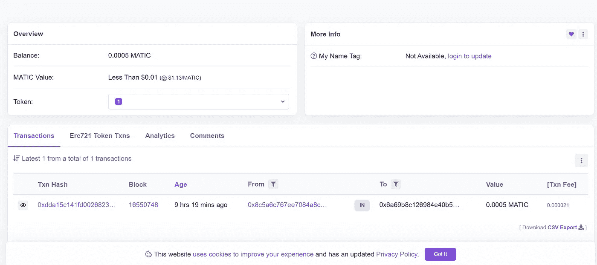
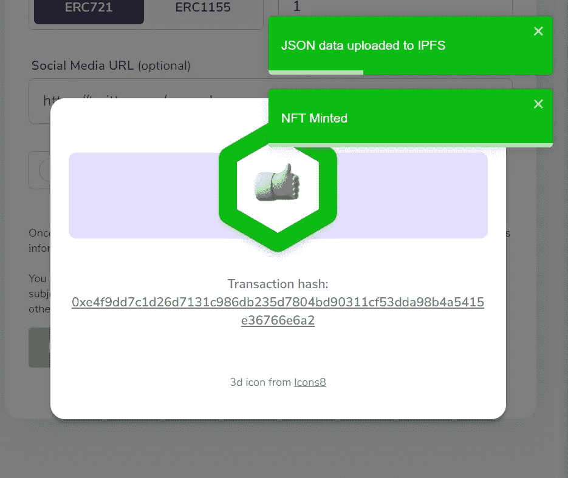

# 铸造你的第一个 NFT 使用多边形 NFT minter。

> 原文：<https://medium.com/coinmonks/minting-your-first-nft-using-the-polygon-nft-minter-uncryptd-1d6a104536dc?source=collection_archive---------1----------------------->

区块链技术最近经常成为头条新闻。区块链是互联网 2.0，一下子理解起来很复杂，但它为大规模进化打开了许多视野。用外行人的话来说，**区块链是一种记录保存工具，其中分类账(交易记录)分布在计算机网络中。**

首先，让我们理解什么是令牌。令牌是代表其他东西的对象。在区块链世界中，有两种类型的令牌——可替代的和不可替代的。可替代性定义了一项资产与另一项资产交换而不损害其价值的能力。例如，比特币是可替代的——用一个比特币换另一个比特币，你会得到完全一样的东西。但是一个不可替代的令牌(NFT)拥有一个独特的特征，定义了它的独特性。例如，画“蒙娜丽莎”可以被定义为 NFT。从实物艺术收藏的角度来说:任何人都可以买到蒙娜丽莎的画像。但只有一个人能拥有原件。

在我们开始实践之前，有几个先决条件。

1.  *以太坊*:以太坊是一个开源的区块链平台，允许开发者构建和发布[智能合约](https://www.investopedia.com/terms/s/smart-contracts.asp)和去中心化应用(DApp)。以太坊有自己的加密货币——以太(ETH)。
2.  我们已经见证了网络在一段时间内的发展。

Source: Fabric Ventures

O'Reilly 等人在 1999 年至 2004 年间创造的 Web 2.0 让世界从为信息消费而设计的静态桌面网页，从昂贵的服务器转向互动体验和用户生成的内容，为我们带来了优步、Airbnb、脸书和 Instagram。Web 2.0 的兴起很大程度上是由三个核心创新层推动的:**移动**、**社交**和**云**。

[Web3](/fabric-ventures/what-is-web-3-0-why-it-matters-934eb07f3d2b) 应用程序要么运行在区块链上，由许多对等节点(服务器)组成的分散式网络上，要么运行在两者的组合上，形成一个加密经济协议。这些应用程序通常被称为 dapps(去中心化应用程序)，你会看到这个术语在 Web3 领域经常使用。

*3。Metamask* :就像你有一个钱包来存放你的货币一样，像 ETH 或 MATIC 这样的数字货币也需要一个钱包来安全地存放它们。一个这样的数字钱包是 Metamask。MetaMask 是一个存在于浏览器中的数字加密钱包。这是一个在你的浏览器中访问以太坊分布式应用或“dApps”的扩展！MetaMask 还允许用户创建和管理他们自己的身份，因此当 dApp 想要执行交易并写入区块链时，用户可以获得一个安全的界面来审查交易，然后批准或拒绝交易。

*让我们在我们的系统上安装 fox 吧！你可能想知道福克斯现在是什么？哈哈，别担心，你很快就会认出那只狐狸；)*

> 安装 MetaMask 扩展(【https://metamask.io/download】T4)。转到提到的链接并点击“下载”，你将被重定向到 Chrome 网络商店，在那里你将能够下载 MetaMask 扩展。

安装扩展后，为你的钱包设置一个密码，然后你会得到一个种子短语。

注意:种子短语就像打开金库的钥匙。把它写在某个地方，也许在你的手机上或纸上，但是不要让任何人违反它。

Fig: UI of Metamask.

现在认出狐狸了吗？；)[点击这里](http://digitostudio.com/projects/metamask/index.html)阅读福克斯 logo 背后的事实。

3.*Polygon:***Polygon**(原名 **MATIC** )是一个印度区块链可扩展平台，名为‘以太坊的区块链互联网’。我们将在本文中使用 Matic。

4. *IPFS* :当前的互联网系统是由客户端-服务器关系主导的，它依赖于互联网协议组。其中，超文本传输协议( [HTTP](https://en.wikipedia.org/wiki/Hypertext_Transfer_Protocol?ref=hackernoon.com) )是通信的基础。例如，当我们在浏览器中输入 google.com 时，它会被翻译成某个谷歌服务器的 IP 地址，然后请求-响应循环就从那个服务器开始。

星际文件系统(IPFS)试图创建一个永久的分布式网络。它通过使用内容寻址系统而不是 HTTP 的基于位置的系统来做到这一点。

> 一个 HTTP 请求看起来像是[**HTTP://10 . 20 . 30 . 40/folder/file . txt**](http://10.20.30.40/folder/file.txt)
> 
> 一个 IPFS 请求看起来像是**/ipfs/qmt 5 nvutom5 n/folder/file . txt**

IPFS 不使用位置地址，而是使用内容本身的表示来寻址内容。

> 别瞎想了，我的朋友，通过实践你会明白一切的。我只是匆匆扫了你一眼。深呼吸，因为我们现在将深入研究如何创建第一个 NFT。

**步骤 1** :拍拍你的背，因为已经通过安装 Metamask 和安全存储种子短语完成了 10%的工作(希望你完成了)。正如你在当前界面中看到的，你在以太坊主网上，但在本教程中，我们不会使用以太坊主网。我们将使用 Matic Mainnet。

**第二步**:要开始使用 Polygon，我们必须先连接到它的网络，但是 MetaMask 的“网络”列表中默认没有 Polygon 网络(点击下拉菜单可以看到可用的网络)，所以我们需要手动添加。

> 转到[提到的链接](https://docs.matic.network/docs/develop/metamask/config-matic/)并切换到 Matic Mainnet 部分，并按照那里提供的说明连接到多边形。只是几步而已。别担心，这很容易😇。

现在，在 Metamask 的“网络”下拉菜单中，可以看到“Matic Mainnet”。选择“自动维护网”选项。

第三步:在这一步中，让我们给你一些 MATIC。去 mainnet 水龙头 [Matic Supply](https://matic.supply/) ，免费为你提供 0.0005 MATIC，这样你就可以开始网上交易了。

Fig: Matic Supply

确保您已连接到 Metamask 上的 Matic Mainnet，然后单击“连接”(如上所示)。单击“连接”后，将弹出元掩码通知，要求您允许连接到 Matic 电源。

你必须通过完成验证码程序来验证你是一个人。你在验证码部分下面看到的长散列是你的公钥。您可以验证它是否与元掩码钱包中显示的帐号相同

由于交通拥挤，您可能需要尝试几次才能接收到 MATIC。

在我们进一步讨论之前，让我们先了解一下什么是公钥和私钥。

比特币和其他加密货币使用公钥加密(PKC)来加密和解密交易。公钥和私钥是 PKC 不可或缺的一部分。他们像一对钥匙一样装配在一起。

Fig: Public & Private keys.

虽然任何人都可以向公钥发送交易，但你需要私钥来“解锁”它们，并证明你是交易中收到的加密货币的所有者。你可以查看[这个链接](https://www.gemini.com/cryptopedia/public-private-keys-cryptography)来全面了解 PKC 框架。

**第四步**:我们印度人总是想要一张我们交易的收据对吧！所以让我给你展示一下你如何在区块链中查看你的交易历史。

从 matic [进入交易链接。供应](http://matic.supply)页面。或者去 https://polygonscan.com/[的](https://polygonscan.com/)，在搜索栏上复制/粘贴你的公开地址，查看你账户上的交易。最新的交易将是您从水龙头新收到的自动交易。点击它。

Fig: Polygon Scan

在上图中，你可以看到你的余额。点击 Txn 哈希下面的公钥。

在这里，您可以看到您从哪个帐户收到 MATIC、交易费用等的完整历史记录。“发件人:”旁边的长散列描述了您收到 MATIC 的地址。

有趣的事实:区块链完全透明。你可以访问以太扫描网站，甚至可以查看 Vitalik Buterin(以太坊创始人)的交易历史。

**第五步**:转到多边形 NFT minter([https://mintnft.today/](https://mintnft.today/))。

去上面提到的多边形 NFT minter，把你的钱包连接到 dApp(确保你还在多边形 Mainnet 上)。

连接后，向下滚动，你会看到一个表格，你需要填写。上传您的 NFT 的图片，键入您要为其命名的名称、描述、令牌类型(ERC-721，ERC-115)-在本教程中，我们将继续使用 ERC-721。瞧啊。

你能看到弹出的“提交给 IPFS 的 JSON 数据”吗？你已经知道 IPFS 是什么了。哇哦。

第六步:在公海上观赏你的 NFT。开阔的大海。OpenSea 是 NFT 最大的市场之一，也是最受欢迎的检查你的 NFT 的地方之一。代币生成的方法是免费的，出售的方法不是。

前往[公海](https://opensea.io/)。

点击右上角的头像，从下拉菜单中选择“钱包”。并连接到元掩码。将弹出元掩码通知，请确认。

现在，点击“我的个人资料”并查看您的 NFT！！

Fig: NFT I created.

我的 NFT 贴近我的心。《星球大战》的粉丝可能会理解为什么；)你可以查看我的 NFT [这里](https://opensea.io/assets/matic/0x36a8377e2bb3ec7d6b0f1675e243e542eb6a4764/2280)。

向世界大喊，你创造了你的第一个 NFT，进入了去中心化的世界！！

# 如何在 Polygon 区块链上部署智能合约来铸造 NFTs？

创建智能合约以在面区块链上铸造不可替换令牌(NFT)包括几个步骤:

1.  安装必要的软件和工具:

*   安装一个本地开发环境，比如 Truffle 或 Buidler
*   安装 Polygon SDK，这将允许您在开发环境中与多边形区块链进行交互

1.  设置多边形钱包:

*   为了在多边形区块链上制造 NFT，你需要有一个多边形钱包，里面有足够的资金来支付油费。

2.编写智能合同代码:

*   用 Solidity 编写智能合约代码，Solidity 是用于以太坊和多边形智能合约的编程语言。智能合约应定义 NFT 的结构和属性，以及将用于创建、传输或以其他方式与 NFT 交互的任何功能。

3.编译和部署智能合同:

*   使用您的开发环境编译智能合同代码，并将其部署到多边形区块链。这将在区块链上创建智能合约的一个实例，然后您可以使用它来创建 NFT。

4.铸造 NFT:

*   使用智能合约中定义的函数来创建新的 NFT。每个 NFT 都是独一无二的数字资产，具有自己的一套属性和特征。

值得注意的是，编写和部署智能合约可能是一个复杂的过程，建议在尝试创建智能合约之前，对 Solidity 和区块链技术有很好的理解。

## 在 Polygon 上部署智能合约的分步指南

Alchemy 有一个很好的循序渐进的入门教程，它将教你如何在基于多边形 EVM 的 sidechain 上构建智能合约并与之交互。此外，tt 是开始学习稳健的好方法！

 [## 如何编码和部署多边形智能协定

### 你好！如果你是区块链开发的新手，不知道从哪里开始，或者你已经探索了以太坊主网

docs.alchemy.com](https://docs.alchemy.com/docs/how-to-code-and-deploy-a-polygon-smart-contract) 

如果你喜欢这个教程，给炼金术一个转发 [@AlchemyPlatform](https://twitter.com/AlchemyPlatform) ！