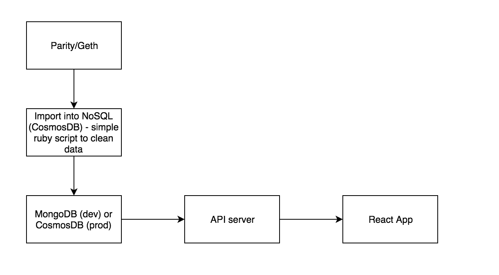

# 与以太坊反应中的不幸

> 原文：<https://medium.com/coinmonks/misadventures-in-react-with-ethereum-7ab3d4ee1af6?source=collection_archive---------7----------------------->

天啊，我讨厌 Javascript！25 年前我开始学习的第一门语言是基于 [Commodore Plus](https://en.wikipedia.org/wiki/Commodore_Plus/4) /4 的，后来我升级到了 Amstrad CPC 6128。然后在大学我学了 Pascal 和汇编，最后在大学学了 C 和 C++。

我这么说，是因为我是一个 80 和 90 年代的孩子，这都是关于过程语言和面向对象语言的——这也是我如何从本质上学会编写软件的方法。这些年来，我已经学会了 Python、Perl 和 Ruby(Ruby on Rails 的忠实粉丝)等等。

当我开始为我的机器学习工作编写 ETL 工具时，我尝试了 Javascript(准确地说，不是我在 90 年代/90 年代在 HTML 页面中使用的一些蹩脚的 JS ),并且几乎把[列为 Node.js 开发人员](https://www.toptal.com/nodejs/top-10-common-nodejs-developer-mistakes)犯的 10 个最常见的错误，我自己也添加了一些。

作为一名程序员，我很差劲，但我热爱制造东西，修理东西，把机器推得越远越好；所以我破解代码，复制粘贴，然后我[把事情做完](http://rea.tech/getting-shit-done/)。我是技术债务先生，我为此感到羞耻——20 年来，我内心深处一直想成为一名 leet 程序员，但我的大脑并不是这样工作的。作为一名架构师，我的职业生涯主要是在开发人员和业务的交叉点上，现在我是微软开源项目的技术主管。我是一个系统人员，我在设计时着眼于大局，但我明白事情在幕后是如何运作的。

我强调这一点，因为它正在侵蚀我。我看到漂亮的代码(我知道代码中的漂亮是什么样子)，我希望能够那样想，那样做。我可以和开发人员交流，我们可以一起设计伟大的系统，但是他们的技能让我感到困惑。

所以我用了几周前我拼凑的东西作为内联 Javascript 和一些 ETL 等等。我可以想象出区块链以太坊。

我对我几个小时的工作印象深刻，并认为这是一个完美的兼职项目，使这成为一项服务，不只是完成狗屎，而是做好它。

我第一次遇到 Angular 时，内心和外部都在哭泣，因为整个事情对我来说是多么完全陌生。我问了一些非常有能力的开发人员，我是否应该考虑 Angular、Vue 或 React 来解决这个问题，除了一些“Vue 是未来”的评论之外，响亮的回答是 React。我喜欢这个答案，因为这也意味着如果我想为移动设备编写代码，我可以使用 React Native(在过去的生活中，我为我的 IOS 和 Android 应用程序使用了 [Appcelerator](https://www.appcelerator.com/) )。

在微软，我们订阅了 Safari 在线图书，我开始在 React 上尽可能多地阅读。O'Reilly 的书 [Learning React](http://shop.oreilly.com/product/0636920049579.do) 是迄今为止帮助最大的一本书，因为它很早就推动你理解函数式编程。

我不得不承认，当我听到人们谈论 FP 的时候，我还以为他们谈论的是程序和事情。我现在意识到我是多么的错误，并且仍然对“胖箭头”语法，为什么 FP 更好，以及——有太多的事情让我对整个情况感到困惑。但是我明白它帮助我成为一个更好的程序员，我感觉如果我能理解这一点，我将成为一个更好的软件设计师。我将不再复制粘贴，我将不再满足于完成任务。

我从高层次上了解到。就像 Angular 做的一样，React 允许我将我的应用组件化，这样我就可以有谨慎的元素来工作。

我意识到这是有价值的，因为我最初在以太坊可视化器上的工作很快就变成了一团混乱的 Javascript 函数意大利面条，而且漏洞百出，以至于我不愿意把它推到我的 [GitHub repo](https://github.com/justindavies/VisualiseEthereum) 上，但我做到了。你可以在 [http://inkl.in](http://inkl.in) 看到它的下一个版本。我说“实时”是因为它是相同的代码，每个以太坊块都有不同的 JSON 文件中的力图可视化读数。没有什么动态，除了看起来有点漂亮之外，它不是很有用。

当我在彭博工作时，我亲眼看到了将数据转化为信息是多么重要，彭博可以从全球交易所获得所有的市场数据，并使其对大量受众变得有价值。

这里我们有区块链，整个链是可读和开源的——这激发了我的兴趣。你能从数据中获得哪些有用的信息？

所以我现在开始使用 React 来制作一个可视化的交互式以太坊浏览器。我已经学会了如何以编程方式解析以太坊数据、契约，如何清理数据，使其成为参考数据，并能够查询它的一些用途(尽管我们将在后面看到它有多有用)

(非常粗略的)数据流是…



正如朱莉·沃尔特斯所说:让我们从头开始。

为了能够查询以太坊区块链，你需要下载数据库本身。比较简单；在你的机器上安装 [Geth](https://github.com/ethereum/go-ethereum/wiki/geth) 或[奇偶校验](https://www.parity.io/)。

默认情况下，奇偶校验将尝试对区块链进行快速同步(在编写本文时，数据库中有超过 500 万个数据块)。您应该能够在几个小时内在本地获得一大块数据库。它可以做到这一点，因为您的机器不需要验证所有先前验证的块。下载完数据库快照后，它的速度确实慢了下来，看起来它开始验证收到的数据块。总而言之，花了大约 24 个小时才在本地更新。

Geth 和 Parity 都有一个 RPC 接口，可以通过 Web3 接口以各种语言访问。我不得不说，对于开始查询区块链来说，该文档非常好(带有示例)。

我开始摆弄 YouTube 视频^up 的 Javascript 接口，但是当我意识到我需要开始将数据转换成可以查询的格式时，我开始使用 [Ruby Web3 Gem](https://github.com/izetex/web3-eth) 进行批量导入。

对于我的本地开发人员实例，我将使用安装在 Mac 上的 Mongo，并将 Mongoid 用于 Ruby 的接口。

一开始，我将 Mongo 中的数据组织为:

```
block: {
  block_id: NUMBER
  transactions: [tx1, tx2, tx3]
}
```

但我意识到，在文档中查询数组的复杂性和低效率不允许我在区块链上通过合同或令牌进行有效搜索——我认为这是收集有用信息的关键数据点。

现在数据的格式是以太坊交易与集合中文档的 1:1 映射。

代码应该相对自我解释，也许除了同步检查。

当以太坊客户端连接到网络时，它将尝试在本地同步数据库。当这种情况发生时，你真的只能读取和导入本地数据，你不能查询网络本身。因为我不想等待，所以我会询问本地 RPC 端点最新同步的数据块是什么

```
web3.eth.syncing
```

在生产中，假设它将完全同步，并且只接收网络上出现的新数据块。

这是我们需要打电话的时候

```
web3.eth.blockNumber
```

在我的设计中，导入脚本实际上将位于 Kubernetes 集群上的一个容器中(就像奇偶校验一样，作为服务运行)，它将循环接收任何新数据。我知道我可以订阅新街区的事件，但我并不期待实时数据，我对近实时数据和一些弹性很满意，以确保我拥有所有数据。1 分钟的延迟不会导致任何数据= >信息质量问题。

我现在有很多可查询格式的数据——还有很多事情要做才能理解，这是我将在接下来的几周内记录的旅程。

哦，最后一次统计(我仍然没有摄取所有数据)，我看到超过 150，000，000 个文档从我可怜的 Mac SSD 中打出来。但是对于现在的开发环境来说，这已经足够了。