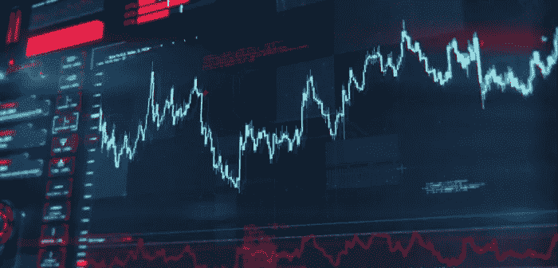

# 在交易策略中混合 RSI 和费希尔变换。

> 原文：<https://medium.com/coinmonks/mixing-the-rsi-with-the-fisher-transform-in-a-trading-strategy-1e0ca09574a3?source=collection_archive---------5----------------------->

## RSI 和 Fisher 变换能提供好的信号吗？

相对强弱指数(RSI)是一个很好的反转指标。同样，费希尔变换也可以暗示可能的市场变化。如果我们尝试将两者结合起来，给我们一个反应应该发生的及时信号，会怎么样呢？这意味着…