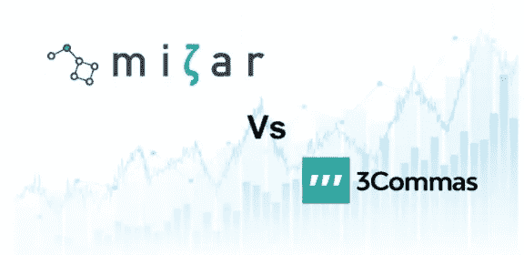
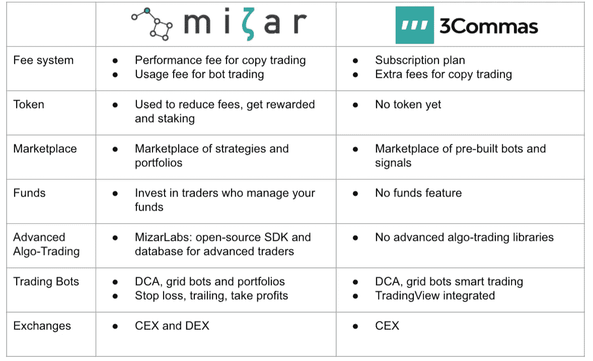

# mizar vs 3 commas——比较与评述

> 原文：<https://medium.com/coinmonks/mizar-vs-3commas-comparison-and-review-b1d0af8502bb?source=collection_archive---------5----------------------->

[加密交易机器人](/coinmonks/crypto-trading-bot-c2ffce8acb2a)是根据预先定义的交易策略规则创建并向交易所提交买卖订单的计算机程序。

越来越多的平台支持密码的自动化交易。在这篇比较文章中，我们将仔细研究该领域最成功的公司之一 3Commas，并将其与 Mizar 进行比较。

[**Mizar**](https://mizar.ai/) 是一个即将向公众开放的下一代算法交易平台。Mizar 是一个社交交易市场，你可以在这里模仿其他交易者，也是一个平台，你可以通过用户友好的界面建立机器人和投资组合。此外，我们在 Mizar 开发了 MizarLabs，这是一个先进的开源交易库，专家可以在这里研究、开发和回测他们的算法策略。Mizar 没有订阅费，用户根据使用或性能付费，并可以通过持有 Mizar 原生令牌 MZR 来减少或避免费用。

[**3Commas**](https://3commas.io/) 是一项全面的在线服务，支持加密货币交易管理。3Commas 用户可以跟踪成功交易者的信号或定制不同的策略，以完全自动化他们的交易活动。要使用 3Commas，用户必须支付订阅费，最高可达每月 50 美元。最重要的是，用户必须每月付费才能跟踪其他交易者。

本文将对 Mizar 和 3Commas 进行比较，并强调两者的主要区别。

# 价格和计划

Mizar 希望让每个人都能使用算法交易。大多数算法交易平台每月提供 15 至 100 美元的订阅费，有时对小散户投资者来说太贵了(特别是当交易机器人的表现不如预期时)。然而，我们在 Mizar 开发了一个安全的钱包系统，投资者可以使用它来奖励、被奖励或根据不同的指标支付服务费。

*   复制交易:用户可以复制在市场上发布策略或投资组合的交易者。交易者可以选择向遵循其投资组合或策略的用户收取绩效费。成功的交易者会因为他们的努力和想法得到公平的回报，用户只有在盈利的情况下才会付费。
*   机器人交易:用户可以设计自己的机器人，并向其分配部分资本。用户将根据由机器人管理的资金的总价值付费。

3Commas 目前有 3 种不同的计划:初级版(14.50 美元)、高级版(22.50 美元)和专业版(49.50 美元)。根据该计划，用户将获得不同的功能和津贴。如果用户想关注其他交易者，还需要支付额外的订阅费。这可能是免费的，也可能高达每月 150 美元，这取决于交易者。

# 代币

**Mizar** 的公用令牌——MZR——将对 MZR 持有者具有明显优势，并成为 Mizar 生态系统的核心。例如，用户持有的 MZR 越多，参与交易策略或机器人的费用就越低。爬上排行榜首位的交易者会因为是最好的而被 MZR 的社区奖励。最后，在不久的将来，用户可以在明星池中下注 MZR，并作为 Mizar 收入流的一部分获得奖励。

**3 条短信**还没有令牌。

# 市场

Mizar 希望让算法交易变得尽可能简单。用户可以访问市场，搜索他们喜欢的策略。只需点击几下鼠标，他们就可以看到回溯测试或实时交易表现，并复制交易。根据该策略，低延迟 Mizar 引擎将代表投资者下单。用户不必担心其他任何事情，交易者将在后端监控策略行为，并根据市场情况和表现进行调整。

**3Commas** 提供了一个预建机器人市场，每个人都可以使用它来实现交易自动化。这些机器人是由 3Commas 提出的，用户必须根据市场情况对它们进行校准和定期监控。此外，3Commas 提供了一个交易者信号的市场，用户可以将这些信号集成到他们的机器人中。尽管这个功能受到用户的欢迎，但对于需要一些交易知识和不断适应的初学者来说，它仍然很复杂。

# 基金

**Mizar** 想要支持那些发现很难找到正确策略的用户。投资于一个单一的战略可能是有益的…只有当该战略正在执行。Mizar 帮助用户区分他们的投资，提出了一个基金市场。用户有可能投资于一个交易商或贸易公司，该交易商或贸易公司将把他们的资金分配到不同的策略中，并从一个策略交换到另一个策略，以在控制风险的同时获得最佳表现。

**3Commas** 目前还不提供此项服务。

# 高级算法交易

Mizar 为高级或专业交易者提供一个名为 MizarLabs 的开源库。交易员可以获得对冲基金的优质数据，并使用机器学习模型来研究、开发和回测他们自己的算法交易策略。交易者还可以利用 Mizar 的实时交易基础设施，通过纸上交易或实时交易来实时测试自己的策略。对于运行自托管策略的交易者，Mizar 开发了一种高级 API，可用于连接 Mizar，实时部署策略，或在市场上发布策略，以吸引其他投资者的资本。

**3Commas** 为运行自托管策略的交易员提供 API，以便能够实时部署策略或在市场上发布信号。

# 交易机器人

**Mizar** 希望让用户自由设计无需编码的交易机器人。为了实现这一目标，Mizar 开发了一个平台，用户可以在这个平台上使用各种交易工具。DCA(美元成本平均)和网格机器人是 Mizar Trader Lab 产品的核心。此外，交易员将能够创建自己的投资组合，实现投资组合的自动化或再平衡，或者通过止损或获利来管理风险。

3Commas 将交易机器人作为其产品的核心。与 Mizar 类似，它们也基于 [DCA](https://blog.coincodecap.com/dca) 机制，并根据 Tradingview 算法使用买入和卖出建议。该平台的特点是简单的和复合的机器人，可以同时交易多少硬币。

# 非监禁

**Mizar** 是非托管的，这意味着你的资金会留在你的钱包或交易所里。Mizar 开发了一个 API 系统，使其用户能够连接到集中和分散的交易所(CEX 和 DEX)以实现交易自动化，而用户不会失去对其资金的托管。

**3Commas** 也有一个 API，让用户连接到他们的交换机。目前还没有连接到分散交换机的解决方案。

# 交换

为了适应不同类型的用户，Mizar 打算支持广泛的 CEX。第一批实施的交易所是币安、FTX 和库币。Mizar 计划在未来几个月整合更多的交易所，如 Bitmex、Bitfinex、比特币基地 PRO 等。此外，Mizar 计划在不久的将来整合 DEX，以便在 DeFi 领域进行扩张。

**3Commas** 提供各种不同的 CEX。还没有集成 DEX。

Mizar 的算法策略平台基于众包原则。研究和设计其他交易者使用的算法交易策略的交易者将因他们的辛勤工作而获得奖励，这激励了构建和共享算法的社区方法。Mizar 帮助弥合了发现很难参与市场的开发者和发现很难找到并使用成功的算法交易机器人的用户之间的差距。与此同时，Mizar 的目标是让算法交易变得简单，并对所有人开放。Mizar 提出了一套广泛的无代码工具，以可承受的价格开发简单或高级的机器人，并使用户的交易自动化。

Mizar 很快将开放其测试版。

# 今天就加入 Mizar 吧！

**帮助我们建立您想要使用的加密交易平台。**

Mizar 是一个下一代交易平台，交易者可以在这里搜索安全分配资本的策略，或者获得广泛的交易工具，以调动他们的资产。Mizar 让交易变得更简单，对每个人来说都更容易，而且不需要订阅。

成为 MIZAR 密码交易社区的活跃分子。
[在这里报名](https://mizar.com/sign-up)或者参观[mizar.com](https://mizar.com)

[不和](https://discord.gg/g8NJ5XKKMt) | [电报](https://t.me/mizar_com) | [电报公告](https://t.me/mizar_com_announcement) | [推特](https://twitter.com/Mizar_com) | [网站](https://mizar.com/) | [媒体](https://mizar-com.medium.com)**|[Youtube](https://www.youtube.com/channel/UCnKb-vTG4OZartQoJWIrs8w/featured)**

## **也阅读**

** [## 3Commas Review 2021 |一个优秀的加密交易机器人[更新]

### 自动交易机器人为独立交易者提供了最好的价值。它们可以定制，链接到几个…

blog.coincodecap.com](https://blog.coincodecap.com/3commas-review-an-excellent-crypto-trading-bot)**