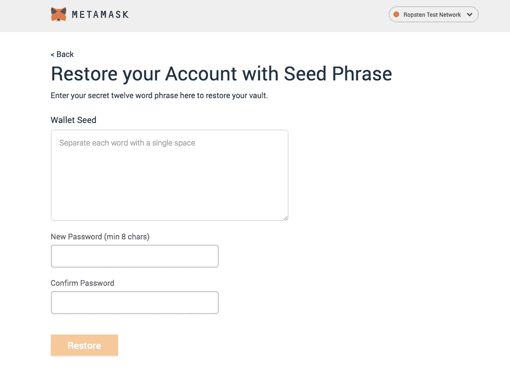

# 助记符生成(BIP39)简单解释

> 原文：<https://medium.com/coinmonks/mnemonic-generation-bip39-simply-explained-e9ac18db9477?source=collection_archive---------0----------------------->

每当一个人设置一个加密钱包，他/她被提供 12 个(在某些情况下 24 个)助记短语，并被要求保证其安全。这些助记符进一步用于恢复帐户和相关的加密余额。



MetaMask Account Recovery using Seed Phrase

一组助记符可以用来创建多个地址。很久以前 [BIP32](https://github.com/bitcoin/bips/blob/master/bip-0032.mediawiki) & [BIP39](https://github.com/bitcoin/bips/blob/master/bip-0039.mediawiki) 中就介绍了这种生成账户的方法。在这里，我们将通过一个简单的例子来讨论 BIP39 助记符的生成过程。

## BIP39

这个 BIP 描述了助记码或助记句(一组易于记忆的单词)的实现，用于确定性钱包的产生。

它由两部分组成:生成助记符，并将其转换为二进制种子。该种子可在以后使用 BIP-0032 或类似方法来生成确定性钱包。让我们理解它的第一部分。

## 记忆生成

记忆生成是一个多步骤的过程。我们将通过一个示例一步一步地介绍:

1.  **产生熵:**从熵产生开始。熵越大，安全性越好，但句子长度增加。允许为 128-256 位，以生成 12-24 个短语。我们将以 128 位为例，这将产生 12 个短语。在我们的例子中，下面是以十六进制&二进制产生的熵:

十六进制:063679 ca 1 b 28 b 5 cfda 9 c 186 b 367 e 271 e

完整的 128 位如下:

```
0    6    3    6    7    9    c    a    1    b    2    8    b    
0000 0110 0011 0110 0111 1001 1100 1010 0001 1011 0010 1000 1011

5    c     f     d    a    9    c    1    8     6    b    3    6    
0101 1100  1111  1101 1010 1001 1100 0001 1000 0110 1011 0011 01107     e    2    7    1   e
0111 1110 0010 0111 0001 1110
```

**2。生成校验和:**第二步是生成校验和。

```
checksum = first (length of entropy in bits/32) bits of SHA256 of     entropy
```

在我们的例子中，它是 128/32 = 4 位。让我们假设，在我们的例子中是 0110(十进制 6)。将该校验和附加在初始熵的末尾。因此，在连接之后，它将是:

```
000001100011011001111001110010100001101100101000101101011100111111011010100111000001100001101011001101100111111000100111000111100110
```

3.**拆分:**现在我们需要把它拆分成 11 位的组。现在总位数是 128 + 4 = 132

分割后，它将看起来像:

```
00000110001 10110011110 01110010100 00110110010 10001011010 11100111111 01101010011 10000011000 01101011001 10110011111 10001001110 00111100110
```

4.**转换成十进制:**现在我们需要将这些位转换成它的十进制表示，如下所示:

```
00000110001 10110011110 01110010100 00110110010 10001011010
49          1438        916         434         111411100111111 01101010011 10000011000 01101011001 10110011111
1855        851         1048        857          143910001001110 00111100110
1102       486
```

这些十进制表示从 0 到 2047 不等。这些作为助记单词表的索引。这个词表可以在[这里](https://github.com/bitcoin/bips/blob/master/bip-0039/bip-0039-wordlists.md)找到。

5.**找出单词:**现在将从单词列表中选择单词。在我们的例子中，用英语来说，它们将是:

```
49          1438        916         434         1114        1855 
alert        record      income      curve       mercy       tree851         1048        857          1439       1102       486
heavy        loan        hen         recycle     mean       devote
```

所以，这样最终生成的助记短语将是:

> 预警记录收入曲线仁慈树重贷款母鸡回收手段投入

生成的助记单词的数量取决于初始熵的大小。其内容如下:

```
**Bits of Entropy     Number of words** 128                  12
160                  15
192                  18
224                  21
256                  24
```

此外，为了从生成的助记符创建二进制种子，我们使用了 **PBKDF2** 函数，其中助记语句(在 UTF-8 NFKD 中)用作密码，字符串“助记符”+密码短语(同样在 UTF-8 NFKD 中)用作盐。迭代计数设置为 2048，使用 HMAC-SHA512 作为伪随机函数。派生密钥的长度为 512 位(= 64 字节)。此种子可进一步用于高清钱包目的。

谢谢你的阅读！！！

> 加入 Coinmonks [电报频道](https://t.me/coincodecap)和 [Youtube 频道](https://www.youtube.com/c/coinmonks/videos)获取每日[加密新闻](http://coincodecap.com/)

## 此外，请阅读

*   [拷贝交易](/coinmonks/top-10-crypto-copy-trading-platforms-for-beginners-d0c37c7d698c) | [密码税务软件](/coinmonks/crypto-tax-software-ed4b4810e338)
*   [网格交易](https://coincodecap.com/grid-trading) | [加密硬件钱包](/coinmonks/the-best-cryptocurrency-hardware-wallets-of-2020-e28b1c124069)
*   [密码电报信号](http://Top 4 Telegram Channels for Crypto Traders) | [密码交易机器人](/coinmonks/crypto-trading-bot-c2ffce8acb2a)
*   [最佳密码交易所](/coinmonks/crypto-exchange-dd2f9d6f3769) | [印度最佳密码交易所](/coinmonks/bitcoin-exchange-in-india-7f1fe79715c9)
*   [开发人员的最佳加密 API](/coinmonks/best-crypto-apis-for-developers-5efe3a597a9f)
*   最佳[密码借出平台](/coinmonks/top-5-crypto-lending-platforms-in-2020-that-you-need-to-know-a1b675cec3fa)
*   [杠杆代币](/coinmonks/leveraged-token-3f5257808b22)终极指南
*   [7 款最佳零费用密码交换平台](https://coincodecap.com/zero-fee-crypto-exchanges)
*   [最佳网上赌场](https://coincodecap.com/best-online-casinos) | [期货交易机器人](/coinmonks/futures-trading-bots-5a282ccee3f5)
*   [分散式交易所](https://coincodecap.com/what-are-decentralized-exchanges)|[FIP 比特币](https://coincodecap.com/bitbns-fip)
*   [用信用卡购买密码的 10 个最佳地点](https://coincodecap.com/buy-crypto-with-credit-card)
*   [加拿大最好的加密交易机器人](https://coincodecap.com/5-best-crypto-trading-bots-in-canada) | [比特 vs 币安](https://coincodecap.com/bybit-binance-moonxbt)