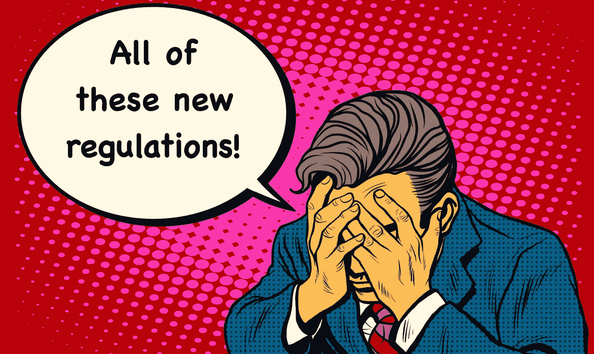

# Mnuchin 对涉及加密货币的交易的要求

> 原文：<https://medium.com/coinmonks/mnuchins-requirements-for-certain-transactions-involving-convertible-virtual-currency-or-digital-619896881f0e?source=collection_archive---------6----------------------->

# 部长姆努钦的加密钱包立法

[1506-AB47](https://www.regulations.gov/document?D=FINCEN_FRDOC_0001-0121)号法规要求金融机构验证涉及自托管加密钱包或不是由金融机构或服务提供的钱包的交易的收款人和汇款人的身份。这种钱包的例子包括硬件钱包或在用户计算机上运行的钱包。

比特币基地加密货币交易所首席执行官 Brian Armstrong 上周在[推特上发布了关于](https://twitter.com/brian_armstrong/status/1331745196887867393)监管的消息。他表示，这可能会产生“意想不到的副作用”，并将“扼杀许多新兴的加密货币用例”。四名美国国会议员[敦促财政部与国会协商](https://davidson.house.gov/media-center/press-releases/davidson-pens-letter-treasury-self-hosted-wallet-regs)声明:

> “在财政部发布关于自我托管钱包监管的午夜规则之前，姆努钦部长应该到人民院向代表们讲述他的法规将会做些什么。在利用区块链和加密货币的力量方面，对自有钱包的过度监管将摧毁一个新兴产业，并将美国甩在世界其他国家之后。
> 
> “错误的法规将侵犯用户的金融隐私，并向世界发出一个信息，即你不应该在美国建立业务或尝试区块链的新用例。我希望财政部会仔细考虑它对自有钱包采取的任何行动。我期待着与姆努钦部长就美国金融技术的这一重要问题进行合作。”

## 我对监管自助钱包立法提案的意见

我的投稿可以在这里找到[。关于扩大《银行保密法》中"货币工具"定义范围的影响，金融罪行执法网请金融机构和公众就以下问题发表意见。在这篇文章中，我想集中讨论他们的一个问题:](https://www.regulations.gov/document?D=FINCEN-2020-0020-0810)

> (18)描述遵守提议的记录保存和验证要求的成本。

遵守拟议的记录保存要求的潜在成本相当于美国放弃了在区块链技术领域的主导地位。2008 年金融危机的根源在于不透明的金融机构，这些机构的资产负债表上存在巨大的交易对手风险。相反，区块链提倡透明的金融体系。这种系统旨在通过消除对第三方托管人持有资金的依赖来消除交易对手风险。这一监管将有效地防止资金在比特币基地等交易所之间转移到智能合约。免于第三方托管的智能合约是关键的技术创新，将使美国保持其在区块链领域的主导地位。

智能合约没有物理地址或位置。它们是代码行，有效地起到托管资金的作用，这些资金将在未来某个时间根据收到的适当指令释放。这些指示通常与履行预定的合同义务联系在一起。如果该法规要求资金接收者具有实际名称和地址，那么该法规将有效地禁止比特币基地账户持有人购买加密货币以直接将资金发送到智能合同地址。

这将完全禁止比特币基地客户加入点对点保险智能合约社区。使用智能契约互助的应用程序以前被设计为完全符合州和地方保险法，现在却不符合。这一规定将把取消第三方资金托管人的意图定为刑事犯罪，而第三方资金托管人一直是区块链领域创新的驱动力。

这种变化的影响可能是深远的。加入对等保险互助组织实际上将被视为犯罪。这条规则实际上是政府告诉公民应该如何花钱。如果其他国家的 P2P 互助保险有效地击败了传统的保险提供商，那么这些公民将受益于允许更大创新的监管制度。随着创新降低了其他国家金融产品的成本，美国人将被迫支付有效的过时税。将来，美国人应该知道，更高的保险费是监管制度扼杀创新的结果。这将悲剧性地导致美国消费者在寻找有竞争力的金融产品(如保险)供应商时，选择更少，自由更少。

如果你想了解点对点保险是如何运作的，你可以阅读以下文章:

*   [**分散式点对点保险如何运作**](/@joshuadavis31/tandapay-explained-e452411b5e59)
*   [**为什么点对点保险需要区块链才能工作**](https://joshuadavis31.medium.com/true-p2p-insurance-requires-the-blockchain-to-work-661024d50920)

如果您想了解智能合同如何保持法规遵从性，您可以在此处阅读更多信息:

*   [**法律与智能契约 1**](/predict/the-law-and-smart-contracts-9611e9d7e783)
*   [**法律与智能合同 2**](/@joshuadavis31/review-the-law-and-smart-contracts-a88b1c9bb49a)

这种技术支持以下所述的新型金融产品:

*   [**信息 Escrows 得到上电**](/illumination/information-escrows-get-a-power-up-7a5152a26c63)
*   [**肯纳委员会有效申诉回应的处方**](/illumination/kerner-commissions-prescription-for-effective-grievance-response-d40c6a8d1a2)
*   [**性骚扰的政治数据**](/@joshuadavis31/the-politics-of-sexual-harassment-data-8265203e6fd9)

最后，我希望您已经仔细考虑了遵守建议的记录保存和验证要求的成本。这些成本不亚于我们在区块链市场上与其他国家竞争保险等金融产品的能力。这一规定将有效削弱我们的先发优势。这将使中国等国家在微信和支付宝等金融应用方面的创新超过美国公司。通过这种方式，它将削弱美国金融科技开发商，并允许中国在分散化金融产品和服务市场上超越美国。