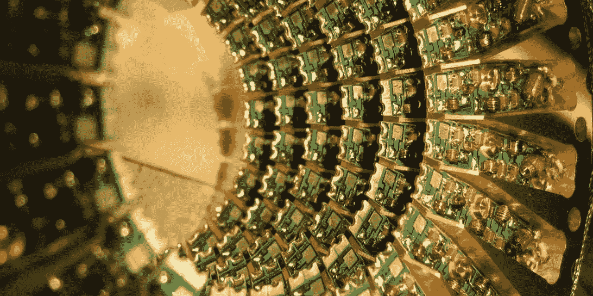

# Mod P 多项式运算……走向量子鲁棒加密

> 原文：<https://medium.com/coinmonks/mod-p-polynomial-operations-towards-quantum-robust-crypto-61786c2894dd?source=collection_archive---------11----------------------->

这就对了…你不能指责我点击诱饵。有了这样的标题，如果你真的想阅读量子密码学，你只需要点击这个页面。

此处定义了该方法的演示[。](https://asecuritysite.com/encryption/polyop)

模 P 多项式被用在量子计算机鲁棒密码术的一些提议的方法中，例如用格…