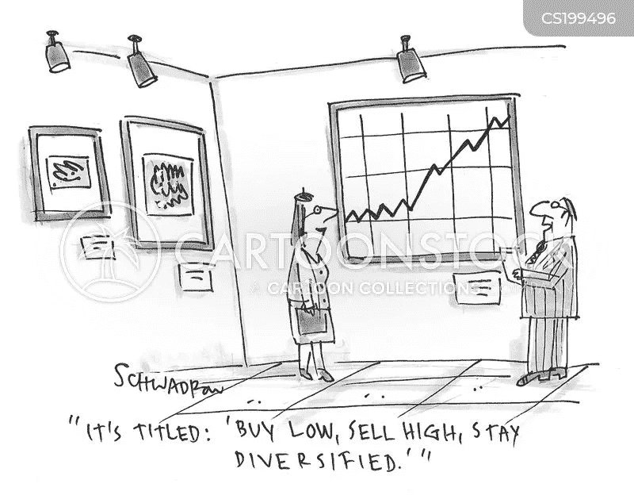

# 共同基金投资组合模型——圣杯第一部分

> 原文：<https://medium.com/coinmonks/model-mutual-fund-portfolio-holy-grail-part-i-ae9f3d6124b8?source=collection_archive---------4----------------------->

嘿，伙计们……我敢肯定，在之前的帖子中讨论了共同基金的几乎所有可能的方面之后，你一定很想把你的知识用在实践中。因此，让我们直接投入投资。但是，这里的困难是，我必须把注意力集中在兴趣广泛的观众身上。如果你读过之前的文章，尤其是之前的文章，你会知道每个人在收入、支出、储蓄潜力、预期未来需求以及投资范围方面都可能有不同的财务状况。我相信现在你们所有人都已经熟悉了这些术语，并且理解它们在实际生活中的含义。我敢说，向一个人提出建议要容易得多，但向广大听众提出建议就完全是另一回事了。因此，我不会给你一个精确的基金名称，我会保持这篇文章的广泛基础，并建议在各自的共同基金类别的资产类别中表现最好的几个。

根据需求、投资能力和视野，我想将投资者分为三大类，如-

1.年龄在 25 到 30 岁之间，未结婚，没有固定收入，但希望谨慎储蓄，以便日后自给自足。

2.30 至 60 岁之间，已婚，有无子女，父母年迈，收入稳定，但必须为未来的雨天以及计划支出(如子女的高等教育和婚姻、建造房屋等)储蓄，同时为退休后的生活储蓄一些。

3.年龄在 60 岁到 80 岁之间，甚至更大，退休后有或没有养老金，已经履行了大部分承诺，但希望他们的钱是安全的，不断增长。

正如你所猜测的，最大认真投资者将属于第二类，这反映在他们对不断增长的 MF 行业的贡献。但是，在这篇文章中，我将首先讨论我所属的类别，以及许多其他有才华的年轻人，他们希望在这条道路上获得经济独立，以便他们可以在艺术、音乐、体育、科技领域的创新甚至社会工作等不同领域追求自己的人生使命。

如果你是投资新手，想从 MFs 投资开始你的旅程，首先要做几个基本的……demat 账户并不是强制性的，但它有助于投资和管理您的投资组合，并提供了极大的灵活性。最好的一点是，开立 demat 账户的过程比完成 AMC(资产管理公司)要求的 KYC(了解你的客户)手续更简单。

其次，您可以在 10 分钟内在线开立一个三方 demat 账户，您的银行、交易和 demat 账户相互关联，从而为您提供无缝服务。唯一的要求是使用智能设备，无论是移动设备还是笔记本电脑，以及 PAN 和 Aadhar 卡。无论如何，KYC 的资产管理公司也需要这些。如果您仍未满 18 岁，您仍然可以与一名监护人一起开立 demat 账户，或者您可以选择通过您的近亲(如哥哥姐姐、母亲或父亲)的 demat 账户进行投资。

最后，demat 帐户将为您提供投资不同 AMC 的不同 MF 的便利，这可能会对 AMC 路线产生一些挑战。因此，伙计们，如果你现在还没有 demat 账户…..只需准备好您的 PAN 卡、Aadhaar 卡，然后登录您选择的任何银行网站。如果你还需要帮助，写在评论区，我会帮助你，或者你可以谷歌一下，或者在 Youtube 上看到许多免费视频。好的……有了德玛特账号或者出于某种原因，如果你选择 KYC 路线……然后是 AMC 账户，让我们开始 MFs 的投资之旅。……..

**第一组→ 25 到 30 岁+没有固定收入** —这个组最大的考虑是你能投入多少，投入的频率。当然，你没有一个明确的答案，很多时候你可用的金额可能少于 500 卢比。这类人的最佳选择是投资交易所交易基金或 ETF。美妙之处在于，你可以在大多数资产类别中选择 ETF，比如股票、债券，甚至是黄金等大宗商品。你也可以选择指数，比如我最喜欢的 Nifty 50 和 S & P 500，或者任何行业的具体指数，比如汽车、金属、IT、银行等等。

**实用提示**:——如果这是你的第一次，我建议你通过 Nifty BeES 开始投资，最受欢迎的基金公司是 Nippon。然而，永远不要急着投资，即使是像 Nifty BeES 这样的 ETF。每当市场调整时(Sensex 和 Nifty 等指数下跌)，这都是投资的黄金时机。但是，实际上不可能确定市场时间，因此，只要在 5 个工作日或一周内每天查看一次新闻，每当市场处于最低点时…是你投资的时候了。否则，最好的方法就是用拐点线(支撑线-阻力线)来决定进场点。

另一件要记住的重要事情是分散投资，永远不要把所有的鸡蛋放在一个篮子里。尽管指数驱动的 MFs 本身是多样化的，但即使如此，不局限于一个部门或资产类别也可能是有益的。由于 Nifty BeES 是最广泛的基础指数，它可能被分配到投资组合的 50%，剩余的资金需要分散到至少 3 到 5 个更多的部门指数，如 it、汽车、银行、金属和基础设施，几乎相等的划分，以吸收部门驱动的冲击，并受益于特定部门的繁荣，如目前在 IT 部门中可以看到的。

ETF 是唯一的选择吗？？？当然不是…..但这无疑是最受欢迎、最有效和最省事的投资，我会推荐给我所有的年轻朋友，他们要么没有足够的钱，要么不想挖得太深，以遵循股权投资路线。选择 MF 是一个很好的选择，但 SIP 或通过一次总付路线至少需要 500 卢比。因此，即使你被其中一个选项所吸引…你仍然可以把钱存起来，建立一个足够的本金来投资其他选择。ETF 的最大优势在于，它没有任何进出负担，可以像普通股票一样在 NSE 或 BSE 交易，这确保了投资的资金几乎像流动现金一样。

然而，如果你能够定期或一次性拿出一些现金，我同样建议投资蓝筹股基金、新兴企业、银行，以及同等比例的黄金或债券基金。但是，为了取得令人鼓舞的结果，这些投资必须继续或至少保持到至少 3 至 5 年的时间。

伙计们…..即使你的钱有限，也要继续探索这些选择。Nippon India ETF Nifty BeES 目前的交易价格为 184.19 卢比，半年内平均上涨约 15%，一年内上涨 41%。即使我用低至 200 卢比的资金进行不定期投资，我也可以通过这种选择获得每年 20%的回报。你也一样，有了承诺和关心，你将拥有一个健康的投资组合，你会为此感到骄傲，因为这将完全是你的辛勤工作。伙计们，现在就这样吧…下周见，讨论第二组投资者。

但是，在我们说再见之前…让我请求你们**点击左下方**的鼓掌按钮以示感谢，如果你们最近才加入**，请点击右上方**的关注按钮。

> 加入 Coinmonks [电报频道](https://t.me/coincodecap)和 [Youtube 频道](https://www.youtube.com/c/coinmonks/videos)了解加密交易和投资

## 也阅读

 [## 杠杆代币[多头代币]终极指南

### 杠杆化令牌是具有杠杆化风险敞口的 ERC20 令牌，不考虑保证金、要求、管理…

medium.com](/coinmonks/leveraged-token-3f5257808b22)  [## 最佳加密交易所| 2021 年十大加密货币交易所

### 加密货币交易所的加密交易需要了解市场，这可以帮助你获得利润。之前…

blog.coincodecap.com](https://blog.coincodecap.com/crypto-exchange)  [## 2021 年最佳加密交换平台| CoinCodeCap

### 如果我们看看今天的场景，许多加密货币交换平台提供了广泛的功能和深度…

blog.coincodecap.com](https://blog.coincodecap.com/best-swap-platforms)  [## 2021 年最佳加密借贷平台| 6 大比特币借贷平台

### 获得比特币和其他加密货币的最佳贷款利率

medium.com](/coinmonks/top-5-crypto-lending-platforms-in-2020-that-you-need-to-know-a1b675cec3fa)  [## 2021 年 6 大最佳硬件钱包|顶级加密硬件钱包[更新]

### 最好的加密货币硬件钱包是绝对必要的。我们将在 NGRAVE、Ledger Nano X 和…

medium.com](/coinmonks/the-best-cryptocurrency-hardware-wallets-of-2020-e28b1c124069)  [## 2021 年最佳免费加密交易机器人

### 2021 年币安、比特币基地、库币和其他密码交易所的最佳密码交易机器人。四进制，位间隙…

medium.com](/coinmonks/crypto-trading-bot-c2ffce8acb2a)  [## 最佳 4 个加密交易信号电报通道

### 这是乏味的找到正确的加密交易信号提供商。因此，在本文中，我们将讨论最好的…

medium.com](/coinmonks/best-crypto-signals-telegram-5785cdbc4b2b)  [## 获取信号、交易机器人和套利

### 编辑描述

blog.coincodecap.com](https://blog.coincodecap.com/bitsgap-review)